# Óptica Geométrica - Parte 1

## Módulo 0: Fundamentos y Principios de la Luz

La **Óptica Geométrica** estudia los fenómenos lumínicos mediante un modelo puramente geométrico, asumiendo que la luz está constituida por **rayos rectilíneos** que viajan con principio y fin.

### Clasificación de Haces Lumínicos

Un conjunto de rayos forma un **haz de luz**. Según la distribución de sus rectas de propagación, se clasifican en:

* **Haz Paralelo:** Las rectas de propagación de los rayos son paralelas entre sí.
* **Haz Homocéntrico:** Todas las rectas de propagación concurren en un mismo punto del espacio. Se dividen en:
* **Convergentes:** Los rayos se dirigen físicamente hacia un punto de intersección.
* **Divergentes:** Los rayos divergen y *parecen provenir* desde un punto común hacia atrás.

### Los 5 Principios Fundamentales de la Propagación

Toda la resolución geométrica de ejercicios se sostiene sobre estas premisas:

1. **Propagación Rectilínea:** La luz viaja en línea recta dentro de medios **isótropos** (misma velocidad en toda dirección) y **homogéneos** (mismas propiedades intensivas en cada punto).
2. **Independencia de las Partes de un Haz:** Si bloqueás una porción de un haz con un cuerpo opaco, los rayos restantes no sufren alteración alguna y siguen su trayectoria original.
3. **Independencia de los Haces de Luz:** Dos haces pueden cruzarse o superponerse en el espacio sin afectarse mutuamente; cada uno mantiene su marcha original tras el cruce.
4. **Reversibilidad:** El camino geométrico recorrido por un rayo no varía si se invierte el sentido de su propagación.
5. **Principio de Fermat:** La luz siempre escoge el trayecto que le tome el **mínimo tiempo posible** para ir de un punto a otro. Si existen múltiples rutas posibles, todas insumen exactamente idéntico tiempo.

---

## Módulo 1: Naturaleza de Objetos e Imágenes

Para resolver ejercicios analíticos en la UTN sin equivocarte con los signos, tenés que entender conceptualmente qué es un objeto y qué es una imagen bajo el modelo geométrico.

### Definición Geométrica de Objeto

Un objeto es el **punto de origen o convergencia de los rayos incidentes** que llegan a un sistema óptico (un espejo o dioptra).

* **Objeto Real (O.R.):** Se ubica en el punto de intersección de los rayos incidentes propiamente dichos. Los rayos físicamente salen divergentes de ese punto hacia el espejo/lente.
* **Objeto Virtual (O.V.):** Se ubica en la intersección de las *prolongaciones* de los rayos incidentes. Ocurre típicamente cuando un sistema óptico previo intentaba formar una imagen, pero interponemos otro sistema en el camino.

### Definición Geométrica de Imagen

Una imagen es la región del espacio donde **concurren (o parecen provenir) las rectas de propagación de los rayos que ya han sido reflejados o refractados** por el sistema.

* **Imagen Real (I.R.):** Se forma por la intersección física de los rayos reflejados o refractados propiamente dichos. **Regla de examen:** Las imágenes reales se pueden proyectar sobre una pantalla o film fotográfico.
* **Imagen Virtual (I.V.):** Se forma en la intersección de las *prolongaciones virtuales* (trazadas en línea de puntos) de los rayos emergentes. No se puede proyectar en una pantalla, pero el ojo humano la percibe porque los rayos entran a la pupila pareciendo salir de ese punto virtual.

---

## Módulo 2: Catóptrica - Espejos Planos

La reflexión es el retorno de la luz al medio original tras incidir sobre la superficie de un cuerpo. Trabajamos con la **reflexión especular** (superficies pulidas y lisas, es decir, espejos).

### Leyes de la Reflexión

Cuando un rayo incide sobre una superficie con un ángulo $\alpha$ respecto a la recta Normal ($N$), se cumple que:

1. El rayo incidente, la normal y el rayo reflejado son **coplanares** (están en el mismo plano de incidencia).
2. El ángulo de incidencia $\alpha$ y el ángulo de reflexión $\beta$ son **congruentes**:

$$\alpha = \beta$$

### Propiedades y Campo de un Espejo Plano

* A todo punto objeto $a$, un espejo plano le hace corresponder una **imagen virtual $a'$ absolutamente simétrica** respecto al plano del espejo. Ambos están sobre la misma perpendicular al espejo, a idéntica distancia ($x' = -x$).
* **Campo Visual:** Es la región del espacio que un observador $o$ situado frente al espejo puede ver reflejada. Se determina geométricamente trazando semirrectas que partan de la imagen virtual del ojo ($o'$) y pasen por los bordes extremos del espejo.

---

## Módulo 3: Catóptrica - Espejos Esféricos

Los espejos esféricos son casquetes de esfera con superficies reflectantes especulares.

* **Espejo Cóncavo:** La cara reflectante es la **interior** de la esfera.
* **Espejo Convexo:** La cara reflectante es la **exterior** de la esfera.

### Convención de Signos Oficial de la UTN (Coordenadas Cartesianas)

¡Mucho cuidado acá! La convención adoptada en los pizarrones y apuntes de la UTN FRBA coloca el origen de coordenadas $(0,0)$ en el **Vértice ($v$) del espejo**.

* El eje $x$ coincide con el Eje Principal ($e.p.$) del espejo.
* **Sentido Positivo ($+x$):** Se toma hacia **adelante** del espejo (es decir, apuntando en sentido contrario al sentido de la luz incidente).
* **Sentido Negativo ($-x$):** Se toma hacia **atrás** (el interior oculto del espejo).

Gracias a esta convención estricta, los parámetros geométricos del espejo quedan fijos:

| Parámetro | Espejo Cóncavo | Espejo Convexo |
| --- | --- | --- |
| **Radio de curvatura ($R$)** | $R > 0$ (Centro $c$ adelante) | $R < 0$ (Centro $c$ atrás) |
| **Abscisa focal ($f$)** | $f > 0$ (Foco $F$ adelante) | $f < 0$ (Foco $F$ atrás) |

### Condición de Pequeña Abertura (Aproximación Paraxial)

Las ecuaciones de espejos sólo funcionan de manera lineal si nos limitamos a **rayos paraxiales** (aquellos muy próximos al eje principal, donde el ángulo de abertura total es menor a $15^\circ$). Bajo esta condición, geométricamente se demuestra que el foco principal $F$ es el punto medio exacto entre el vértice y el centro de curvatura ($v$ y $c$). Por ende, la **abscisa focal** es:

$$f = \frac{R}{2}$$

### Trazado de Rayos Fundamentales (Marcha de Rayos)

Para encontrar gráficamente la imagen de cualquier punto, se deben trazar al menos dos de los siguientes tres rayos geométricos:

1. **Rayo Paralelo:** Un rayo que incide paralelo al eje principal se refleja de modo que su recta de propagación pasa por el foco principal $F$.
2. **Rayo Focal:** Un rayo cuya recta de propagación pasa por el foco principal $F$ incide en el espejo y se refleja de forma totalmente paralela al eje principal.
3. **Rayo Radial:** Un rayo cuya recta de propagación pasa por el centro de curvatura $c$ incide perpendicularmente sobre la superficie esférica y se refleja volviendo sobre sí mismo.

---

## Módulo 4: Formulación Analítica de Espejos

### La Fórmula de Descartes para Espejos

Válida para objetos e imágenes reales o virtuales colocados sobre el eje principal de espejos de pequeña abertura:

$$\frac{1}{x} + \frac{1}{x'} = \frac{1}{f}$$

Donde:

* $x$: posición (abscisa) del objeto. Si el objeto es real, $x > 0$.
* $x'$: posición (abscisa) de la imagen. Si es real, la imagen se forma adelante ($x' > 0$). Si es virtual, se forma detrás ($x' < 0$).
* $f$: distancia focal del espejo ($\frac{R}{2}$).

### Aumento Lateral ($A$)

Se define como la relación entre la altura de la imagen ($y'$) y la altura del objeto ($y$):

$$A = \frac{y'}{y} = -\frac{x'}{x}$$

**Interpretación física obligatoria para justificar en parciales:**

* **Signo de $A$:**
* Si $A > 0$: La imagen es **Derecha** (conserva la misma orientación vertical que el objeto, $y'$ e $y$ tienen igual signo).
* Si $A < 0$: La imagen es **Invertida** (se genera en el semiplano opuesto al del objeto con respecto al eje principal).

* **Módulo de $A$:**
* Si $\vert{}A\vert{} > 1$: La imagen es **Mayor** que el objeto.
* Si $\vert{}A\vert{} = 1$: La imagen es de **Igual tamaño**.
* Si $\vert{}A\vert{} < 1$: La imagen es **Menor** que el objeto.

---

### Tabla Resumen de Comportamiento de Espejos (Casos de Examen)

Para objetos reales ($x > 0$):

| Tipo de Espejo | Posición Objeto ($x$) | Tipo de Imagen | Orientación | Tamaño | Posición Imagen ($x'$) |
| --- | --- | --- | --- | --- | --- |
| **Cóncavo ($f > 0$)** | $x > R$ (más allá de $c$) | Real | Invertida | Menor ($\vert{}A\vert{} < 1$) | $f < x' < R$ |
| **Cóncavo ($f > 0$)** | $x = R$ (en el centro $c$) | Real | Invertida | Igual ($A = -1$) | $x' = R$ |
| **Cóncavo ($f > 0$)** | $f < x < R$ (entre $F$ y $c$) | Real | Invertida | Mayor ($\vert{}A\vert{} > 1$) | $x' > R$ |
| **Cóncavo ($f > 0$)** | $x = f$ (en el foco $F$) | No se forma / En el infinito | — | Infinito | $x' = \infty$ |
| **Cóncavo ($f > 0$)** | $0 < x < f$ (entre $F$ y $v$) | **Virtual** | **Derecha** | **Mayor** ($A > 1$) | $x' < 0$ (atrás) |
| **Convexo ($f < 0$)** | Cualquier $x > 0$ | **Virtual** | **Derecha** | **Menor** ($0 < A < 1$) | $x' < 0$ (atrás) |

> **💡 Consejo Técnico Clave para el Parcial:** Si un enunciado te dice *"un espejo esférico produce una imagen derecha y del doble de tamaño..."*, automáticamente sabés que el espejo es **cóncavo**. ¿Por qué? Porque los convexos *únicamente* dan imágenes derechas pero **menores** que el objeto. Si la imagen derecha es **mayor**, la única opción matemática y física es el caso $0 < x < f$ de un espejo cóncavo.

---

¡Excelente, Nacho! Seguimos metiéndole con todo. Ahora entramos en terreno de **Refracción**, un bloque clave donde en los parciales de la UTN suelen aparecer los típicos ejercicios de "profundidad aparente" (dioptras planas), "reflexión total interna" (ángulo límite en prismas o fibras ópticas) y, por supuesto, la joya de la corona: las **dioptras esféricas** y la **fórmula del fabricante de lentes**.

Vamos a estructurar este **Bloque 2: Dioptras, Prismas y Lentes** con el mismo rigor matemático y paraxial que venimos usando.

---

# Repositorio de Óptica Geométrica - Parte 2

## Módulo 5: Dioptra Plana y Refracción de la Luz

La **refracción** ocurre cuando la luz incide sobre la superficie de separación de dos medios transparentes distintos (llamada **dioptra**) y la atraviesa, cambiando su velocidad de propagación.

### Velocidad e Índice de Refracción

La velocidad de la luz en el vacío es una constante física: $c \approx 3 \cdot 10^{8} \text{ m/s}$. En cualquier otro medio material transparente, la velocidad $v$ siempre es menor ($v < c$).
Se define el **índice de refracción absoluto ($n$)** de un medio como:

$$n = \frac{c}{v}$$

* El índice $n$ es una magnitud **adimensional** y siempre se cumple que $n \ge 1$ (siendo $n = 1$ para el vacío).

* **Índice de refracción relativo:** Es el cociente entre los índices de dos medios distintos:

$$n_{AB} = \frac{n_A}{n_B} = \frac{v_B}{v_A}$$

### Las Leyes de la Refracción (Leyes de Snell)

Cuando un rayo pasa de un medio 1 (con índice $n_1$) a un medio 2 (con índice $n_2$):

1. El rayo incidente, la normal a la dioptra en el punto de incidencia y el rayo refractado son **coplanares**.

2. **Ley de Snell:** Los ángulos formados respecto de la normal ($\alpha$ para el incidente, y $\beta$ para el refractado) cumplen la relación:

$$n_1 \cdot \operatorname{sen}(\alpha) = n_2 \cdot \operatorname{sen}(\beta)$$

---

### Ángulo Límite ($\hat{l}$) y Reflexión Total Interna

Este fenómeno es una de las preguntas de teoría y práctica más recurrentes de la cursada.

* **Caso A ($n_2 > n_1$):** El rayo pasa a un medio más refringente (más "lento"). El rayo refractado **se acerca a la normal** ($\beta < \alpha$). Aquí **siempre** hay refracción para cualquier ángulo de incidencia.

* **Caso B ($n_2 < n_1$):** El rayo viaja hacia un medio menos refringente (más "rápido", por ejemplo, de agua a aire o de vidrio a agua). El rayo **se aleja de la normal** ($\beta > \alpha$).

Si en el **Caso B** empezamos a aumentar el ángulo de incidencia $\alpha$, llegará un momento en el que el ángulo de refracción alcance su valor máximo físico: $\beta = 90^{\circ}$. El rayo refractado emerge paralelo ("rasante") a la dioptra.
El ángulo de incidencia que produce este efecto se denomina **Ángulo Límite ($\hat{l}$)**. Aplicando Snell:

$$n_1 \cdot \operatorname{sen}(\hat{l}) = n_2 \cdot \operatorname{sen}(90^{\circ}) \implies \operatorname{sen}(\hat{l}) = \frac{n_2}{n_1}$$

> 
> **⚠️ Condición de Existencia:** Para que exista el ángulo límite, obligatoriamente se debe cumplir que el medio de incidencia sea más refringente que el de salida ($n_1 > n_2$).
> 
> 

* **Reflexión Total:** Si el ángulo de incidencia supera al ángulo límite ($\alpha > \hat{l}$), la luz **no puede refractarse**. Toda la energía lumínica se refleja internamente, comportándose la interfaz como un espejo perfecto.

---

### Dioptra Plana: Ecuación de Profundidad Aparente

Cuando mirás un objeto que está sumergido (como el pez en la pecera del problema 3 de la guía complementaria), la refracción desvía los rayos y hace que veas la imagen en una posición distinta de la real.

* $x$: Distancia real del objeto a la dioptra ($x > 0$).

* $x'$: Distancia aparente (posición de la imagen) a la dioptra.

Para el caso de **incidencia normal u oblicua muy cercana a la normal** (que es como observamos los seres humanos, usando rayos paraxiales):

$$\frac{n_1}{x} = \frac{n_2}{x'}$$

Donde:

* $n_1$ es el índice del medio **donde se encuentra físicamente el objeto**.

* $n_2$ es el índice del medio **donde está situado el observador**.

---

## Módulo 6: Elementos de Tránsito Avanzados

### Lámina de Caras Paralelas

Es un bloque transparente de espesor $e$ e índice $n$ rodeado por un medio (típicamente aire, $n_0$).

* Al aplicar Snell en ambas caras, se demuestra geométricamente que el ángulo de emergencia $\delta$ es idéntico al ángulo de incidencia inicial $\alpha$ ($\delta \cong \alpha$).

* Por lo tanto, **el rayo incidente y el emergente son paralelos**. La lámina no cambia la dirección del rayo, únicamente produce un **desplazamiento lateral ($d$)** dado por:

$$d = e \cdot \operatorname{sen}(\alpha) \cdot \left[1 - \sqrt{\frac{1 - \operatorname{sen}^2(\alpha)}{n^2 - \operatorname{sen}^2(\alpha)}}\right]$$

---

### Prismas Ópticos

Un prisma es un cuerpo de índice $n$ limitado por dos dioptras planas que forman un ángulo diedro llamado **Ángulo de Refringencia o Refracción del Prisma ($\omega$)**.

Al incidir un rayo por una cara con ángulo $\alpha$, se refracta hacia adentro con $\beta$, viaja hasta la otra cara incidiendo con $\beta'$ y emerge al aire con un ángulo $\varepsilon$.
Se cumplen las siguientes ecuaciones fundamentales:

1. **Relación de ángulos internos:**

$$\beta + \beta' = \omega$$

2. **Ángulo de Desviación ($\delta$):** Es el ángulo formado entre la recta de propagación del rayo incidente y la del rayo emergente:

$$\delta = \alpha + \varepsilon - \omega$$

3. **Desviación Mínima ($\delta_{\text{min}}$):** Ocurre experimentalmente cuando el rayo atraviesa el prisma de manera totalmente simétrica, es decir, cuando $\alpha = \varepsilon$ y $\beta = \beta'$. Bajo esta condición única, el índice de refracción del prisma se puede calcular como:

$$n = \frac{\operatorname{sen}\left(\frac{\delta_{\text{min}} + \omega}{2}\right)}{\operatorname{sen}\left(\frac{\omega}{2}\right)}$$

---

## Módulo 7: Dioptras Esféricas (Anexo Clave)

Aunque el apunte de la facultad menciona que es un tema de anexo, en la UTN FRBA **se toma** (como se ve en los problemas de bloques macizos y barras plásticas de la guía).

Una dioptra esférica es una superficie de separación esférica de radio $R$ entre un medio 1 ($n_1$) y un medio 2 ($n_2$).

Usando la misma convención de signos cartesianos con origen en el vértice $v$ de la dioptra:

* El radio $R$ es positivo si el centro de curvatura $c$ está del lado que define la superficie esférica convexa respecto a la incidencia de la luz.

### Ecuación de Conjugación de la Dioptra Esférica (Fórmula Fundamental)

Bajo aproximación de rayos paraxiales, la relación entre la posición del objeto $x$ y la de su imagen $x'$ viene dada por:

$$\frac{n_1}{x} - \frac{n_2}{x'} = \frac{n_1 - n_2}{R}$$

*(¡Ojo con los signos de las variables al reemplazar en la ecuación!)* 

### Distancias Focales de la Dioptra

A diferencia de los espejos, una dioptra tiene dos distancias focales distintas porque la luz viaja en medios con índices diferentes a cada lado:

* **Abscisa focal objeto ($f$):** Posición del objeto para la cual la imagen se forma en el infinito ($x' \to \infty$).

$$f = \frac{n_1 \cdot R}{n_1 - n_2}$$

* **Abscisa focal imagen ($f'$):** Posición donde se enfoca un objeto que proviene del infinito ($x \to \infty$).

$$f' = -\frac{n_2 \cdot R}{n_1 - n_2}$$

Relación fundamental entre focos:

$$\frac{f}{f'} = -\frac{n_1}{n_2}$$

y 

$$f + f' = R$$

La ecuación de la dioptra se puede rescribir de forma simplificada como:

$$\frac{f}{x} + \frac{f'}{x'} = 1$$

---

## Módulo 8: Lentes Delgadas

Una lente es un cuerpo transparente limitado por dos dioptras esféricas (o una plana y otra esférica) cuyo espesor máximo es totalmente despreciable frente a los radios de curvatura.

Clasificación de Lentes (para aire, $n_{\text{medio}} = 1$) 

* **Convergentes ($f > 0$):** Son más gruesas en el centro que en los bordes. Hacen converger un haz de rayos paralelos en un punto físico (Foco Imagen Real, $F'$).

* **Divergentes ($f < 0$):** Son más delgadas en el centro que en los bordes. Hacen divergir los rayos; sus prolongaciones convergen en un Foco Imagen Virtual ($F'$).

### La Fórmula del Fabricante de Lentes

Si querés diseñar una lente con una distancia focal $f$ específica usando un material de índice $n$ rodeado de aire:

$$\frac{1}{f} = (n - 1) \cdot \left(\frac{1}{R_1} - \frac{1}{R_2}\right)$$

> **⚠️ Regla de Signos Crítica para Radios $R_1$ y $R_2$:**
> * $R_1$ es el radio de la **primera cara** que toca la luz. Es positivo ($> 0$) si esa cara es convexa (curvada hacia afuera) y negativo ($< 0$) si es cóncava.
> * $R_2$ es el radio de la **segunda cara**. Es positivo ($> 0$) si la cara es cóncava y negativo ($< 0$) si es convexa.
> 
> 

---

### Ecuación de Descartes para Lentes Delgadas

Relaciona la posición del objeto $x$ con la posición de la imagen $x'$ usando como origen el Centro Óptico $o$ de la lente:

$$\frac{1}{x} - \frac{1}{x'} = \frac{1}{f}$$

*(Notar el signo menos en el término de la imagen, a diferencia de la fórmula de espejos)*.

* **Aumento Lateral ($A$):**

$$A = \frac{y'}{y} = \frac{x'}{x}$$

* **Potencia de una Lente ($P$):** Mide la capacidad de refracción o convergencia de la lente. Su unidad es la **dioptría ($D$)**, definida como $\text{m}^{-1}$.

$$P = \frac{1}{f_{\text{(en metros)}}}$$

* **Sistemas de Lentes Adosadas:** Si colocás dos lentes delgadas pegadas una con la otra, la potencia del sistema resultante es simplemente la suma algebraica de sus potencias individuales:

$$P_{\text{total}} = P_1 + P_2$$

---

# Ejercicio de la guía 

## Ejercicio de Cámara Oscura (Cuarto Oscuro)

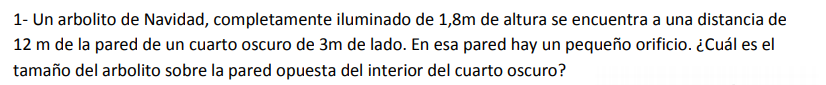

Ess un problema de **Cámara Oscura** (o cuarto oscuro). Este es uno de los ejercicios más conceptuales porque se resuelve utilizando pura semejanza de triángulos gracias al **principio de propagación rectilínea de la luz**.

---

### 1. Identificación de Datos e Incógnitas

Analizando la imagen que pasaste:

* **Altura del objeto (arbolito, $h$ o $\overline{AB}$):** $1,8\text{ m}$.

* **Distancia del objeto al orificio ($d$ o $\overline{BO}$):** $12\text{ m}$.

* **Profundidad del cuarto oscuro (ancho de la habitación, $d'$ o $\overline{B'O}$):** Al ser un cuarto de $3\text{ m}$ de lado, la distancia desde la pared del orificio hasta la pared opuesta donde se proyecta la imagen es de $3\text{ m}$.

* **Incógnita (altura de la imagen proyectada, $h'$ o $\overline{A'B'}$):** Tamaño del arbolito sobre la pared opuesta.

 

---

### 2. Planteo Gráfico y Semejanza Geométrica

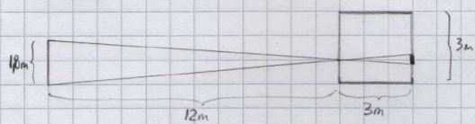

Debido a que la luz se propaga en línea recta, los rayos que parten de la punta del arbolito y de su base se cruzan en el pequeño orificio $O$, proyectando una **imagen invertida** en la pared del fondo.

Esto genera dos triángulos semejantes opuestos por el vértice ($O$): el triángulo del objeto ($ABO$) y el triángulo de la imagen ($A'B'O$).

Por semejanza de triángulos (Teorema de Tales), la relación entre las alturas es directamente proporcional a la relación entre las distancias al orificio:

$$\frac{\text{Altura de la Imagen } (h')}{\text{Altura del Objeto } (h)} = \frac{\text{Profundidad del cuarto } (d')}{\text{Distancia al objeto } (d)} \quad \text{}$$

Expresado matemáticamente con las variables del pizarrón:

$$\frac{\overline{A'B'}}{\overline{AB}} = \frac{\overline{B'O}}{\overline{BO}} \quad \text{}$$

---

### 3. Desarrollo Matemático Paso a Paso

Reemplazamos con los datos de tu enunciado de la guía:

$$\frac{\overline{A'B'}}{1,8\text{ m}} = \frac{3\text{ m}}{12\text{ m}} \quad \text{}$$

Despejamos el tamaño de la imagen ($\overline{A'B'}$):

$$\overline{A'B'} = 1,8\text{ m} \cdot \left( \frac{3\text{ m}}{12\text{ m}} \right) \quad \text{}$$

Simplificamos la fracción $\frac{3}{12} = \frac{1}{4} = 0,25$:

$$\overline{A'B'} = 1,8\text{ m} \cdot 0,25 \quad \text{}$$

$$\overline{A'B'} = 0,45\text{ m} \quad (45\text{ cm}) \quad \text{[cite: 1224]}$$

---

### 4. Justificación para el Examen y Comparación

* **Justificación Física:** Al pasar por un orificio milimétrico, los rayos de luz provenientes del extremo superior e inferior del arbolito continúan su marcha rectilínea cruzándose en el orificio $O$. Esto obliga a que la imagen proyectada sea **real** (se proyecta sobre la pared del fondo que actúa de pantalla) e **invertida**. Su tamaño final es de **$0,45\text{ m}$** (o $45\text{ cm}$).

---

## Ejercicio 2: Demostración de Espejos Planos Perpendiculares (90°)

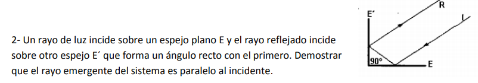

Este es un ejercicio clásico de **demostración geométrica** en espejos planos. En la jerga de física se lo conoce como el principio del **retrorreflector**.

Vamos a hacer la demostración paso a paso usando geometría básica y la **segunda ley de la reflexión**. 

---

### 1. Planteo Gráfico y Asignación de Ángulos

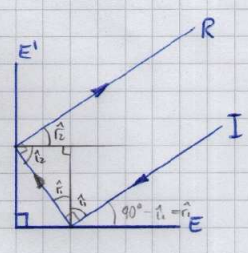

Imaginemos el rayo incidente $I$ que toca el espejo horizontal $E$ y se refleja hacia el espejo vertical $E'$. Al chocar contra $E'$, se vuelve a reflejar saliendo como rayo emergente $R$.

Trazamos las normales en cada punto de incidencia. Al ser los espejos perpendiculares entre sí ($90^{\circ}$), **sus normales también serán perpendiculares entre sí**.

Definamos las variables basándonos en tu apunte de clase (pág. 20):

* $\hat{1}$: Ángulo que forma el rayo incidente $I$ con el espejo horizontal $E$.

* $\hat{2}$: Ángulo que forma el rayo reflejado intermedio con el espejo $E$.

* $\hat{3}$: Ángulo que forma ese mismo rayo reflejado con el espejo vertical $E'$.

* $\hat{4}$: Ángulo que forma el rayo emergente $R$ con el espejo vertical $E'$.

---

### 2. Demostración Matemática Paso a Paso

**Paso A: Relación por Ley de Reflexión en el primer espejo ($E$)**
Por la segunda ley de la reflexión (el ángulo de incidencia es igual al de reflexión con respecto a la normal), se demuestra de forma directa que los ángulos que forma el rayo con la superficie reflectante también son iguales entre sí:

$$\hat{1} = \hat{2} \quad \text{}$$

**Paso B: Relación por Ley de Reflexión en el segundo espejo ($E'$)**
De igual manera, aplicando la ley de reflexión en el choque con el espejo $E'$:

$$\hat{3} = \hat{4} \quad \text{}$$

**Paso C: Propiedad del triángulo rectángulo interno**
Los espejos $E$ y $E'$ forman una esquina de $90^{\circ}$. El rayo intermedio que viaja de un espejo al otro forma un triángulo rectángulo con las dos paredes de los espejos.
Como la suma de los ángulos interiores de cualquier triángulo es de $180^{\circ}$:

$$\hat{2} + \hat{3} + 90^{\circ} = 180^{\circ}$$

$$\hat{2} + \hat{3} = 90^{\circ} \quad \text{}$$

**Paso D: Vinculación de los extremos**
De la ecuación anterior despejamos $\hat{3}$:

$$\hat{3} = 90^{\circ} - \hat{2}$$

Sustituyendo las igualdades de los pasos A y B ($\hat{2} = \hat{1}$ y $\hat{3} = \hat{4}$):

$$\hat{4} = 90^{\circ} - \hat{1} \quad \text{}$$

Si miramos el gráfico completo, el ángulo complementario que forma el rayo de salida $R$ respecto a la horizontal del primer espejo (o una línea paralela) nos confirma que las pendientes de las rectas son idénticas. En términos de vectores directores, si un rayo viaja con dirección $\vec{u} = (u_x, u_y)$:

1. Al reflejarse en $E$ (eje horizontal), su componente vertical cambia de signo: $\vec{u}_{ref} = (u_x, -u_y)$.
2. Al reflejarse en $E'$ (eje vertical), su componente horizontal cambia de signo: $\vec{u}_{eme} = (-u_x, -u_y)$.

Como el vector del rayo emergente es exactamente el opuesto del incidente:

$$\vec{u}_{eme} = -\vec{u}$$

---

### 3. Conclusión para el Parcial

Como las rectas de propagación del rayo incidente ($I$) y del emergente ($R$) tienen la misma inclinación respecto a la vertical y la horizontal pero en sentidos opuestos, se demuestra de manera absoluta que **ambas trayectorias son paralelas entre sí ($I \parallel R$)**. Queda demostrada la propiedad del sistema retrorreflector de ángulo recto.

---

## Ejercicio 3: Longitud Mínima del Espejo para Ver el Árbol

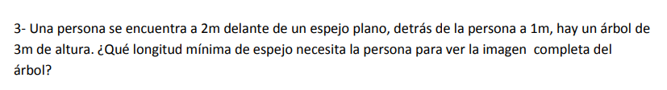

Es el típico ejercicio donde la mayoría se equivoca porque se confunden al ubicar las distancias y las prolongaciones virtuales de la imagen.

Vamos a resolverlo paso a paso usando la **simetría de espejos planos** y la **semejanza de triángulos**. Vas a ver que con el esquema correcto sale solo.

---

### 1. Identificación de Datos y Posiciones Relativas

Primero pasemos en limpio las distancias del sistema:

* **Distancia de la persona ($R$) al espejo ($EE'$):** $2\text{ m}$.

* **Distancia del árbol ($AB$) a la persona ($R$):** $1\text{ m}$ (está detrás de ella).

* **Distancia del árbol ($AB$) al espejo ($EE'$):** Como el árbol está $1\text{ m}$ detrás de la persona, y la persona está a $2\text{ m}$ del espejo, la distancia total del árbol al espejo es:

$$2\text{ m} + 1\text{ m} = 3\text{ m} \quad \text{}$$

* **Altura real del árbol ($AB$):** $3\text{ m}$.

* **Incógnita:** Longitud mínima del espejo ($\overline{EE'}$).

---

### 2. El Truco Físico Clave: La Imagen Virtual Simétrica

Recordando la teoría de espejos planos, todo objeto colocado frente a un espejo plano genera una **imagen virtual simétrica detrás del espejo** (a igual distancia).

* El árbol está físicamente a $3\text{ m}$ por delante del espejo.

* Por lo tanto, su imagen virtual ($A'B'$) se formará **$3\text{ m}$ por detrás del espejo**.

* La altura de la imagen del árbol ($A'B'$) es exactamente idéntica a la del árbol real: $3\text{ m}$.

Ahora calculemos la **distancia total desde los ojos de la persona ($R$) hasta la imagen del árbol ($A'B'$)**:

* Desde la persona hasta el espejo hay $2\text{ m}$.

* Desde el espejo hasta la imagen del árbol hay $3\text{ m}$.

* Distancia total:

$$2\text{ m} + 3\text{ m} = 5\text{ m} \quad \text{}$$

---

### 3. Planteo Geométrico (Semejanza de Triángulos)

Para que la persona pueda ver el árbol completo reflejado, los rayos de luz que parecen provenir de los extremos de la imagen del árbol ($A'$ y $B'$) deben ingresar a sus ojos ($R$) pasando justo por los bordes físicos del espejo ($E$ y $E'$).

Esto nos define dos triángulos semejantes:

1. El triángulo pequeño: formado por los ojos de la persona y los bordes del espejo, **$\Delta REE'$**. Su altura es la distancia de la persona al espejo ($2\text{ m}$).

2. El triángulo grande: formado por los ojos de la persona y los extremos de la imagen del árbol, **$\Delta RA'B'$**. Su altura es la distancia total de la persona a la imagen ($5\text{ m}$).

Establecemos la relación de semejanza de triángulos:

$$\frac{\text{Base menor }(\overline{EE'})}{\text{Base mayor }(\overline{A'B'})} = \frac{\text{Altura menor }(\overline{RH})}{\text{Altura mayor }(\overline{RH'})} \quad \text{}$$

Sustituimos con los valores conocidos:

$$\frac{\overline{EE'}}{3\text{ m}} = \frac{2\text{ m}}{5\text{ m}} \quad \text{}$$

---

### 4. Desarrollo Matemático y Resultado

Despejamos la longitud del espejo ($\overline{EE'}$):

$$\overline{EE'} = 3\text{ m} \cdot \left(\frac{2\text{ m}}{5\text{ m}}\right) \quad \text{}$$

$$\overline{EE'} = 3\text{ m} \cdot 0,4 \quad \text{}$$

$$\overline{EE'} = 1,2\text{ m} \quad \text{}$$

---

### 5. Conclusión para el Parcial

La persona necesita que el espejo plano tenga una **longitud mínima de $1,2\text{ m}$** para poder visualizar reflejada la totalidad del árbol de $3\text{ m}$ de altura que tiene a sus espaldas.

---

## Ejercicio 4: Radio de Curvatura de Espejo Cóncavo

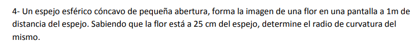

ste ejercicio es muy importante porque introduce un concepto clave para justificar en tus parciales de la UTN: **la relación entre imágenes reales y pantallas**.

---

### 1. Identificación de Datos e Incógnitas

* **Tipo de espejo:** Cóncavo de pequeña abertura.

* **Posición del objeto (flor, $x$):** El objeto real está por delante del espejo, entonces:

$$x = +25\text{ cm} = +0,25\text{ m} \quad \text{}$$

* **Ubicación de la pantalla (imagen, $x'$):** La imagen se forma sobre una pantalla colocada a $1\text{ m}$ del espejo.

* **Incógnita:** Radio de curvatura del espejo ($R$ o $r$).

---

### 2. Análisis Físico Esencial (Justificación de Examen)

Antes de hacer cuentas en un parcial de la UTN, tenés que justificar los signos de tus variables de esta manera:

1. 
**Justificación del carácter de la imagen:** El enunciado menciona que la imagen se forma **en una pantalla**. Por definición, las únicas imágenes que pueden proyectarse sobre pantallas o soportes físicos son las **imágenes reales**.

2. 
**Justificación del signo de la posición de la imagen ($x'$):** Al ser una imagen real en un espejo esférico, los rayos reflejados se intersectan físicamente por delante del espejo (del mismo lado que el objeto). Por lo tanto, usando el sistema de coordenadas cartesianas de la facultad, su coordenada de posición es positiva:

$$x' = +1\text{ m} = +100\text{ cm} \quad \text{}$$

3. **Justificación del tipo de espejo y foco ($f$):** Los espejos convexos producen únicamente imágenes virtuales para objetos reales. Dado que esta imagen es real , el espejo obligatoriamente tiene que ser **cóncavo**. Por ende, su distancia focal $f$ y su radio de curvatura $R$ deben resultar positivos.

---

### 3. Desarrollo Matemático Paso a Paso

**Paso A: Calcular la abscisa focal ($f$) mediante la fórmula de Descartes**
Utilizamos la ecuación de Descartes para espejos de pequeña abertura:

$$\frac{1}{f} = \frac{1}{x} + \frac{1}{x'} \quad \text{}$$

Reemplazamos con los valores en metros (para mantener coherencia de unidades):

$$\frac{1}{f} = \frac{1}{0,25\text{ m}} + \frac{1}{1\text{ m}} \quad \text{}$$

Calculamos las fracciones:

$$\frac{1}{f} = 4 + 1 \quad \text{}$$

$$\frac{1}{f} = 5 \implies f = \frac{1}{5}\text{ m} = 0,2\text{ m} \quad (20\text{ cm}) \quad \text{}$$

---

**Paso B: Hallar el Radio de Curvatura ($R$)**
Sabiendo que para espejos esféricos de pequeña abertura se cumple la relación paraxial:

$$f = \frac{R}{2} \implies R = 2 \cdot f \quad \text{}$$

Sustituimos el valor de $f$:

$$R = 2 \cdot 0,2\text{ m} \quad \text{}$$

$$R = 0,4\text{ m} \quad (40\text{ cm}) \quad \text{}$$

---

### 4. Características Adicionales de la Imagen (Opcional para complementar)

Si quisiéramos calcular el aumento lateral ($A$):

$$A = -\frac{x'}{x} \quad \text{}$$

$$A = -\frac{1\text{ m}}{0,25\text{ m}} = -4 \quad \text{}$$

* Como **$A = -4$** es negativo, la imagen de la flor sobre la pantalla estará **invertida**.

* Como **$\vert{}A\vert{} [cite_start]= 4 > 1$**, la imagen será **4 veces más grande** que la flor real.

---

### 5. Conclusión para el Parcial

El espejo esférico es **cóncavo** y posee un **radio de curvatura de $0,4\text{ m}$** (o $40\text{ cm}$).

---

## Ejercicio 5: Espejo Esférico de Afeitado/Maquillaje

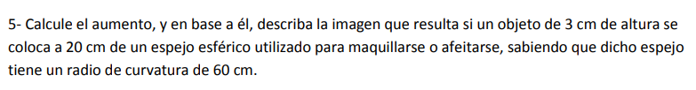

---

### 1. Identificación de Datos e Incógnitas

* **Altura del objeto ($y$):** $+3\text{ cm}$ (positivo por estar orientado hacia arriba del eje principal).

* **Posición del objeto ($x$):** $+20\text{ cm}$ (objeto real por delante del vértice del espejo).

* **Radio de curvatura ($R$):** Como es un espejo para maquillarse o afeitarse (necesitamos ver nuestro rostro ampliado y al derecho), se trata obligatoriamente de un **espejo cóncavo**. Por lo tanto, el radio es positivo: $R = +60\text{ cm}$.

* **Incógnitas:** Aumento lateral ($A$), posición de la imagen ($x'$) y descripción completa de la misma.

---

### 2. Desarrollo Matemático Paso a Paso

**Paso A: Calcular la abscisa focal ($f$)**
Para un espejo esférico bajo condiciones de pequeña abertura (paraxial), la distancia focal es la mitad de su radio de curvatura:

$$f = \frac{R}{2} = \frac{60\text{ cm}}{2} = +30\text{ cm} \quad \text{(Foco positivo = Cóncavo)} \text{}$$

**Paso B: Hallar la posición de la imagen ($x'$) mediante la ecuación de Descartes**
La ecuación de Descartes establece que:

$$\frac{1}{x} + \frac{1}{x'} = \frac{1}{f} \text{}$$

Reemplazamos con los valores numéricos correspondientes:

$$\frac{1}{20\text{ cm}} + \frac{1}{x'} = \frac{1}{30\text{ cm}} \text{}$$

Despejamos el término que contiene la incógnita $x'$:

$$\frac{1}{x'} = \frac{1}{30\text{ cm}} - \frac{1}{20\text{ cm}} \text{}$$

Buscamos el común denominador ($60$) para realizar la resta:

$$\frac{1}{x'} = \frac{2 - 3}{60\text{ cm}} = -\frac{1}{60\text{ cm}} \text{}$$

Por lo tanto:

$$x' = -60\text{ cm} \text{}$$

**Paso C: Calcular el aumento lateral ($A$)**
La fórmula del aumento lateral para espejos esféricos es:

$$A = \frac{y'}{y} = -\frac{x'}{x} \text{}$$

Reemplazamos con los valores de las posiciones obtenidos:

$$A = -\frac{-60\text{ cm}}{20\text{ cm}} = +3 \text{ }$$

(Al ser un cociente de magnitudes con la misma unidad de medida, el aumento es una cantidad **adimensional**, es decir, sin unidades).

**Paso D: Determinar la altura final de la imagen ($y'$)**
Sustituyendo el aumento en la primera parte de la relación:

$$A = \frac{y'}{y} \implies 3 = \frac{y'}{3\text{ cm}} \implies y' = 9\text{ cm} \text{}$$

---

### 3. Justificación Física y Descripción de la Imagen (Esencial para el Parcial)

Para obtener el puntaje completo en tu examen de Física, debés justificar la naturaleza de la imagen utilizando los signos de las variables calculadas:

* **Imagen Virtual:** Dado que **$x' < 0$** ($-60\text{ cm}$), la imagen se forma por detrás de la superficie reflectante del espejo (en el espacio virtual de las prolongaciones de los rayos reflejados).

* **Imagen Derecha:** Como el aumento lateral es positivo (**$A = +3 > 0$**), la altura de la imagen $y'$ conserva el mismo signo positivo que la del objeto. La imagen no está invertida.

* **Imagen Mayor:** Como el módulo del aumento es mayor que la unidad (**$\vert{}A\vert{} = 3 > 1$**), el tamaño final de la imagen ($9\text{ cm}$) es tres veces más grande que el tamaño del objeto original ($3\text{ cm}$).

---

## Ejercicio 6: Análisis de Espejo Esférico con Imagen Virtual

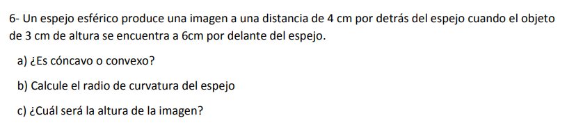

---

### 1. Identificación de Datos e Incógnitas

* **Altura del objeto ($y$):** $+3\text{ cm}$ (objeto real orientado hacia arriba).

* **Posición del objeto ($x$):** $+6\text{ cm}$ (objeto real por delante del vértice del espejo).

* **Ubicación de la imagen ($x'$):** Se produce a $4\text{ cm}$ **por detrás** del espejo. Aplicando la convención de signos cartesianos de la facultad, toda posición por detrás del vértice se toma con signo negativo:

$$x' = -4\text{ cm} \text{}$$

**Incógnitas:**
* a) Clasificación del espejo (cóncavo o convexo).

* b) Radio de curvatura ($R$).

* c) Altura de la imagen ($y'$).

---

### 2. Desarrollo Matemático Paso a Paso

Parte a) ¿Es cóncavo o convexo? 

Para clasificar el espejo, primero necesitamos calcular su **abscisa focal ($f$)** empleando la ecuación de Descartes:

$$\frac{1}{f} = \frac{1}{x} + \frac{1}{x'} \text{}$$

Sustituimos los datos con sus respectivos signos cartesianos:

$$\frac{1}{f} = \frac{1}{6\text{ cm}} + \frac{1}{-4\text{ cm}} \text{}$$

$$\frac{1}{f} = \frac{1}{6} - \frac{1}{4} \text{}$$

Buscamos el común denominador ($12$ o $24$) para resolver la resta:

$$\frac{1}{f} = \frac{2 - 3}{12\text{ cm}} = -\frac{1}{12\text{ cm}} \text{}$$

Despejando, obtenemos la abscisa focal:

$$f = -12\text{ cm} \text{}$$

> 
> **💡 Justificación para el parcial:** > Bajo la convención de signos cartesianos oficial de la UTN FRBA, si la abscisa focal resultante es negativa ($f < 0$), el foco se encuentra por detrás del vértice del espejo. Por lo tanto, se trata de un **espejo convexo**.
> 
> 

---

Parte b) Calcule el radio de curvatura del espejo 

Para un espejo esférico de pequeña abertura, el radio de curvatura se vincula con la distancia focal mediante la relación:

$$f = \frac{R}{2} \implies R = 2 \cdot f \text{}$$

Sustituimos el valor de $f$ que acabamos de calcular:

$$R = 2 \cdot (-12\text{ cm}) \text{}$$

$$R = -24\text{ cm} \text{}$$

* **Interpretación:** El signo negativo confirma que es un espejo convexo (cuyo centro de curvatura se localiza por detrás del espejo). El valor absoluto del radio es $24\text{ cm}$.

---

Parte c) ¿Cuál será la altura de la imagen? 

Utilizamos la relación del aumento lateral ($A$) para vincular las posiciones con las alturas:

$$A = \frac{y'}{y} = -\frac{x'}{x} \text{}$$

Primero calculamos el valor del aumento ($A$):

$$A = -\frac{-4\text{ cm}}{6\text{ cm}} = +\frac{4}{6} = +0,67 \text{}$$

Ahora, despejamos la altura de la imagen ($y'$) de la igualdad:

$$0,67 = \frac{y'}{3\text{ cm}} \implies y' = 0,67 \cdot 3\text{ cm} \text{}$$

$$y' \approx +2\text{ cm} \text{}$$

---

### 3. Justificación Física y Características de la Imagen

* **Imagen Virtual:** Se localiza por detrás del espejo ($x' = -4\text{ cm} < 0$).

* **Imagen Derecha:** Al tener un aumento lateral positivo ($A = +0,67 > 0$), la altura $y'$ mantiene el mismo signo positivo (hacia arriba) que el objeto.

* **Imagen Menor:** Dado que el módulo del aumento es menor a la unidad ($\vert{}A\vert{} = 0,67 < 1$), el tamaño de la imagen ($2\text{ cm}$) es menor que el del objeto original ($3\text{ cm}$).

Esto coincide perfectamente con la teoría: un objeto real frente a un espejo convexo **siempre** produce una única imagen virtual, derecha y de menor tamaño.

---
## Ejercicio 7: Velocidad de la Luz en el Diamante

7- Hallar la velocidad de la luz en el interior del diamante. 

---

### 1. Identificación de Datos e Incógnitas

* **Velocidad de la luz en el vacío ($c$):** $c \approx 3 \cdot 10^{8} \text{ m/s}$ (o expresada como $300.000 \text{ km/s}$).

* **Índice de refracción absoluto del diamante ($n_{\text{diamante}}$):** Consultando la tabla oficial del material teórico de la cátedra (pág. 16), el índice asignado para esta sustancia es de:

$$n_{\text{diamante}} = 2,42 \quad \text{}$$

(Nota técnica: En las anotaciones rápidas del pizarrón de clase a veces se simplifica a $2,4$ , pero en el parcial siempre conviene respaldarse en la tabla del apunte teórico ).

* **Incógnita:** Velocidad de propagación de la luz en el interior del diamante ($v$).

---

### 2. Desarrollo Matemático Paso a Paso

El índice de refracción absoluto de un medio material se define como el cociente entre la velocidad de la luz en el vacío y la velocidad que adquiere en dicho medio material:

$$n = \frac{c}{v} \quad \text{}$$

Como nuestra incógnita es la velocidad en el medio ($v$), procedemos a realizar el despeje correspondiente de la ecuación:

$$v = \frac{c}{n} \quad \text{}$$

Reemplazamos con los datos numéricos de la materia:

$$v = \frac{3 \cdot 10^{8} \text{ m/s}}{2,42} \quad \text{}$$

Efectuamos el cálculo de la división:

$$v \approx 1,2396 \cdot 10^{8} \text{ m/s} \quad \text{}$$

Si decidís trabajar con la velocidad de la luz en kilómetros por segundo ($300.000 \text{ km/s}$) para expresarlo de manera idéntica a la sección de respuestas de la guía de la facultad:

$$v = \frac{300.000 \text{ km/s}}{2,42} \approx 123.966,94 \text{ km/s} \quad \text{}$$

Lo cual se condensa de forma simplificada en las soluciones de tu guía como:

$$v = 1,24 \cdot 10^{5} \text{ km/s} \quad (\text{ó } 1,24 \cdot 10^{8} \text{ m/s}) \quad \text{}$$

---

### 3. Justificación Física para el Examen

* El índice de refracción es una propiedad adimensional que indica cuántas veces es mayor la velocidad de la luz en el vacío respecto a la velocidad dentro del medio material analizado.

* Dado que el diamante posee un índice de refracción elevado ($2,42$) , la velocidad de la luz en su interior se reduce drásticamente a un $41,3\%$ de su valor original en el vacío , resultando en un valor aproximado de **$1,24 \cdot 10^{8} \text{ m/s}$**.

---

¡Espectacular, Nacho! El ejercicio 8 es un clásico absoluto de examen en la UTN porque introduce de manera práctica el concepto de **dispersión cromática** vinculado al fenómeno de **reflexión total interna**. La luz blanca está compuesta por todos los colores, y como cada color experimenta un índice de refracción sutilmente distinto en el vidrio, cada uno se comporta de forma independiente.

Vamos a resolverlo paso a paso con todo el rigor conceptual que te van a exigir.

---

## Ejercicio 8: Dispersión y Reflexión Total Interna (Vidrio-Aire)

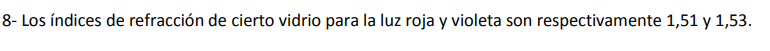
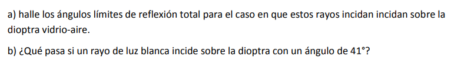

### 1. Identificación de Datos e Incógnitas

* **Índice de refracción para la luz roja ($n_{\text{roja}}$):** $1,51$.

* **Índice de refracción para la luz violeta ($n_{\text{violeta}}$):** $1,53$.

* **Medio de incidencia (Medio 1):** Vidrio ($n_1 = n_{\text{color}}$).

* **Medio de emergencia (Medio 2):** Aire ($n_2 = 1,0003 \approx 1$).

* **Incógnitas:**
* a) Ángulos límites de reflexión total para ambos rayos en la dioptra vidrio-aire.

* b) Fenómeno físico ocurrido si incide luz blanca con un ángulo real $\alpha = 41^{\circ}$.

---

### 2. Desarrollo Matemático Paso a Paso

#### Parte a) Hallar los ángulos límites ($\hat{l}$) para cada componente cromática

Recordando la condición general de ángulo límite, el rayo viaja de un medio más refringente a uno menos refringente ($n_1 > n_2$). El ángulo crítico se calcula cuando el ángulo de refracción alcanza los $90^{\circ}$:

$$\operatorname{sen}(\hat{l}) = \frac{n_2}{n_1} = \frac{n_{\text{aire}}}{n_{\text{vidrio}}} \approx \frac{1}{n_{\text{vidrio}}} $$

* **Para la luz roja ($n_{\text{roja}} = 1,51$):**

$$\operatorname{sen}(\hat{l}_{\text{roja}}) = \frac{1}{1,51} \approx 0,66225$$

$$\hat{l}_{\text{roja}} = \operatorname{arcsen}(0,66225) \approx 41,47^{\circ} $$

* **Para la luz violeta ($n_{\text{violeta}} = 1,53$):**

$$\operatorname{sen}(\hat{l}_{\text{violeta}}) = \frac{1}{1,53} \approx 0,65359$$

$$\hat{l}_{\text{violeta}} = \operatorname{arcsen}(0,65359) \approx 40,81^{\circ} $$

---

#### Parte b) ¿Qué pasa si un rayo de luz blanca incide con un ángulo de $41^{\circ}$?

La luz blanca contiene todo el espectro visible, desde el rojo hasta el violeta. Al incidir con un ángulo físico real de $\alpha = 41^{\circ}$ en la interfaz, debemos comparar este valor con el ángulo límite de cada color:

1. **Análisis para la componente violeta:**
El ángulo de incidencia real es **mayor** que su ángulo límite:

$$\alpha > \hat{l}_{\text{violeta}} \quad \implies \quad 41^{\circ} > 40,81^{\circ}$$

* **Resultado:** La luz violeta (y la gran mayoría de los colores intermedios como el azul o el verde, cuyos ángulos límite también son menores a $41^{\circ}$) **no pueden refractarse**. Experimentan **reflexión total interna** y vuelven hacia el interior del vidrio con un ángulo de reflexión de $41^{\circ}$.

2. **Análisis para la componente roja:**
El ángulo de incidencia real es **menor** que su ángulo límite:

$$\alpha < \hat{l}_{\text{roja}} \quad \implies \quad 41^{\circ} < 41,47^{\circ} $$

* **Resultado:** La luz roja **sí logra refractarse** y salir al aire. Al atravesar la dioptra hacia un medio menos refringente, se aleja de la normal con un ángulo de refracción $\beta_{\text{roja}}$ calculable por Snell:

$$1,51 \cdot \operatorname{sen}(41^{\circ}) = 1 \cdot \operatorname{sen}(\beta_{\text{roja}}) $$

$$\operatorname{sen}(\beta_{\text{roja}}) \approx 1,51 \cdot 0,65606 \approx 0,99065$$

$$\beta_{\text{roja}} = \operatorname{arcsen}(0,99065) \approx 82,15^{\circ}$$

---

### 3. Conclusión Teórica 

Si te llegan a pedir que describas conceptualmente el fenómeno general que se observa en la superficie, debés responder lo siguiente:

> Al incidir la luz blanca a $41^{\circ}$, el rayo **se descompone**. Las componentes de longitudes de onda más cortas (como el violeta y el azul) sufren **reflexión total interna** y se quedan atrapadas dentro del bloque de vidrio. Por el contrario, las componentes de longitudes de onda más largas (como el rojo) logran **refractarse** y emergen al aire de forma rasante, muy cercanas a la superficie de la dioptra con un ángulo de salida aproximado de $82,15^{\circ}$.
> 
> 

---

## Ejercicio 9: Mancha Luminosa en la Piscina

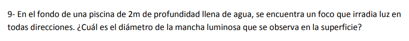

Se lo conoce como el problema del **cono de luz** o de la **mancha luminosa en la piscina**. Acá combinamos el concepto de **ángulo límite** con **trigonometría básica**.

---

### 1. Identificación de Datos e Incógnitas

* **Profundidad de la piscina ($h$):** $2\text{ m}$.

* **Medio de incidencia (Medio 1):** Agua ($n_1 = 1,33$).

* **Medio de emergencia (Medio 2):** Aire ($n_2 \approx 1$).

* **Incógnita:** Diámetro de la mancha luminosa circular ($D$) en la superficie del agua.

---

### 2. Análisis Físico Clave (Justificación de Examen)

Como el foco irradia luz en todas las direcciones desde el fondo, los rayos viajan del agua (más refringente) hacia el aire (menos refringente).

* Los rayos que inciden con un ángulo menor al ángulo límite ($\alpha < \hat{l}$) logran refractarse y salir al aire, haciéndose visibles desde afuera.

* Los rayos que inciden justo con el ángulo límite ($\alpha = \hat{l}$) emergen rasantes a la superficie ($\beta = 90^{\circ}$).

* Todos los rayos que se emitan con un ángulo mayor al ángulo límite ($\alpha > \hat{l}$) sufren **reflexión total interna** y vuelven al fondo de la piscina, por lo que no aportan luz al exterior.

Esto significa que el borde extremo de la mancha circular visible en la superficie está determinado exactamente por el rayo que incide con el **ángulo límite ($\hat{l}$)**.

---

### 3. Desarrollo Matemático Paso a Paso

**Paso A: Calcular el ángulo límite ($\hat{l}$) para la interfaz agua-aire**
Aplicando la Ley de Snell cuando el ángulo de refracción es de $90^{\circ}$:

$$\operatorname{sen}(\hat{l}) = \frac{n_2}{n_1} = \frac{1}{1,33} \approx 0,75188 \text{ }$$

$$\hat{l} = \operatorname{arcsen}(0,75188) \approx 48,75^{\circ} \text{ (o } 48^{\circ} 45' \text{) }$$

**Paso B: Relacionar el ángulo con la geometría de la piscina (Trigonometría)**
Si observamos el triángulo rectángulo formado entre la vertical del foco, la superficie del agua y el rayo extremo:

* El cateto adyacente es la profundidad de la piscina: $h = 2\text{ m}$.

* El cateto opuesto es el **radio ($R$)** de la mancha circular en la superficie.

* El ángulo opuesto superior es alterno interno con el ángulo límite de incidencia, vale decir que también es $\hat{l}$.

Por definición de la función tangente:

$$\tan(\hat{l}) = \frac{\text{Cateto Opuesto}}{\text{Cateto Adyacente}} = \frac{R}{h} \text{ }$$

Despejamos el radio ($R$):

$$R = h \cdot \tan(\hat{l}) \text{}$$

$$R = 2\text{ m} \cdot \tan(48,75^{\circ}) \text{ }$$

$$R \approx 2\text{ m} \cdot 1,1404 \approx 2,2808\text{ m} \text{}$$

**Paso C: Calcular el diámetro de la mancha ($D$)**
El diámetro es el doble del radio de la circunferencia:

$$D = 2 \cdot R \text{ }$$

$$D = 2 \cdot 2,2808\text{ m} \approx 4,5616\text{ m} \text{}$$

---

### 4. Conclusión para el Parcial

$$D \approx 4,56\text{ m} \text{}$$

El **diámetro de la mancha luminosa** observable en la superficie es de aproximadamente **$4,56\text{ m}$**.

---

## Ejercicio 10: Espejo Plano y Vaso con Agua (Profundidad Aparente)

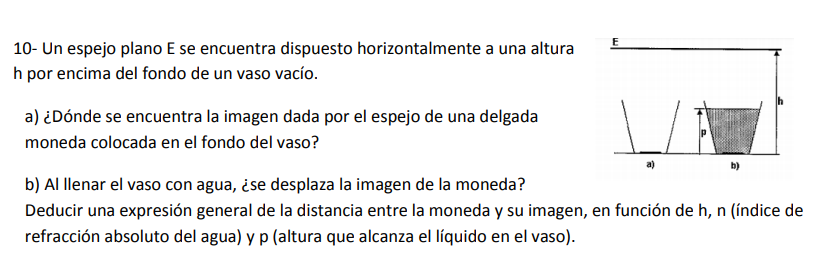

El ejercicio  combina dos temas del repositorio en un mismo sistema: **la reflexión en un espejo plano** y la **refracción en una dioptra plana** (efecto de profundidad aparente).

Vamos a resolver los incisos a) y b) paso a paso, deduciendo la expresión formal tal como la solicita la guía.

---

### 1. Identificación de Datos del Sistema

* $h$: Altura fija desde el fondo del vaso hasta el espejo plano horizontal.

* $p$: Altura o nivel que alcanza el agua en el interior del vaso ($p \le h$).

* $n$: Índice de refracción absoluto del agua ($n_{\text{agua}} = n$).

* $n_0$: Índice de refracción del aire ($n_{\text{aire}} \approx 1$).

---

### 2. Resolución del Inciso a) Vaso Vacío

Cuando el vaso se encuentra completamente vacío, el único medio presente entre la moneda y el espejo es el aire. El sistema se reduce al comportamiento clásico de un espejo plano.

* **Propiedad teórica:** Todo objeto real colocado frente a un espejo plano a una distancia determinada produce una imagen virtual que es perfectamente simétrica respecto al plano del espejo.

* **Matemática:** Como la distancia real de la moneda al espejo es igual a $h$, su imagen virtual se forma exactamente a una distancia $h$ por encima (detrás) del espejo.

* **Respuesta a):** La imagen se encuentra a una altura **$h$ por encima del plano del espejo**. Por lo tanto, la distancia total entre la moneda real y su correspondiente imagen virtual reflejada es de **$2h$**.

---

### 3. Resolución del Inciso b) Vaso con Agua y Deducción Analítica

Al llenar el vaso con agua hasta una altura $p$, la luz emitida por la moneda debe atravesar primero la superficie del agua (dioptra plana agua-aire) antes de viajar por el aire y alcanzar el espejo. Esto genera una desviación de los rayos paraxiales cambiando la posición aparente del objeto para el espejo.

#### Paso A: Calcular la posición de la primera imagen dada por la dioptra plana

Para un observador o sistema óptico situado en el aire, la refracción en la superficie del agua provoca un efecto de "profundidad aparente". La moneda real, que se encuentra en el fondo (a una distancia real $p$ de la dioptra), produce una imagen intermedia virtual a una distancia aparente $p'$ de la interfaz agua-aire.

Aplicando la ecuación de la dioptra plana para incidencia normal o paraxial:

$$\frac{n_{\text{origen}}}{x} = \frac{n_{\text{destino}}}{x'} \implies \frac{n}{p} = \frac{1}{p'}$$

Despejamos la profundidad aparente de la moneda ($p'$):

$$p' = \frac{p}{n} \quad \text{}$$

Esto significa que, debido a la refracción, el espejo no "ve" la moneda en el fondo real, sino que la recibe como un **objeto aparente** que se encuentra a una distancia $p'$ por debajo de la superficie del agua.

#### Paso B: Calcular la distancia de este objeto aparente hacia el espejo

* La distancia desde el fondo del vaso hasta el espejo es $h$.

* La capa de agua mide $p$, por lo que el espacio de aire vacío entre la superficie del agua y el espejo mide $(h - p)$.

* La distancia efectiva ($d$) desde el objeto aparente (imagen de la dioptra) hasta el espejo es la suma del espacio de aire más la profundidad aparente:

$$d = (h - p) + p' = (h - p) + \frac{p}{n}$$

#### Paso C: Aplicar la simetría del espejo plano

El espejo plano horizontal genera la imagen final del sistema a una distancia idéntica $d$ por encima de su plano. Por lo tanto, la distancia que separa al espejo de la imagen final reflejada de la moneda es:

$$d_{\text{imagen-espejo}} = h - p + \frac{p}{n}$$

#### Paso D: Obtener la distancia total entre la moneda real y su imagen final

El enunciado nos pide deducir la expresión de la distancia total entre la moneda real (que está en el fondo del vaso, a una distancia $h$ por debajo del espejo) y la imagen final reflejada (que está a una distancia $d$ por encima del espejo):

$$\text{Distancia Total} = h + d_{\text{imagen-espejo}}$$

$$\text{Distancia Total} = h + \left( h - p + \frac{p}{n} \right)$$

$$\text{Distancia Total} = 2h - p + \frac{p}{n}$$

$$\text{Distancia Total} = 2h - p \cdot \left( 1 - \frac{1}{n} \right) \quad \implies \quad 2h - p \cdot \frac{n - 1}{n} \quad \text{}$$

---

### 4. Conclusiones finales para el parcial

* **¿Se desplaza la imagen de la moneda?** Sí, se desplaza hacia arriba. Al introducir agua (un medio con $n > 1$), el término $p \cdot \frac{n - 1}{n}$ resta valor a la distancia original de $2h$, lo que significa analíticamente que **la imagen final se eleva (se acerca más a la moneda real)**.

* **Expresión general deducida:**

$$\text{Distancia} = 2h - p \cdot \frac{n - 1}{n} \quad \text{}$$

---

## Ejercicio 11: Marcha de un Rayo en un Prisma Triangular

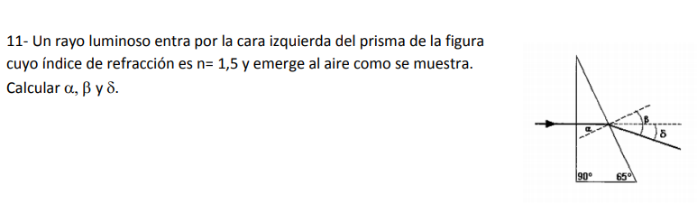

Un problema de **prismas ópticos** muy interesante. Este tipo de ejercicios requiere que combinemos la **Ley de Snell** con la geometría interna de los ángulos del triángulo del prisma.

Vamos a resolverlo paso a paso, aplicando la teoría oficial de la materia para deducir $\alpha$, $\beta$ y $\delta$.

---

### 1. Identificación de Datos e Incógnitas

* **Índice de refracción del prisma ($n$ o $n_1$):** $n = 1,5$.

* **Medio exterior:** Aire ($n_{\text{aire}} = 1$).

* **Geometría del prisma:** Es un triángulo que posee un ángulo recto ($90^\circ$) y un ángulo en la base de $65^\circ$. El ángulo superior (ángulo de refringencia, $\omega$) no está explícitamente dado, pero se deduce geométricamente.

* **Incidencias:**
* El rayo entra de forma **perpendicular (normal)** por la cara izquierda.

* Al llegar a la segunda cara (cara derecha oblicua), incide con un ángulo $\alpha$ respecto a la normal de esa superficie.

* Se refracta emergiendo al aire con un ángulo $\beta$ respecto de la normal.

* El ángulo $\delta$ representa el ángulo de desviación del rayo respecto de su dirección horizontal original.

---

### 2. Desarrollo Geométrico y Matemático Paso a Paso

#### Paso A: Comportamiento en la primera cara (izquierda)

* **Principio físico:** Cuando la luz incide en forma perpendicular sobre una dioptra, el ángulo de incidencia es $0^\circ$. Por lo tanto, el ángulo de refracción también es $0^\circ$.

* **Resultado:** El rayo atraviesa la primera superficie **sin desviarse**, manteniendo una trayectoria completamente horizontal hacia el interior del prisma.

#### Paso B: Calcular el ángulo de incidencia $\alpha$ en la segunda cara

Para hallar $\alpha$, necesitamos usar la geometría de los triángulos internos formados por el rayo horizontal:

1. **Calcular el ángulo superior del prisma ($\omega$):**
Sabiendo que la suma de los ángulos interiores del triángulo del prisma es $180^\circ$:

$$\omega + 90^\circ + 65^\circ = 180^\circ$$

$$\omega = 180^\circ - 155^\circ = 25^\circ$$

2. **Relación geométrica con la normal:**
El rayo viaja de manera totalmente horizontal dentro del prisma. Si trazamos un triángulo rectángulo superior usando la cara izquierda, la cara oblicua y el rayo horizontal, el ángulo interno que forma la cara oblicua con el rayo es el complementario de $\omega$:

$$\theta_{\text{interno}} = 90^\circ - \omega = 90^\circ - 25^\circ = 65^\circ$$

3. **Hallar $\alpha$:**
La recta de puntos del diagrama representa la **Normal ($N$)** a la cara oblicua, lo que significa que forma un ángulo de $90^\circ$ exactos con dicha superficie. Por lo tanto, el ángulo de incidencia $\alpha$ y el ángulo interno del rayo ($\theta_{\text{interno}}$) son complementarios entre sí:

$$\alpha + \theta_{\text{interno}} = 90^\circ$$

$$\alpha = 90^\circ - 65^\circ = 25^\circ$$

> **📌 Regla general de prismas:** Cuando un rayo incide normalmente por la primera cara de un prisma rectangular, el ángulo de incidencia en la segunda cara siempre es igual al ángulo de refringencia superior del prisma ($\alpha = \omega = 25^\circ$).
> 
> 

---

#### Paso C: Calcular el ángulo de emergencia $\beta$

El rayo ahora viaja desde el interior del prisma ($n_1 = 1,5$) hacia el aire ($n_2 = 1$). Aplicamos la **Ley de Snell** en esta segunda interfaz:

$$n_1 \cdot \operatorname{sen}(\alpha) = n_2 \cdot \operatorname{sen}(\beta)$$

Reemplazamos con los valores conocidos:

$$1,5 \cdot \operatorname{sen}(25^\circ) = 1 \cdot \operatorname{sen}(\beta)$$

Calculamos el seno de $25^\circ$:

$$\operatorname{sen}(\beta) = 1,5 \cdot 0,42262 = 0,63393$$

Despejamos el ángulo $\beta$ aplicando la función inversa:

$$\beta = \operatorname{arcsen}(0,63393) \approx 39,34^\circ \text{}$$

Si convertimos los decimales a minutos para que te coincida de forma exacta con la respuesta del pizarrón y de la guía ($0,34^\circ \cdot 60 \approx 20'$):

$$\beta \approx 39^\circ 20' \text{}$$

---

#### Paso D: Calcular el ángulo de desviación $\delta$

Mirando con atención el diagrama geométrico de la segunda cara:

* La línea horizontal discontinua es la prolongación de la trayectoria original que traía el rayo.

* El ángulo que se forma entre esa horizontal original y la normal oblicua es exactamente igual a $\alpha$ por ser ángulos correspondientes/alternos entre paralelas y transversales.

* El ángulo de emergencia total $\beta$ está compuesto por la suma de esa inclinación horizontal más la desviación física final del rayo ($\delta$):

$$\beta = \alpha + \delta$$

Despejamos el ángulo de desviación $\delta$:

$$\delta = \beta - \alpha$$

$$\delta = 39^\circ 20' - 25^\circ = 14^\circ 20' \text{}$$

---

### 3. Respuestas Finales para el Repositorio

* **$\alpha = 25^\circ$**

* **$\beta = 39^\circ 20'$**

* **$\delta = 14^\circ 20'$**

---

## Ejercicio 12: Lente Delgada con Potencia Positiva

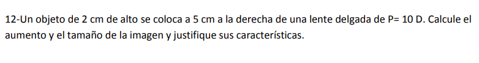

Este problema entra de lleno en el tema de **Lentes Delgadas** y es ideal para poner en juego el concepto de **Potencia ($P$)** expresado en dioptrías, combinándolo con la convención analítica cartesiana de la facultad.

Vamos a resolverlo paso a paso, calculando el aumento, el tamaño y justificando de manera formal cada una de sus características físicas.

---

### 1. Identificación de Datos e Incógnitas

* **Altura del objeto ($y$):** $+2\text{ cm}$ (objeto real orientado hacia arriba del eje principal).

* **Posición del objeto ($x$):** En el enunciado dice *"a 5 cm a la derecha de una lente"*. Recordá que por la convención cartesiana de la cátedra, la luz se considera viniendo desde la izquierda hacia la derecha. Si el objeto se coloca del lado de donde proviene la luz, su coordenada de posición es positiva:

$$x = +5\text{ cm} \text{}$$

* **Potencia de la lente ($P$):** $P = +10\text{ D}$ (dioptrías). Al ser una potencia positiva ($P > 0$), sabemos de inmediato que se trata de una **lente convergente**.

* **Incógnitas:** Aumento lateral ($A$), tamaño de la imagen ($y'$) y la justificación formal de sus características.

---

### 2. Desarrollo Matemático Paso a Paso

**Paso A: Calcular la abscisa focal ($f$) a partir de la potencia ($P$)**
La potencia se define como la inversa multiplicativa de la abscisa focal objeto expresada en metros:

$$P = \frac{1}{f} \implies f = \frac{1}{P} \text{}$$

Reemplazamos con el valor de la potencia:

$$f = \frac{1}{10\text{ D}} = 0,1\text{ m} \text{}$$

Convertimos el foco a centímetros para trabajar con la misma unidad de posición que el objeto:

$$f = 0,1\text{ m} \cdot 100\text{ cm/m} = +10\text{ cm} \text{}$$

*(Al resultar $f > 0$, se reconfirma de manera analítica que la lente es convergente).*

---

**Paso B: Hallar la posición de la imagen ($x'$) mediante la ecuación de Descartes para lentes**
La ecuación fundamental para lentes delgadas es:

$$\frac{1}{x} - \frac{1}{x'} = \frac{1}{f} \text{}$$

Sustituimos nuestros valores conocidos ($x = +5\text{ cm}$ y $f = +10\text{ cm}$):

$$\frac{1}{5\text{ cm}} - \frac{1}{x'} = \frac{1}{10\text{ cm}} \text{}$$

Despejamos el término que contiene la incógnita $\frac{1}{x'}$:

$$\frac{1}{5\text{ cm}} - \frac{1}{10\text{ cm}} = \frac{1}{x'} \text{}$$

$$\frac{2 - 1}{10\text{ cm}} = \frac{1}{x'} \implies \frac{1}{10\text{ cm}} = \frac{1}{x'} \text{}$$

Por lo tanto, la posición de la imagen es:

$$x' = +10\text{ cm} \text{}$$

---

**Paso C: Calcular el aumento lateral ($A$)**
La fórmula del aumento lateral o transversal para lentes delgadas es:

$$A = \frac{x'}{x} \text{}$$

Reemplazamos con las posiciones que calculamos:

$$A = \frac{10\text{ cm}}{5\text{ cm}} = +2 \text{}$$

---

**Paso D: Determinar el tamaño de la imagen ($y'$)**
Usamos la definición de aumento lateral en relación con las alturas de los extremos del objeto y de la imagen:

$$A = \frac{y'}{y} \implies 2 = \frac{y'}{2\text{ cm}} \text{}$$

$$y' = 2 \cdot 2\text{ cm} = +4\text{ cm} \text{}$$

---

### 3. Justificación Física y Características de la Imagen

Para obtener el puntaje completo en el parcial, debés describir y justificar la naturaleza de la imagen en base a los signos de tus resultados:

* **Imagen Virtual:** En la convención cartesiana de lentes de la UTN, el sentido positivo de las abscisas va en contra del sentido de propagación de la luz (hacia la izquierda de la lente). Como **$x' = +10\text{ cm} > 0$**, significa que la imagen se forma a la izquierda de la lente (del mismo lado del que proviene la luz). Al no refractarse físicamente del lado de salida de los rayos (derecha), es obligatoriamente una **imagen virtual**.

* **Imagen Derecha:** Como el aumento lateral es positivo (**$A = +2 > 0$**), la altura $y'$ conserva el mismo signo positivo que la del objeto, indicando que la imagen se genera **derecha (no invertida)**.

* **Imagen Mayor (Ampliada):** Al ser el módulo del aumento mayor que la unidad (**$\vert{}A\vert{} = 2 > 1$**), el tamaño de la imagen resultante ($4\text{ cm}$) es el doble del tamaño del objeto original ($2\text{ cm}$).

> **💡 Nota conceptual de examen:** Este caso corresponde a una lupa común. Cuando colocamos un objeto dentro de la distancia focal de una lente convergente ($0 < x < f$, en este caso $5\text{ cm} < 10\text{ cm}$), la lente actúa ampliando el objeto de forma virtual, derecha y mayor.
> 
> 

---

### Respuestas finales para guardar en tu repositorio:

* **Aumento lateral ($A$):** $+2$

* **Tamaño de la imagen ($y'$):** $4\text{ cm}$

* **Características:** Virtual, derecha y mayor.

---

## Ejercicio 13: Lente Divergente y Localización Gráfica

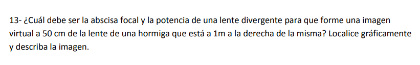

El ejercicio te pide calcular los parámetros analíticos (abscisa focal y potencia) de una **lente divergente** y, además, te exige de forma explícita **localizar gráficamente** y **describir la imagen**.

---

### 1. Identificación de Datos e Incógnitas

* **Tipo de lente:** Divergente, lo que significa analíticamente que su abscisa focal objeto debe resultar negativa ($f < 0$) y su símbolo gráfico lleva flechas invertidas.

* **Posición del objeto (hormiga, $x$):** Está a $1\text{ m}$ a la derecha de la lente. Por convención cartesiana de la facultad, si la luz incide desde la izquierda, el objeto real se sitúa del lado positivo:

$$x = +1\text{ m} = +100\text{ cm}$$

* **Posición de la imagen ($x'$):** El enunciado indica que forma una *imagen virtual a 50 cm de la lente*. En las lentes, una imagen virtual se forma del mismo lado del que proviene la luz (a la izquierda). Por lo tanto, su coordenada cartesiana es positiva:

$$x' = +50\text{ cm}$$

* **Incógnitas:** Abscisa focal objeto ($f$), potencia ($P$), descripción y localización gráfica de la imagen.

---

### 2. Desarrollo Matemático Paso a Paso

**Paso A: Calcular la abscisa focal objeto ($f$)**
Aplicamos la ecuación de Descartes para lentes delgadas:

$$\frac{1}{x} - \frac{1}{x'} = \frac{1}{f}$$

Sustituimos con los datos numéricos en centímetros:

$$\frac{1}{100\text{ cm}} - \frac{1}{50\text{ cm}} = \frac{1}{f}$$

Buscamos el común denominador ($100$) para resolver la resta:

$$\frac{1 - 2}{100\text{ cm}} = \frac{1}{f} \implies -\frac{1}{100\text{ cm}} = \frac{1}{f}$$

$$f = -100\text{ cm} = -1\text{ m}$$

(El signo negativo corrobora analíticamente el carácter divergente de la lente).

**Paso B: Calcular la potencia ($P$)**
La potencia se obtiene con la inversa de la abscisa focal expresada en metros:

$$P = \frac{1}{f_{\text{(en metros)}}} = \frac{1}{-1\text{ m}} = -1\text{ D} \quad (\text{dioptría})$$

---

### 3. Localización Gráfica (Marcha de Rayos)

Para dibujar la marcha de rayos de forma perfecta en la UTN, debés seguir estas pautas geométricas con regla:

1. **Dibujar la lente y los focos:** Trazá el eje principal horizontal ($e.p.$). Dibujá la lente de forma vertical usando el símbolo de **flechas invertidas** (indicando que es divergente). Colocá el centro óptico ($o$) en el origen.

2. **Ubicar los puntos focales:** Como es una lente divergente con $f = -100\text{ cm}$, el **Foco Objeto ($F$) se ubica a la derecha** (a una distancia equivalente a $100\text{ cm}$) y el **Foco Imagen ($F'$) se ubica a la izquierda** (a $100\text{ cm}$).

3. **Ubicar el objeto:** Dibujá una flecha vertical hacia arriba que represente a la hormiga ($y$) a una distancia de $100\text{ cm}$ a la izquierda de la lente ($x = +100\text{ cm}$). *¡Notarás que en este problema el objeto coincide exactamente sobre la vertical del punto del foco imagen $F'$!*

4. Trazar los Rayos Principales:

* Rayo 1 (Paralelo a Central): Trazá un rayo que salga desde la punta del objeto de manera paralela al eje principal hasta tocar el plano de la lente. Al refractarse, el rayo diverge abriéndose hacia arriba, pero de modo tal que **su prolongación virtual hacia atrás (en línea de puntos) pasa exactamente por el Foco Imagen ($F'$)**.

* Rayo 2 (Rayo Central): Trazá un rayo rectilíneo continuo que vaya desde la punta del objeto y pase directamente por el centro óptico ($o$) de la lente. Este rayo continúa su marcha sin experimentar desviación alguna.

5. **Intersección:** El punto exacto donde se cruzan la prolongación en línea de puntos del Rayo 1 y la línea continua del Rayo 2 determina la punta de la flecha de la imagen ($y'$). Esta se localiza a mitad de camino ($x' = +50\text{ cm}$).

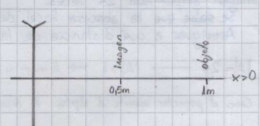

### 4. Justificación y Descripción de la Imagen

Para cumplir con la consigna de *describir la imagen*, calculamos el aumento lateral ($A$):

$$A = \frac{x'}{x} = \frac{50\text{ cm}}{100\text{ cm}} = +0,5$$

Justificación de características para el examen:

* **Virtual:** Se localiza en la intersección de una prolongación virtual y un rayo. Además, $x' = +50\text{ cm} > 0$, formándose a la izquierda (lado de incidencia).

* **Derecha:** Al ser el aumento lateral positivo ($A = +0,5 > 0$), la imagen no se invierte y mantiene la misma orientación vertical que la hormiga objeto.

* **Menor:** Como el módulo del aumento es menor a la unidad ($\vert{}A\vert{} = 0,5 < 1$), el tamaño de la imagen es exactamente la mitad del tamaño de la hormiga real.

---

### Respuestas finales para consolidar en tu repositorio:

* **Abscisa focal objeto ($f$):** $-100\text{ cm}$ (ó $-1\text{ m}$)

* **Potencia de la lente ($P$):** $-1\text{ D}$

* **Descripción:** Imagen virtual, derecha y menor.

---

## Ejercicio 14: Lente Convergente entre Objeto y Pantalla

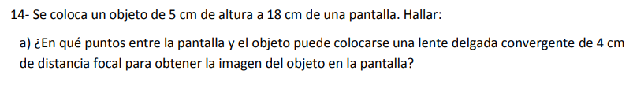

b) El tamaño de la imagen en cada caso

---

### 1. Identificación de Datos e Incógnitas

* **Altura del objeto ($y$):** $+5\text{ cm}$ (objeto real orientado hacia arriba del eje principal).

* **Distancia fija objeto-pantalla ($L$):** $18\text{ cm}$.

* **Distancia focal de la lente ($f$):** Al ser una lente convergente, su abscisa focal objeto es positiva: $f = +4\text{ cm}$.

* **Sistema de Coordenadas de la UTN:**
* Colocamos el origen de coordenadas $(0,0)$ en el centro óptico ($o$) de la lente.

* La luz viaja de izquierda a derecha. El objeto real está a la izquierda, por lo que su posición cartesiana es positiva: $x > 0$.

* La pantalla está a la derecha para recibir los rayos refractados, por lo que la posición de la imagen es negativa: $x' < 0$.

* La distancia física total entre ellos es la resta de sus coordenadas: $x - x' = 18\text{ cm}$.

---

### 2. Resolución del Inciso a) Posiciones de la Lente

**Paso A: Plantear el sistema de ecuaciones**

1. Relación de distancias espaciales:

$$x - x' = 18 \implies x = 18 + x' \quad \text{(Ecuación 1)} \text{}$$

2. Ecuación de Descartes para lentes delgadas:

$$\frac{1}{x} - \frac{1}{x'} = \frac{1}{f} \implies \frac{1}{x} - \frac{1}{x'} = \frac{1}{4} \quad \text{(Ecuación 2)} \text{}$$

**Paso B: Sustituir la Ecuación 1 en la Ecuación 2**

$$\frac{1}{18 + x'} - \frac{1}{x'} = \frac{1}{4} \text{[cite: 2]}$$

Para resolver la resta de fracciones en el miembro izquierdo, buscamos el común denominador:

$$\frac{x' - (18 + x')}{x'(18 + x')} = \frac{1}{4}$$

$$\frac{x' - 18 - x'}{18x' + (x')^2} = \frac{1}{4}$$

$$\frac{-18}{18x' + (x')^2} = \frac{1}{4}$$

**Paso C: Armar la ecuación cuadrática**
Multiplicamos cruzado para eliminar los denominadores:

$$-18 \cdot 4 = 1 \cdot (18x' + (x')^2)$$

$$-72 = 18x' + (x')^2$$

Igualamos a cero para obtener la forma estándar $ax^2 + bx + c = 0$:

$$(x')^2 + 18x' + 72 = 0 \text{}$$

**Paso D: Aplicar la fórmula de Bhaskara para hallar las raíces**
Identificamos los coeficientes: $a = 1$, $b = 18$, $c = 72$.

$$x' = \frac{-18 \pm \sqrt{18^2 - 4 \cdot 1 \cdot 72}}{2 \cdot 1}$$

$$x' = \frac{-18 \pm \sqrt{324 - 288}}{2}$$

$$x' = \frac{-18 \pm \sqrt{36}}{2} = \frac{-18 \pm 6}{2}$$

Obtenemos las dos soluciones cartesianas para la posición de la imagen ($x'$):

* **Solución 1:** $x'_1 = \frac{-18 + 6}{2} = \frac{-12}{2} = -6\text{ cm}$

* **Solución 2:** $x'_2 = \frac{-18 - 6}{2} = \frac{-24}{2} = -12\text{ cm}$

(Ambas posiciones son negativas, lo que reconfirma geométricamente que la imagen se proyecta de forma real a la derecha de la lente, sobre la pantalla).

**Paso E: Calcular las posiciones del objeto ($x = 18 + x'$) correspondientes**

* **Para el Caso 1:** $x_1 = 18 + (-6) = +12\text{ cm}$

* **Para el Caso 2:** $x_2 = 18 + (-12) = +6\text{ cm}$

#### 📝 Respuesta del inciso a):

La lente puede colocarse en dos posiciones distintas entre el objeto y la pantalla:

1. **Caso 1:** A **$12\text{ cm}$ del objeto** (lo que equivale a $6\text{ cm}$ de la pantalla).

2. **Caso 2:** A **$6\text{ cm}$ del objeto** (lo que equivale a $12\text{ cm}$ de la pantalla).

---

### 3. Resolución del Inciso b) Tamaño de la Imagen en cada Caso

Para hallar el tamaño vertical de la imagen ($y'$), utilizamos la fórmula oficial del aumento lateral ($A$) para lentes delgadas:

$$A = \frac{y'}{y} = \frac{x'}{x} \implies y' = y \cdot \left(\frac{x'}{x}\right)$$

#### 🔹 Tamaño en el Caso 1 ($x = +12\text{ cm}$ y $x' = -6\text{ cm}$)

1. Calculamos su aumento lateral ($A_1$):

$$A_1 = \frac{x'_1}{x_1} = \frac{-6\text{ cm}}{12\text{ cm}} = -0,5 \text{}$$

2. Multiplicamos por la altura del objeto ($y = 5\text{ cm}$):

$$y'_1 = 5\text{ cm} \cdot (-0,5) = -2,5\text{ cm} \text{}$$

* **Características:** Al ser $y'$ negativo, la imagen está **invertida**. Su tamaño físico es de **$2,5\text{ cm}$**.

#### 🔹 Tamaño en el Caso 2 ($x = +6\text{ cm}$ y $x' = -12\text{ cm}$)

1. Calculamos su aumento lateral ($A_2$):

$$A_2 = \frac{x'_2}{x_2} = \frac{-12\text{ cm}}{6\text{ cm}} = -2 \text{}$$

2. Multiplicamos por la altura del objeto ($y = 5\text{ cm}$):

$$y'_2 = 5\text{ cm} \cdot (-2) = -10\text{ cm} \text{}$$

* **Características:** Al ser $y'$ negativo, la imagen está **invertida**. Su tamaño físico es de **$10\text{ cm}$**.

#### 📝 Respuesta del inciso b):

* En el primer punto de colocación, la imagen en la pantalla mide **$2,5\text{ cm}$** e invertida.

* En el segundo punto de colocación, la imagen en la pantalla mide **$10\text{ cm}$** e invertida.

---

## Ejercicio 15: Sistema de Dos Lentes Delgadas Separadas

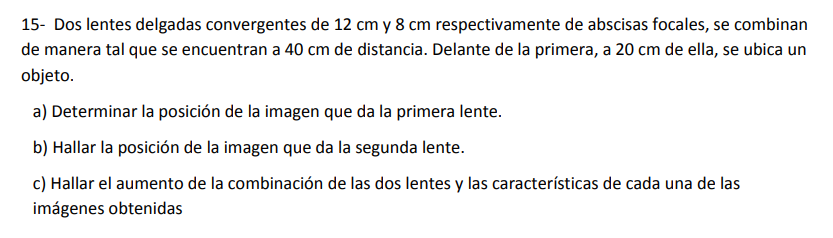

Ejercicio  problema integrador de **sistema óptico de lentes acopladas o compuestas**. Este tipo de problemas es hermoso porque se resuelve de manera secuencial: **la imagen que produce la primera lente se convierte automáticamente en el objeto para la segunda lente**.

---

### 1. Identificación de Datos e Incógnitas

* **Lente 1 (L1):** Convergente, abscisa focal $f_1 = +12\text{ cm}$.

* **Lente 2 (L2):** Convergente, abscisa focal $f_2 = +8\text{ cm}$.

* **Separación entre lentes ($d_{\text{L1-L2}}$):** $40\text{ cm}$.

* **Objeto inicial ($x_1$):** Ubicado a $20\text{ cm}$ por delante de la primera lente. Por convención cartesiana, $x_1 = +20\text{ cm}$.

---

### 2. Resolución del Inciso a) Imagen de la Primera Lente (L1)

Tomamos como origen de coordenadas el centro óptico de la primera lente ($o_1$). Aplicamos la ecuación de Descartes para lentes delgadas:

$$\frac{1}{x_1} - \frac{1}{x'_1} = \frac{1}{f_1} \quad \text{}$$

Reemplazamos con los datos de L1 ($x_1 = +20\text{ cm}$ y $f_1 = +12\text{ cm}$):

$$\frac{1}{20\text{ cm}} - \frac{1}{x'_1} = \frac{1}{12\text{ cm}} \quad \text{}$$

Despejamos el término de la posición de la imagen ($\frac{1}{x'_1}$):

$$\frac{1}{20\text{ cm}} - \frac{1}{12\text{ cm}} = \frac{1}{x'_1} \quad \text{}$$

Buscamos el común denominador ($60$) para resolver la resta:

$$\frac{3 - 5}{60\text{ cm}} = \frac{1}{x'_1} \quad \implies \quad -\frac{2}{60\text{ cm}} = \frac{1}{x'_1} \quad \implies \quad -\frac{1}{30\text{ cm}} = \frac{1}{x'_1} \quad \text{}$$

$$x'_1 = -30\text{ cm} \quad \text{}$$

* **Justificación física (L1):** Al dar una coordenada negativa ($x'_1 < 0$), significa geométricamente que la luz se refractó y convergió a la derecha de L1. Por lo tanto, L1 forma una **imagen real** a una distancia de $30\text{ cm}$ a su derecha.

---

### 3. Resolución del Inciso b) Imagen de la Segunda Lente (L2)

Ahora cambiamos nuestro origen de coordenadas al centro óptico de la segunda lente ($o_2$).

**Paso A: Determinar la posición del objeto para la segunda lente ($x_2$)**

* Sabemos que L2 está colocada a una distancia física de $40\text{ cm}$ a la derecha de L1.

* La imagen dada por L1 se formó a $30\text{ cm}$ a la derecha de L1.

* Por lo tanto, la distancia que separa a esta imagen intermedia respecto de L2 es:

$$40\text{ cm} - 30\text{ cm} = 10\text{ cm} \quad \text{}$$

* Como la luz viaja de izquierda a derecha y esta imagen quedó situada *antes* (a la izquierda) de L2, se comporta como un **objeto real para L2**. Aplicando la convención de la UTN, su signo cartesiano es positivo:

$$x_2 = +10\text{ cm} \quad \text{}$$

**Paso B: Calcular la posición de la imagen final ($x'_2$) mediante Descartes**

$$\frac{1}{x_2} - \frac{1}{x'_2} = \frac{1}{f_2} \quad \text{}$$

Sustituimos con los parámetros de L2 ($x_2 = +10\text{ cm}$ y $f_2 = +8\text{ cm}$):

$$\frac{1}{10\text{ cm}} - \frac{1}{x'_2} = \frac{1}{8\text{ cm}} \quad \text{}$$

$$\frac{1}{10\text{ cm}} - \frac{1}{8\text{ cm}} = \frac{1}{x'_2} \quad \text{}$$

Buscamos el común denominador ($40$) para operar:

$$\frac{4 - 5}{40\text{ cm}} = \frac{1}{x'_2} \quad \implies \quad -\frac{1}{40\text{ cm}} = \frac{1}{x'_2} \quad \text{}$$

$$x'_2 = -40\text{ cm} \quad \text{}$$

* **Justificación física (L2):** El signo negativo ($x'_2 < 0$) indica que la imagen final se forma a la derecha de la segunda lente. Es una **imagen real** situada a $40\text{ cm}$ a la derecha de L2.

---

### 4. Resolución del Inciso c) Aumento del Sistema y Características

**Paso A: Calcular el aumento lateral de cada lente individual**

* **Aumento de la lente 1 ($A_1$):**

$$A_1 = \frac{x'_1}{x_1} = \frac{-30\text{ cm}}{20\text{ cm}} = -1,5 \quad \text{}$$

* **Aumento de la lente 2 ($A_2$):**

$$A_2 = \frac{x'_2}{x_2} = \frac{-40\text{ cm}}{10\text{ cm}} = -4 \quad \text{}$$

**Paso B: Calcular el aumento total de la combinación ($A_{\text{sistema}}$)**
El aumento total de un sistema compuesto de lentes delgadas es igual al producto de los aumentos laterales de cada una de las lentes que lo constituyen:

$$A_{\text{sistema}} = A_1 \cdot A_2 \quad \text{}$$

$$A_{\text{sistema}} = (-1,5) \cdot (-4) = +6 \quad \text{}$$

**Paso C: Describir las características de cada imagen**

* **Características de la imagen 1 (dada por L1):**
* Como $x'_1 = -30\text{ cm}$ es negativo, es **Real**.

* Como $A_1 = -1,5$ es negativo, es **Invertida**.

* Como $\vert{}A_1\vert{} = 1,5 > 1$, es de **Mayor tamaño**.

* **Características de la imagen final (dada por L2):**
* Como $x'_2 = -40\text{ cm}$ es negativo, es **Real**.

* Como $A_{\text{sistema}} = +6$ es positivo, significa que el sistema invirtió una imagen que ya estaba invertida, por lo tanto, la imagen final respecto del objeto original es **Derecha**.

* Como $\vert{}A_{\text{sistema}}\vert{} = 6 > 1$, es **6 veces mayor** en tamaño que el objeto original.

---

### Respuestas finales para tu repositorio de estudio:

* **a) Posición de la imagen de L1 ($x'_1$):** $-30\text{ cm}$ (a $30\text{ cm}$ a la derecha de L1).

* **b) Posición de la imagen de L2 ($x'_2$):** $-40\text{ cm}$ (a $40\text{ cm}$ a la derecha de L2).

* **c) Aumento de la combinación ($A_{\text{sistema}}$):** $+6$.

* *Imagen 1:* Real, invertida y mayor.

* *Imagen final:* Real, derecha y mayor respecto al objeto original.

---

## Ejercicio 16: El Proyector de Diapositivas

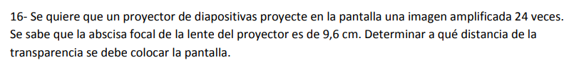

Este problema es un excelente ejercicio de examen para **lentes delgadas** porque introduce un dispositivo óptico real: el **proyector de diapositivas**.

La clave acá radica en interpretar físicamente cómo funciona un proyector para deducir correctamente el signo del aumento lateral, y luego calcular de forma precisa la distancia total solicitada. Vamos paso a paso.

---

### 1. Identificación de Datos e Incógnitas

* **Abscisa focal de la lente ($f$):** Un proyector necesita formar una imagen en una pantalla alejada, por lo que usa una lente convergente. Su distancia focal es positiva:

$$f = +9,6\text{ cm} \quad \text{}$$

* **Magnificación / Amplificación de la imagen:** El enunciado pide que la imagen esté amplificada $24$ veces. Esto significa que el módulo del aumento lateral es $\vert{}A\vert{} = 24$.

* **Incógnita:** Determinar a qué distancia de la transparencia (el objeto real) se debe colocar la pantalla (donde se proyecta la imagen).

---

### 2. Análisis Físico Clave (Justificación de Signos)

Para plantear las ecuaciones de manera correcta bajo el sistema analítico cartesiano de la UTN, primero justificamos el signo del aumento lateral ($A$):

1. **Carácter de la imagen:** Dado que la imagen se proyecta **sobre una pantalla**, obligatoriamente tiene que ser una **imagen real**. Las lentes delgadas forman imágenes reales únicamente del lado opuesto al objeto (a la derecha de la lente, lo que implica que su coordenada cartesiana de posición es negativa: $x' < 0$).

2. **Orientación de la imagen:** Toda imagen real producida por una única lente delgada a partir de un objeto real resulta **invertida**. Por lo tanto, el aumento lateral debe tener signo negativo de forma obligatoria:

$$A = -24 \quad \text{}$$

---

### 3. Desarrollo Matemático Paso a Paso

**Paso A: Relacionar las posiciones $x$ y $x'$ usando la fórmula del aumento**
La definición de aumento lateral para lentes delgadas establece que:

$$A = \frac{x'}{x} \quad \text{}$$

Sustituimos el valor del aumento ($A = -24$):

$$-24 = \frac{x'}{x} \implies x' = -24x \quad \text{(Ecuación 1)}$$

**Paso B: Aplicar la ecuación de Descartes para hallar las posiciones exactas**
Utilizamos la fórmula fundamental para lentes delgadas:

$$\frac{1}{x} - \frac{1}{x'} = \frac{1}{f} \quad \text{}$$

Reemplazamos $x'$ usando la **Ecuación 1** y sustituimos la distancia focal ($f = 9,6\text{ cm}$):

$$\frac{1}{x} - \frac{1}{-24x} = \frac{1}{9,6}$$

Aplicamos regla de signos (menos por menos es más):

$$\frac{1}{x} + \frac{1}{24x} = \frac{1}{9,6}$$

Buscamos el común denominador ($24x$) en el miembro izquierdo para efectuar la suma de fracciones:

$$\frac{24 + 1}{24x} = \frac{1}{9,6}$$

$$\frac{25}{24x} = \frac{1}{9,6}$$

Multiplicamos cruzado para despejar la variable $x$:

$$25 \cdot 9,6 = 24x$$

$$240 = 24x \implies x = \frac{240}{24} = +10\text{ cm}$$

* **Interpretación de $x$:** La transparencia (objeto real) se debe colocar a **$10\text{ cm}$ a la izquierda de la lente** provectora.

Ahora, sustituimos el valor de $x = 10\text{ cm}$ en la **Ecuación 1** para hallar la posición de la pantalla ($x'$):

$$x' = -24 \cdot (10\text{ cm}) = -240\text{ cm}$$

* **Interpretación de $x'$:** La pantalla se sitúa a **$240\text{ cm}$ a la derecha de la lente** (coordenada negativa en sentido de la luz).

---

**Paso C: Calcular la distancia total entre la transparencia y la pantalla**
El problema no nos pide la distancia respecto de la lente, sino *"a qué distancia de la transparencia se debe colocar la pantalla"*.

Geométricamente, la lente se encuentra interpuesta entre ambas. La distancia total ($d$) es la suma de las distancias absolutas de cada elemento hacia el centro óptico de la lente:

$$d = \vert{}x\vert{} + \vert{}x'\vert{}$$

$$d = 10\text{ cm} + 240\text{ cm} = 250\text{ cm} \quad \text{}$$

Si preferís expresarlo en metros para la presentación final:

$$d = 2,5\text{ m}$$

---

### 4. Respuesta Final para el Repositorio

La pantalla se debe colocar a una distancia total de **$250\text{ cm}$** (o **$2,5\text{ m}$**) respecto de la transparencia.

---
