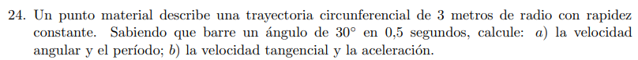
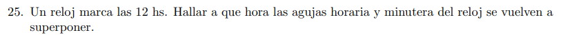
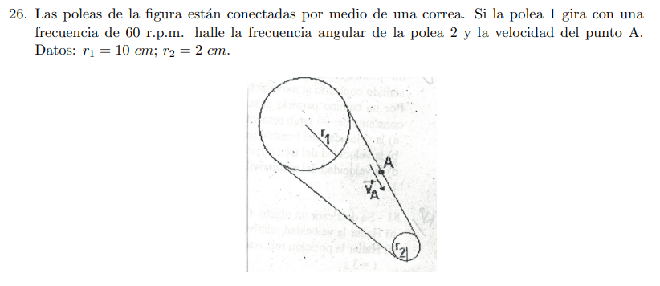
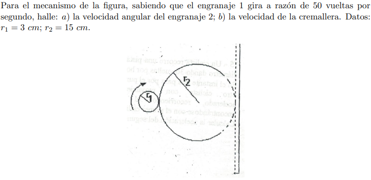
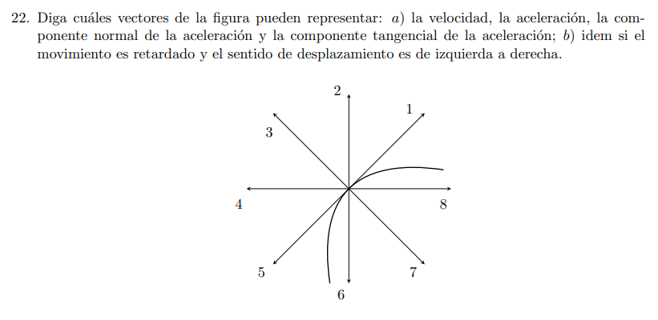
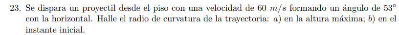

# Movimiento Circular

# Ejercicios 

##  Ejercicio 24: Base del Movimiento Circular Uniforme (MCU)

---

## 📚 Sustento Teórico del Ejercicio

Para que el Ing. Pozzetti te considere el ejercicio como excelente en el examen, tenemos que fundamentar las ecuaciones en las hipótesis del enunciado:

1. **Definición de Rapidez Constante:** El enunciado especifica que el módulo de la velocidad tangencial es constante ($v(t) = v = \text{cte.}$). Según la teoría intrínseca de tu guía, esto implica que la **aceleración tangencial es nula** ($a_t = \frac{dv}{dt} = 0$). Por lo tanto, estamos ante un **Movimiento Circular Uniforme (MCU)**.

2. **Velocidad Angular ($\omega$):** En el MCU, la velocidad angular instantánea coincide con la velocidad angular media para cualquier lapso de tiempo, por lo que se define directamente como la tasa de variación del ángulo respecto al tiempo:

$$\omega = \frac{\Delta\theta}{\Delta t} \quad \text{}$$

3. **El Sistema Radianes:** Para que las relaciones lineales y angulares como $v = \omega \cdot R$ sean válidas en el sistema MKS, el ángulo **debe** medirse en radianes, ya que el radián es una unidad adimensional definida por el cociente entre la longitud del arco y el radio.

4. **Período ($T$):** Es el tiempo empleado por la partícula en completar una revolución exacta ($2\pi \text{ rad}$).
5. **Aceleración Normal o Centrípeta ($\vec{a}_\eta$):** Aunque la rapidez es constante, la dirección del vector velocidad instantánea varía continuamente debido a la curvatura de la trayectoria. Esa variación de dirección genera una aceleración dirigida estrictamente hacia el centro de la circunferencia, cuyo módulo es:

$$a_\eta = \frac{v^2}{R} = \omega^2 \cdot R \quad \text{}$$

---

## 📐 Resolución Paso a Paso

### Tramo Inicial: Pasaje de Unidades a MKS

El ángulo está dado en grados sexagesimales, por lo que realizamos la conversión formal a radianes utilizando la equivalencia de cátedra:

$$\Delta\theta = 30^{\circ} = 30^{\circ} \cdot \frac{\pi \text{ rad}}{180^{\circ}} = \mathbf{\frac{\pi}{6} \text{ rad}}$$

---

### Inciso a) Cálculo de la Velocidad Angular ($\omega$) y el Período ($T$)

**1. Velocidad Angular ($\omega$):**
Aplicamos la definición para rapidez constante utilizando el intervalo de tiempo dado ($\Delta t = 0,5 \text{ s}$):

$$\omega = \frac{\Delta\theta}{\Delta t} = \frac{\frac{\pi}{6} \text{ rad}}{0,5 \text{ s}} \quad \text{}$$

Como $0,5 = \frac{1}{2}$, operamos algebraicamente la fracción de fracciones:

$$\omega = \frac{\pi}{6 \cdot \frac{1}{2}} = \frac{\pi}{3} \text{ s}^{-1} \quad \text{}$$

> **🎯 Resultado:** $\omega = \mathbf{\frac{\pi}{3} \text{ s}^{-1}} \approx \mathbf{1,047 \text{ rad/s}}$.
> 
> 

**2. Período ($T$):**
El período es el tiempo que se tarda en barrer un ángulo completo de $\Delta\theta = 2\pi \text{ rad}$. Despejando de la ecuación horaria angular:

$$T = \frac{2\pi}{\omega} \quad \text{}$$

$$T = \frac{2\pi}{\frac{\pi}{3}} = 2 \cdot 3 = \mathbf{6 \text{ s}} \quad \text{}$$

> **🎯 Resultado:** $T = \mathbf{6 \text{ s}}$.
> 
> 

---

### Inciso b) Cálculo de la Velocidad Tangencial ($v$) y el Vector Aceleración ($\vec{a}$)

**1. Módulo de la Velocidad Tangencial ($v$):**
Vinculamos la velocidad angular con el radio de la trayectoria circunferencial ($R = 3 \text{ m}$):

$$v = \omega \cdot R \quad \text{}$$

$$v = \frac{\pi}{3} \text{ s}^{-1} \cdot 3 \text{ m} = \mathbf{\pi \text{ m/s}} \quad \text{}$$

Si calculamos su valor decimal aproximado:

$$v \approx \mathbf{3,1416 \text{ m/s}}$$

> **🎯 Resultado:** $v = \mathbf{\pi \text{ m/s}}$.
> 
> 

**2. Vector Aceleración ($\vec{a}$):**
Planteamos la aceleración en sus componentes intrínsecas (tangencial y normal):

$$\vec{a} = a_t \cdot \hat{\tau} + a_\eta \cdot \hat{\eta} \quad \text{}$$

* Como la rapidez es constante, la componente tangencial es nula:

$$a_t = \frac{dv}{dt} = \mathbf{0 \text{ m/s}^2} \quad \text{}$$

* Calculamos el módulo de la componente normal o centrípeta:

$$a_\eta = \frac{v^2}{R} = \frac{(\pi \text{ m/s})^2}{3 \text{ m}} = \mathbf{\frac{\pi^2}{3} \text{ m/s}^2} \quad \text{}$$

Haciendo la aproximación numérica:

$$a_\eta \approx \frac{9,8696}{3} \approx \mathbf{3,29 \text{ m/s}^2}$$

Asociando formalmente los versores intrínsecos de tu guía (donde $\hat{\eta}$ es el versor normal dirigido hacia el centro de la circunferencia):

$$\vec{a} = \mathbf{\frac{\pi^2}{3} \cdot \hat{\eta} \text{ m/s}^2} \quad \text{}$$

> **🎯 Resultado:** El módulo de la aceleración es $\vert{}\vec{a}\vert{} = \mathbf{\frac{\pi^2}{3} \text{ m/s}^2}$, con dirección **perpendicular a la velocidad** (radial) y sentido **hacia el centro de la trayectoria**.
> 
> 

---

##  Ejercicio 25: Velocidad Angular Relativa (El Encuentro de las Agujas)

## 📚 Sustento Teórico del Ejercicio

Para resolver este ejercicio con la rigurosidad formal que te van a pedir en la UTN, aplicamos la cinemática de una partícula en trayectorias circunferenciales utilizando un enfoque escalar curvilíneo angular:

1. **Hipótesis de Movimiento:** Tanto la aguja minutera como la aguja horaria se desplazan con rapidez constante, lo que significa que realizan un Movimiento Circular Uniforme (MCU). Sus aceleraciones angulares son nulas ($\gamma = 0$).

2. **Ecuación Horaria Angular:** Para un móvil en MCU, la posición angular $\theta$ en función del tiempo $t$ responde a la expresión lineal análoga al MRU:

$$\theta(t) = \theta_0 + \omega \cdot (t - t_0) \quad \text{}$$

3. **Velocidad Angular ($\omega$) a partir del Período ($T$):** Sabemos que la velocidad angular se calcula conociendo el tiempo que tarda la aguja en dar una vuelta completa ($2\pi \text{ rad}$):

$$\omega = \frac{2\pi}{T} \quad \text{}$$

4. **Condición de Encuentro Angular:** Al partir ambas agujas juntas a las 12:00, la aguja minutera (que es más rápida) se adelantará inmediatamente. Para que vuelvan a superponerse por primera vez, la minutera debe sacarle exactamente **una vuelta completa de ventaja** ($2\pi \text{ rad}$) a la aguja horaria:

$$\theta_{\text{minutera}}(t_e) = \theta_{\text{horaria}}(t_e) + 2\pi \quad \text{}$$

---

## 📐 Resolución Paso a Paso

### Paso 1: Determinación de las Velocidades Angulares ($\omega$)

Definimos el período de rotación ($T$) de cada aguja en la unidad formal del MKS (el segundo):

* **Aguja Minutera ($M$):** Tarda exactamente $1 \text{ hora}$ en dar una vuelta completa.

$$T_M = 1\text{ h} = 3600\text{ s}$$

$$\omega_M = \frac{2\pi \text{ rad}}{3600\text{ s}} = \frac{\pi}{1800}\text{ rad/s}$$

* **Aguja Horaria ($H$):** Tarda exactamente $12 \text{ horas}$ en dar una vuelta completa al cuadrante.

$$T_H = 12\text{ h} = 12 \cdot 3600\text{ s} = 43200\text{ s}$$

$$\omega_H = \frac{2\pi \text{ rad}}{43200\text{ s}} = \frac{\pi}{21600}\text{ rad/s}$$

---

### Paso 2: Planteo de las Ecuaciones Horarias Angulares

Adoptamos como origen de tiempos $t_0 = 0\text{ s}$ las 12:00 hs exactas, fijando la posición angular inicial de ambas en cero ($\theta_0 = 0\text{ rad}$):

$$\theta_M(t) = \omega_M \cdot t = \frac{\pi}{1800} \cdot t$$

$$\theta_H(t) = \omega_H \cdot t = \frac{\pi}{21600} \cdot t$$

---

### Paso 3: Aplicación de la Condición de Encuentro

Igualamos las posiciones angulares considerando la vuelta de ventaja que debe dar la minutera para alcanzarla por detrás:

$$\theta_M(t_e) = \theta_H(t_e) + 2\pi$$

$$\frac{\pi}{1800} \cdot t_e = \frac{\pi}{21600} \cdot t_e + 2\pi$$

Para facilitar el despeje algebraico, simplificamos la constante $\pi$ de todos los términos de la igualdad:

$$\frac{1}{1800} \cdot t_e = \frac{1}{21600} \cdot t_e + 2$$

Agrupamos los términos con la incógnita $t_e$ en el miembro izquierdo:

$$t_e \cdot \left(\frac{1}{1800} - \frac{1}{21600}\right) = 2$$

Buscamos común denominador dentro del paréntesis ($21600$, ya que $1800 \cdot 12 = 21600$):

$$t_e \cdot \left(\frac{12 - 1}{21600}\right) = 2$$

$$t_e \cdot \frac{11}{21600} = 2$$

Despejamos el tiempo de encuentro $t_e$:

$$t_e = \frac{2 \cdot 21600}{11} = \mathbf{\frac{43200}{11}\text{ s}}$$

---

### Paso 4: Conversión de Segundos a Horas, Minutos y Segundos

Hacemos la división exacta de la fracción para desglosar el tiempo transcurrido desde las 12:00:

$$t_e = 3927,2727\dots\text{ s}$$

1. **Calculamos las horas:**

$$3927,2727\text{ s} \div 3600\text{ s/h} = \mathbf{1\text{ hora}} \quad \text{(y nos queda un resto de } 327,2727\text{ s)}$$

2. **Calculamos los minutos:**

$$327,2727\text{ s} \div 60\text{ s/min} = \mathbf{5\text{ minutos}} \quad \text{(y nos queda un resto de } 27,2727\text{ s)}$$

3. **Calculamos los segundos:**
El resto final es de **$27,27\text{ segundos}$**.

---

## 🎯 Respuesta Final para entregar en el Examen

Partiendo desde las 12:00 hs, las agujas se volverán a superponer por primera vez cuando haya transcurrido 1 hora, 5 minutos y 27 segundos. Por lo tanto, la hora exacta marcada por el reloj será:

$$\mathbf{t = 13^{\text{h}}\ 05^{\text{m}}\ 27^{\text{s}}} \quad \text{}$$

---

## Ejercicio 26: Poleas y Acoplamiento por Correa

---

## 📚 Sustento Teórico del Ejercicio

Para fundamentar analíticamente el desarrollo según la teoría de la UTN, establecemos las siguientes hipótesis físicas:

1. **Condición de No Deslizamiento:** Al estar vinculadas por una correa ideal, asumimos que no existe patinamiento entre la superficie de las poleas y la soga. Esto implica de forma obligatoria que **todos los puntos de la periferia de la polea 1, de la polea 2 y cualquier punto sobre la correa (como el punto A) comparten estrictamente idéntico módulo de velocidad tangencial o lineal**:

$$v_1 = v_2 = v_A \quad \text{}$$

2. **Relación entre Frecuencia ($f$) y Velocidad Angular ($\omega$):** La frecuencia $f$ mide la cantidad de vueltas (revoluciones) por unidad de tiempo. La velocidad angular expresa esa misma rotación en radianes por segundo:

$$\omega = 2\pi \cdot f \quad \text{}$$

3. **Acoplamiento Cinemático:** El módulo de la velocidad tangencial se vincula con la rotación angular a través del radio de giro de cada cuerpo ($v = \omega \cdot r$). Al igualar las velocidades tangenciales, se obtiene la ley de transmisión de poleas:

$$\omega_1 \cdot r_1 = \omega_2 \cdot r_2 \quad \text{}$$

---

## 📐 Resolución Paso a Paso

### Paso 1: Conversión de Unidades al Sistema Internacional (MKS)

Para trabajar de forma segura y evitar errores con las unidades de la guía, pasamos los datos a metros y segundos:

* **Radio de la polea 1 ($r_1$):** $10 \text{ cm} = \mathbf{0,1 \text{ m}}$

* **Radio de la polea 2 ($r_2$):** $2 \text{ cm} = \mathbf{0,02 \text{ m}}$

* **Frecuencia de la polea 1 ($f_1$):** $60 \text{ r.p.m.} = \frac{60 \text{ vueltas}}{60 \text{ segundos}} = \mathbf{1 \text{ s}^{-1}} = \mathbf{1 \text{ Hz}}$

---

### Paso 2: Cálculo de la Velocidad Angular de la Polea 1 ($\omega_1$)

Utilizando la frecuencia de rotación de la primera rueda, calculamos cuántos radianes barre por segundo:

$$\omega_1 = 2\pi \cdot f_1 \quad \text{}$$

$$\omega_1 = 2\pi \cdot 1 \text{ s}^{-1} = \mathbf{2\pi \text{ rad/s}}$$

---

### Paso 3: Cálculo de la Velocidad del Punto A ($v_A$)

El punto $A$ se encuentra ubicado directamente sobre la correa de transmisión. Por lo tanto, su velocidad lineal es igual a la velocidad tangencial de la periferia de la polea 1:

$$v_A = v_1 = \omega_1 \cdot r_1 \quad \text{}$$

Sustituimos con los valores en centímetros para dejarlo expresado tal cual lo publica la cátedra en su respuesta:

$$v_A = 2\pi \text{ rad/s} \cdot 10 \text{ cm} = \mathbf{20\pi \text{ cm/s}}$$

Si resolvemos la aproximación numérica decimal con $\pi \approx 3,1416$:

$$v_A \approx 20 \cdot 3,1416 = \mathbf{62,8 \text{ cm/s}} \quad \text{}$$

---

### Paso 4: Cálculo de la Frecuencia Angular de la Polea 2 ($f_2$ o $\omega_2$)

> ⚠️ *Nota técnica de nomenclatura de la UTN:* La guía pide la "frecuencia angular de la polea 2" pero la respuesta oficial la expresa en r.p.m. (frecuencia de giro $f_2$). Vamos a calcular ambas para blindar el ejercicio en el parcial.
> 
> 

1. Calculamos primero la velocidad angular $\omega_2$ por acoplamiento:

$$\omega_2 \cdot r_2 = v_A \quad \text{}$$

$$\omega_2 \cdot 2 \text{ cm} = 20\pi \text{ cm/s}$$

$$\omega_2 = \frac{20\pi \text{ cm/s}}{2 \text{ cm}} = \mathbf{10\pi \text{ rad/s}}$$

2. Convertimos la velocidad angular a frecuencia de giro ($f_2$) en r.p.m.:

$$f_2 = \frac{\omega_2}{2\pi} = \frac{10\pi \text{ rad/s}}{2\pi \text{ rad/vuelta}} = 5 \text{ vueltas por segundo (Hz)} \quad \text{}$$

Pasamos de segundos a minutos multiplicando por 60:

$$f_2 = 5 \text{ vueltas/s} \cdot \frac{60 \text{ s}}{1 \text{ min}} = \mathbf{300 \text{ r.p.m.}} \quad \text{}$$

---

## 🎯 Resumen de Respuestas para la Carpeta

* **Velocidad lineal del punto A ($v_A$):** $\mathbf{62,8 \text{ cm/s}}$ (o $20\pi \text{ cm/s}$).

* **Frecuencia de giro de la polea 2 ($f_2$):** $\mathbf{300 \text{ r.p.m.}}$.

---

##  Ejercicio 27: Mecanismo de Engranajes y Cremallera

## 📚 Sustento Teórico del Ejercicio

Para que el desarrollo tenga el sustento formal de las clases de Física I de la UTN, fundamentamos el análisis en los siguientes principios cinemáticos:

1. **Acoplamiento por Contacto Directo (Diente a Diente):** En el punto de tangencia donde se acoplan ambos engranajes, para que los dientes engranen de forma perfecta sin romperse ni patinar, la velocidad lineal de la periferia de ambos debe ser exactamente la misma en módulo:

$$v_1 = v_2 \quad \text{}$$

2. **Vínculo Cremallera-Piñón:** Una cremallera es una barra dentada plana que transforma un movimiento de rotación en uno de traslación rectilínea. Al estar engranada con el cuerpo 2, la velocidad de traslación horizontal de la cremallera ($v_{\text{cremallera}}$) es idéntica al módulo de la velocidad tangencial de la periferia del engranaje 2:

$$v_{\text{cremallera}} = v_2 \quad \text{}$$

3. **Conversión de Frecuencia ($f$) a Velocidad Angular ($\omega$):** El enunciado da como dato la frecuencia de giro del primer piñón en vueltas por segundo (Hz). Su velocidad angular en radianes por segundo se define como:

$$\omega = 2\pi \cdot f \quad \text{}$$

---

## 📐 Resolución Paso a Paso

### Paso 1: Organización de Datos en Unidades MKS

Pasamos los radios dados en centímetros a la unidad formal de metros:

* **Radio del engranaje 1 ($r_1$):** $3\text{ cm} = \mathbf{0,03\text{ m}}$

* **Radio del engranaje 2 ($r_2$):** $15\text{ cm} = \mathbf{0,15\text{ m}}$

* **Frecuencia del engranaje 1 ($f_1$):** $\mathbf{50\text{ s}^{-1}}$ (vueltas por segundo)

---

### Inciso a) Cálculo de la Velocidad Angular del Engranaje 2 ($\omega_2$)

1. **Calculamos la velocidad angular instantánea del primer engranaje ($\omega_1$):**

$$\omega_1 = 2\pi \cdot f_1 \quad \text{}$$

$$\omega_1 = 2\pi \cdot 50\text{ s}^{-1} = \mathbf{100\pi\text{ rad/s}}$$

2. **Aplicamos la condición de acoplamiento tangencial entre ruedas ($v_1 = v_2$):**

$$\omega_1 \cdot r_1 = \omega_2 \cdot r_2 \quad \text{}$$

3. **Despejamos la velocidad angular incógnita $\omega_2$:**

$$\omega_2 = \omega_1 \cdot \frac{r_1}{r_2} \quad \text{}$$

$$\omega_2 = 100\pi\text{ rad/s} \cdot \frac{3\text{ cm}}{15\text{ cm}}$$

Simplificamos la fracción ($\frac{3}{15} = \frac{1}{5}$):

$$\omega_2 = \frac{100\pi}{5} = \mathbf{20\pi\text{ rad/s}}$$

4. **Expresamos el valor numérico final (utilizando $\pi \approx 3,1416$):**

$$\omega_2 \approx 20 \cdot 3,1416 = \mathbf{62,8\text{ s}^{-1}} \quad \text{}$$

> **🎯 Resultado a):** $\omega_2 = \mathbf{62,8\text{ s}^{-1}}$.
> 
> 

---

### Inciso b) Cálculo de la Velocidad de la Cremallera ($v$)

1. **Establecemos la igualdad cinemática con la periferia del segundo engranaje:**

$$v_{\text{cremallera}} = v_2 = \omega_2 \cdot r_2 \quad \text{}$$

2. **Sustituimos con los valores en el Sistema Internacional (MKS):**

$$v_{\text{cremallera}} = (20\pi\text{ rad/s}) \cdot 0,15\text{ m}$$

$$v_{\text{cremallera}} = 3\pi\text{ m/s}$$

3. **Calculamos su aproximación decimal final:**

$$v_{\text{cremallera}} \approx 3 \cdot 3,1416 = \mathbf{9,42\text{ m/s}} \quad \text{}$$

> **🎯 Resultado b):** $v_{\text{cremallera}} = \mathbf{9,42\text{ m/s}}$.
> 
> 

---

## 🎯 Resumen de Respuestas para el Examen

* **a)** $\omega_2 = \mathbf{62,8\text{ s}^{-1}}$

* **b)** $v = \mathbf{9,42\text{ m/s}}$

---

## Ejercicio 22: Componentes Vectoriales Intrínsecas en Movimiento Curvilíneo

## 📚 Sustento Teórico del Ejercicio

Para justificar analíticamente la elección de los vectores frente a la cátedra, nos basamos en la teoría de los componentes intrínsecos del vector aceleración ($\vec{a}$) desarrollada en tu guía:

1. **Vector Velocidad Instantánea ($\vec{v}$):** Por definición fundamental, la velocidad siempre es **tangente a la trayectoria** en el punto considerado y su sentido coincide de manera obligatoria con el **sentido del movimiento**.

2. **Versores Intrínsecos:** Definimos el versor tangente $\hat{\tau}(t)$ (en la dirección de la recta tangente y sentido del eje curvilíneo creciente) y el versor normal $\hat{\eta}(t)$ (perpendicular a la tangente y dirigido estrictamente hacia el centro de curvatura, es decir, hacia la **concavidad** de la curva).

3. **Aceleración Tangencial ($\vec{a}_t$):** Es la componente de la aceleración sobre la recta tangente a la trayectoria, responsable de modificar el módulo de la velocidad:

* $\vec{a}_t = \frac{dv}{dt} \cdot \hat{\tau}$

* Si el movimiento es **acelerado**, $\vec{a}_t$ tiene el **mismo sentido** que la velocidad $\vec{v}$.

* Si el movimiento es **retardado (o desacelerado)**, $\vec{a}_t$ tiene **sentido opuesto** a la velocidad $\vec{v}$.

4. **Aceleración Normal o Centrípeta ($\vec{a}_\eta$):** Es la componente perpendicular a la recta tangente, encargada de modificar la dirección del vector velocidad:

* $\vec{a}_\eta = \frac{v^2}{\rho} \cdot \hat{\eta}$

* Como el radio de curvatura $\rho$ y el término cuadrático $v^2$ son siempre positivos, $\vec{a}_\eta$ **siempre apunta hacia el centro de curvatura (el lado cóncavo de la trayectoria)**. Nunca puede apuntar hacia el lado convexo.

5. **Aceleración Neta o Total ($\vec{a}$):** Es la suma vectorial de ambas componentes ($\vec{a} = \vec{a}_t + \vec{a}_\eta$). Al ser la diagonal del rectángulo formado por ambas, el vector aceleración neta **siempre debe apuntar hacia el interior de la concavidad** de la curva.

---

## 📐 Resolución Paso a Paso

Observando detenidamente la disposición geométrica de la rosa de vectores en tu gráfico de la guía:

* La **recta tangente** a la curva en ese punto central está representada por la dirección que une a los vectores **1 y 5**.

* La **recta normal** (perpendicular a la tangente) está representada por la dirección que une a los vectores **3 y 7**. El centro de curvatura (la concavidad) se encuentra hacia abajo a la derecha, por lo que el vector **7 apunta hacia la concavidad**.

---

### Inciso a) Caso General (Asumiendo movimiento acelerado de abajo hacia arriba / izquierda a derecha)

* **Velocidad ($\vec{v}$):** Al ser tangente a la trayectoria en el sentido del desplazamiento, está representada por el **vector 1** (o el **vector 5** si el movimiento fuera en sentido opuesto).

* **Componente Normal de la Aceleración ($\vec{a}_\eta$):** Debe ser perpendicular a la tangente y apuntar estrictamente hacia adentro de la curva (concavidad), lo que corresponde de forma unívoca al **vector 7**.

* **Componente Tangencial de la Aceleración ($\vec{a}_t$):** Al ser un movimiento acelerado, comparte dirección y sentido con la velocidad, estando representada por el **vector 1** (o **vector 5** si se moviese al revés).

* **Aceleración Total ($\vec{a}$):** Al ser la suma de $\vec{a}_t$ (vector 1) y $\vec{a}_\eta$ (vector 7), el vector resultante debe ser una diagonal que apunte hacia el interior cóncavo. Dependiendo de los módulos, puede estar representada por los vectores **6, 7 u 8**.

> **🎯 Respuesta Oficial Cátedra a):** $v$: 1 y 5; $a$: 6, 7 y 8; $a_\eta$: 7; $a_t$: 1 y 5.
> 
> 

---

### Inciso b) Caso de Movimiento Retardado con Desplazamiento de Izquierda a Derecha

Analizamos vectorialmente las condiciones específicas impuestas por Pozzetti:

1. **Dirección y Sentido de la Velocidad ($\vec{v}$):** Como el móvil se desplaza obligatoriamente de izquierda a derecha, el vector velocidad debe ser tangente y apuntar hacia arriba a la derecha. Por lo tanto, queda determinado por el **vector 1**.

2. **Componente Normal de la Aceleración ($\vec{a}_\eta$):** No depende de si acelera o frena; siempre apunta hacia el centro de curvatura. Se mantiene en el **vector 7**.

3. **Componente Tangencial de la Aceleración ($\vec{a}_t$):** Al especificarse que el movimiento es **retardado**, la aceleración tangencial debe oponerse al vector velocidad $\vec{v}$ (vector 1). Por ende, se ubica sobre la recta tangente pero apuntando hacia abajo a la izquierda: el **vector 5**.

4. **Aceleración Total ($\vec{a}$):** Realizamos la suma vectorial (regla del paralelogramo) entre la componente tangencial $\vec{a}_t$ (**vector 5**) y la componente normal $\vec{a}_\eta$ (**vector 7**). La diagonal de estos dos vectores componentes apunta hacia la zona inferior izquierda de la concavidad, correspondiendo exactamente al **vector 6**.

> **🎯 Respuesta Oficial Cátedra b):** $v$: 1; $a$: 6; $a_\eta$: 7; $a_t$: 5.
> 
> 

---

## 🎯 Resumen de Respuestas para Presentar en el Parcial

* **a)** $\vec{v}$: **1 y 5**; $\vec{a}$: **6, 7 y 8**;  $\vec{a}_\eta$: **7**;  $\vec{a}_t$: **1 y 5**.

* **b)** $\vec{v}$: **1**;  $\vec{a}$: **6**;  $\vec{a}_\eta$: **7**;  $\vec{a}_t$: **5**.

---

## 📄 Ejercicio 23: Cálculo de Radios de Curvatura ($\rho$) en Tiro Oblicuo

---

## 📚 Sustento Teórico del Ejercicio

Para que el desarrollo tenga la rigurosidad analítica formal de la UTN, fundamentamos el planteo en las siguientes leyes físicas:

1. **Aceleración en Tiro Oblicuo:** Al despreciar el rozamiento con el aire, la única aceleración que experimenta el proyectil en todo su recorrido es la de la gravedad, la cual se representa como un vector constante vertical hacia abajo: $\vec{a} = \vec{g} = 10 \text{ m/s}^2$.

2. **Definición de Radio de Curvatura ($\rho$):** En cualquier punto de un movimiento curvilíneo, la componente normal o centrípeta de la aceleración se vincula con la velocidad instantánea y el radio de la circunferencia osculatriz mediante la expresión:

$$a_\eta = \frac{v^2}{\rho} \implies \rho = \frac{v^2}{a_\eta} \quad$$

3. **Componente Horizontal de la Velocidad ($v_x$):** En el eje horizontal no actúan fuerzas ni aceleraciones ($a_x = 0$), por lo que el movimiento en ese eje es un MRU y la componente $v_x$ permanece estrictamente constante en todo el tiro oblicuo:

$$v_x = v_0 \cdot \cos\theta = \text{cte.} \quad$$

---

## 📐 Resolución Paso a Paso

### Paso Inicial: Componentes de la Velocidad Inicial y Datos MKS

A partir de los datos dados ($v_0 = 60 \text{ m/s}$ y $\theta = 53^{\circ}$), calculamos las componentes cartesianas iniciales sabiendo que $\sin(53^{\circ}) \approx 0,8$ y $\cos(53^{\circ}) \approx 0,6$:

* $v_{x0} = v_0 \cdot \cos(53^{\circ}) = 60 \text{ m/s} \cdot 0,6 = \mathbf{36 \text{ m/s}}$
* $v_{y0} = v_0 \cdot \sin(53^{\circ}) = 60 \text{ m/s} \cdot 0,8 = \mathbf{48 \text{ m/s}}$

---

### Inciso a) Radio de Curvatura en la Altura Máxima

1. **Velocidad en la altura máxima ($v_{\text{top}}$):**
En el punto más alto de la trayectoria parabólica, la velocidad vertical se anula por completo ($v_y = 0$) debido a que el cuerpo deja de subir y comienza a descender. Por lo tanto, el módulo de la velocidad total en la cumbre es puramente su componente horizontal constante:

$$v_{\text{top}} = v_x = 36 \text{ m/s}$$

2. **Aceleración Normal en la altura máxima ($a_{\eta\text{,top}}$):**
En la cumbre, el vector velocidad instantánea es estrictamente horizontal. Como el vector de la aceleración de la gravedad ($\vec{g}$) es vertical hacia abajo, ambos vectores forman un ángulo recto exacto de $90^{\circ}$. Esto significa que la gravedad es completamente perpendicular a la trayectoria y actúa enteramente como aceleración normal:

$$a_{\eta\text{,top}} = g = 10 \text{ m/s}^2$$

3. **Cálculo del radio de curvatura ($\rho_{\text{top}}$):**
Aplicamos la ecuación del radio de curvatura:

$$\rho_{\text{top}} = \frac{v_{\text{top}}^2}{a_{\eta\text{,top}}} = \frac{(36 \text{ m/s})^2}{10 \text{ m/s}^2} = \frac{1296}{10} = \mathbf{129,6 \text{ m}} \quad$$

> **🎯 Resultado a):** $R = \mathbf{129,6 \text{ m}}$.
> 
> 

---

### Inciso b) Radio de Curvatura en el Instante Inicial

1. **Velocidad en el instante inicial ($v_{\text{inicial}}$):**
El módulo de la velocidad total al momento del disparo es el dato directo brindado por el problema:

$$v_{\text{inicial}} = v_0 = 60 \text{ m/s} \quad$$

2. **Aceleración Normal en el instante inicial ($a_{\eta\text{,inicial}}$):**
Al momento del lanzamiento, el vector velocidad forma un ángulo de $53^{\circ}$ con la horizontal. El vector gravedad apunta verticalmente hacia abajo, formando un ángulo complementario con la recta normal a la trayectoria. Proyectamos geométricamente la gravedad sobre el eje normal (perpendicular al vector velocidad):

$$a_{\eta\text{,inicial}} = g \cdot \cos(53^{\circ}) = 10 \text{ m/s}^2 \cdot 0,6 = \mathbf{6 \text{ m/s}^2} \quad$$

3. **Cálculo del radio de curvatura inicial ($\rho_{\text{inicial}}$):**
Utilizamos la relación intrínseca fundamental:

$$\rho_{\text{inicial}} = \frac{v_{\text{inicial}}^2}{a_{\eta\text{,inicial}}} = \frac{(60 \text{ m/s})^2}{6 \text{ m/s}^2} = \frac{3600}{6} = \mathbf{600 \text{ m}} \quad$$

> **🎯 Resultado b):** $R = \mathbf{600 \text{ m}}$.
> 
> 

---

## 🎯 Resumen de Respuestas para la Carpeta

* **a) En la altura máxima:** $\rho = \mathbf{129,6 \text{ m}}$

* **b) En el instante inicial:** $\rho = \mathbf{600 \text{ m}}$
