# Dinámica del Punto Material

## Bloque 1: Las Tres Leyes de Newton y Sistemas de Referencia

La dinámica del punto material estudia el movimiento de los cuerpos atendiendo a las causas que lo producen (las fuerzas). Un punto material es una idealización donde concentramos toda la masa del cuerpo en un único punto geométrico.

```
                  EJE Y
                    ↑
                    |    _
                    |   \ | /  (Fuerzas Externas)
                    |----•----> EJE X  (Sentido + del movimiento)
                   /    m
                  /
                 ↙
               EJE Z

```

### 1. Primera Ley de Newton (Principio de Inercia)

Si la resultante de las fuerzas que actúan sobre un cuerpo es nula ($\Sigma \vec{F} = \vec{0}$), el cuerpo mantendrá su estado de reposo ($v = 0$) o de movimiento rectilíneo uniforme ($v = \text{cte.}$).

* **Sistemas de Referencia Inerciales (SRI):** Son aquellos sistemas de coordenadas fijos o en MRU respecto a las estrellas fijas donde se cumplen rigurosamente las leyes de Newton. En la UTN, adoptamos la Tierra como un SRI válido para las experiencias de laboratorio.


### 2. Segunda Ley de Newton (Ley de Masa)

La aceleración que adquiere un punto material es directamente proporcional a la fuerza neta aplicada e inversamente proporcional a su masa inercial:


$$\vec{a} = \frac{\Sigma \vec{F}}{m} \implies \Sigma \vec{F} = m \cdot \vec{a} \quad$$

* **Unidades del Sistema Internacional (MKS):** La masa se mide en kilogramos masa ($\text{kg}$), la aceleración en $\text{m/s}^2$ y la fuerza en Newtons ($\text{N}$). Un Newton es la fuerza necesaria para imprimirle a una masa de $1\text{ kg}$ una aceleración de $1\text{ m/s}^2$ ($1\text{ N} = 1\text{ kg}\cdot\text{m/s}^2$).


* **Masa vs. Peso:** La masa ($m$) es una propiedad intrínseca e inercial del cuerpo, constante en cualquier lugar del universo. El peso ($\vec{P}$) es la fuerza de atracción gravitatoria que ejerce un planeta sobre dicha masa, y varía según la gravedad local ($\vec{P} = m \cdot \vec{g}$).


* **Equivalencia de Cátedra:** En todos los ejercicios adoptamos $|g| [cite_start]= 10\text{ m/s}^2$. Por lo tanto, una masa de $1\text{ kg}$ pesa exactamente $10\text{ N}$ en la Tierra.


### 3. Tercera Ley de Newton (Acción y Reacción)

Cuando dos cuerpos interactúan, la fuerza $\vec{F}_{12}$ ejercida por el cuerpo 1 sobre el cuerpo 2 es igual en módulo y dirección, pero de sentido opuesto, a la fuerza $\vec{F}_{21}$ ejercida por el cuerpo 2 sobre el cuerpo 1.


$$\vec{F}_{12} = -\vec{F}_{21} \quad$$

* **Regla de oro de Pozzetti:** Las fuerzas de acción y reacción **actúan siempre sobre cuerpos distintos**, por lo que **NUNCA se anulan mutuamente** ni pueden sumarse en el Diagrama de Cuerpo Libre de un mismo objeto. Si en un solo bloque ves dos fuerzas opuestas (como la Normal y el Peso), **no son** un par de acción y reacción.


---

## Bloque 2: Diagramas de Cuerpo Libre (DCL) y Descomposición de Fuerzas

El secreto para meter un 10 en el parcial de Dinámica radica en aislar el cuerpo bajo estudio y dibujar el **Diagrama de Cuerpo Libre (DCL)**, representando vectorialmente todas las fuerzas de interacción y de vínculo.

### 1. El Plano Inclinado y los Sistemas de Coordenadas Ortogonales

Para resolver movimientos sobre superficies oblicuas con un ángulo de inclinación $\alpha$, Pozzetti siempre rota los ejes cartesianos de modo que el **eje X coincida con la dirección paralela a la superficie** (dirección del movimiento) y el **eje Y sea perpendicular a ella**.

* **Descomposición del Peso ($\vec{P}$):** Al rotar los ejes, el ángulo $\alpha$ de la rampa se traslada entre el vector peso vertical y el eje Y invertido. Esto genera dos componentes fundamentales:


* Componente tangencial (paralela a la rampa): $P_x = P \cdot \sin\alpha = m \cdot g \cdot \sin\alpha$ 


* Componente normal (perpendicular a la rampa): $P_y = P \cdot \cos\alpha = m \cdot g \cdot \cos\alpha$ 


* **Fuerza Normal o de Vínculo ($\vec{N}$):** Es la fuerza de reacción perpendicular que ejerce la superficie para evitar que el cuerpo la atraviese. Su valor no es fijo; se obtiene despejando la sumatoria de fuerzas del eje Y ($\Sigma F_y = 0$).


---

## Bloque 3: Fuerzas de Rozamiento (Estático vs. Cinético)

El rozamiento es una fuerza de contacto tangencial a la superficie que se opone siempre al deslizamiento o a la tendencia de movimiento relativo entre los cuerpos.

```
 Fuerza de Roce (Fr)
       ↑
 Fr_max|          / (Zona Estática: Fr = F_externa)
       |         /
   Frc |--------/---------- (Zona Cinética: Frc = μc • N)
       |       /
       +--------------------> Fuerza Aplicada (F)

```

### 1. Rozamiento Estático ($f_{re}$)

Actúa cuando los cuerpos no deslizan entre sí. Es una fuerza de respuesta variable que equilibra a las fuerzas externas tractoras hasta alcanzar un valor límite máximo:


$$f_{re} \le f_{re}^{\text{máx}} = \mu_e \cdot N \quad $$

Donde $\mu_e$ es el coeficiente de rozamiento estático. Si la fuerza externa supera a $f_{re}^{\text{máx}}$, el cuerpo rompe el estado de reposo e inicia el movimiento.

### 2. Rozamiento Cinético o Dinámico ($f_{rc}$)

Actúa una vez que existe un deslizamiento relativo efectivo entre las superficies. A diferencia del estático, su valor se considera constante y es independiente de la velocidad del móvil:


$$f_{rc} = \mu_c \cdot N \quad $$

Donde $\mu_c$ es el coeficiente de rozamiento cinético ($\mu_c < \mu_e$).

---

## Bloque 4: Fuerzas Elásticas y Ley de Hooke

Un resorte ideal ejerce una fuerza elástica que es proporcional a su estiramiento o compresión respecto de su longitud natural $l_0$.

### 1. Expresión Matemática (Fuerza Restitutiva)

$$\vec{F}_e = -k \cdot \Delta l \cdot \hat{i} \quad [cite: 6083]$$

Donde $k$ es la constante elástica del resorte (medida en $\text{N/m}$ o $\text{N/cm}$) y $\Delta l = l - l_0$ es la deformación lineal. El signo negativo indica que la fuerza es restitutiva: apunta siempre en sentido opuesto a la deformación, buscando restablecer el equilibrio.

### 2. Conexión de Resortes (Asociaciones Equivalentes)

Cuando combinamos varios resortes, podemos modelarlos mediante una constante equivalente ($k_e$):

* **Asociación en Paralelo:** Los resortes sufren la misma deformación en simultáneo. Las constantes se suman:


$$k_e = k_1 + k_2 + \dots \quad $$


* 
**Asociación en Serie:** Los resortes soportan la misma fuerza, pero sus deformaciones individuales se suman. La inversa de la constante equivalente es la suma de las inversas:


$$\frac{1}{k_e} = \frac{1}{k_1} + \frac{1}{k_2} + \dots \implies k_e = \frac{k_1 \cdot k_2}{k_1 + k_2} \quad $$


---

## Bloque 5: Dinámica del Movimiento Circular

Cuando una partícula describe una trayectoria circular de radio $R$, su vector velocidad cambia de dirección de forma continua, lo que engendra una **aceleración centrípeta ($\vec{a}_{cp}$)** apuntando siempre hacia el centro de la curva.

### 1. La Fuerza Centrípeta ($\vec{F}_{cp}$)

Por la Segunda Ley de Newton, para que exista un movimiento circular, debe actuar una fuerza neta dirigida hacia el centro de la trayectoria, denominada fuerza centrípeta:


$$F_{cp} = m \cdot a_{cp} = m \cdot \frac{v_t^2}{R} = m \cdot \omega^2 \cdot R \quad [cite: 6345, 6352]$$

Donde $v_t$ es la velocidad tangencial y $\omega$ es la velocidad angular.

* 
**¡Alerta Teórica de Pozzetti!** La fuerza centrípeta **no es una fuerza nueva o independiente** que se dibuje en el DCL. Es simplemente la **resultante de las fuerzas reales** (tensiones, normales, pesos, rozamientos) que actúan en la dirección radial.


---

## Bloque 6: Teorema del Trabajo y la Energía Mecánica

Este es el bloque más potente para resolver de forma rápida y elegante los ejercicios complejos con fuerzas variables o trayectorias curvas.

### 1. Definiciones Fundamentales de Energía

* **Energía Cinética ($E_c$):** Asociada al estado de movimiento lineal del punto material.


$$E_c = \frac{1}{2}m \cdot v^2 \quad $$


* **Energía Potencial Gravitatoria ($E_{pg}$):** Asociada a la altura respecto a un nivel de referencia.


$$E_{pg} = m \cdot g \cdot h \quad $$


* **Energía Potencial Elástica ($E_{pe}$):** Almacenada por la deformación de un resorte.


$$E_{pe} = \frac{1}{2}k \cdot (\Delta l)^2 \quad $$


La **Energía Mecánica Total ($E_{\text{mec}}$)** es la suma de todas ellas en un instante determinado:


$$E_{\text{mec}} = E_c + E_{pg} + E_{pe} \quad $$

### 2. Los Dos Teoremas Energéticos Críticos de la Cátedra

* **Teorema de las Fuerzas Vivas (Trabajo Total):** El trabajo de **TODAS** las fuerzas que actúan sobre un cuerpo (tanto conservativas como no conservativas) es igual a la variación de su energía cinética:


$$W_{\text{Total}} = \Delta E_c = E_{c_f} - E_{c_0} \quad $$


* **Teorema de las Fuerzas No Conservativas ($W_{\text{Fnc}}$):** El trabajo realizado únicamente por las fuerzas no conservativas (como el rozamiento o una fuerza externa de tiro) es igual a la variación de la energía mecánica total del sistema:


$$W_{\text{Fnc}} = \Delta E_{\text{mec}} = E_{\text{mec}_f} - E_{\text{mec}_0} \quad$$


> 💡 **Condición de Conservación:** Si el trabajo de las fuerzas no conservativas es nulo ($W_{\text{Fnc}} = 0$), la energía mecánica total del sistema permanece estrictamente constante en cualquier punto de la trayectoria ($E_{\text{mec}_0} = E_{\text{mec}_f}$).
> 
> 

---

# Ejercicios

# Ejercicio 1

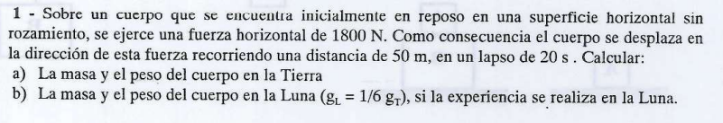


## 🛠️ Paso 1: Extracción de Datos e Identificación Cinemática

Primero ordenamos las variables cinemáticas experimentales dadas por el enunciado para determinar la aceleración constante ($a$) del cuerpo:

* **Velocidad inicial ($v_0$):** Como parte del reposo, $v_0 = 0 \text{ m/s}$.


* **Posición inicial ($x_0$):** Fijamos nuestro origen de coordenadas en $x_0 = 0 \text{ m}$.


* **Desplazamiento ($\Delta x$):** $50 \text{ m}$.


* **Tiempo empleado ($\Delta t$):** $20 \text{ s}$.


* **Fuerza horizontal aplicada ($F$):** $1800 \text{ N}$.


Dado que la fuerza aplicada es constante, la aceleración también será constante (MRUV). Usamos la ecuación horaria de la posición para despejar la aceleración ($a$):

$$x = x_0 + v_0 \cdot t + \frac{1}{2} \cdot a \cdot t^2 \text{} $$

$$50 \text{ m} = 0 + 0 \cdot (20 \text{ s}) + \frac{1}{2} \cdot a \cdot (20 \text{ s})^2 \text{} $$

$$50 \text{ m} = \frac{1}{2} \cdot a \cdot 400 \text{ s}^2 \text{} $$

$$50 \text{ m} = 200 \text{ s}^2 \cdot a \text{}$$

Despejamos el módulo de la aceleración ($a$):


$$a = \frac{50 \text{ m}}{200 \text{ s}^2} = \mathbf{0,25 \text{ m/s}^2} \text{} $$

---

## 📐 Paso 2: Resolución del Inciso a) Masa y Peso en la Tierra

### 1. Cálculo de la Masa Inercial ($m$)

Aplicamos la **Segunda Ley de Newton** en el eje horizontal del movimiento:


$$\Sigma F_x = m \cdot a \implies F = m \cdot a \text{} $$

Sabiendo que la soga o el dispositivo jala con $1800 \text{ N}$ y produce la aceleración calculada:


$$1800 \text{ N} = m \cdot 0,25 \text{ m/s}^2 \text{} $$

$$m = \frac{1800 \text{ N}}{0,25 \text{ m/s}^2} = \mathbf{7200 \text{ kg}} \text{} $$

### 2. Cálculo del Peso en la Tierra ($P_T$)

El peso es la fuerza de atracción que ejerce la Tierra sobre la masa corporal. Adoptando el valor de la cátedra para la gravedad terrestre ($g_T = 10 \text{ m/s}^2$):


$$P_T = m \cdot g_T = 7200 \text{ kg} \cdot 10 \text{ m/s}^2 = \mathbf{72000 \text{ N}} \text{}$$

---

## 📐 Paso 3: Resolución del Inciso b) Masa y Peso en la Luna


### 1. Masa en la Luna ($m_L$)

> ⚠️ **Principio de Inercia Importante:** La masa es la cantidad de materia e inercia propia del punto material, por lo que **no cambia sin importar en qué lugar del universo se realice la experiencia**.
> 
> 
> 
> $$\mathbf{m_L = m_T = 7200 \text{ kg}} \text{} $$
> 
> 

### 2. Cálculo del Peso en la Luna ($P_L$)

La gravedad en la Luna es la sexta parte de la terrestre ($g_L = \frac{1}{6} \cdot g_T$):


$$g_L = \frac{10 \text{ m/s}^2}{6} \approx 1,667 \text{ m/s}^2 \text{}$$

Calculamos la fuerza peso resultante en la superficie lunar:


$$P_L = m \cdot g_L = 7200 \text{ kg} \cdot \left(\frac{10}{6} \text{ m/s}^2\right) = 1200 \cdot 10 = \mathbf{12000 \text{ N}} \text{}$$

---

## 🎯 Resumen de Respuestas para el Examen

* **a) En la Tierra:** Masa $m = 7200 \text{ kg}$ y Peso $P_T = 72000 \text{ N}$.


* **b) En la Luna:** Masa $m = 7200 \text{ kg}$ y Peso $P_L = 12000 \text{ N}$.


---

# Ejercicio 9 Fuerza Inclinada sobre Plano Horizontal

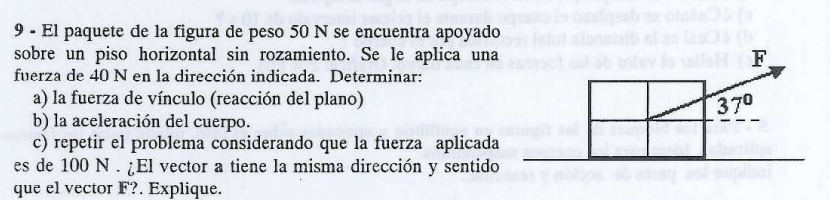


---

## 🛠️ Paso 1: Extracción de Datos y Descomposición de la Fuerza ($F = 40\text{ N}$)

* Peso del paquete ($P$): $50\text{ N}$.


* Masa del cuerpo ($m$): $m = \frac{P}{g} = \frac{50\text{ N}}{10\text{ m/s}^2} = 5\text{ kg}$.


* Ángulo de la fuerza respecto a la horizontal ($\alpha$): $37^\circ$.


Descomponemos la fuerza aplicada $\vec{F} = 40\text{ N}$ en los ejes coordenados convencionales ($+x$ hacia la derecha, $+y$ hacia arriba):

* $F_x = F \cdot \cos(37^\circ) = 40\text{ N} \cdot 0,8 = 32\text{ N}$ 


* $F_y = F \cdot \sin(37^\circ) = 40\text{ N} \cdot 0,6 = 24\text{ N}$ 


---

## 📐 Paso 2: Análisis para el Caso de $F = 40\text{ N}$

### a) Calcular la Fuerza Normal o de Vínculo ($N$)

Planteamos la sumatoria de fuerzas en el eje vertical $y$. Como la componente vertical de la fuerza ($F_y = 24\text{ N}$) es menor que el peso total del bloque ($P = 50\text{ N}$), el cuerpo no se levanta del suelo ($a_y = 0$):


$$\Sigma F_y = m \cdot a_y \implies N + F_y - P = 0 $$

$$N = P - F_y = 50\text{ N} - 24\text{ N} = \mathbf{26\text{ N}} $$

### b) Calcular la Aceleración del Cuerpo ($a_x$)

Planteamos la sumatoria de fuerzas en el eje horizontal $x$ donde ocurre el movimiento:


$$\Sigma F_x = m \cdot a_x \implies F_x = m \cdot a_x$$

$$32\text{ N} = 5\text{ kg} \cdot a_x \quad$$

$$a_x = \frac{32\text{ N}}{5\text{ kg}} = \mathbf{6,4\text{ m/s}^2} $$

---

## 📐 Paso 3: Análisis del Inciso c) Caso Especial para $F = 100\text{ N}$

Aumentamos la intensidad de la fuerza a $F = 100\text{ N}$. Calculamos sus nuevas componentes vectoriales:

* $F_x = 100\text{ N} \cdot \cos(37^\circ) = 80\text{ N}$ 


* $F_y = 100\text{ N} \cdot \sin(37^\circ) = 60\text{ N}$ 


### 1. Verificación del Despegue

Pozzetti siempre te va a pedir que verifiques si el cuerpo sigue apoyado. Evaluamos la tendencia en el eje vertical:
La fuerza hacia arriba ($F_y = 60\text{ N}$) es **estrictamente mayor** que el peso hacia abajo ($P = 50\text{ N}$).
Por lo tanto, el piso ya no necesita reaccionar. El bloque se despega del suelo, lo que significa que **la fuerza normal se anula por completo**:


$$\mathbf{N = 0\text{ N}} $$

### 2. Cálculo de las Aceleraciones Reales ($a_x$ y $a_y$)

Al estar en el aire, el cuerpo acelera en ambas direcciones en simultáneo:

* **Eje X:**


$$a_x = \frac{F_x}{m} = \frac{80\text{ N}}{5\text{ kg}} = \mathbf{16\text{ m/s}^2} $$


* **Eje Y:**


$$\Sigma F_y = m \cdot a_y \implies F_y - P = m \cdot a_y $$


$$60\text{ N} - 50\text{ N} = 5\text{ kg} \cdot a_y \implies 10 = 5 \cdot a_y \implies a_y = \mathbf{2\text{ m/s}^2} $$


El vector aceleración neta resultante es: $\vec{a} = (16\hat{i} + 2\hat{j})\text{ m/s}^2$.

### 3. Explicación Conceptual de las Direcciones

La pregunta del parcial dice: *¿El vector $\vec{a}$ tiene la misma dirección y sentido que el vector $\vec{F}$?* 

* **Respuesta:** **NO.** 


* **Justificación:** Según la Segunda Ley de Newton, el vector aceleración siempre tiene la misma dirección y sentido que la **fuerza resultante neta ($\vec{R}$)**, no de una fuerza individual. Como en el eje vertical actúa el peso además de la fuerza inclinada, la dirección de la fuerza resultante es diferente a la de $\vec{F}$, haciendo que los vectores no sean co-lineales.


---

## 🎯 Resumen de Respuestas para el Examen

* **a)** $N = 26\text{ N}$.


* **b)** $a = 6,4\text{ m/s}^2$.


* **c)** Para $F = 100\text{ N}$: $N = 0\text{ N}$ , $a_x = 16\text{ m/s}^2$ , $a_y = 2\text{ m/s}^2$. Las direcciones no coinciden porque la aceleración sigue a la fuerza resultante, la cual incluye el efecto del peso.


---

# Ejercicio 10 Dinámica del Plano Inclinado con Fuerza Oblicua

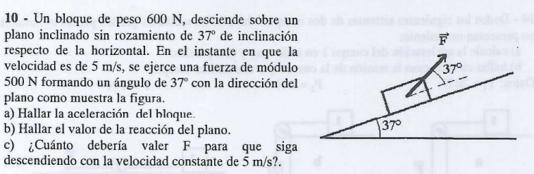

Este problema combina un plano inclinado sin rozamiento con una fuerza externa oblicua aplicada a un bloque que viene descendiendo con velocidad inicial.

A continuación, la resolución analítica minuciosa paso a paso siguiendo la nomenclatura de la cátedra:
---

## 🛠️ Paso 1: Extracción de Datos y Descomposición Vectorial

el **eje X** paralelo al plano inclinado (tomamos positivo hacia abajo, en el sentido original del movimiento) y el **eje Y** perpendicular a la rampa (positivo hacia arriba, apuntando hacia la Normal).

* **Peso del bloque ($P$):** $600 \text{ N}$.


* **Masa inercial ($m$):** $m = \frac{P}{g} = \frac{600 \text{ N}}{10 \text{ m/s}^2} = \mathbf{60 \text{ kg}}$.


* **Ángulo de la rampa ($\alpha$):** $37^\circ$.


* **Fuerza oblicua aplicada ($F$):** $500 \text{ N}$ a un ángulo $\theta = 37^\circ$ respecto de la pendiente.


Descomponemos las fuerzas en los nuevos ejes rotados:

1. **Componentes del Peso:**
* $P_x = P \cdot \sin(37^\circ) = 600 \text{ N} \cdot 0,6 = 360 \text{ N}$ (apunta hacia abajo de la rampa, sentido $+x$).


* $P_y = P \cdot \cos(37^\circ) = 600 \text{ N} \cdot 0,8 = 480 \text{ N}$ (apunta hacia adentro de la rampa, sentido $-y$).


2. **Componentes de la Fuerza Externa:**
* $F_x = F \cdot \cos(37^\circ) = 500 \text{ N} \cdot 0,8 = 400 \text{ N}$ (apunta hacia arriba de la rampa, sentido $-x$).


* $F_y = F \cdot \sin(37^\circ) = 500 \text{ N} \cdot 0,6 = 300 \text{ N}$ (apunta hacia arriba, despegando el bloque, sentido $+y$).


---

## 📐 Paso 2: Planteo de las Ecuaciones de Newton (Segunda Ley)

### b) Calcular la Reacción del Plano o Fuerza Normal ($N$)

En el eje perpendicular al plano inclinado no existe movimiento neto ($a_y = 0$):


$$\Sigma F_y = 0 \implies N + F_y - P_y = 0 \quad$$

$$N = P_y - F_y \quad$$

$$N = 480 \text{ N} - 300 \text{ N} = \mathbf{180 \text{ N}} \quad $$

---

### a) Calcular la Aceleración del Bloque ($a_x$)

Planteamos la sumatoria de fuerzas a lo largo del plano inclinado (eje X):


$$\Sigma F_x = m \cdot a_x \implies P_x - F_x = m \cdot a_x \quad $$

Sustituimos las componentes calculadas:


$$360 \text{ N} - 400 \text{ N} = 60 \text{ kg} \cdot a_x \quad$$

$$-40 \text{ N} = 60 \text{ kg} \cdot a_x \quad $$

$$a_x = \frac{-40 \text{ N}}{60 \text{ kg}} = -\frac{2}{3} \text{ m/s}^2 \approx \mathbf{-0,67 \text{ m/s}^2} \quad $$

> 💡 **Significado del Signo Menor:** Como la aceleración dio con signo negativo, su vector apunta en sentido contrario al eje X elegido. Esto físicamente significa que la componente de la fuerza de tiro hacia arriba de la rampa le gana a la de la gravedad, por lo que el bloque se encuentra **frenando (desacelerando)** mientras desciende.
> 
> 

---

## 📐 Paso 3: Resolución del Inciso c) Fuerza para Velocidad Constante

Para que el cuerpo continúe descendiendo con una velocidad estrictamente constante de $5 \text{ m/s}$ ($v = \text{cte.}$), la aceleración lineal neta debe ser nula ($a_x = 0$):

$$\Sigma F_x = 0 \implies P_x - F_x = 0 \quad $$

$$P \cdot \sin(37^\circ) - F \cdot \cos(37^\circ) = 0 \quad $$

$$F \cdot \cos(37^\circ) = P \cdot \sin(37^\circ) \quad$$

Despejamos el módulo requerido de la nueva fuerza $F$:


$$F = P \cdot \frac{\sin(37^\circ)}{\cos(37^\circ)} = P \cdot \tan(37^\circ) \quad $$

$$F = 600 \text{ N} \cdot \tan(37^\circ) \approx 600 \cdot 0,75355 = \mathbf{452,13 \text{ N}} \quad$$

---

## 🎯 Resumen de Respuestas para el Examen

* **a) Aceleración ($a_x$):** $-0,67 \text{ m/s}^2$ (frenando).


* **b) Reacción del plano ($N$):** $180 \text{ N}$.


* **c) Fuerza $F$ requerida:** $452,13 \text{ N}$.


---

# Ejercicio 16 Cuerpos Vinculados en Superficie Horizontal sin Roce

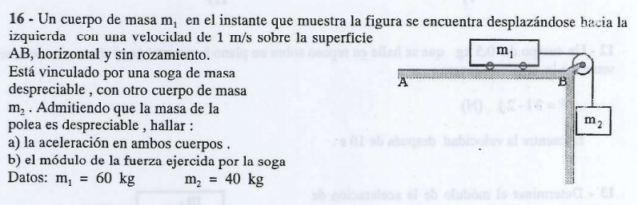

Este problema introduce un sistema clásico de dos cuerpos vinculados por una soga inextensible de masa despreciable que pasa por una polea fija ideal.

La trampa conceptual te pone acá es la velocidad inicial hacia la izquierda, un distractor cinemático que no afecta las ecuaciones de la dinámica de Newton.

A continuación, la resolución completa paso a paso:


## 🛠️ Paso 1: Planteo del Sistema de Referencia y Vínculos

* **Velocidad inicial ($\vec{v}_0$):** Se mueve a $1\text{ m/s}$ hacia la izquierda. Al ser la soga inextensible, ambos cuerpos comparten en todo momento el mismo módulo de velocidad y aceleración lineal ($a_1 = m_2 \cdot a_x$).


* **Sentido de las fuerzas:** La masa $m_2$ cuelga verticalmente, por lo que su peso ($P_2 = m_2 \cdot g$) tira de la soga hacia abajo. Esto generará una aceleración neta que obligará al sistema a acelerar **hacia la derecha** (frenando el movimiento inicial hacia la izquierda).


Establecemos el sentido positivo del movimiento siguiendo la soga: $+x$ hacia la derecha para el bloque 1, y $+y$ hacia abajo para el bloque 2.

---

## 📐 Paso 2: Diagramas de Cuerpo Libre (DCL) y Ecuaciones

### 1. Ecuaciones para el Bloque 1 ($m_1$)

En el eje vertical, la Normal compensa exactamente al peso corporal ($N_1 = P_1 = m_1 \cdot g$). En el eje horizontal de la mesa lisa, la única fuerza actuante es la tensión de la cuerda ($T$):


$$\Sigma F_x = m_1 \cdot a \implies T = m_1 \cdot a \quad \text{(Ecuación 1)}$$

### 2. Ecuaciones para el Bloque 2 ($m_2$)

El cuerpo cuelga y acelera hacia abajo:


$$\Sigma F_y = m_2 \cdot a \implies P_2 - T = m_2 \cdot a \quad \text{(Ecuación 2)}$$

---

## 🧮 Paso 3: Resolución del Sistema de Ecuaciones

### a) Calcular la Aceleración del Sistema ($a$)

Sumamos miembro a miembro la **Ecuación 1** y la **Ecuación 2** para eliminar la tensión interna $T$:


$$(T) + (P_2 - T) = m_1 \cdot a + m_2 \cdot a \quad$$

$$P_2 = (m_1 + m_2) \cdot a \quad $$

Calculamos el peso del bloque colgante utilizando $g = 10\text{ m/s}^2$:


$$P_2 = m_2 \cdot g = 40\text{ kg} \cdot 10\text{ m/s}^2 = 400\text{ N} \quad$$

Despejamos la aceleración lineal común ($a$):


$$a = \frac{P_2}{m_1 + m_2} = \frac{400\text{ N}}{60\text{ kg} + 40\text{ kg}} = \frac{400\text{ N}}{100\text{ kg}} = \mathbf{4\text{ m/s}^2} \quad$$

> 💡 **Nota Cinemática:** La aceleración es de $4\text{ m/s}^2$ hacia la derecha. Como la velocidad inicial iba hacia la izquierda, el carrito horizontal se encuentra **frenando uniformemente** hasta detenerse por completo, para luego comenzar a acelerar hacia la derecha.
> 
> 

---

### b) Calcular el Módulo de la Fuerza Ejercida por la Soga (Tensión $T$)

Sustituimos el valor de la aceleración en la Ecuación 1 del Bloque 1:


$$T = m_1 \cdot a = 60\text{ kg} \cdot 4\text{ m/s}^2 = \mathbf{240\text{ N}} \quad [cite: 2105, 2134]$$

---

## 🎯 Resumen de Respuestas para el Examen

* **a) Aceleración ($a$):** $4\text{ m/s}^2$ (con sentido hacia la derecha).


* **b) Tensión de la soga ($T$):** $240\text{ N}$.


---

# Ejercicio 21  Máquina de Atwood y Reacciones en el Soporte

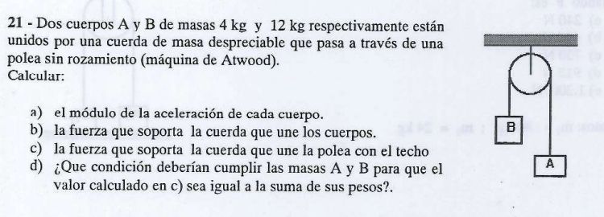

Es un ejercicio que evalua no solo la aceleración del sistema y la tensión de la soga móvil , sino también **la fuerza que soporta la soga fija que sostiene la polea al techo**.

A continuación, la resolución completa explicada paso a paso:

---

## 🛠️ Paso 1: Datos y Elección del Sistema de Referencia

* **Masa A ($m_A$):** $4\text{ kg} \implies P_A = m_A \cdot g = 4\text{ kg} \cdot 10\text{ m/s}^2 = 40\text{ N}$.


* **Masa B ($m_B$):** $12\text{ kg} \implies P_B = m_B \cdot g = 12\text{ kg} \cdot 10\text{ m/s}^2 = 120\text{ N}$.


Como la masa B es mayor que la masa A ($m_B > m_A$), el sistema acelerará de forma natural **haciendo descender a B y ascender a A**. Definimos nuestro sentido positivo siguiendo la soga: $+y$ hacia arriba para el cuerpo A, y $+y$ hacia abajo para el cuerpo B.

---

## 📐 Paso 2: Diagramas de Cuerpo Libre (DCL) y Ecuaciones

### 1. Ecuación para el Cuerpo A ($m_A$)

El bloque asciende con aceleración $a$:


$$\Sigma F_y = m_A \cdot a \implies T - P_A = m_A \cdot a \quad \text{ (Ecuación 1)}$$

### 2. Ecuación para el Cuerpo B ($m_B$)

El bloque desciende con aceleración $a$:


$$\Sigma F_y = m_B \cdot a \implies P_B - T = m_B \cdot a \quad \text{ (Ecuación 2)}$$

---

## 🧮 Paso 3: Resolución del Sistema

### a) Calcular el Módulo de la Aceleración ($a$)

Sumamos miembro a miembro la **Ecuación 1** y la **Ecuación 2** para cancelar algebraicamente la tensión interna $T$:


$$(T - P_A) + (P_B - T) = m_A \cdot a + m_B \cdot a \quad \text{}$$

$$P_B - P_A = (m_A + m_B) \cdot a \quad \text{}$$

Sustituimos los valores de los pesos y las masas:


$$120\text{ N} - 40\text{ N} = (4\text{ kg} + 12\text{ kg}) \cdot a \quad$$

$$80\text{ N} = 16\text{ kg} \cdot a \quad$$

$$a = \frac{80\text{ N}}{16\text{ kg}} = \mathbf{5\text{ m/s}^2} \quad \text{}$$

---

### b) Calcular la Fuerza que soporta la Cuerda Móvil (Tensión $T$)

Usamos la Ecuación 1 para aislar el valor de la tensión de la soga:


$$T = P_A + m_A \cdot a \quad$$

$$T = 40\text{ N} + (4\text{ kg} \cdot 5\text{ m/s}^2) \quad$$

$$T = 40\text{ N} + 20\text{ N} = \mathbf{60\text{ N}} \quad \text{}$$

---

### c) Calcular la Fuerza que soporta la Cuerda del Techo ($T_2$)

Hacemos un DCL enfocado exclusivamente en la polea fija. Como la polea tiene masa despreciable y está inmóvil en el techo, la sumatoria de fuerzas sobre ella es cero:


$$\Sigma F_y = 0 \implies T_2 - T - T = 0 \quad \text{}$$

$$T_2 = 2T \quad \text{}$$

Sustituimos el valor de la tensión interna de la soga móvil que calculamos en el inciso b:


$$T_2 = 2 \cdot 60\text{ N} = \mathbf{120\text{ N}} \quad \text{}$$

---

### d) Análisis de la Condición de Igualdad de Pesos

La suma directa de los pesos de ambos bloques es: $P_A + P_B = 40\text{ N} + 120\text{ N} = 160\text{ N}$. Sin embargo, la cuerda del techo solo soporta $120\text{ N}$ porque el sistema está acelerando en caída parcial.

Para que la tensión del techo ($T_2$) sea exactamente igual a la suma de los pesos individuales ($P_A + P_B$), el sistema **no debe acelerar** ($a = 0$).
Revisando la fórmula de la aceleración del Paso 3:


$$a = \frac{m_B - m_A}{m_A + m_B} \cdot g = 0 \implies m_B - m_A = 0 \implies \mathbf{m_A = m_B} \quad$$

> 💡 **Conclusión de Cátedra:** La única condición física para que se cumpla esa igualdad es que **ambas masas sean exactamente iguales**, lo que mantiene al sistema en un estado de equilibrio estático completo.
> 
> 

---

## 🎯 Resumen de Respuestas para el Examen

* **a) Aceleración ($a$):** $5\text{ m/s}^2$.


* **b) Tensión de los bloques ($T$):** $60\text{ N}$.


* **c) Tensión del techo ($T_2$):** $120\text{ N}$.


* **d) Condición:** Que las masas sean iguales ($m_A = m_B$) para anular la aceleración.


---

# Ejercicio 33 Fuerza Elástica y Masa Colgante

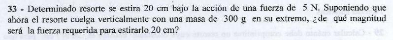

Este problema introduce las **fuerzas elásticas** y es evalúa qué ocurre cuando un resorte que fue caracterizado horizontalmente pasa a trabajar en posición vertical sosteniendo una masa.

---

## 📄 Ejercicio 33: Fuerza Elástica y Masa Colgante


## 🛠️ Paso 1: Caracterización del Resorte (Obtención de la Constante $k$)

Primero utilizamos la experiencia inicial dada por el enunciado para determinar la rigidez intrínseca del resorte:

* **Fuerza aplicada ($F$):** $5\text{ N}$.
* **Deformación lineal ($\Delta l$):** $20\text{ cm} = 0,2\text{ m}$.

Aplicamos la **Ley de Hooke** en módulo:


$$F_e = k \cdot \vert{}\Delta l\vert{} \implies k = \frac{F_e}{\vert{}\Delta l\vert{}} \quad \text{}$$

$$k = \frac{5\text{ N}}{0,2\text{ m}} = \mathbf{25\text{ N/m}} \quad \text{}$$

---

## 📐 Paso 2: Análisis del Resorte Vertical con la Masa Colgante

Ahora el resorte cuelga verticalmente y se le engancha una masa $m = 300\text{ g} = 0,3\text{ kg}$.

### 1. Deformación por Equilibrio Estático ($\Delta l_0$)

El propio peso de la masa ($P = m \cdot g$) ya estira libremente al resorte una distancia inicial $\Delta l_0$:


$$P = m \cdot g = 0,3\text{ kg} \cdot 10\text{ m/s}^2 = 3\text{ N} \quad \text{}$$

Planteamos el equilibrio estático del cuerpo colgado ($\Sigma F_y = 0$):


$$F_e - P = 0 \implies k \cdot \Delta l_0 = P \quad \text{}$$

$$\Delta l_0 = \frac{P}{k} = \frac{3\text{ N}}{25\text{ N/m}} = \mathbf{0,12\text{ m}} = 12\text{ cm} \quad \text{}$$

---

## 🧮 Paso 3: Cálculo de la Fuerza Externa Adicional ($F_3$)

El enunciado nos pide hallar qué fuerza adicional $F_3$ hay que aplicarle hacia abajo a la masa para lograr que la deformación **total** del resorte alcance los $20\text{ cm}$ ($0,20\text{ m}$) desde su posición libre sin deformar.

* Deformación total buscada ($\Delta l_{\text{total}}$): $0,20\text{ m}$.
* Deformación que ya provocó el peso ($\Delta l_0$): $0,12\text{ m}$.
* Deformación adicional que debe aportar la fuerza extra ($\Delta l_3$):

$$\Delta l_3 = 0,20\text{ m} - 0,12\text{ m} = \mathbf{0,08\text{ m}} = 8\text{ cm} \quad \text{}$$


Planteamos la condición de equilibrio para la masa en esa posición estática extendida ($\Sigma F_y = 0$) adoptando positivo hacia abajo:


$$\Sigma F_y = 0 \implies P + F_3 - F_{e_{\text{total}}} = 0 \quad \text{}$$

$$P + F_3 = k \cdot \Delta l_{\text{total}} \quad \text{}$$

Despejamos la fuerza requerida $F_3$:


$$F_3 = k \cdot \Delta l_{\text{total}} - P \quad \text{}$$

$$F_3 = 25\text{ N/m} \cdot (0,20\text{ m}) - 3\text{ N} \quad \text{}$$

$$F_3 = 5\text{ N} - 3\text{ N} = \mathbf{2\text{ N}} \quad \text{}$$

> 💡 **Forma Alternativa Directa:** También se puede calcular considerando que la fuerza adicional $F_3$ solo debe vencer el estiramiento suplementario de $8\text{ cm}$ ($\Delta l_3 = 0,08\text{ m}$):
> 
> $$F_3 = k \cdot \Delta l_3 = 25\text{ N/m} \cdot 0,08\text{ m} = \mathbf{2\text{ N}} \quad \text{}$$
> 
> 

---

## 🎯 Resumen de Respuestas para el Examen

* **Constante del resorte ($k$):** $25\text{ N/m}$.
* **Deformación estática por el peso ($\Delta l_0$):** $12\text{ cm}$ ($0,12\text{ m}$).
* **Fuerza requerida ($F_3$):** $2\text{ N}$.

---

# Ejercicio 40  Transición de Fricción Estática Máxima a Rozamiento Cinético

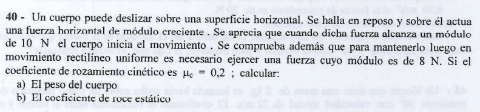

Este problema porque evalúa la transición exacta entre el **estado de reposo con rozamiento estático** y el **movimiento rectilíneo uniforme con rozamiento cinético**.

A continuación, la resolución analítica y minuciosa paso a paso:


---

## 📐 Paso 1: Análisis del Tramo Dinámico (Movimiento Rectilíneo Uniforme)

Pozzetti siempre arranca resolviendo desde los datos cinéticos conocidos para aislar las fuerzas normales. Cuando el cuerpo ya se encuentra en **movimiento rectilíneo uniforme (MRU)**, su velocidad es estrictamente constante ($v = \text{cte.}$) , lo que implica que su aceleración lineal en el eje del movimiento es nula ($a_x = 0$).

* Fuerza dinámica requerida ($F_d$): $8\text{ N}$.


* Coeficiente de fricción cinético ($\mu_c$ o $\mu_d$): $0,2$.


Planteamos las ecuaciones de la Segunda Ley de Newton para el cuerpo en deslizamiento:

* **Eje Vertical Y:** No hay movimiento en la vertical, por lo que la Normal equilibra al peso:


$$\Sigma F_y = 0 \implies N - P = 0 \implies N = P = m \cdot g \quad \text{}$$


* **Eje Horizontal X:** Planteamos el equilibrio dinámico ($\Sigma F_x = m \cdot a_x = 0$):


$$\Sigma F_x = 0 \implies F_d - f_{rc} = 0 \implies F_d = f_{rc} \quad \text{}$$


Sabiendo que la fuerza de rozamiento cinético responde a la expresión $f_{rc} = \mu_c \cdot N$:


$$8\text{ N} = \mu_c \cdot N \implies 8\text{ N} = 0,2 \cdot N \quad \text{}$$

Despejamos el valor de la fuerza Normal de vínculo ($N$):


$$N = \frac{8\text{ N}}{0,2} = \mathbf{40\text{ N}} \quad \text{}$$

### Resolución del Inciso a) El Peso del Cuerpo ($P$)

Como demostramos en el equilibrio del eje Y que la Normal equivale al peso corporal ($N = P$):


$$\mathbf{P = 40\text{ N}} \quad \text{}$$

(Nota inercial de control: Utilizando $g = 10\text{ m/s}^2$, la masa inercial de la partícula es de $4\text{ kg}$).

---

## 📐 Paso 2: Análisis del Umbral de Movimiento (Fricción Estática Máxima)

El enunciado establece que el cuerpo rompe el estado de reposo e inicia el movimiento justo en el instante en que la fuerza horizontal aplicada alcanza los $10\text{ N}$. Ese punto límite exacto corresponde analíticamente a la **fuerza de rozamiento estática máxima ($f_{re}^{\text{máx}}$)**:


$$f_{re}^{\text{máx}} = 10\text{ N} \quad \text{}$$

La ley de frotamiento estático límite define que:


$$f_{re}^{\text{máx}} = \mu_e \cdot N \quad \text{}$$

### Resolución del Inciso b) El Coeficiente de Roce Estático ($\mu_e$)

Sustituimos el valor de la Normal ($N = 40\text{ N}$) obtenido en el bloque anterior:


$$10\text{ N} = \mu_e \cdot 40\text{ N} \quad \text{}$$

Despejamos de forma directa el coeficiente estático ($\mu_e$), el cual es una magnitud adimensional:


$$\mu_e = \frac{10\text{ N}}{40\text{ N}} = \mathbf{0,25} \quad \text{}$$

> 💡 **Verificación Teórica Obligatoria:** En todo ejercicio de dinámica física bien resuelto, se debe cumplir estrictamente que el coeficiente estático sea mayor que el cinético ($\mu_e > \mu_c$). En este caso, $0,25 > 0,2$, validando por completo la resolución de la pizarra.
> 
> 

---

## 🎯 Resumen de Respuestas para el Examen

* **a) Peso del cuerpo ($P$):** $40\text{ N}$.


* **b) Coeficiente de roce estático ($\mu_e$):** $0,25$.


---

# Ejercicio 41

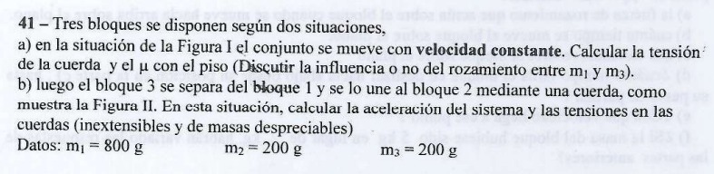

¡Vamos con el **Ejercicio 41** de la lista (página 11, ejercicio 41)! Este problema es completísimo porque analiza el mismo sistema de tres bloques bajo dos situaciones dinámicas totalmente diferentes: una en **equilibrio dinámico (MRU)** y otra en **movimiento acelerado**.

A continuación, lo resolvemos paso a paso con el nivel analítico de tus apuntes de clase:

---

## 📄 Ejercicio 41: Sistema de Tres Bloques Vinculados

> **41 - Tres bloques se disponen según dos situaciones:**
> * a) En la situación de la Figura I el conjunto se mueve con velocidad constante. Calcular la tensión de la cuerda y el coeficiente de rozamiento con el piso (Discutir la influencia o no del rozamiento entre $m_1$ y $m_3$). 
> 
> 
> * b) Luego el bloque 3 se separa del bloque 1 y se lo une al bloque 2 mediante una cuerda, como muestra la Figura II. En esta situación, calcular la aceleración del sistema y las tensiones en las cuerdas (inextensibles y de masas despreciables). * **Datos: $m_1 = 800\text{ g} = 0,8\text{ kg}$, $m_2 = 200\text{ g} = 0,2\text{ kg}$, $m_3 = 200\text{ g} = 0,2\text{ kg}$.** 
> 
> 
> 
> 

---

## 📐 Situación I (Figura I): Movimiento con Velocidad Constante ($v = \text{cte.}$)

En este primer tramo, el bloque 3 está apoyado arriba del bloque 1. Dado que el conjunto completo se desplaza con **velocidad constante**, el sistema está en equilibrio dinámico y la aceleración es nula ($a = 0$).

### 1. Discusión Conceptual del Roce entre $m_1$ y $m_3$

Como el sistema se mueve a velocidad constante, no hay aceleración ($a=0$). Al plantear el DCL de la masa 3 en el eje horizontal, la sumatoria de fuerzas debe ser cero. Como no hay ninguna fuerza exterior que intente desplazar a $m_3$ respecto de $m_1$, **la fuerza de rozamiento estática entre ambos es estrictamente CERO ($f_{re_{13}} = 0$)**. No influye en la traslación horizontal.

### 2. Planteo Dinámico y Obtención de la Tensión ($T$) y el Coeficiente ($\mu_c$)

* **Bloque Colgante ($m_2$):** Acelera a cero hacia abajo ($\Sigma F_y = 0$):


$$P_2 - T = 0 \implies T = P_2 = m_2 \cdot g = 0,2\text{ kg} \cdot 10\text{ m/s}^2 = \mathbf{2\text{ N}} \quad \text{}$$


* **Bloques sobre la Mesa ($m_1 + m_3$):** Se mueven solidariamente hacia la derecha. La Normal total que soporta el piso es la suma de ambos pesos:


$$N_{\text{total}} = P_1 + P_3 = (m_1 + m_3) \cdot g = (0,8\text{ kg} + 0,2\text{ kg}) \cdot 10\text{ m/s}^2 = 1\text{ kg} \cdot 10\text{ m/s}^2 = 10\text{ N} \quad \text{}$$


Planteamos el equilibrio horizontal en la mesa ($\Sigma F_x = 0$):


$$T - f_{rd} = 0 \implies T = f_{rd} \implies T = \mu_c \cdot N_{\text{total}} \quad \text{}$$

$$2\text{ N} = \mu_c \cdot 10\text{ N} \implies \mu_c = \frac{2}{10} = \mathbf{0,2} \quad \text{}$$

---

## 📐 Situación II (Figura II): Movimiento Acelerado ($a \ne 0$)

Ahora el bloque 3 se saca de arriba del bloque 1 y se lo amarra abajo del bloque 2, por lo que colgarán juntos. Esto rompe el equilibrio y el sistema comenzará a acelerar.

* Masa en la mesa: $m_1 = 0,8\text{ kg}$. Su Normal ahora es: $N_1 = P_1 = 0,8\text{ kg} \cdot 10\text{ m/s}^2 = 8\text{ N}$.


* Fuerza de roce dinámico en la mesa (se mantiene $\mu_c = 0,2$):


$$f_{rd} = \mu_c \cdot N_1 = 0,2 \cdot 8\text{ N} = 1,6\text{ N} \quad \text{}$$


### 1. Resolución del Sistema Acoplado de Newton

Llamemos $T_A$ a la soga horizontal y $T_B$ a la soga vertical intermedia entre los bloques colgantes:

* **Bloque 1 (en la mesa):** 
$$T_A - f_{rd} = m_1 \cdot a \implies T_A - 1,6 = 0,8 \cdot a \quad \text{(Ecuación 1)}$$


* **Bloque 2 (colgante superior):** Tira su peso y el de 3 hacia abajo, y lo frena la soga de la mesa:


$$P_2 + T_B - T_A = m_2 \cdot a \implies 2 + T_B - T_A = 0,2 \cdot a \quad \text{(Ecuación 2)}$$


* **Bloque 3 (colgante inferior):**


$$P_3 - T_B = m_3 \cdot a \implies 2 - T_B = 0,2 \cdot a \quad \text{(Ecuación 3)}$$


### 2. Cálculo de la Aceleración ($a$)

Sumamos miembro a miembro las tres ecuaciones para eliminar todas las tensiones internas ($T_A$ y $T_B$):


$$(T_A - 1,6) + (2 + T_B - T_A) + (2 - T_B) = (0,8 + 0,2 + 0,2) \cdot a$$

$$-1,6 + 2 + 2 = 1,2 \cdot a$$

$$2,4 = 1,2 \cdot a \implies a = \frac{2,4}{1,2} = \mathbf{2\text{ m/s}^2} \quad \text{}$$

### 3. Cálculo de las Tensiones de las Cuerdas ($T_A$ y $T_B$)

* **Tensión de la soga horizontal ($T_A$):** De la Ecuación 1:


$$T_A = 1,6 + 0,8 \cdot (2) = 1,6 + 1,6 = \mathbf{3,2\text{ N}} \quad \text{}$$


* **Tensión de la soga vertical intermedia ($T_B$):** De la Ecuación 3:


$$T_B = 2 - 0,2 \cdot (2) = 2 - 0,4 = \mathbf{1,6\text{ N}} \quad \text{[}$$


---

## 🎯 Resumen de Respuestas para el Examen

* **a) Situación I:** $T = 2\text{ N}$ y $\mu_c = 0,2$. El rozamiento con $m_3$ es cero porque no acelera.


* **b) Situación II:** $a = 2\text{ m/s}^2$ , $T_A = 3,2\text{ N}$ y $T_B = 1,6\text{ N}$.


---

# Ejercicio 46: Dos Estados de Movimiento sobre Plano Inclinado con Roce

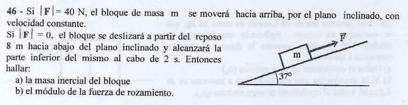

Este es uno de los problemas más completos y representativos porque te obliga a analizar dos estados de movimiento totalmente independientes sobre el mismo plano inclinado rugoso para poder despejar las incógnitas del sistema.


## 📐 Estado de Movimiento II ($F = 0$): Descenso Acelerado Libre

Pozzetti siempre arranca analizando el estado donde se conocen las variables cinemáticas para poder extraer la aceleración lineal neta y el coeficiente de rozamiento dinámico ($\mu_c$).

* **Datos experimentales de caída:** $v_0 = 0\text{ m/s}$ (parte del reposo) , $\Delta x = 8\text{ m}$ , $\Delta t = 2\text{ s}$.


### 1. Obtención de la Aceleración Cinemática ($a$)

Usamos la ecuación horaria de la posición para el movimiento uniformemente variado en descenso por el plano inclinado:


$$\Delta x = v_0 \cdot t + \frac{1}{2} \cdot a \cdot t^2 \text{} $$

$$8\text{ m} = 0 \cdot (2\text{ s}) + \frac{1}{2} \cdot a \cdot (2\text{ s})^2 \text{} $$

$$8\text{ m} = \frac{1}{2} \cdot a \cdot 4\text{ s}^2 \implies 8 = 2a \implies a = \mathbf{4\text{ m/s}^2} \text{} $$

### 2. Planteo Dinámico de la Caída libre por la rampa

Establecemos el sistema de referencia rotado convencional con el eje X positivo apuntando hacia abajo del plano (en sentido del deslizamiento). Las fuerzas actuantes son:

* **Eje Y (Perpendicular al plano):** No hay movimiento en este eje, por lo que la Normal compensa a la componente perpendicular del peso:


$$\Sigma F_y = 0 \implies N - P_y = 0 \implies N = P_y = m \cdot g \cdot \cos(37^\circ) \text{} $$


* **Eje X (Paralelo al plano):** La componente del peso tira hacia abajo y el rozamiento dinámico ($f_{rc} = \mu_c \cdot N$) la frena apuntando hacia arriba:


$$\Sigma F_x = m \cdot a \implies P_x - f_{rc} = m \cdot a \text{} $$


$$m \cdot g \cdot \sin(37^\circ) - \mu_c \cdot \big(m \cdot g \cdot \cos(37^\circ)\big) = m \cdot a \text{} $$


Simplificamos algebraicamente la masa $m$ de todos los términos de la igualdad:


$$g \cdot \sin(37^\circ) - \mu_c \cdot g \cdot \cos(37^\circ) = a \text{} $$

Sustituimos con la aceleración calculada ($a = 4\text{ m/s}^2$) y los valores trigonométricos de la rampa ($\sin 37^\circ = 0,6$ y $\cos 37^\circ = 0,8$) para aislar el coeficiente de roce dinámico ($\mu_c$):


$$10 \cdot 0,6 - \mu_c \cdot 10 \cdot 0,8 = 4 \text{} $$

$$6 - 8\mu_c = 4 \implies 6 - 4 = 8\mu_c \implies 2 = 8\mu_c \text{} $$

$$\mu_c = \frac{2}{8} = \mathbf{0,25} \text{} $$

---

## 📐 Estado de Movimiento I ($F = 40\text{ N}$): Ascenso con Velocidad Constante

Ahora analizamos la primera situación planteada por el enunciado : se aplica la fuerza horizontal paralela a la rampa hacia arriba, logrando que el bloque ascienda con **velocidad constante** ($v = \text{cte.}$), por lo que la aceleración en este tramo es estrictamente nula ($a = 0$).

Como el bloque ahora cambia su sentido de marcha e intenta subir por la rampa, **la fuerza de rozamiento dinámico cambia de sentido y apunta hacia abajo del plano inclinado** (oponiéndose al movimiento ascendente).

Planteamos el equilibrio dinámico sobre el eje X paralelo al plano inclinado (tomando positivo hacia arriba de la rampa):


$$\Sigma F_x = 0 \implies F - f_{rc} - P_x = 0 \text{} $$

$$F - \mu_c \cdot \big(m \cdot g \cdot \cos(37^\circ)\big) - m \cdot g \cdot \sin(37^\circ) = 0 \text{} $$

### a) Calcular la Masa Inercial del Bloque ($m$)

Agrupamos y factorizamos los términos que contienen la incógnita de la masa $m$:


$$F = m \cdot \big[\mu_c \cdot g \cdot \cos(37^\circ) + g \cdot \sin(37^\circ)\big] \text{} $$

Sustituimos el valor de la fuerza externa ($F = 40\text{ N}$) y el coeficiente hallado ($\mu_c = 0,25$):


$$40\text{ N} = m \cdot \big[0,25 \cdot 10 \cdot 0,8 + 10 \cdot 0,6\big] \text{} $$

$$40\text{ N} = m \cdot \big[2 + 6\big] \text{}$$

$$40\text{ N} = m \cdot 8 \implies m = \frac{40}{8} = \mathbf{5\text{ kg}} \text{} $$

### b) Calcular el Módulo de la Fuerza de Rozamiento Cinético ($f_{rc}$)

Evaluamos la magnitud de la fuerza de fricción disipativa para esta situación ascendente utilizando la masa inercial recién calculada:


$$f_{rc} = \mu_c \cdot m \cdot g \cdot \cos(37^\circ) \text{} $$

$$f_{rc} = 0,25 \cdot 5\text{ kg} \cdot 10\text{ m/s}^2 \cdot 0,8 \text{} $$

$$f_{rc} = 0,25 \cdot 40 = \mathbf{10\text{ N}} \text{} $$

---

## 🎯 Resumen de Respuestas para el Examen

* **a) Masa inercial del bloque ($m$):** $5\text{ kg}$.


* **b) Módulo de la fuerza de rozamiento ($f_{rc}$):** $10\text{ N}$.


---

## Ejercicio 54: Cuerpos en Contacto sobre Plano Inclinado con Roce

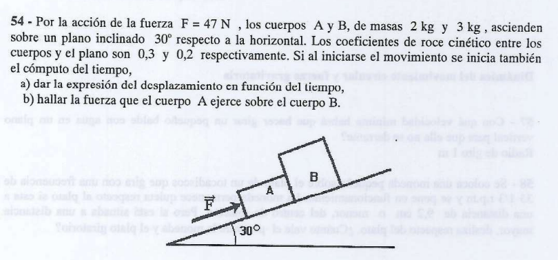

Este problema modela el comportamiento de **dos cuerpos en contacto** que ascienden por un plano inclinado rugoso bajo la acción de una fuerza externa.

Vamos a plantearlo de forma sistémica e individual con el Diagrama de Cuerpo Libre (DCL), tal como figura en tus apuntes de clase:

---


>

## 🛠️ Paso 1: Extracción de Datos y Descomposición del Peso

Establecemos el sistema de referencia rotado estándar: eje X positivo de forma paralela hacia arriba de la rampa (sentido del movimiento ascendente) y eje Y perpendicular al plano.

* **Cuerpo A:** $m_A = 2\text{ kg}$ , $\mu_{cA} = 0,3$.


* $P_A = m_A \cdot g = 2\text{ kg} \cdot 10\text{ m/s}^2 = 20\text{ N}$.


* $P_{Ax} = P_A \cdot \sin(30^\circ) = 20\text{ N} \cdot 0,5 = 10\text{ N}$.


* $P_{Ay} = P_A \cdot \cos(30^\circ) = 20\text{ N} \cdot \frac{\sqrt{3}}{2} \approx 17,32\text{ N}$.

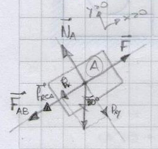


* **Cuerpo B:** $m_B = 3\text{ kg}$ , $\mu_{cB} = 0,2$.


* $P_B = m_B \cdot g = 3\text{ kg} \cdot 10\text{ m/s}^2 = 30\text{ N} \quad$.


* $P_{Bx} = P_B \cdot \sin(30^\circ) = 30\text{ N} \cdot 0,5 = 15\text{ N}$.


* $P_{By} = P_B \cdot \cos(30^\circ) = 30\text{ N} \cdot \frac{\sqrt{3}}{2} \approx 25,98\text{ N}$.

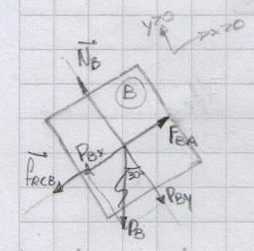


* **Fuerza exterior de tiro ($F$):** $47\text{ N}$ paralela al plano.


---

## 📐 Paso 2: Análisis Dinámico del Sistema Completo

Para hallar la aceleración ($a$), es recomendable tratar temporalmente a ambos bloques unidos como un único **macro-sistema** de masa total $M_T = m_A + m_B = 2\text{ kg} + 3\text{ kg} = 5\text{ kg}$. Las fuerzas de contacto mutuas son internas y se cancelan entre sí.

### 1. Cálculo de las Fuerzas de Rozamiento Individuales

En el eje Y perpendicular a la pendiente, cada cuerpo está en equilibrio estático ($N = P_y$):

* **Fricción en A ($f_{rcA}$):** $f_{rcA} = \mu_{cA} \cdot N_A = 0,3 \cdot 17,32\text{ N} = \mathbf{5,196\text{ N}}$.


* **Fricción en B ($f_{rcB}$):** $f_{rcB} = \mu_{cB} \cdot N_B = 0,2 \cdot 25,98\text{ N} = \mathbf{5,196\text{ N}}$.


### 2. Aplicación de la Segunda Ley de Newton en el Eje X

La fuerza $F$ empuja hacia arriba, mientras que las componentes de los pesos y los rozamientos se oponen tirando hacia abajo:


$$\Sigma F_x = M_T \cdot a \implies F - P_{Ax} - P_{Bx} - f_{rcA} - f_{rcB} = (m_A + m_B) \cdot a \quad \text{}$$

$$47\text{ N} - 10\text{ N} - 15\text{ N} - 5,196\text{ N} - 5,196\text{ N} = 5\text{ kg} \cdot a \quad \text{}$$

$$47 - 25 - 10,392 = 5 \cdot a \quad \text{}$$

$$11,608 = 5 \cdot a \implies a = \frac{11,608}{5} = \mathbf{2,3216\text{ m/s}^2} \quad \text{}$$

---

## 🧮 Paso 3: Resolución de los Incisos del Examen

### a) Expresión del Desplazamiento en función del tiempo ($\Delta x(t)$)

Como el bloque arranca desde el reposo absoluto ($v_0 = 0$) en el origen temporal ($t_0 = 0$) , aplicamos la ecuación cinemática horaria del MRUV con nuestra aceleración constante:


$$\Delta x(t) = v_0 \cdot t + \frac{1}{2} \cdot a \cdot t^2 \implies \mathbf{\Delta x(t) = 1,1608 \cdot t^2 \quad [\text{m}]} \quad \text{}$$

### b) Fuerza que el cuerpo A ejercgit pull origin main --rebasee sobre el cuerpo B ($E$ o $N_{BA}$)

Para calcular la fuerza de contacto interna, aislamos el **Cuerpo B** de forma individual. Su DCL en el eje X muestra que el cuerpo A lo empuja con una fuerza de contacto hacia arriba (llamémosla $E$), mientras que su propio peso y su rozamiento lo frenan hacia abajo:


$$\Sigma F_x = m_B \cdot a \implies E - f_{rcB} - P_{Bx} = m_B \cdot a \quad \text{}$$

$$E - 5,196\text{ N} - 15\text{ N} = 3\text{ kg} \cdot 2,3216\text{ m/s}^2 \quad \text{}$$

$$E - 20,196 = 6,9648 \quad \text{}$$

$$E = 6,9648 + 20,196 = \mathbf{27,16\text{ N}} \quad \text{}$$

---

## 🎯 Resumen de Respuestas para el Examen

* **a) Ecuación horaria de desplazamiento:** $\Delta x(t) = 1,1608 \cdot t^2 \quad [\text{m}]$.


* **b) Fuerza de contacto entre bloques ($N_{BA}$):** $27,16\text{ N}$.


---


