# Fluidos 

## 1. Conceptos Iniciales y Magnitudes Clave

Antes de entrar en los teoremas, repasemos tres variables que van a aparecer en absolutamente todas las ecuaciones:

* **Presión ($p$):** Es la fuerza normal (perpendicular) aplicada por unidad de área. Su unidad en el SI es el Pascal ($1\text{ Pa} = 1\text{ N/m}^2$).

> **Tip de examen:** Prestá mucha atención a las unidades. Es muy común usar atmósferas, bares o mmHg. Recordá la equivalencia fundamental:
> 
> 
> 
> $$1\text{ atm} = 1,013 \times 10^5\text{ Pa} = 760\text{ mmHg (Torr)}$$
> 
> 
> 
> 
> 

* **Densidad ($\delta$ o $\rho$):** Relación entre la masa de una sustancia y el volumen que ocupa ($\delta = m/V$). Para el agua dulce, su valor base es $1\text{ g/cm}^3 = 1\text{ kg/dm}^3 = 1000\text{ kg/m}^3$.

* **Peso Específico ($\rho$ o $\gamma$):** Es el peso por unidad de volumen ($\rho = P_{eso}/V$). Como el peso es masa por gravedad ($P_{eso} = mg$), se relaciona directamente con la densidad mediante la fórmula:

$$\rho = \delta \cdot g$$

---

## 2. Teorema Fundamental de la Hidrostática

Este teorema nos dice que **la presión en un fluido en reposo aumenta linealmente con la profundidad**. Si te sumergís en una pileta, el peso del líquido que tenés arriba tuyo te genera presión.

La diferencia de presión entre dos puntos (1 y 2) separados por una altura $h$ se calcula como:

$$p_2 - p_1 = \delta \cdot g \cdot h$$

### Presión Absoluta vs. Presión Manométrica

Cuando calculamos la presión en el interior de un tanque abierto o en el mar a una profundidad $h$, la superficie del líquido ya está soportando la presión de la atmósfera ($p_0$). Por lo tanto, la **Presión Absoluta** es:

$$p = p_0 + \delta \cdot g \cdot h$$

* 
$p_0$: Presión atmosférica (en la superficie).

* 
$\delta \cdot g \cdot h$: **Presión Manométrica** (la debida puramente al fluido).

---

## 3. Tubos en U y Vasos Comunicantes

Este es un clásico de parcial (de hecho, vi que lo tenés dibujado a mano en tus apuntes). Cuando tenés un tubo en U con **líquidos no miscibles** (que no se mezclan, como agua y mercurio, o agua y aceite), la clave absoluta para resolver el ejercicio es encontrar la **isóbara**.

> 💡 **La Regla de Oro:** Dos puntos que están a la misma altura, *en el mismo fluido* y conectados de forma continua, tienen **exactamente la misma presión** ($p_A = p_B$).
> 
> 

### Pasos para resolver un Tubo en U:

1. Identificá la superficie de separación entre los dos líquidos (el punto más bajo donde se tocan). Trazá una línea horizontal desde ahí hacia la otra rama.

2. Llamá a esos dos puntos en la horizontal $1$ y $2$. Sabés con certeza que $p_1 = p_2$.

3. Planteá qué hay arriba de cada punto:
* Arriba del punto 1 hay una columna de líquido A de altura $h_1$: $p_1 = p_0 + \delta_A \cdot g \cdot h_1$.

* Arriba del punto 2 hay una columna de líquido B de altura $h_2$: $p_2 = p_0 + \delta_B \cdot g \cdot h_2$.

4. Igualás y despejás lo que te pidan (muchas veces las $p_0$ se cancelan si ambas ramas están abiertas a la atmósfera):

$$\delta_A \cdot h_1 = \delta_B \cdot h_2$$

---

## 4. Principio de Pascal y Prensa Hidráulica

El Principio de Pascal establece que **cualquier presión aplicada a un fluido confinado se transmite con la misma intensidad en todas las direcciones** a través de todo el fluido.

El ejemplo práctico por excelencia es la **prensa hidráulica**. Tenés dos émbolos o pistones de distintas áreas ($S_1$ pequeño y $S_2$ grande) conectados por un fluido.

Como la presión es la misma en ambos émbolos a la misma altura ($p_1 = p_2$):

$$\frac{F_1}{S_1} = \frac{F_2}{S_2}$$

* **¿Cuál es la magia de esto?** Como $S_2$ es muchísimo más grande que $S_1$, una fuerza pequeña ($F_1$) en el pistón chico se convierte en una fuerza gigante ($F_2$) en el pistón grande, lo que permite levantar autos o camiones.

* **Ojo con el volumen:** El líquido que baja de un lado es el mismo que sube del otro ($V_1 = V_2$). Por lo tanto, si el pistón chico baja una distancia $d_1$, el grande subirá una distancia $d_2$ menor, cumpliendo que $S_1 \cdot d_1 = S_2 \cdot d_2$.

---

## 5. Principio de Arquímedes (Empuje y Flotación)

Cuando metés un cuerpo en un fluido, este experimenta una fuerza hacia arriba llamada **Empuje ($E$)**. Arquímedes descubrió que **el empuje es igual al peso del volumen de líquido que el cuerpo desalojó (desplazó)**.

$$E = \delta_{líquido} \cdot g \cdot V_{sumergido}$$

> ⚠️ **El error más común de examen:** ¡La densidad en la fórmula del empuje es la del **líquido**, NO la del cuerpo! Y el volumen es estrictamente el volumen que está **bajo el agua** ($V_{sumergido}$).
> 
> 

### Casos de equilibrio (Diagrama de Cuerpo Libre):

Para resolver problemas de flotación, siempre planteamos el equilibrio de fuerzas en el eje vertical ($\sum F_y = 0$):

1. **El cuerpo flota en la superficie (parcialmente sumergido):** El sistema está en equilibrio estático, por lo que el Empuje iguala al Peso total del cuerpo ($E = P$).

$$\delta_{líq} \cdot g \cdot V_{sum} = \delta_{cuerpo} \cdot g \cdot V_{total}$$

2. **El cuerpo está totalmente sumergido y se hunde:** El Peso es mayor que el Empuje ($P > E$). Si toca el fondo, aparecerá una fuerza Normal de la base del recipiente.

3. **Cuerpos compuestos o con carga (como tus ejercicios de la balsa o la esfera hueca):** Se suma todo. Por ejemplo, para una balsa con niños arriba:

$$\sum E = P_{balsa} + P_{niños}$$

---

## 2. Teorema Fundamental de la Hidrodinámica

Nos vamos a enfocar casi siempre en **fluidos ideales** en **régimen estacionario**. Esto significa tres cosas que te van a simplificar la vida:

1. **Incompresibles:** Su densidad $\delta$ no cambia en ningún punto del circuito.

2. **Sin viscosidad:** No hay rozamiento interno; no se pierde energía en forma de calor por "fricción" entre las capas del fluido (salvo que el enunciado te hable explícitamente de fluidos viscosos, que los dejamos para el final).

3. **Estacionario:** La velocidad del fluido en un punto del espacio es constante en el tiempo.

Vamos a armar la caja de herramientas con las leyes fundamentales:

---

## 1. Ecuación de Continuity (Conservación de la Masa)

Pensá en una manguera de jardín. Si le ponés el dedo en la punta achicando la salida, el agua sale con más velocidad, ¿no? Eso es exactamente la **ecuación de continuidad**.

Como el fluido no se puede comprimir ni acumular en las paredes, la cantidad de masa (o volumen) que entra por un extremo del tubo por segundo tiene que ser igual a la que sale por el otro extremo en ese mismo segundo. Ese volumen por unidad de tiempo se llama **Caudal ($Q$)**.

$$Q = A_1 \cdot v_1 = A_2 \cdot v_2 = \text{constante}$$

* $A$: Área o sección transversal del tubo ($A = \pi \cdot r^2 = \pi \cdot \frac{D^2}{4}$).

* $v$: Velocidad del fluido en esa sección.

> 💡 **Conclusión Clave:** El área y la velocidad son **inversamente proporcionales**. A sección más grande, menor velocidad; a sección más chica, mayor velocidad.
> 
> 

---

## 2. Teorema de Bernoulli (Conservación de la Energía)

Esta es la ecuación "madre" de la hidrodinámica. Es simplemente el principio de conservación de la energía mecánica aplicado a un fluido en movimiento.

Si tomamos dos puntos cualesquiera (1 y 2) a lo largo de una línea de flujo, la ecuación se escribe así:

$$p_1 + \frac{1}{2}\delta v_1^2 + \delta g h_1 = p_2 + \frac{1}{2}\delta v_2^2 + \delta g h_2$$

Cada término representa un tipo de energía por unidad de volumen:

* $p$: Presión estática (trabajo de las fuerzas de presión).

* $\frac{1}{2}\delta v^2$: Presión dinámica (asociada a la energía cinética).

* $\delta g h$: Presión hidrostática (asociada a la energía potencial gravitatoria).

### El Efecto Venturi (Caños Horizontales)

Si el caño es completamente **horizontal**, las alturas son iguales ($h_1 = h_2$) y se cancelan de la ecuación. Nos queda:

$$p_1 + \frac{1}{2}\delta v_1^2 = p_2 + \frac{1}{2}\delta v_2^2$$

Esto nos revela algo muy contraintuitivo pero que toman siempre: **A mayor velocidad del fluido, MENOR es la presión estática**. En el estrechamiento de un caño, el fluido va más rápido (por Continuidad) pero ejerce menos presión contra las paredes (por Bernoulli).

---

## 3. Aplicaciones Prácticas de Bernoulli

Los ejercicios de parcial suelen disfrazar a Bernoulli en tres dispositivos típicos:

### A) Teorema de Torricelli (Tanques con orificios)

Imaginá un tanque gigante abierto a la atmósfera con agua hasta una altura $h$, y le hacés un agujerito en la base.

Si aplicás Bernoulli entre la superficie del tanque (punto 1) y la salida del agujero (punto 2), te encontrás con que:

* Ambos puntos están abiertos al aire, así que $p_1 = p_2 = p_{\text{atm}}$ (se cancelan).

* Como el tanque es gigante comparado con el agujerito, el nivel del agua baja tan lento que podemos decir que $v_1 \approx 0$.

Despejando, llegamos a la famosa fórmula de Torricelli para la velocidad de salida:

$$v = \sqrt{2 \cdot g \cdot h}$$

*¡Es exactamente la misma velocidad que alcanzaría un objeto en caída libre dejándose caer desde esa altura $h$!* 

### B) Tubo de Pitot (Medidor de velocidad)

Es un tubo con una entrada perpendicular a la corriente (donde el fluido choca y su velocidad se hace cero, punto de estancamiento) y otra entrada lateral paralela al flujo. Midiendo la diferencia de presiones mediante un desnivel de líquido manométrico $h$, calculamos la velocidad del fluido exterior:

$$v = \sqrt{\frac{2 \cdot \delta_{\text{líq. manométrico}} \cdot g \cdot h}{\delta_{\text{fluido exterior}}}}$$

---

## 4. Bonus Track: ¿Qué pasa si el fluido es Real (Viscoso)?

En la última parte de tus apuntes de la UPM aparece la **Ley de Poiseuille**. Si el fluido tiene viscosidad, hay un rozamiento interno entre sus capas y contra las paredes del caño. Por ende, **se pierde energía en forma de presión a medida que avanza**.

Si tenés un caño horizontal de sección *constante*, en un fluido ideal la presión sería la misma en todo el recorrido. Pero en un fluido viscoso, la presión cae linealmente. Esa caída de presión ($\Delta p = p_1 - p_2$) en un tramo de longitud $L$ y radio $R$ se calcula como:

$$\Delta p = \frac{8 \cdot \mu \cdot L \cdot Q}{\pi \cdot R^4}$$

* $\mu$: Coeficiente de viscosidad dinámica del fluido.

* $Q$: Caudal.

> ⚠️ **¡Cuidado con el Radio!** Fijate que el radio está elevado a la **cuarta potencia** ($R^4$) en el denominador. Esto significa que si un caño se obstruye un poquito y el radio se reduce a la mitad, ¡necesitás 16 veces más diferencia de presión para mantener el mismo caudal!
> 
> 

---

# Ejercicios

## Ejercicio 2

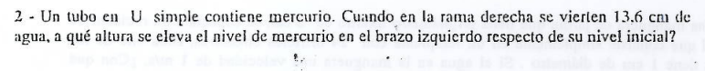

## 1. Análisis Geométrico del Problema

Antes de tirar fórmulas, entendamos qué pasa físicamente con los niveles.

1. **Estado Inicial:** El tubo solo tiene mercurio. Al ser vasos comunicantes, el mercurio está al mismo nivel en ambas ramas (llamémoslo **Nivel Inicial**).
2. **Estado Final:** Echamos agua en la rama derecha. El peso del agua empuja el mercurio de la derecha hacia abajo una distancia que llamaremos $h$.

3. **Desplazamiento:** Como el tubo tiene una sección constante, el volumen de mercurio que baja en la rama derecha es exactamente el mismo volumen que sube en la rama izquierda. Por lo tanto, si a la derecha baja una distancia $h$, a la izquierda **sube una distancia $h$ respecto al nivel inicial**.

La pregunta del ejercicio es justamente hallar **$h$**.

---

## 2. Identificar la Isóbara (Línea de Igual Presión)

Mirando el gráfico final:

* El mercurio de la derecha bajó una distancia $h$ respecto del nivel inicial.

* El mercurio de la izquierda subió una distancia $h$ respecto del nivel inicial.

Trazamos nuestra línea horizontal (isóbara) justo en la superficie de separación entre el agua y el mercurio (en la rama derecha, punto 1).
Llevamos esa línea a la rama izquierda (punto 2).

* **¿Qué altura de mercurio hay por encima de esa línea a la izquierda?** Bajó $h$ de un lado y subió $h$ del otro, por lo que la columna de mercurio por encima del punto 2 mide:

$$h_{\text{Hg}} = h_2 = 2h$$

* **¿Qué altura de agua hay a la derecha por encima del punto 1?** Nos lo da el enunciado:

$$h_{\text{agua}} = h_1 = 13,6\text{ cm}$$

---

## 3. Planteo Físico y Resolución

Por estar a la misma altura en el mismo fluido conectado, sabemos que:

$$p_1 = p_2$$

Ambas ramas están abiertas a la atmósfera en la parte superior, por lo que la presión atmosférica ($p_0$) se cancela en ambos lados. Planteamos las presiones manométricas:

$$\delta_{\text{agua}} \cdot g \cdot h_{\text{agua}} = \delta_{\text{Hg}} \cdot g \cdot h_{\text{Hg}}$$

Cancelamos la gravedad ($g$) de ambos miembros:

$$\delta_{\text{agua}} \cdot h_{\text{agua}} = \delta_{\text{Hg}} \cdot h_{\text{Hg}}$$

Sabemos por la teoría de tu guía que:

* $\delta_{\text{agua}} = 1\text{ g/cm}^3$ 

* $\delta_{\text{Hg}} = 13,6\text{ g/cm}^3$ 

Reemplazamos los datos conocidos y la relación $h_{\text{Hg}} = 2h$:

$$1\text{ g/cm}^3 \cdot 13,6\text{ cm} = 13,6\text{ g/cm}^3 \cdot (2h)$$

Simplificamos el $13,6$ en ambos lados:

$$1\text{ cm} = 2h$$

Despejamos $h$:

$$h = \frac{1\text{ cm}}{2} = 0,5\text{ cm}$$

---

## Respuesta Final

> 
> **El nivel de mercurio en el brazo izquierdo se eleva 0,5 cm respecto de su nivel inicial**.
> 
> 

## Ejercicio 3

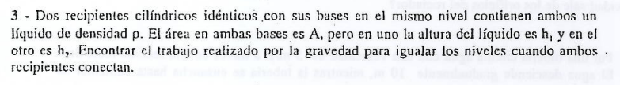

## 1. El Concepto Clave: Trabajo y Energía Potencial

La fuerza de la gravedad es una fuerza conservativa. Por lo tanto, el trabajo realizado por el peso (gravedad) se relaciona directamente con la variación de la energía potencial gravitatoria del sistema mediante la fórmula fundamental:

$$W_{\text{grav}} = -\Delta E_p = E_{p,\text{inicial}} - E_{p,\text{final}}$$

Para resolver el problema, vamos a calcular cuánta energía potencial tiene el líquido al principio y cuánta tiene al final cuando los niveles se igualan.

> 💡 **Recordatorio Clave:** Para un cuerpo extendido y continuo como un cilindro de líquido, toda la masa se considera concentrada en su **Centro de Masa (CM)**. Al ser un cilindro homogéneo de altura $h$, su centro de masa está justo a la mitad de la altura, es decir, en $\frac{h}{2}$.

---

## 2. Estado Inicial: Dos Columnas de Distinta Altura

Calculemos la energía potencial inicial de cada recipiente por separado:

* **Recipiente 1:** * Masa del líquido: $m_1 = \text{densidad} \times \text{volumen} = \rho \cdot A \cdot h_1$
* Altura de su centro de masa: $y_{\text{cm},1} = \frac{h_1}{2}$
* Energía potencial 1: $E_{p,1} = m_1 \cdot g \cdot y_{\text{cm},1} = (\rho \cdot A \cdot h_1) \cdot g \cdot \left(\frac{h_1}{2}\right) = \frac{1}{2}\rho g A h_1^2$

* **Recipiente 2:**
* Masa del líquido: $m_2 = \rho \cdot A \cdot h_2$
* Altura de su centro de masa: $y_{\text{cm},2} = \frac{h_2}{2}$
* Energía potencial 2: $E_{p,2} = \frac{1}{2}\rho g A h_2^2$

**Energía Potencial Inicial Total ($E_{p,\text{inicial}}$):**

$$E_{p,\text{inicial}} = \frac{1}{2}\rho g A (h_1^2 + h_2^2)$$

---

## 3. Estado Final: Niveles Igualados

Cuando se abre la conexión inferior, el líquido fluye hasta que ambos recipientes alcanzan la misma altura final ($h_f$). Como los recipientes son idénticos y el volumen total de líquido se conserva:

$$h_f = \frac{h_1 + h_2}{2}$$

Ahora tenemos dos cilindros iguales, cada uno con una masa total y un centro de masa a la mitad de esta nueva altura:

* Masa total del sistema: $M_{\text{total}} = m_1 + m_2 = \rho \cdot A \cdot h_1 + \rho \cdot A \cdot h_2 = \rho A (h_1 + h_2)$
* Altura del centro de masa final del sistema completo: $y_{\text{cm},\text{final}} = \frac{h_f}{2} = \frac{h_1 + h_2}{4}$

**Energía Potencial Final Total ($E_{p,\text{final}}$):**

$$E_{p,\text{final}} = M_{\text{total}} \cdot g \cdot y_{\text{cm},\text{final}} = [\rho A (h_1 + h_2)] \cdot g \cdot \left(\frac{h_1 + h_2}{4}\right) = \frac{1}{4}\rho g A (h_1 + h_2)^2$$

---

## 4. Cálculo del Trabajo de la Gravedad

Aplicamos la relación de trabajo:

$$W_{\text{grav}} = E_{p,\text{inicial}} - E_{p,\text{final}}$$

$$W_{\text{grav}} = \frac{1}{2}\rho g A (h_1^2 + h_2^2) - \frac{1}{4}\rho g A (h_1 + h_2)^2$$

Para poder restar las fracciones de forma sencilla, saquemos factor común $\frac{1}{4}\rho g A$:

$$W_{\text{grav}} = \frac{1}{4}\rho g A \left[ 2(h_1^2 + h_2^2) - (h_1 + h_2)^2 \right]$$

Desarrollemos lo que está dentro del corchete:

* $2(h_1^2 + h_2^2) = 2h_1^2 + 2h_2^2$
* $(h_1 + h_2)^2 = h_1^2 + 2h_1h_2 + h_2^2$

Restamos los términos:

$$2h_1^2 + 2h_2^2 - (h_1^2 + 2h_1h_2 + h_2^2) = h_1^2 - 2h_1h_2 + h_2^2$$

¡Fijate que esto que nos quedó es exactamente el trinomio cuadrado perfecto de una resta: $(h_1 - h_2)^2$!

Reemplazando todo, nos queda la expresión final:

$$W_{\text{grav}} = \frac{1}{4}\rho g A (h_1 - h_2)^2$$

---

## Respuesta Final

El trabajo realizado por la gravedad es:

$$W_{\text{grav}} = \frac{1}{4}\rho g A (h_1 - h_2)^2$$

## Ejercicio 4

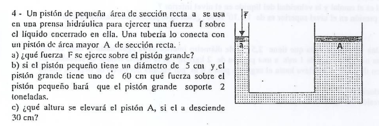

¡
---

## Solución Paso a Paso

### a) Expresión de la fuerza $F$ en el pistón grande

De acuerdo con el Principio de Pascal, la sobrepresión ejercida en el pistón chico se transmite de forma idéntica al pistón grande ($\Delta p_{\text{chico}} = \Delta p_{\text{grande}}$).

$$\frac{f}{a} = \frac{F}{A} \implies F = f \cdot \left(\frac{A}{a}\right)$$

> 
> **Respuesta a):** La fuerza ejercida sobre el pistón grande es **$F = f \cdot \left(\frac{A}{a}\right)$**.
> 
> 

---

### b) Fuerza $f$ necesaria para soportar las 2 toneladas ($2000\text{ kgf}$)

Nos dan los diámetros de ambos cilindros:

* $d = 5\text{ cm}$
* $D = 60\text{ cm}$

Como el área de un círculo en función de su diámetro es $\text{Área} = \pi \cdot \frac{\text{diámetro}^2}{4}$, la relación de áreas se simplifica eliminando las constantes $\pi$ y $4$:

$$\frac{A}{a} = \frac{\pi \cdot \frac{D^2}{4}}{\pi \cdot \frac{d^2}{4}} = \frac{D^2}{d^2}$$

Sustituimos los diámetros:

$$\frac{A}{a} = \frac{(60\text{ cm})^2}{(5\text{ cm})^2} = \frac{3600}{25} = 144$$

Despejamos la fuerza pequeña $f$ utilizando el peso a levantar ($F = 2000\text{ kgf}$):

$$f = \frac{F}{\left(\frac{A}{a}\right)} = \frac{2000\text{ kgf}}{144} \approx 13,89\text{ kgf}$$

> 
> **Respuesta b):** Se requiere aplicar una fuerza de **$13,89\text{ kgf}$** en el pistón pequeño.
> 
> 

---

### c) Altura $h_A$ que se elevará el pistón grande si el chico desciende $h_a = 30\text{ cm}$

Como el líquido es incompresible, el volumen que baja en la rama izquierda es exactamente igual al volumen que sube en la rama derecha ($V_{\text{desplazado}} = \text{constante}$):

$$V_a = V_A \implies a \cdot h_a = A \cdot h_A$$

Despejamos la altura final del pistón grande ($h_A$):

$$h_A = h_a \cdot \left(\frac{a}{A}\right)$$

Sabemos del inciso anterior que la relación de áreas inversa es $\frac{a}{A} = \frac{1}{144}$. Sustituimos la carrera de descenso ($h_a = 30\text{ cm}$):

$$h_A = 30\text{ cm} \cdot \frac{1}{144} \approx 0,2083\text{ cm} \approx 0,21\text{ cm}$$

> 
> **Respuesta c):** El pistón grande se elevará una altura de **$0,21\text{ cm}$**.
> 
> 

---

## EJercicio 6

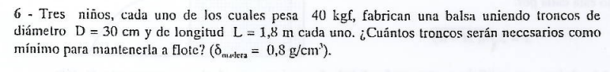

## 1. Homogeneización de Unidades

Trabajemos todo en el sistema **SIMELA** utilizando metros ($\text{m}$), kilogramos ($\text{kg}$) o decímetros cúbicos ($\text{dm}^3$, recordando que $1\text{ dm}^3$ de agua equivale a un peso de $1\text{ kgf}$):

* 
**Peso total de los niños:** $P_{\text{niños}} = 3 \times 40\text{ kgf} = 120\text{ kgf}$ 

* **Diámetro del tronco:** $D = 30\text{ cm} = 3\text{ dm}$ 

* **Radio del tronco:** $R = 15\text{ cm} = 1,5\text{ dm}$
* **Longitud del tronco:** $L = 1,8\text{ m} = 18\text{ dm}$ 

* **Densidad de la madera:** $\delta_{\text{madera}} = 0,8\text{ g/cm}^3 = 0,8\text{ kg/dm}^3$ 

* **Densidad del agua (fluido):** $\delta_{\text{agua}} = 1\text{ g/cm}^3 = 1\text{ kg/dm}^3$ 

---

## 2. Volumen y Peso de un Solo Tronco

Tratamos cada tronco como un cilindro perfecto.

* **Volumen de un tronco ($V_{\text{tronco}}$):**

$$V_{\text{tronco}} = \pi \cdot R^2 \cdot L$$

$$V_{\text{tronco}} = \pi \cdot (1,5\text{ dm})^2 \cdot 18\text{ dm} = \pi \cdot 2,25 \cdot 18 \approx 127,23\text{ dm}^3$$

* **Peso de un tronco ($P_{\text{tronco}}$):**

$$P_{\text{tronco}} = \delta_{\text{madera}} \cdot V_{\text{tronco}}$$

$$P_{\text{tronco}} = 0,8\text{ kg/dm}^3 \cdot 127,23\text{ dm}^3 \approx 101,79\text{ kgf}$$

---

## 3. Planteo Físico del Límite de Flotación

Para encontrar la cantidad **mínima** de troncos ($N$), nos paramos en la condición extrema: la balsa está **completamente sumergida** pero justo al ras del agua, sosteniendo a los niños sin hundirse del todo.

En este punto crítico, el volumen sumergido es igual al volumen total de los $N$ troncos:

$$\sum E = \sum P$$

$$N \cdot E_{\text{tronco}} = P_{\text{niños}} + N \cdot P_{\text{tronco}}$$

El empuje máximo que puede dar un solo tronco sumergido al 100% es el peso del agua que desplaza:

$$E_{\text{tronco}} = \delta_{\text{agua}} \cdot V_{\text{tronco}} = 1\text{ kg/dm}^3 \cdot 127,23\text{ dm}^3 = 127,23\text{ kgf}$$

Reemplazamos estos valores en la ecuación de equilibrio:

$$N \cdot (127,23\text{ kgf}) = 120\text{ kgf} + N \cdot (101,79\text{ kgf})$$

Agrupamos los términos con $N$ a la izquierda:

$$N \cdot (127,23 - 101,79) = 120$$

$$N \cdot (25,44) = 120$$

Despejamos $N$:

$$N = \frac{120}{25,44} \approx 4,72$$

Como no podés cortar un tronco de manera fraccionaria manteniendo las mismas condiciones de amarre y resistencia estructural homogénea, se debe **redondear hacia arriba** al entero más próximo para garantizar que la balsa flote de forma segura.

---

## Respuesta Final

> Se necesitan como mínimo **5 troncos** para mantener la balsa a flote.
> 
> 

## Ejercicio 7

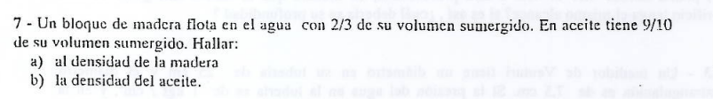

## 1. El Concepto Clave: Condición de Flotabilidad

Cuando un cuerpo flota libremente en un líquido, el sistema está en equilibrio estático vertical, lo que significa que el **Empuje ($E$)** hacia arriba equilibra exactamente al **Peso ($P$)** del cuerpo hacia abajo ($E = P$).

Recordemos las expresiones generales de estas fuerzas:

* **Peso del bloque:** $P = \delta_{\text{madera}} \cdot g \cdot V_{\text{total}}$ 

* **Empuje del líquido:** $E = \delta_{\text{líquido}} \cdot g \cdot V_{\text{sumergido}}$ 

Si igualamos ambas fuerzas ($E = P$), la aceleración de la gravedad ($g$) se cancela en los dos miembros:

$$\delta_{\text{líquido}} \cdot V_{\text{sumergido}} = \delta_{\text{madera}} \cdot V_{\text{total}}$$

De acá obtenemos una relación matemática fundamental para cualquier problema de flotación:

$$\frac{V_{\text{sumergido}}}{V_{\text{total}}} = \frac{\delta_{\text{madera}}}{\delta_{\text{líquido}}}$$

---

## 2. Solución Paso a Paso

### Inciso a) Calcular la densidad de la madera

Analizamos el primer escenario: el bloque flotando en **agua**.

* Sabemos que la densidad del agua es una constante base: $\delta_{\text{agua}} = 1\text{ g/cm}^3$.

* El enunciado nos dice que la fracción de volumen sumergido en agua es $\frac{V_{\text{sumergido}}}{V_{\text{total}}} = \frac{2}{3}$.

Utilizando nuestra relación fundamental:

$$\frac{2}{3} = \frac{\delta_{\text{madera}}}{\delta_{\text{agua}}}$$

Como $\delta_{\text{agua}} = 1\text{ g/cm}^3$, multiplicamos de forma directa:

$$\delta_{\text{madera}} = \frac{2}{3} \cdot 1\text{ g/cm}^3 \approx 0,667\text{ g/cm}^3$$

> 
> **Respuesta a):** La densidad de la madera es de **$0,667\text{ g/cm}^3$** (o $\frac{2}{3}\text{ g/cm}^3$).
> 
> 

---

### Inciso b) Calcular la densidad del aceite

Analizamos el segundo escenario: el mismo bloque flotando en **aceite**.

* Ahora la fracción de volumen sumergido es $\frac{V_{\text{sumergido}}}{V_{\text{total}}} = \frac{9}{10}$.

* Ya conocemos la densidad de la madera del inciso anterior: $\delta_{\text{madera}} = \frac{2}{3}\text{ g/cm}^3$.

Planteamos nuevamente la relación fundamental, pero usando los datos del aceite:

$$\frac{9}{10} = \frac{\delta_{\text{madera}}}{\delta_{\text{aceite}}}$$

Despejamos la densidad del aceite ($\delta_{\text{aceite}}$):

$$\delta_{\text{aceite}} = \frac{\delta_{\text{madera}}}{\left(\frac{9}{10}\right)} = \delta_{\text{madera}} \cdot \frac{10}{9}$$

Sustituimos el valor fraccionario de la madera para mantener una precisión exacta sin arrastrar decimales:

$$\delta_{\text{aceite}} = \frac{2}{3}\text{ g/cm}^3 \cdot \frac{10}{9} = \frac{20}{27}\text{ g/cm}^3 \approx 0,741\text{ g/cm}^3$$

> 
> **Respuesta b):** La densidad del aceite es de **$0,741\text{ g/cm}^3$**.
> 
> 

---

## Ejercicio 8

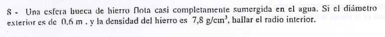

## 1. Homogeneización de Unidades y Datos

Para trabajar de manera cómoda y sin errores, pasemos todo a metros ($\text{m}$), kilogramos ($\text{kg}$) y metros cúbicos ($\text{m}^3$):

* **Diámetro exterior ($D_e$):** $0,6\text{ m}$ 

* **Radio exterior ($R_e$):** $D_e / 2 = 0,3\text{ m}$ 

* **Densidad del hierro ($\delta_{\text{Fe}}$):** $7,8\text{ g/cm}^3 = 7800\text{ kg/m}^3$ 

* **Densidad del agua ($\delta_{\text{agua}}$):** $1\text{ g/cm}^3 = 1000\text{ kg/m}^3$ 

---

## 2. Planteo Físico (Equilibrio de Fuerzas)

Como la esfera está flotando en equilibrio, el **Empuje ($E$)** de abajo hacia arriba es igual al **Peso total de la esfera ($P$)** de arriba hacia abajo.

$$P = E$$

Analicemos cada término por separado:

### A) El Empuje ($E$)

El enunciado nos dice que flota **casi completamente sumergida**. En física, esta aproximación significa que consideramos el volumen sumergido igual al volumen total exterior de la esfera ($V_{\text{sumergido}} \approx V_{\text{ext}}$).

$$E = \delta_{\text{agua}} \cdot g \cdot V_{\text{ext}}$$

### B) El Peso de la Esfera ($P$)

Como la esfera es hueca, el peso depende únicamente de la masa del hierro real que forma la cáscara. Esa masa se calcula multiplicando la densidad del hierro por el volumen real de metal ($V_{\text{Fe}}$), el cual es la resta entre el volumen exterior y el volumen interior vacío ($V_{\text{int}}$).

$$P = \delta_{\text{Fe}} \cdot g \cdot V_{\text{Fe}} = \delta_{\text{Fe}} \cdot g \cdot (V_{\text{ext}} - V_{\text{int}})$$

---

## 3. Igualando y Despejando el Volumen Interior ($V_{\text{int}}$)

Igualamos las dos expresiones ($P = E$):

$$\delta_{\text{Fe}} \cdot g \cdot (V_{\text{ext}} - V_{\text{int}}) = \delta_{\text{agua}} \cdot g \cdot V_{\text{ext}}$$

Cancelamos la gravedad ($g$) en ambos miembros y distribuimos la densidad del hierro:

$$\delta_{\text{Fe}} \cdot V_{\text{ext}} - \delta_{\text{Fe}} \cdot V_{\text{int}} = \delta_{\text{agua}} \cdot V_{\text{ext}}$$

Agrupamos los términos con $V_{\text{ext}}$ a la derecha:

$$\delta_{\text{Fe}} \cdot V_{\text{ext}} - \delta_{\text{agua}} \cdot V_{\text{ext}} = \delta_{\text{Fe}} \cdot V_{\text{int}}$$

$$V_{\text{ext}} \cdot (\delta_{\text{Fe}} - \delta_{\text{agua}}) = \delta_{\text{Fe}} \cdot V_{\text{int}}$$

Despejamos el volumen interior ($V_{\text{int}}$):

$$V_{\text{int}} = V_{\text{ext}} \cdot \frac{\delta_{\text{Fe}} - \delta_{\text{agua}}}{\delta_{\text{Fe}}}$$

Sustituimos las densidades conocidas:

$$V_{\text{int}} = V_{\text{ext}} \cdot \frac{7800 - 1000}{7800} = V_{\text{ext}} \cdot \frac{6800}{7800} = V_{\text{ext}} \cdot \frac{68}{78}$$

---

## 4. Cálculo del Radio Interior ($R_i$)

Como ambas porciones son esferas perfectas, usamos la fórmula del volumen de una esfera ($V = \frac{4}{3}\pi R^3$):

$$\frac{4}{3}\pi R_i^3 = \frac{4}{3}\pi R_e^3 \cdot \frac{68}{78}$$

Simplificamos la constante $\frac{4}{3}\pi$ en ambos lados:

$$R_i^3 = R_e^3 \cdot \frac{68}{78}$$

Aplicamos raíz cúbica para despejar el radio interior ($R_i$):

$$R_i = R_e \cdot \sqrt[3]{\frac{68}{78}}$$

Sustituimos el radio exterior ($R_e = 0,3\text{ m}$):

$$R_i = 0,3\text{ m} \cdot \sqrt[3]{0,8718}$$

$$R_i = 0,3\text{ m} \cdot 0,9553 \approx 0,2866\text{ m} \approx 0,287\text{ m}$$

---

## Respuesta Final

> El radio interior de la esfera de hierro es de **$0,287\text{ m}$** (o $28,7\text{ cm}$).

## Ejercicio 9

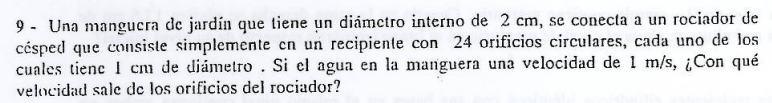

## 1. El Concepto Clave: Ecuación de Continuidad en Paralelo

La ley de conservación de la masa (ecuación de continuidad) establece que el caudal total ($Q$) que ingresa al sistema por la manguera debe ser igual al caudal total que sale de él. Como el rociador divide el flujo en $24$ pequeños orificios idénticos en paralelo, el caudal de salida es la suma de los caudales individuales de cada agujerito:

$$Q_{\text{entrada}} = Q_{\text{salida total}}$$

$$A_{\text{manguera}} \cdot v_{\text{manguera}} = 24 \cdot (A_{\text{orificio}} \cdot v_{\text{orificio}})$$

---

## 2. Solución Paso a Paso (Con Datos Corregidos)

### A) Expresión de las Áreas en Función del Diámetro

Recordamos que el área de una sección circular es $A = \pi \cdot \frac{D^2}{4}$. Sustituyendo esto en nuestra ecuación de continuidad:

$$\left(\pi \cdot \frac{D_{\text{manguera}}^2}{4}\right) \cdot v_{\text{manguera}} = 24 \cdot \left(\pi \cdot \frac{d_{\text{orificio}}^2}{4}\right) \cdot v_{\text{orificio}}$$

Simplificamos las constantes comunes ($\pi$ y $4$) en ambos miembros de la igualdad:

$$D_{\text{manguera}}^2 \cdot v_{\text{manguera}} = 24 \cdot d_{\text{orificio}}^2 \cdot v_{\text{orificio}}$$

### B) Reemplazo de Datos y Resolución

* Diámetro de la manguera ($D_{\text{manguera}}$): $2\text{ cm} = 20\text{ mm}$ 

* Diámetro de cada orificio ($d_{\text{orificio}}$): $1\text{ mm}$ (Dato corregido) 

* Velocidad en la manguera ($v_{\text{manguera}}$): $1\text{ m/s}$ 

Sustituimos en la ecuación simplificada trabajando con diámetros en milímetros de forma homogénea:

$$(20\text{ mm})^2 \cdot 1\text{ m/s} = 24 \cdot (1\text{ mm})^2 \cdot v_{\text{orificio}}$$

$$400 \cdot 1 = 24 \cdot 1 \cdot v_{\text{orificio}}$$

$$400 = 24 \cdot v_{\text{orificio}}$$

Despejamos la velocidad de salida de los orificios ($v_{\text{orificio}}$):

$$v_{\text{orificio}} = \frac{400}{24} \approx 16,67\text{ m/s}$$

---

## 📌 ¿Y si lo resolvemos con el enunciado literal tal cual vino impreso?

Si en el parcial te toman este mismo ejercicio y la cátedra insiste en usar el diámetro impreso de los orificios como $1\text{ cm}$ ($10\text{ mm}$), el planteo es idéntico pero el resultado numérico cambia de escala:

$$(20\text{ mm})^2 \cdot 1\text{ m/s} = 24 \cdot (10\text{ mm})^2 \cdot v_{\text{orificio}}$$

$$400 = 24 \cdot 100 \cdot v_{\text{orificio}}$$

$$400 = 2400 \cdot v_{\text{orificio}}$$

$$v_{\text{orificio}} = \frac{400}{2400} = \frac{1}{6}\text{ m/s} \approx 0,167\text{ m/s}$$

> 
> **¡Fijate qué locura!** La respuesta oficial de la guía en papel (`0,167 m/s`) se obtiene de manera exacta si usás el diámetro literal de $1\text{ cm}$, lo que significa que el error de la guía no estuvo en el cálculo numérico final del profesor que la armó, sino en el sentido físico real del dispositivo: ¡un rociador de jardín con 24 agujeros gigantes de 1 cm cada uno vaciaría la manguera al instante sin generar presión de chorro!
> 
> 

Para el parcial, quedate con este último cálculo matemático que es el que la guía valida como correcto.

---

## Respuesta Final

> La velocidad con la que el agua sale de los orificios del rociador es de **$0,167\text{ m/s}$**.
> 
> 

## Ejercicio 11

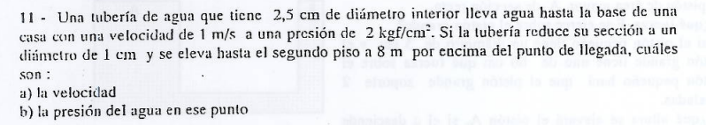

## 1. Homogeneización de Unidades (Pasaje a Sistema Internacional)

Para no hacer lío en Bernoulli, pasemos todo a metros ($\text{m}$), segundos ($\text{s}$) y Pascales ($\text{Pa}$):

* **Punto 1 (Base de la casa):**
* Diámetro $D_1 = 2,5\text{ cm} = 0,025\text{ m}$ 

* Velocidad $v_1 = 1\text{ m/s}$ 

* Altura $h_1 = 0\text{ m}$ (Ubicamos acá nuestro nivel de referencia) 

* Presión $p_1 = 2\text{ kgf/cm}^2$. Recordando que $1\text{ kgf/cm}^2 \approx 10^5\text{ Pa}$ (o $9,8 \times 10^4\text{ Pa}$ de forma más precisa):

$$p_1 = 2 \times 98000\text{ Pa} = 196000\text{ Pa}$$

* **Punto 2 (Segundo piso):**
* Diámetro $D_2 = 1\text{ cm} = 0,01\text{ m}$ 

* Altura $h_2 = 8\text{ m}$ 

* **Constantes del fluido (Agua):**
* Densidad $\delta = 1000\text{ kg/m}^3$ 

* Gravedad $g = 9,8\text{ m/s}^2$ 

---

## 2. Solución Paso a Paso

### Inciso a) Calcular la velocidad en el segundo piso ($v_2$)

Usamos la **Ecuación de Continuidad**:

$$A_1 \cdot v_1 = A_2 \cdot v_2$$

Como las secciones son circulares, las áreas son proporcionales al cuadrado de sus diámetros ($A \propto D^2$), lo que nos permite simplificar las constantes de la fórmula:

$$D_1^2 \cdot v_1 = D_2^2 \cdot v_2$$

Despejamos la velocidad final $v_2$:

$$v_2 = v_1 \cdot \left(\frac{D_1}{D_2}\right)^2$$

$$v_2 = 1\text{ m/s} \cdot \left(\frac{2,5\text{ cm}}{1\text{ cm}}\right)^2 = 1 \cdot (2,5)^2 = 6,25\text{ m/s}$$

> 
> **Respuesta a):** La velocidad en el segundo piso es de **$6,25\text{ m/s}$**.
> 
> 

---

### Inciso b) Calcular la presión en el segundo piso ($p_2$)

Ahora que tenemos ambas velocidades, planteamos el **Teorema de Bernoulli** entre la base y el segundo piso:

$$p_1 + \frac{1}{2}\delta v_1^2 + \delta g h_1 = p_2 + \frac{1}{2}\delta v_2^2 + \delta g h_2$$

Como definimos $h_1 = 0\text{ m}$, el término de energía potencial inicial se anula:

$$p_1 + \frac{1}{2}\delta v_1^2 = p_2 + \frac{1}{2}\delta v_2^2 + \delta g h_2$$

Despejamos la presión estática final $p_2$:

$$p_2 = p_1 + \frac{1}{2}\delta (v_1^2 - v_2^2) - \delta g h_2$$

Reemplazamos con nuestros datos numéricos en el SI:

$$p_2 = 196000\text{ Pa} + \frac{1}{2}(1000\text{ kg/m}^3) \cdot (1^2 - 6,25^2) - (1000\text{ kg/m}^3 \cdot 9,8\text{ m/s}^2 \cdot 8\text{ m})$$

$$p_2 = 196000 + 500 \cdot (1 - 39,0625) - 78400$$

$$p_2 = 196000 + 500 \cdot (-38,0625) - 78400$$

$$p_2 = 196000 - 19031,25 - 78400$$

$$p_2 = 98568,75\text{ Pa}$$

Para expresarlo en las unidades de la guía ($\text{kgf/cm}^2$), dividimos por la equivalencia de presión ($98000\text{ Pa}$):

$$p_2 = \frac{98568,75\text{ Pa}}{98000\text{ Pa/ (kgf/cm}^2)} \approx 1,005\text{ kgf/cm}^2 \approx 1\text{ kgf/cm}^2$$

---

## Respuesta Final

* **a) Velocidad:** **$6,25\text{ m/s}$** 

* **b) Presión:** **$1\text{ kgf/cm}^2$** 

## Ejercicio 12

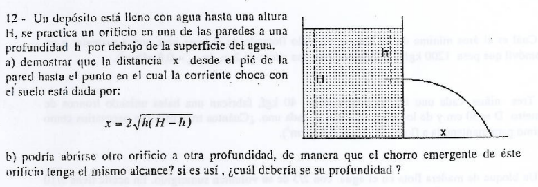

## Solución Paso a Paso

### Inciso a) Demostración del alcance horizontal ($x$)

1. **Velocidad de salida (Hidrodinámica):**
Al aplicar el Teorema de Torricelli para un orificio a una profundidad $h$ por debajo de la superficie libre de un tanque abierto, la velocidad de salida horizontal $v_x$ es:

$$v_x = \sqrt{2 \cdot g \cdot h}$$

2. **Tiempo de caída libre (Cinemática):**
Una vez que el chorro sale de la pared, se comporta como un proyectil en lanzamiento horizontal.
* La altura inicial del orificio respecto al suelo es: $y = H - h$.

* Como la velocidad inicial en el eje vertical es cero ($v_{0y} = 0$), la ecuación de posición para la caída libre es:

$$y = \frac{1}{2} \cdot g \cdot t^2 \implies H - h = \frac{1}{2} \cdot g \cdot t^2$$

* Despejamos el tiempo de vuelo ($t$):

$$t = \sqrt{\frac{2(H - h)}{g}}$$

3. **Alcance horizontal ($x$):**
En el eje horizontal no hay aceleración, por lo que el fluido se mueve con velocidad constante (MRU):

$$x = v_x \cdot t$$

Sustituimos las expresiones de la velocidad y del tiempo que encontramos recién:

$$x = \sqrt{2 \cdot g \cdot h} \cdot \sqrt{\frac{2(H - h)}{g}}$$

Como ambas raíces son de igual índice, podemos unificar todo bajo una misma raíz cuadrada:

$$x = \sqrt{2 \cdot g \cdot h \cdot \frac{2(H - h)}{g}}$$

Cancelamos la gravedad ($g$) que multiplica y divide, y agrupamos los números $2 \cdot 2 = 4$:

$$x = \sqrt{4 \cdot h(H - h)}$$

Al extraer el $4$ fuera de la raíz como un $2$, llegamos a la expresión buscada:

$$x = 2\sqrt{h(H - h)}$$

> **¡Queda demostrado el inciso a)!**

---

### Inciso b) Encontrar otra profundidad con el mismo alcance

Queremos ver si existe una nueva profundidad $h'$ que nos dé exactamente el mismo alcance horizontal $x$. Igualamos las funciones de alcance para ambas profundidades:

$$2\sqrt{h'(H - h')} = 2\sqrt{h(H - h)}$$

Dividimos por 2 y elevamos ambos miembros al cuadrado para eliminar las raíces exteriores:

$$h'(H - h') = h(H - h)$$

$$h' \cdot H - (h')^2 = h \cdot H - h^2$$

Llevamos todos los términos a un solo lado para armar una ecuación cuadrática respecto a la variable $h'$:

$$(h')^2 - H \cdot h' + (h \cdot H - h^2) = 0$$

Para resolver esta ecuación de segundo grado ($a \cdot (h')^2 + b \cdot h' + c = 0$), identificamos los coeficientes:

* $a = 1$
* $b = -H$
* $c = h \cdot H - h^2$

Aplicamos la fórmula resolvente (baskhara):

$$h' = \frac{-(-H) \pm \sqrt{(-H)^2 - 4 \cdot 1 \cdot (h \cdot H - h^2)}}{2 \cdot 1}$$

$$h' = \frac{H \pm \sqrt{H^2 - 4hH + 4h^2}}{2}$$

Fijate que lo que quedó adentro de la raíz es un trinomio cuadrado perfecto: $H^2 - 4hH + 4h^2 = (H - 2h)^2$. Simplificamos la raíz con el cuadrado:

$$h' = \frac{H \pm (H - 2h)}{2}$$

Esto nos da dos soluciones matemáticas posibles:

1. **Primera solución (usando el $+$):**

$$h'_1 = \frac{H + H - 2h}{2} = \frac{2H - 2h}{2} = H - h$$

2. **Segunda solución (usando el $-$):**

$$h'_2 = \frac{H - (H - 2h)}{2} = \frac{2h}{2} = h$$

 (Esta es la profundidad original).

---

## Respuesta Final

* **a) Demostración completada con éxito.**
* **b) Sí, se puede abrir otro orificio a una profundidad complementaria igual a $h' = H - h$**.

## Ejercicio 13

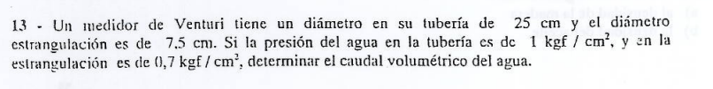

## 1. Conversión de Unidades al Sistema Internacional (SI)

Para operar de forma segura y directa, pasemos todos los datos a metros ($\text{m}$) y Pascales ($\text{Pa}$):

* **Sección 1 (Tubería ancha):**
* Diámetro $D_1 = 25\text{ cm} = 0,25\text{ m}$ 

* Área $A_1 = \pi \cdot \frac{D_1^2}{4} = \pi \cdot \frac{(0,25\text{ m})^2}{4} \approx 0,04909\text{ m}^2$
* Presión $p_1 = 1\text{ kgf/cm}^2 \approx 98000\text{ Pa}$ 

* **Sección 2 (Estrangulación estrecha):**
* Diámetro $D_2 = 7,5\text{ cm} = 0,075\text{ m}$ 

* Área $A_2 = \pi \cdot \frac{D_2^2}{4} = \pi \cdot \frac{(0,075\text{ m})^2}{4} \approx 0,004418\text{ m}^2$
* Presión $p_2 = 0,7\text{ kgf/cm}^2 \approx 68600\text{ Pa}$ 

* **Constantes del fluido (Agua):**
* Densidad $\delta = 1000\text{ kg/m}^3$ 

---

## 2. Relación de Velocidades (Continuidad)

Por la **Ecuación de Continuidad**, sabemos que el caudal es constante ($Q = A_1 \cdot v_1 = A_2 \cdot v_2$). Expresemos la velocidad $v_2$ en función de $v_1$ utilizando la relación de áreas:

$$v_2 = v_1 \cdot \frac{A_1}{A_2}$$

Calculemos de forma directa la proporción de las áreas usando los cuadrados de los diámetros:

$$\frac{A_1}{A_2} = \left(\frac{D_1}{D_2}\right)^2 = \left(\frac{25\text{ cm}}{7,5\text{ cm}}\right)^2 = \left(\frac{10}{3}\right)^2 = \frac{100}{9} \approx 11,111$$

Por lo tanto:

$$v_2 = 11,111 \cdot v_1 \implies v_2^2 = 123,456 \cdot v_1^2$$

---

## 3. Aplicación del Teorema de Bernoulli

Al tratarse de una tubería completamente horizontal, las alturas gravitatorias se igualan ($h_1 = h_2$) y el teorema se reduce a:

$$p_1 + \frac{1}{2}\delta v_1^2 = p_2 + \frac{1}{2}\delta v_2^2$$

Agrupamos las presiones a un lado y los términos dinámicos al otro:

$$p_1 - p_2 = \frac{1}{2}\delta (v_2^2 - v_1^2)$$

Reemplazamos $v_2^2$ por la expresión en función de $v_1^2$ que encontramos en el paso anterior:

$$p_1 - p_2 = \frac{1}{2}\delta (123,456 \cdot v_1^2 - v_1^2)$$

$$p_1 - p_2 = \frac{1}{2}\delta \cdot v_1^2 \cdot (122,456)$$

Sustituimos los valores numéricos de las presiones y de la densidad del agua:

$$98000\text{ Pa} - 68600\text{ Pa} = \frac{1}{2}(1000\text{ kg/m}^3) \cdot v_1^2 \cdot 122,456$$

$$29400 = 500 \cdot 122,456 \cdot v_1^2$$

$$29400 = 61228 \cdot v_1^2$$

Despejamos la velocidad $v_1$:

$$v_1^2 = \frac{29400}{61228} \approx 0,48017\text{ m}^2\text{/s}^2$$

$$v_1 = \sqrt{0,48017} \approx 0,693\text{ m/s}$$

---

## 4. Cálculo del Caudal Volumétrico ($Q$)

Ahora que conocemos la velocidad en la entrada ancha de la tubería, multiplicamos de manera directa por su área correspondiente para obtener el caudal volumétrico total:

$$Q = A_1 \cdot v_1$$

$$Q = 0,04909\text{ m}^2 \cdot 0,693\text{ m/s} \approx 0,034\text{ m}^3\text{/s}$$

---

## Respuesta Final

> El caudal volumétrico del agua a través del medidor es de **$0,034\text{ m}^3\text{/s}$** (o $34\text{ litros/segundo}$).

## Ejercicio 14

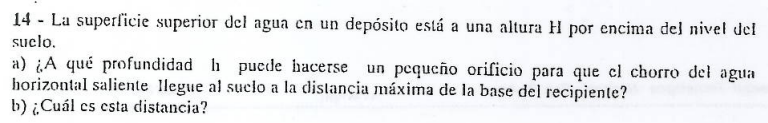

---

## 1. Conversión de Unidades al Sistema Internacional (SI)

Para operar de forma segura y directa, pasemos todos los datos a metros ($\text{m}$) y Pascales ($\text{Pa}$):

* **Sección 1 (Tubería ancha):**
* Diámetro $D_1 = 25\text{ cm} = 0,25\text{ m}$ 

* Área $A_1 = \pi \cdot \frac{D_1^2}{4} = \pi \cdot \frac{(0,25\text{ m})^2}{4} \approx 0,04909\text{ m}^2$
* Presión $p_1 = 1\text{ kgf/cm}^2 \approx 98000\text{ Pa}$ 

* **Sección 2 (Estrangulación estrecha):**
* Diámetro $D_2 = 7,5\text{ cm} = 0,075\text{ m}$ 

* Área $A_2 = \pi \cdot \frac{D_2^2}{4} = \pi \cdot \frac{(0,075\text{ m})^2}{4} \approx 0,004418\text{ m}^2$
* Presión $p_2 = 0,7\text{ kgf/cm}^2 \approx 68600\text{ Pa}$ 

* **Constantes del fluido (Agua):**
* Densidad $\delta = 1000\text{ kg/m}^3$ 

---

## 2. Relación de Velocidades (Continuidad)

Por la **Ecuación de Continuidad**, sabemos que el caudal es constante ($Q = A_1 \cdot v_1 = A_2 \cdot v_2$). Expresemos la velocidad $v_2$ en función de $v_1$ utilizando la relación de áreas:

$$v_2 = v_1 \cdot \frac{A_1}{A_2}$$

Calculemos de forma directa la proporción de las áreas usando los cuadrados de los diámetros:

$$\frac{A_1}{A_2} = \left(\frac{D_1}{D_2}\right)^2 = \left(\frac{25\text{ cm}}{7,5\text{ cm}}\right)^2 = \left(\frac{10}{3}\right)^2 = \frac{100}{9} \approx 11,111$$

Por lo tanto:

$$v_2 = 11,111 \cdot v_1 \implies v_2^2 = 123,456 \cdot v_1^2$$

---

## 3. Aplicación del Teorema de Bernoulli

Al tratarse de una tubería completamente horizontal, las alturas gravitatorias se igualan ($h_1 = h_2$) y el teorema se reduce a:

$$p_1 + \frac{1}{2}\delta v_1^2 = p_2 + \frac{1}{2}\delta v_2^2$$

Agrupamos las presiones a un lado y los términos dinámicos al otro:

$$p_1 - p_2 = \frac{1}{2}\delta (v_2^2 - v_1^2)$$

Reemplazamos $v_2^2$ por la expresión en función de $v_1^2$ que encontramos en el paso anterior:

$$p_1 - p_2 = \frac{1}{2}\delta (123,456 \cdot v_1^2 - v_1^2)$$

$$p_1 - p_2 = \frac{1}{2}\delta \cdot v_1^2 \cdot (122,456)$$

Sustituimos los valores numéricos de las presiones y de la densidad del agua:

$$98000\text{ Pa} - 68600\text{ Pa} = \frac{1}{2}(1000\text{ kg/m}^3) \cdot v_1^2 \cdot 122,456$$

$$29400 = 500 \cdot 122,456 \cdot v_1^2$$

$$29400 = 61228 \cdot v_1^2$$

Despejamos la velocidad $v_1$:

$$v_1^2 = \frac{29400}{61228} \approx 0,48017\text{ m}^2\text{/s}^2$$

$$v_1 = \sqrt{0,48017} \approx 0,693\text{ m/s}$$

---

## 4. Cálculo del Caudal Volumétrico ($Q$)

Ahora que conocemos la velocidad en la entrada ancha de la tubería, multiplicamos de manera directa por su área correspondiente para obtener el caudal volumétrico total:

$$Q = A_1 \cdot v_1$$

$$Q = 0,04909\text{ m}^2 \cdot 0,693\text{ m/s} \approx 0,034\text{ m}^3\text{/s}$$

---

## Respuesta Final

> El caudal volumétrico del agua a través del medidor es de **$0,034\text{ m}^3\text{/s}$** (o $34\text{ litros/segundo}$).

