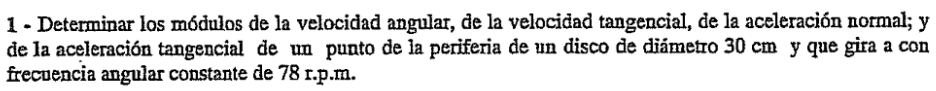
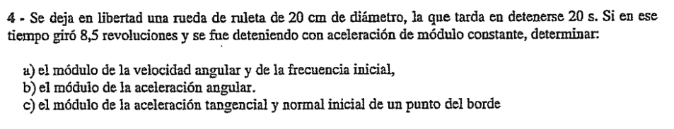
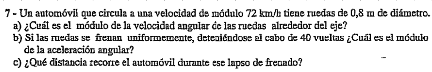
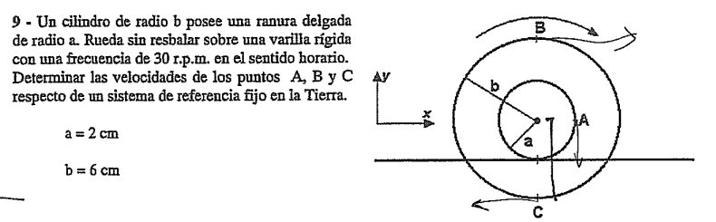
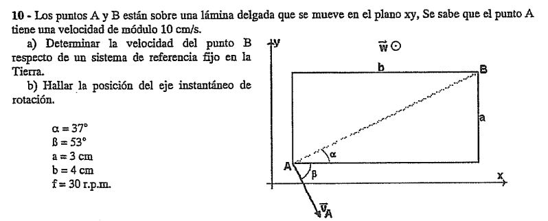

## 1. El Concepto de Rigidez y su Restricción Cinemática

Un **Cuerpo Rígido** ideal es un sistema de infinitos puntos materiales donde la distancia entre dos puntos cualesquiera $A$ y $B$ permanece completamente invariable a lo largo del tiempo, sin importar qué fuerzas actúen sobre él:

$$|\vec{r}_B - \vec{r}_A| = d(A,B) = \text{cte.}$$

### La Condición Cinemática de Rigidez

Si derivamos esta restricción respecto al tiempo, obtenemos una condición fundamental para las velocidades. Si la distancia es constante, el cuerpo no puede estirarse ni comprimirse. Por lo tanto, **las velocidades de los puntos $A$ y $B$ proyectadas sobre la recta que los une deben ser exactamente iguales**.

Matemáticamente se expresa mediante el producto escalar con el versor director $\hat{u}_{AB}$ que apunta de $A$ hacia $B$:

$$\vec{v}_A \cdot \hat{u}_{AB} = \vec{v}_B \cdot \hat{u}_{AB}$$

> 💡 **En el examen:** Si te dan la velocidad de un punto $A$ y la dirección de la velocidad de un punto $B$, esta proyección escalar es la primera herramienta que debés usar para despejar la incógnita antes de plantear ecuaciones más complejas.

---

## 2. Movimientos Cinemáticos Básicos

Un rígido en el espacio bidimensional (movimiento plano) puede realizar tres tipos de movimientos:

1. **Traslación Pura:** Todos los puntos del cuerpo tienen, en cada instante, el mismo vector velocidad y el mismo vector aceleración. Las trayectorias de todos los puntos son idénticas (pueden ser rectilíneas o curvilíneas).

2. **Rotación Pura:** Existe una línea de puntos que permanece inmóvil (el eje de rotación). Todos los demás puntos describen trayectorias circulares concéntricas alrededor de ese eje.

3. **Rototraslación (Movimiento Plano General):** El cuerpo se traslada y rota simultáneamente. Es el caso de un disco rodando por un plano.

---

## 3. Rotación Pura y el Vector Velocidad Angular ($\vec{\omega}$)

Cuando un cuerpo rota alrededor de un eje fijo, introducimos una variable termodinámica/cinemática colectiva: la **velocidad angular ($\vec{\omega}$)**. A diferencia de la velocidad lineal, $\vec{\omega}$ es una propiedad de **todo el cuerpo**: todos los puntos del rígido giran con la misma velocidad angular en un instante dado.

### El Carácter Vectorial de $\vec{\omega}$

La velocidad angular es un vector axial (o pseudovector).

* **Módulo:** $\omega = \frac{d\theta}{dt}$, medido en $[\text{rad/s}]$ o $[\text{s}^{-1}]$.

* **Dirección:** Es perpendicular al plano de rotación (coincide con el eje de giro).

* **Sentido:** Determinado por la **Regla de la Mano Derecha** : si enroscás los dedos de tu mano derecha en el sentido del giro, tu pulgar extendido indicará la dirección y sentido del vector $\vec{\omega}$.

### Velocidad Tangencial de un Punto ($\vec{v}_p$)

Para encontrar el vector velocidad lineal de un punto específico $P$ situado a un vector posición $\vec{r}$ del eje, usamos el producto vectorial:

$$\vec{v}_p = \vec{\omega} \times \vec{r}$$

* El módulo es simplemente: $v_t = \omega \cdot R$ (donde $R$ es la distancia perpendicular del punto al eje).

* El vector $\vec{v}_p$ es siempre **tangente a la trayectoria circular** y perpendicular tanto a $\vec{\omega}$ como a $\vec{r}$.

---

## 4. El Campo de Aceleraciones en Rotación Pura

Si queremos estudiar cómo cambia la velocidad de ese punto $P$ en el tiempo, debemos derivar el producto vectorial respecto al tiempo:

$$\vec{a}_p = \frac{d\vec{v}_p}{dt} = \frac{d}{dt}(\vec{\omega} \times \vec{r}) = \left(\frac{d\vec{\omega}}{dt} \times \vec{r}\right) + \left(\vec{\omega} \times \frac{d\vec{r}}{dt}\right)$$

Sabiendo que $\frac{d\vec{\omega}}{dt} = \vec{\gamma}$ (aceleración angular) y que $\frac{d\vec{r}}{dt} = \vec{v}_p$ , la ecuación se transforma en la suma de dos componentes intrínsecas fundamentales:

$$\vec{a}_p = \vec{a}_t + \vec{a}_c$$

Donde:

* **$\vec{a}_t = \vec{\gamma} \times \vec{r}$ (Aceleración Tangencial):** Es la componente responsable de cambiar el **módulo** de la velocidad lineal. Su módulo es $a_t = \gamma \cdot R$. Si el cuerpo gira a velocidad angular constante ($\omega = \text{cte.}$), entonces $\vec{\gamma} = 0$ y la aceleración tangencial se anula automáticamente ($a_t = 0$).

* **$\vec{a}_c = \vec{\omega} \times \vec{v}_p$ (Aceleración Centripeta o Normal):** Es la componente responsable de cambiar la **dirección** del vector velocidad para obligar al punto a seguir una trayectoria curva. Apunta siempre hacia el centro de la trayectoria (el eje). Su módulo se puede calcular de tres maneras equivalentes:

$$a_c = \omega^2 \cdot R = \frac{v_t^2}{R} = \omega \cdot v_t$$

---

## 5. Modelos Cinematográficos Angulares

Dependiendo de cómo se comporte $\vec{\gamma}$, tenemos los dos modelos típicos de parcial:

A. Movimiento Circular Uniforme (MCU) 

* $\vec{\gamma} = 0 \implies \omega = \text{cte.}$ 

* La posición angular varía linealmente: $\theta(t) = \theta_0 + \omega t$.

* **Ojo en el parcial:** La aceleración total **NO** es cero; tiene aceleración centrípeta ($a_c \neq 0$) pero su aceleración tangencial es nula ($a_t = 0$).

B. Movimiento Circular Uniformemente Variado (MCUV) 

* $\vec{\gamma} = \text{cte.}$ 

* Las ecuaciones cinemáticas angulares son análogas a las de un MRUV lineal:

1. $\omega(t) = \omega_0 + \gamma t$ 

2. $\theta(t) = \theta_0 + \omega_0 t + \frac{1}{2}\gamma t^2$ 

3. $\omega_f^2 = \omega_0^2 + 2\gamma\Delta\theta$ 

> ⚠️ **Conversión de Unidades Crítica:** En la UTN te van a dar casi siempre la frecuencia en revoluciones por minuto ($\text{r.p.m.}$). Para usar las ecuaciones cinemáticas, tenés que pasarla sí o sí a radianes por segundo ($\text{rad/s}$) usando:
> 
> 
> 
> $$\omega = 2\pi \cdot f = 2\pi \cdot \left(\frac{\text{r.p.m.}}{60}\right)$$
> 
> 
> 
> 
> 

---

## 1. El Campo de Velocidades en la Rototraslación

Cuando un cuerpo rígido realiza un movimiento plano general, combina simultáneamente una traslación y una rotación. Para encontrar la velocidad de un punto cualquiera $P$ del cuerpo, usamos la **Ecuación Fundamental del Campo de Velocidades**:

$$\vec{v}_P = \vec{v}_{O'} + \vec{\omega} \times \vec{r}_{P/O'}$$

Donde:

* $\vec{v}_P$: Es la velocidad absoluta del punto $P$.
* $\vec{v}_{O'}$: Es la velocidad absoluta de un punto de referencia $O'$ del mismo cuerpo (suele elegirse el centro de masa $CM$ o el eje de un disco).
* $\vec{\omega}$: Es el vector velocidad angular del cuerpo rígido.
* $\vec{r}_{P/O'}$: Es el vector posición relativa que va desde el centro de referencia $O'$ hasta el punto $P$.

### Interpretación Física Implacable

La velocidad de un punto $P$ es la **suma vectorial** de dos efectos:

1. La velocidad con la que se desplaza todo el cuerpo impulsado por el punto base $O'$ ($\vec{v}_{O'}$).
2. La velocidad tangencial debida a la rotación propia del cuerpo alrededor de ese punto $O'$ ($\vec{\omega} \times \vec{r}_{P/O'}$).

---

## 2. El Centro Instantáneo de Rotación (CIR o EIR)

En cualquier instante dado de una rototraslación en el plano, **existe un punto único** (del propio cuerpo o de su extensión geométrica imaginaria) cuya velocidad instantánea respecto al sistema de referencia fijo es **igual a cero**.

$$\vec{v}_{\text{CIR}} = \vec{0}$$

A este punto se lo conoce como **Centro Instantáneo de Rotación (CIR)** o **Eje Instantáneo de Rotación (EIR)**.

### La Gran Ventaja Simplificadora del CIR

Si elegimos al CIR como nuestro punto de referencia $O'$ en la ecuación del campo de velocidades:

$$\vec{v}_P = \underbrace{\vec{v}_{\text{CIR}}}_{=0} + \vec{\omega} \times \vec{r}_{P/\text{CIR}} \implies \vec{v}_P = \vec{\omega} \times \vec{r}_{P/\text{CIR}}$$

> 🌟 **Conclusión Teórica Clave:** Todo movimiento plano de un cuerpo rígido (por complejo que sea) equivale, **en un instante determinado**, a una **ROTACIÓN PURA** alrededor de su CIR.

Esto significa que el módulo de la velocidad de cualquier punto $P$ es simplemente:

$$v_P = \omega \cdot d_{P\text{-CIR}}$$

Donde $d_{P\text{-CIR}}$ es la distancia en línea recta desde el punto $P$ hasta el CIR. Además, el vector velocidad $\vec{v}_P$ es siempre **perpendicular** al segmento que conecta al punto $P$ con el CIR.

---

## 3. Clasificación de la Rodadura según el Comportamiento del CIR

El comportamiento del CIR determina el tipo de movimiento del cuerpo en los problemas de ruedas o cilindros que se desplazan sobre una superficie:

### A. Rodadura Sin Deslizar (Rodadura Pura)

Ocurre cuando una rueda gira sobre una superficie fija sin patinar en ningún momento.

* **Ubicación del CIR:** El CIR está ubicado **exactamente en el punto de contacto** entre el cuerpo y la superficie sólida.
* **Condición de Rodadura:** Como la velocidad del punto de contacto es nula, la velocidad del Centro de Masa ($CM$) queda acoplada a la velocidad angular:

$$v_{CM} = \omega \cdot R$$

* **Velocidades Notables en un Disco de Radio $R$:**
* Punto de contacto (CIR): $v = 0$.
* Centro de masa ($CM$): $v_{CM} = \omega \cdot R$.
* Punto más alto del disco: $v_{\text{superior}} = \omega \cdot (2R) = 2 v_{CM}$.

### B. Rodadura Con Deslizar (Resbalamiento)

Ocurre cuando la rueda patina o desliza sobre la superficie (ejemplo: un frenado violento o una aceleración desmedida).

* **El CIR se desplaza:** El punto de apoyo **ya no es el CIR** porque tiene velocidad relativa a la superficie.
* **Caso 1 (Translada más de lo que gira):** $v_{CM} > \omega \cdot R$. El CIR se ubica **por debajo** de la superficie de contacto.
* **Caso 2 (Gira más de lo que traslada):** $v_{CM} < \omega \cdot R$. El CIR se ubica **por encima** del centro geométrico del cuerpo.

---

## 4. Métodos Gráficos para Encontrar la Posición del CIR

En el parcial de la UTN suelen darte esquemas gráficos o perfiles de velocidades para determinar la posición del CIR. Hay tres reglas de construcción indispensables:

1. **Si se conocen las direcciones de dos velocidades ($\vec{v}_A$ y $\vec{v}_B$):** Trazás rectas perpendiculares a cada vector velocidad que pasen por sus puntos de aplicación ($A$ y $B$). El punto donde se **cruzan** esas dos líneas perpendiculares es la posición exacta del CIR.
2. **Si dos velocidades son paralelas pero de distinto módulo e igual sentido:** Unís los puntos de aplicación con una línea recta y las puntas de los vectores velocidad con otra. El punto donde se **cruzan** las dos líneas proyectadas es el CIR.
3. **Si dos velocidades son paralelas pero de sentidos opuestos:** Unís las puntas de las flechas con una línea inclinada. El punto donde esa línea cruza al eje geométrico del rígido es el CIR (ejercicio clásico de los discos sobre hielo o bandas de deslizamiento).

---

## Ejercicios 

---

## Ejercicio 1 CCR

## 🛠️ Paso 1: Extracción y Conversión de Datos

Antes de aplicar cualquier fórmula de física, es fundamental llevar todas las magnitudes al Sistema Internacional ($\text{m}$, $\text{s}$).

1. **Radio ($R$ o $r$):** El enunciado nos da el diámetro ($30\text{ cm}$). Como el radio es la mitad del diámetro:

$$r = \frac{30\text{ cm}}{2} = 15\text{ cm} = 0,15\text{ m}$$

2. **Frecuencia ($f$):** Se nos indica que gira a $78\text{ r.p.m.}$ (revoluciones por minuto). Para pasar de minutos a segundos, dividimos por 60:

$$f = 78\text{ r.p.m.} = \frac{78\text{ rev}}{60\text{ s}} = 1,3\text{ s}^{-1} \text{ (o Hz)}$$

---

## 📐 Paso 2: Cálculo de las Incógnitas

### I. Módulo de la Velocidad Angular ($\omega$)

La velocidad angular representa cuántos radianes barre el disco por unidad de tiempo. Usamos la relación directa con la frecuencia:

$$\omega = 2\pi \cdot f$$

$$\omega = 2\pi \cdot 1,3\text{ s}^{-1} = 2,6\pi\text{ rad/s} \approx 8,17\text{ s}^{-1}$$

### II. Módulo de la Velocidad Tangencial ($v_t$)

La velocidad lineal o tangencial de un punto en la periferia depende de la velocidad angular y de su distancia al centro (el radio $r$):

$$v_t = \omega \cdot r$$

$$v_t = 2,6\pi\text{ s}^{-1} \cdot 0,15\text{ m} = 0,39\pi\text{ m/s} \approx 1,23\text{ m/s}$$

### III. Módulo de la Aceleración Normal o Centrípeta ($a_n$ o $a_c$)

Es la responsable de mantener al punto girando en la trayectoria circular (cambiando la dirección del vector velocidad hacia el centro). Usamos la expresión en función de $\omega$ y $r$:

$$a_n = \omega^2 \cdot r$$

$$a_n = (2,6\pi\text{ s}^{-1})^2 \cdot 0,15\text{ m} = 6,76\pi^2 \cdot 0,15\text{ m} = 1,014\pi^2\text{ m/s}^2 \approx 10,01\text{ m/s}^2$$

### IV. Módulo de la Aceleración Tangencial ($a_t$)

La aceleración tangencial mide cómo varía el *módulo* de la velocidad en el tiempo ($a_t = \gamma \cdot r$). El enunciado nos dice textualmente que el disco **"gira con frecuencia angular constante"** ($\omega = \text{cte.}$).

Si la velocidad angular no cambia, la aceleración angular es nula ($\gamma = 0$). Por lo tanto:

$$a_t = 0\text{ m/s}^2 \quad \text{pues } \omega = \text{cte. (MCU)}$$

---

## 🎯 Resumen de Resultados para el Examen

* **Velocidad angular ($\omega$):** $2,6\pi\text{ rad/s}$ 

* **Velocidad tangencial ($v_t$):** $0,39\pi\text{ m/s}$ 

* **Aceleración normal ($a_n$):** $1,014\pi^2\text{ m/s}^2$ 

* **Aceleración tangencial ($a_t$):** $0\text{ m/s}^2$ 

---

## Ejercicio 4 CCR

## 🛠️ Paso 1: Extracción y Conversión de Datos

Primero organizamos los valores que nos da el problema y los pasamos al sistema métrico internacional:

* **Diámetro:** $20\text{ cm} \implies$ **Radio ($r$):** $\frac{20\text{ cm}}{2} = 10\text{ cm} = 0,1\text{ m}$.

* **Tiempo total ($t$):** $20\text{ s}$.

* **Velocidad angular final ($\omega_F$):** Como se detiene por completo, $\omega_F = 0\text{ rad/s}$.

* **Desplazamiento angular ($\Delta\theta$):** Dio 8,5 revoluciones (vueltas). Como cada vuelta equivale a $2\pi\text{ rad}$, calculamos el ángulo total en radianes:

$$\Delta\theta = 8,5 \cdot 2\pi\text{ rad} = 17\pi\text{ rad}$$

---

## 📐 Paso 2: Planteo de las Ecuaciones de MCUV

Como la aceleración angular ($\gamma$) es constante, usamos el sistema cinemático de dos ecuaciones con dos incógnitas ($\omega_0$ y $\gamma$):

1. 
$$\omega_F = \omega_0 + \gamma \cdot t$$

2. 
$$\Delta\theta = \omega_0 \cdot t + \frac{1}{2}\gamma \cdot t^2$$

Sustituyendo nuestros datos conocidos ($t = 20\text{ s}$, $\omega_F = 0$, $\Delta\theta = 17\pi$) obtenemos el sistema de la pizarra:

$$\begin{cases} 0 = \omega_0 + 20\gamma \implies \omega_0 = -20\gamma \quad \text{(Ecuación A)} \\ 17\pi = 20\omega_0 + \frac{1}{2}\gamma(20)^2 \implies 17\pi = 20\omega_0 + 200\gamma \quad \text{(Ecuación B)} \end{cases}$$

---

## 🧮 Paso 3: Resolución del Sistema

Reemplazamos la **Ecuación A** dentro de la **Ecuación B**:

$$17\pi = 20(-20\gamma) + 200\gamma$$

$$17\pi = -400\gamma + 200\gamma$$

$$17\pi = -200\gamma$$

### b) Módulo de la aceleración angular ($\gamma$)

Despejamos $\gamma$:

$$\gamma = -\frac{17}{200}\pi\text{ rad/s}^2 \approx -0,267\text{ rad/s}^2$$

> 💡 *Nota:* El signo menos indica que está frenando. Como el problema nos pide explícitamente el **módulo**, la respuesta final es el valor absoluto:
> **$|\gamma| = \frac{17}{200}\pi\text{ rad/s}^2 \approx 0,267\text{ rad/s}^2$** 
> 
> 

---

### a) Velocidad angular inicial ($\omega_0$) y frecuencia inicial ($f_0$)

1. **Velocidad angular inicial ($\omega_0$):** Usamos el valor de $\gamma$ en la Ecuación A:

$$\omega_0 = -20 \cdot \left(-\frac{17}{200}\pi\right) = \frac{17}{10}\pi\text{ rad/s} \approx 5,34\text{ rad/s}$$

2. **Frecuencia inicial ($f_0$):** Recordando que $\omega = 2\pi f$:

$$f_0 = \frac{\omega_0}{2\pi} = \frac{\frac{17}{10}\pi}{2\pi} = \frac{17}{20}\text{ s}^{-1} = 0,85\text{ Hz}$$

---

### c) Componentes de la aceleración inicial en el borde

Evaluamos las componentes intrínsecas en el instante inicial ($t = 0$), utilizando el radio del borde ($r = 0,1\text{ m}$):

1. **Aceleración tangencial inicial ($a_{t_0}$):** Es constante durante todo el movimiento porque $\gamma$ es constante:

$$a_{t} = |\gamma| \cdot r = \frac{17}{200}\pi\text{ s}^{-2} \cdot 0,1\text{ m} = \frac{17}{2000}\pi\text{ m/s}^2 \approx 0,0267\text{ m/s}^2$$

2. **Aceleración normal o centrípeta inicial ($a_{n_0}$):** Depende de la velocidad angular de ese instante específico ($\omega_0$):

$$a_{n_0} = \omega_0^2 \cdot r = \left(\frac{17}{10}\pi\text{ s}^{-1}\right)^2 \cdot 0,1\text{ m}$$

$$a_{n_0} = \frac{289}{100}\pi^2 \cdot 0,1\text{ m} = 0,289\pi^2\text{ m/s}^2 \approx 2,852\text{ m/s}^2$$

---

## 🎯 Resumen de Respuestas para el Examen

* **a)** $\omega_0 = \frac{17}{10}\pi\text{ rad/s}$ , $f_0 = \frac{17}{20}\text{ s}^{-1}$ 

* **b)** $|\gamma| = \frac{17}{200}\pi\text{ rad/s}^2$ 

* **c)** $a_{t_0} \approx 0,0267\text{ m/s}^2$, $a_{n_0} = 0,289\pi^2\text{ m/s}^2$ 

---

## Ejercicio 7 

## 🛠️ Paso 1: Extracción y Conversión de Datos

Primero acomodamos los datos del enunciado al Sistema Internacional ($\text{m}$, $\text{s}$):

* **Velocidad lineal del auto ($v$):** Equivale a la velocidad de traslación del centro de masa de la rueda ($v = v_{CM}$).

$$v = 72\text{ km/h} = \frac{72}{3,6}\text{ m/s} = 20\text{ m/s} \text{ }$$

* **Diámetro:** $0,8\text{ m} \implies$ **Radio de las ruedas ($R$):** $\frac{0,8\text{ m}}{2} = 0,4\text{ m}$.

* **Vueltas totales ($\Delta\theta$):** $40\text{ vueltas}$. Al convertir a radianes:

$$\Delta\theta = 40 \cdot 2\pi\text{ rad} = 80\pi\text{ rad} \text{ }$$

* **Velocidad angular final ($\omega_F$):** Como se detiene por completo, $\omega_F = 0\text{ rad/s}$.

---

## 📐 Paso 2: Resolución de las Incógnitas

### a) Módulo de la velocidad angular inicial ($\omega_0$) alrededor del eje

Dado que las ruedas avanzan rodando sin resbalar sobre el suelo, la velocidad de traslación del eje coincide con la velocidad tangencial del borde respecto al eje ($v = \omega \cdot R$). Despejamos la velocidad angular inicial ($\omega_0$):

$$\omega_0 = \frac{v}{R} = \frac{20\text{ m/s}}{0,4\text{ m}} = 50\text{ rad/s} \text{ }$$

---

### b) Módulo de la aceleración angular ($\gamma$) durante el frenado

Como el frenado es uniforme, estamos ante un MCUV. Buscamos una ecuación cinemática que relacione las velocidades angulares, el desplazamiento angular y la aceleración sin depender del tiempo:

$$\omega_F^2 = \omega_0^2 + 2\gamma \cdot \Delta\theta \text{ }$$

Sustituimos nuestros valores conocidos ($\omega_F = 0$, $\omega_0 = 50\text{ rad/s}$, $\Delta\theta = 80\pi\text{ rad}$):

$$0^2 = (50)^2 + 2\gamma \cdot (80\pi)$$

$$0 = 2500 + 160\pi \cdot \gamma$$

$$-2500 = 160\pi \cdot \gamma$$

Despejamos la aceleración angular ($\gamma$):

$$\gamma = -\frac{2500}{160\pi} = -\frac{15,625}{\pi}\text{ rad/s}^2 \approx -4,97\text{ rad/s}^2 \text{ }$$

El signo negativo nos ratifica que se trata de una desaceleración. Al pedirnos el enunciado explícitamente el **módulo**, tomamos su valor absoluto:

$$|\gamma| \approx 4,97\text{ rad/s}^2 \text{ }$$

---

### c) Distancia recorrida por el automóvil ($\Delta x$) durante el frenado

En una rodadura pura, cada radián que gira la rueda se traduce directamente en un avance longitudinal en el pavimento. La distancia lineal recorrida por el coche es equivalente a la longitud del arco total que describieron las ruedas ($\Delta x = \Delta\theta \cdot R$):

$$\Delta x = 80\pi\text{ rad} \cdot 0,4\text{ m} = 32\pi\text{ m} \text{ }$$

$$\Delta x \approx 32 \cdot 3,1416\text{ m} \approx 100,53\text{ m} \text{ }$$

---

## 🎯 Resumen de Respuestas para el Examen

* **a)** $\omega_0 = 50\text{ rad/s}$ 

* **b)** $|\gamma| \approx 4,97\text{ rad/s}^2$ 

* **c)** $\Delta x = 32\pi\text{ m} \approx 100,53\text{ m}$ 

---

## Ejercicio 7

¡Este es un excelente **cuarto ejercicio**! Es un problema típico de parcial de la UTN que mezcla geometría con **Rototraslación y Centro Instantáneo de Rotación (CIR)**.

La clave de este ejercicio está en **ubicar correctamente el CIR**. El enunciado dice que la ranura interna de radio $a$ **"rueda sin resbalar sobre una varilla rígida"**. Por lo tanto, el punto de contacto entre la ranura interna y la varilla es el que tiene velocidad cero; es decir, **ahí está nuestro CIR**.

A continuación, resolvemos detalladamente el problema paso a paso:

---

## 🛠️ Paso 1: Conversión de Unidades Cinemáticas

Llevamos la frecuencia y las distancias a las unidades estándar:

* **Velocidad angular ($\omega$):** Gira a 30 r.p.m. en sentido horario.

$$\omega = 30\text{ r.p.m.} = \frac{30 \cdot 2\pi}{60\text{ s}} = \pi\text{ rad/s} \approx 3,1416\text{ s}^{-1} \text{ }$$

Como gira en sentido horario, vectorialmente usando el sistema de la gráfica sería: $\vec{\omega} = -\pi\hat{k}$.

* **Radios:** 
$$a = 2\text{ cm} = 0,02\text{ m} \text{ }$$

$$b = 6\text{ cm} = 0,06\text{ m} \text{ }$$

---

## 📐 Paso 2: Ubicación del CIR y Distancias a los Puntos

Como el cilindro se apoya en la varilla a través de su ranura menor (de radio $a$) , el **CIR se encuentra en el punto más bajo de la circunferencia interna**.

Ahora calculamos la distancia en línea recta ($l$) desde el CIR hasta cada uno de los puntos para usar el método simplificado de rotación pura ($v = \omega \cdot l$):

1. **Distancia al punto B ($l_B$):** El punto B está en la parte más alta de la circunferencia externa. Desde el CIR, subimos la distancia $a$ para llegar al centro, y luego sumamos el radio externo $b$:

$$l_B = a + b = 2\text{ cm} + 6\text{ cm} = 8\text{ cm} = 0,08\text{ m} \text{ }$$

2. **Distancia al punto C ($l_C$):** El punto C es el extremo más bajo de la circunferencia externa. Desde el centro del cilindro bajamos una distancia $b$. Como el CIR está a una distancia $a$ por debajo del centro , la distancia del CIR a C es:

$$l_C = b - a = 6\text{ cm} - 2\text{ cm} = 4\text{ cm} = 0,04\text{ m} \text{ }$$

3. **Distancia al punto A ($l_A$):** El punto A está a la derecha del centro, sobre la circunferencia interna (radio $a$). Formamos un triángulo rectángulo entre el centro, el CIR y el punto A. La distancia horizontal del centro a A es $a$, y la distancia vertical del centro al CIR también es $a$. Usamos Pitágoras:

$$l_A = \sqrt{a^2 + a^2} = a\sqrt{2} = 2\sqrt{2}\text{ cm} \approx 2,83\text{ cm} = 0,0283\text{ m} \text{ }$$

---

## 🧮 Paso 3: Cálculo de los Vectores Velocidad

### I. Velocidad del Punto B ($\vec{v}_B$)

Como el movimiento instantáneo es una rotación horaria respecto al CIR , el vector en la parte superior apunta hacia la derecha ($+\hat{i}$):

$$v_B = \omega \cdot l_B = \pi\text{ s}^{-1} \cdot 0,08\text{ m} = 0,08\pi\text{ m/s} \approx 0,251\text{ m/s} \text{ }$$

$$\vec{v}_B = 0,08\pi\hat{i}\text{ m/s} \text{}$$

### II. Velocidad del Punto C ($\vec{v}_C$)

El punto C está por debajo del CIR. Al rotar de forma horaria alrededor del CIR, los puntos que quedan por debajo se mueven hacia la izquierda ($-\hat{i}$):

$$v_C = \omega \cdot l_C = \pi\text{ s}^{-1} \cdot 0,04\text{ m} = 0,04\pi\text{ m/s} \approx 0,126\text{ m/s} \text{ }$$

$$\vec{v}_C = -0,04\pi\hat{i}\text{ m/s} \text{ }$$

### III. Velocidad del Punto A ($\vec{v}_A$)

El vector velocidad debe ser perpendicular a la línea que une el CIR con el punto A. Como esa línea forma un ángulo de $45^\circ$ por ser un triángulo de lados iguales ($a$ y $a$) , el vector velocidad también estará inclinado a $45^\circ$, apuntando hacia abajo y a la derecha.

Módulo de la velocidad de A:

$$v_A = \omega \cdot l_A = \pi \cdot (2\sqrt{2}\text{ cm}) = 2\sqrt{2}\pi\text{ cm/s} \approx 8,88\text{ cm/s} = 0,0888\text{ m/s} \text{}$$

Descomponemos en los ejes $x$ e $y$:

* $v_{Ax} = v_A \cdot \cos(45^\circ) = 2\sqrt{2}\pi \cdot \frac{\sqrt{2}}{2} = 2\pi\text{ cm/s} = 0,02\pi\text{ m/s} \text{ }$
* $v_{Ay} = v_A \cdot \sin(45^\circ) = 2\sqrt{2}\pi \cdot \frac{\sqrt{2}}{2} = 2\pi\text{ cm/s} = 0,02\pi\text{ m/s} \text{ }$

Vectorialmente:

$$\vec{v}_A = 0,02\pi\hat{i} - 0,02\pi\hat{j}\text{ m/s} \text{ }$$

---

## 🎯 Resumen de Respuestas para el Examen

* **$\vec{v}_B = 0,08\pi\hat{i}\text{ m/s} \approx 0,251\hat{i}\text{ m/s}$** 

* **$\vec{v}_C = -0,04\pi\hat{i}\text{ m/s} \approx -0,126\hat{i}\text{ m/s}$** 

* **$\vec{v}_A = 0,02\pi\hat{i} - 0,02\pi\hat{j}\text{ m/s} \approx 0,063\hat{i} - 0,063\hat{j}\text{ m/s}$** 

---

## Ejercicio 10

¡Excelente elección para cerrar esta tanda de 5 ejercicios! Este problema es el broche de oro porque desafía tu comprensión conceptual sobre cómo se relacionan la **velocidad angular ($\vec{\omega}$)**, el **Centro Instantáneo de Rotación (CIR)** y la descomposición geométrica en una lámina rígida en movimiento plano general.

---

## 🛠️ Paso 1: Obtención de la Velocidad Angular ($\omega$)

Primero, calculamos el módulo de la velocidad angular del cuerpo rígido a partir de la frecuencia dada en revoluciones por minuto:

$$\omega = \frac{2\pi \cdot f}{60} = \frac{2\pi \cdot 30}{60} = \pi\text{ rad/s} \approx 3,1416\text{ s}^{-1}$$

El gráfico nos indica que el vector velocidad angular apunta saliendo del plano ($+\hat{k}$) debido al símbolo $\odot \vec{w}$ en el esquema.

---

## 📐 Paso 2: Resolución de la Parte (b) - Posición del CIR

En tus apuntes de la pizarra, la estrategia más directa para este tipo de ejercicios consiste en ubicar primero geométricamente la posición del eje instantáneo de rotación (o CIR) para luego deducir con facilidad el resto de las velocidades cinemáticas usando la propiedad de rotación pura instantánea ($v = \omega \cdot d$).

Sabemos que:

1. El vector velocidad de cualquier punto del rígido debe ser estrictamente **perpendicular** a la recta que une ese punto con el CIR.
2. Observando el vector $\vec{v}_A$, vemos que está inclinado un ángulo $\beta = 53^\circ$ respecto a la horizontal ($+x$). Por lo tanto, la recta perpendicular a $\vec{v}_A$ (sobre la cual se encuentra el CIR) debe formar un ángulo complementario respecto a la horizontal:

$$\theta = 90^\circ - 53^\circ = 37^\circ$$

Coincidentemente, la recta diagonal interna de la lámina que conecta el punto $A$ con el punto $B$ forma exactamente un ángulo $\alpha = 37^\circ$ con la horizontal. Esto significa que **el CIR se encuentra alineado sobre la mismísima recta diagonal que une a los puntos $A$ y $B$**.

### Cálculo de la distancia desde A hasta el CIR ($d_A$)

Como el movimiento instantáneo equivale a una rotación pura alrededor del CIR, la velocidad de $A$ responde a:

$$v_A = \omega \cdot d_A \implies 10\text{ cm/s} = \pi\text{ s}^{-1} \cdot d_A$$

Despejamos la distancia $d_A$ desde el punto $A$ hasta el CIR:

$$d_A = \frac{10}{\pi}\text{ cm} \approx 3,18\text{ cm} \text{ }$$

Dado que la longitud total de la diagonal que separa a los puntos $A$ y $B$ (llamémosla $D$) se calcula mediante Pitágoras con los lados $a=3\text{ cm}$ y $b=4\text{ cm}$ de la lámina:

$$D = \sqrt{a^2 + b^2} = \sqrt{3^2 + 4^2} = \sqrt{25} = 5\text{ cm}$$

Como $d_A \approx 3,18\text{ cm}$ es menor que $5\text{ cm}$, **el CIR se encuentra ubicado sobre el segmento de la diagonal interna $\overline{AB}$**, a una distancia exacta de $3,18\text{ cm}$ del vértice $A$.

---

## 🧮 Paso 3: Resolución de la Parte (a) - Velocidad del Punto B ($\vec{v}_B$)

### Cálculo del módulo ($v_b$)

Teniendo la posición del CIR sobre el segmento, determinamos la distancia restante que hay desde el CIR hasta el punto $B$ ($d_B$):

$$d_B = D - d_A = 5\text{ cm} - \frac{10}{\pi}\text{ cm} \approx 5\text{ cm} - 3,18\text{ cm} = 1,82\text{ cm} \text{ }$$

Ahora, aplicamos la condición de rotación instantánea pura para el punto $B$ respecto al CIR:

$$v_B = \omega \cdot d_B = \pi\text{ s}^{-1} \cdot \left(5 - \frac{10}{\pi}\right)\text{ cm} = (5\pi - 10)\text{ cm/s}$$

$$v_B \approx 3,1416 \cdot 1,82\text{ cm} \approx 5,71\text{ cm/s}$$

### Dirección y Sentido del vector $\vec{v}_B$

Como el punto $B$ también está contenido sobre la recta de la diagonal que pasa por el CIR, su vector velocidad $\vec{v}_B$ debe ser estrictamente **perpendicular a dicha diagonal**.

Dado que $\vec{\omega}$ sale de la página ($+\hat{k}$) y el punto $B$ se encuentra del otro lado del CIR respecto a $A$, la rotación antihoraria empuja a $B$ en la dirección perpendicular hacia arriba y a la izquierda.

Descomponiendo geométricamente con el ángulo $\alpha = 37^\circ$:

$$\vec{v}_B = v_B \cdot (-\sin 37^\circ \hat{i} + \cos 37^\circ \hat{j})$$

$$\vec{v}_B \approx 5,71 \cdot (-0,6\hat{i} + 0,8\hat{j})\text{ cm/s} \approx -3,43\hat{i} + 4,57\hat{j}\text{ cm/s}$$

---

## 🎯 Resumen de Respuestas para el Examen

* **a) Vector Velocidad del punto B ($\vec{v}_B$):** $\approx -3,43\hat{i} + 4,57\hat{j}\text{ cm/s}$ (Módulo $\approx 5,71\text{ cm/s}$).
* **b) Posición del CIR:** Ubicado sobre la diagonal interna que une $A$ con $B$, a una distancia de $\frac{10}{\pi}\text{ cm} \approx 3,18\text{ cm}$ medidos desde el punto $A$.

---

