## 1. Las Dos Ecuaciones Cardinales de la Dinámica

Para describir por completo el movimiento de un cuerpo rígido en el plano, ya no nos alcanza con tratarlo como una partícula puntual. Un rígido puede trasladarse, pero también puede rotar sobre sí mismo. Por eso, la mecánica clásica establece dos leyes fundamentales:

### A. Primera Ecuación Cardinal (Teorema del Centro de Masa)

Regula el movimiento de **traslación** del cuerpo. Establece que la sumatoria de todas las fuerzas externas aplicadas al rígido es igual a la masa total del cuerpo multiplicada por la aceleración de su centro de masa ($CM$):

$$\Sigma \vec{F}_{\text{ext}} = m \cdot \vec{a}_{CM}$$

> ⚠️ **Detalle de examen:** No importa en qué punto del cuerpo estén aplicadas las fuerzas (ya sea en el borde, en una ranura o en el centro); para la traslación pura del $CM$, todas las fuerzas se vectorizan y se suman directamente como si el cuerpo fuera un punto.
> 
> 

### B. Segunda Ecuación Cardinal (Teorema del Momento Angular o Torque)

Regula el movimiento de **rotación** del cuerpo. Establece que la sumatoria de los momentos (torques) de las fuerzas externas respecto a un punto de referencia $O$ es igual al momento de inercia respecto a ese punto multiplicado por el vector aceleración angular ($\vec{\gamma}$):

$$\Sigma \vec{M}_{F_i, O} = I_O \cdot \vec{\gamma}$$

#### 🚨 Restricción absoluta de la UTN: ¿Dónde podemos tomar centro de momentos?

No se puede tomar cualquier punto del espacio como centro de momentos $O$. La ecuación solo es válida si $O$ cumple una de estas tres condiciones:

1. Es el **Centro de Masa ($CM$)** del cuerpo (el caso más seguro y usado).

2. Es un **eje de rotación fijo** en la Tierra.

3. Es el **Centro Instantáneo de Rotación (CIR)**, siempre y cuando se tenga extremo cuidado con el término de aceleración en sistemas no simétricos.

---

## 2. El Momento de Inercia ($I$) y su Significado Físico

Así como la masa ($m$) es la medida de la inercia de un cuerpo frente a la traslación (su resistencia a cambiar de velocidad lineal), el **Momento de Inercia ($I$)** es la medida de la resistencia que ofrece un cuerpo a cambiar su estado de **rotación** (su resistencia a adquirir aceleración angular).

Su unidad en el Sistema Internacional es:

$$[I] = \text{kg} \cdot \text{m}^2$$

### A. Sistemas de Partículas Discretas

Para un conjunto de masas puntuales ligadas por varillas de masa despreciable, el momento de inercia respecto a un eje se calcula sumando el producto de cada masa por el cuadrado de su distancia perpendicular al eje:

$$I_O = \Sigma m_i x_i^2 = m_1 x_1^2 + m_2 x_2^2 + \dots$$

---

## 3. El Teorema de Steiner (o de Ejes Paralelos)

Este teorema es una de las herramientas más potentes para los problemas de parcial. Nos dice que si conocemos el momento de inercia de un cuerpo respecto a un eje que pasa por su centro de masa ($I_{CM}$), podemos calcular el momento de inercia respecto a **cualquier otro eje paralelo** a este, situado a una distancia $d$:

$$I_{\text{eje}} = I_{CM} + m \cdot d^2$$

### Ejemplo conceptual de la pizarra (La Varilla Delgada)

* El momento de inercia baricéntrico (en el $CM$) de una varilla homogénea de longitud $L$ es:

$$I_{CM} = \frac{1}{12}mL^2$$

* Si queremos calcular su momento de inercia respecto a un eje paralelo que pasa por uno de sus **extremos**, la distancia desde el centro al extremo es $d = \frac{1}{2}L$. Aplicando Steiner:

$$I_{\text{extremo}} = \frac{1}{12}mL^2 + m\left(\frac{1}{2}L\right)^2 = \frac{1}{12}mL^2 + \frac{1}{4}mL^2 = \frac{1}{3}mL^2$$

---

## 4. Momentos de Inercia de Cuerpos Simétricos Comunes

Para resolver los diagramas de cuerpo rígido ($DCR$), tenés que tener de memoria estos valores tabulados respecto al $CM$:

---

## 5. El Radio de Giro ($k$ o $R_g$)

El **Radio de Giro** es una distancia geométrica imaginaria. Representa a qué distancia del eje se debería colocar toda la masa del cuerpo (concentrada en una delgada corona cilíndrica) para que conserve exactamente el mismo momento de inercia que el cuerpo original.

Matemáticamente se define como:

$$I = m \cdot k^2 \implies k = \sqrt{\frac{I}{m_{\text{total}}}}$$

> 💡 **Trampa típica de parcial en UTN:** A veces el enunciado no te da el momento de inercia de la polea o del rígido de forma directa, sino que te dice: *"Una pieza de masa total $4\text{ kg}$ tiene un radio de giro de $0,3\text{ m}$"*. Tu primer paso matemático debe ser calcular $I = m \cdot k^2$.
> 
> 

---

Continuamos con la segunda parte profunda de **Dinámica del Cuerpo Rígido**, donde conectamos las fuerzas con los conceptos de trabajo, potencia y las variaciones energéticas. Acá es donde se unifica toda la materia.

---

## 1. Trabajo y Energía en el Cuerpo Rígido

Cuando un rígido se desplaza combinando traslación y rotación (rototraslación), su estado energético es más completo que el de una partícula puntual.

### A. Energía Cinética Total ($E_{\text{cin}}$)

El teorema de König establece que la energía cinética de un sistema rígido en movimiento plano se puede descomponer en dos partes bien diferenciadas:

1. **Energía Cinética de Traslación:** Toda la masa concentrada en el centro de masa moviéndose a su velocidad lineal ($v_{CM}$).

2. **Energía Cinética de Rotación:** El giro propio del cuerpo alrededor del eje que pasa por su centro de masa ($\omega$).

Matemáticamente la expresión es:

$$E_{\text{cin}} = \frac{1}{2}m v_{CM}^2 + \frac{1}{2} I_{CM} \omega^2$$

#### 🌟 El Atajo del CIR (Centro Instantáneo de Rotación)

Si en lugar de analizar el movimiento desde el $CM$ lo hacemos desde el CIR, sabemos que la velocidad instantánea del CIR es cero. Por lo tanto, el movimiento puede verse puramente como una **rotación instantánea pura** respecto a ese punto.

La energía cinética se reduce a un solo término rotacional utilizando el momento de inercia respecto al CIR ($I_{CIR}$) obtenido por Steiner:

$$E_{\text{cin}} = \frac{1}{2} I_{CIR} \omega^2$$

Si desarrollamos $I_{CIR} = I_{CM} + m d^2$ mediante el Teorema de Steiner y recordamos que por cinemática de rodadura $v_{CM} = \omega \cdot d$, ambas expresiones demuestran ser exacta y algebraicamente equivalentes.

---

## 2. El Trabajo de las Fuerzas y Torques

El cambio en la energía mecánica de nuestro rígido se debe al trabajo realizado por las fuerzas externas no conservativas:

$$W_{\text{Fnc}} = \Delta E_{\text{mec}}$$

En el cuerpo rígido, el trabajo puede producirse de dos formas coordinadas:

### A. Trabajo de una Fuerza Lineal ($W_F$)

Si una fuerza actúa sobre el cuerpo provocando el desplazamiento de su punto de aplicación $\Delta x$, el trabajo responde a la conocida expresión:

$$W_F = |\vec{F}| \cdot |\Delta \vec{x}| \cdot \cos(\alpha)$$

### B. Trabajo de un Momento o Torque ($W_M$)

Si una fuerza o un par de fuerzas generan un momento neto $M$ que hace girar al cuerpo un determinado ángulo $\Delta \theta$, ese torque realiza un trabajo rotacional igual a:

$$W_M = M \cdot \Delta \theta$$

---

## 3. El Caso Paradójico de la Rodadura Sin Deslizar

Este es un concepto crucial para el examen conceptual de la UTN. Cuando un cilindro, esfera o aro rueda por un plano inclinado **sin resbalar o deslizar**, actúa una fuerza de rozamiento estática ($f_{\text{roce}}$) en el punto de contacto.

### ¿Por qué la fuerza de rozamiento estática NO realiza trabajo?

Aunque la fuerza de rozamiento existe y es la encargada de generar el torque necesario para que el cuerpo rote ($\Sigma M = f_{\text{roce}} \cdot R$), **su trabajo es exactamente cero ($W_{f_{\text{roce}}} = 0$)**.

La explicación física es implacable: el punto de aplicación de la fuerza de rozamiento en cada instante es el **CIR**, y por definición, la velocidad instantánea del CIR es cero ($\vec{v}_{\text{CIR}} = \vec{0}$). No hay desplazamiento relativo entre las superficies en el punto de contacto; el cuerpo simplemente "apoya" un punto nuevo a cada instante sin arrastrarse.

> 🎯 **Consecuencia directa para los problemas:** Como el trabajo del rozamiento estático es nulo y la fuerza normal tampoco realiza trabajo por ser perpendicular al desplazamiento, en los problemas de rodadura pura **LA ENERGÍA MECÁNICA SE CONSERVA** ($\Delta E_{\text{mec}} = 0$). Puedes igualar la energía inicial y la final directamente.
> 
> 

---

## 4. Conservación del Momento Angular o Cinético ($\vec{L}$)

Cuando estudiamos sistemas donde la distribución de masa cambia internamente (como el ejercicio del hombre en la plataforma giratoria acercando las pesas a su cuerpo) o choques rotacionales (un disco cayendo coaxialmente sobre otro en reposo), la herramienta dinámica por excelencia es el **Momento Angular ($\vec{L}$)**.

Para un rígido en rotación respecto a un eje fijo, el módulo del momento angular se define como:

$$L = I \cdot \omega$$

Si planteamos la variación del momento angular en el tiempo, descubrimos que es igual a la suma de los momentos de las fuerzas externas:

$$\frac{d\vec{L}}{dt} = \Sigma \vec{M}_{\text{ext}}$$

### El Principio de Conservación

Si el momento neto de las fuerzas externas con respecto a un eje de referencia es nulo ($\Sigma \vec{M}_{\text{ext}} = \vec{0}$), entonces el vector momento angular permanece completamente constante a lo largo del proceso:

$$\vec{L}_{\text{inicial}} = \vec{L}_{\text{final}} \implies I_i \cdot \omega_i = I_f \cdot \omega_f$$

* Si el momento de inercia disminuye (la masa se concentra más cerca del eje), la velocidad angular aumenta de forma proporcional para compensar.

* Si el momento de inercia aumenta (se acopla una nueva masa o disco), la velocidad angular del conjunto disminuye.

---

### Ejercicios DCR

---

### Ejercicio 1 

---

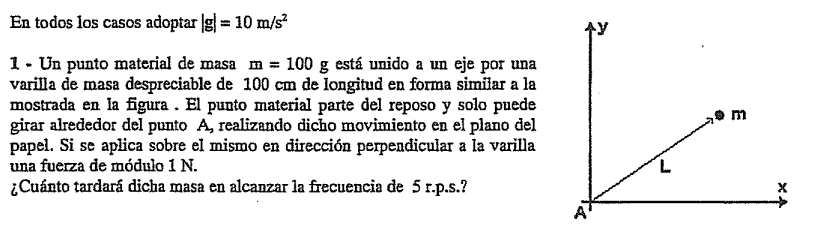

Este primer ejercicio es genial porque conecta la **Dinámica del Torque** con la **Cinemática del MCUV** en un sistema de distribución de masa puntual.

A continuación, la resolución completa explicada al detalle:

---

## 🛠️ Paso 1: Extracción y Conversión de Datos

Llevamos todas las magnitudes al Sistema Internacional para evitar cualquier error con las unidades:

* **Masa puntual ($m$):** $100 \text{ g} = 0,1 \text{ kg}$.

* **Longitud de la varilla ($L$):** $100 \text{ cm} = 1 \text{ m}$.

* **Fuerza aplicada ($F$):** $1 \text{ N}$ (siempre perpendicular a la varilla, actuando como fuerza tangencial).

* **Velocidad angular inicial ($\omega_0$):** Como parte del reposo, $\omega_0 = 0 \text{ rad/s}$.

* **Frecuencia angular final ($f_f$):** $5 \text{ r.p.s.}$ (revoluciones por segundo o $\text{Hz}$).

---

## 📐 Paso 2: Análisis Dinámico (Cálculo del Torque y Momento de Inercia)

Para hallar el tiempo de aceleración, primero necesitamos averiguar la aceleración angular ($\gamma$) del sistema. Aplicamos la **Segunda Ecuación Cardinal** tomando como centro de momentos el punto fijo de rotación $A$:

$$\Sigma M_A = I_A \cdot \gamma \text{ }$$

1. **Momento de la fuerza externa ($\Sigma M_A$):** Dado que la fuerza $F$ es estrictamente perpendicular a la varilla, el brazo de palanca es directamente la longitud total $L$:

$$\Sigma M_A = F \cdot L = 1 \text{ N} \cdot 1 \text{ m} = 1 \text{ N}\cdot\text{m} \text{ }$$

2. **Momento de Inercia del sistema respecto a A ($I_A$):** Como la varilla tiene masa despreciable, el único elemento que aporta resistencia a la rotación es la masa puntual $m$ ubicada en el extremo, a una distancia $L$ del eje:

$$I_A = m \cdot L^2 = 0,1 \text{ kg} \cdot (1 \text{ m})^2 = 0,1 \text{ kg}\cdot\text{m}^2 \text{}$$

Ahora, reemplazamos en la ecuación cardinal para despejar la aceleración angular ($\gamma$):

$$\gamma = \frac{F \cdot L}{m \cdot L^2} = \frac{F}{m \cdot L} \text{ }$$

$$\gamma = \frac{1 \text{ N}}{0,1 \text{ kg} \cdot 1 \text{ m}} = 10 \text{ rad/s}^2 \text{ }$$

---

## 🧮 Paso 3: Análisis Cinemático (MCUV)

La fuerza es constante, por lo que la aceleración angular ($\gamma$) es constante. Estamos ante un **Movimiento Circular Uniformemente Variado (MCUV)**.

1. **Calculamos la velocidad angular final ($\omega_f$):** Usamos la relación con la frecuencia final dada en r.p.s.:

$$\omega_f = 2\pi \cdot f_f = 2\pi \cdot 5 \text{ s}^{-1} = 10\pi \text{ rad/s} \text{ }$$

2. **Planteamos la ecuación cinemática del tiempo:**

$$\omega_f = \omega_0 + \gamma \cdot t \text{ }$$

$$10\pi \text{ rad/s} = 0 + (10 \text{ rad/s}^2) \cdot t \text{ }$$

3. **Despejamos el tiempo ($t$):**

$$t = \frac{10\pi}{10} = \pi \text{ segundos} \approx 3,14 \text{ s} \text{ }$$

---

## 🎯 Respuesta Final para el Examen

La masa puntual tardará exactamente **$\pi$ segundos** (aproximadamente **$3,14 \text{ s}$**) en alcanzar la frecuencia de giro solicitada.

---

## Ejercicio 5

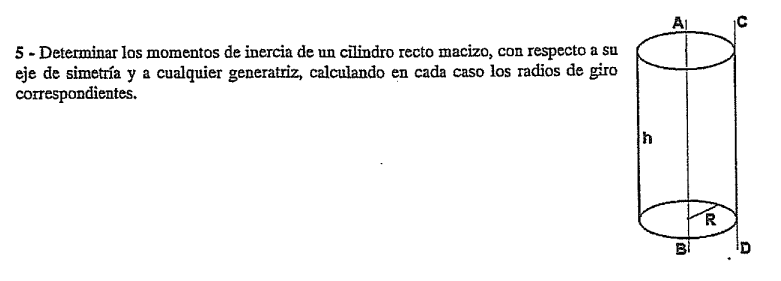

 Este problema es fundamental a nivel teórico porque te hace calcular y demostrar el uso del **Teorema de Steiner** y el concepto del **Radio de Giro ($k$)** sobre un cuerpo continuo tridimensional.

---

## 📐 Parte I: Análisis Respecto al Eje de Simetría ($AB$)

El eje de simetría $AB$ pasa exactamente por el centro de masa ($CM$) del cilindro.

### 1. Momento de Inercia Baricéntrico ($I_{AB}$)

Por tabla de momentos de inercia notables para un cilindro macizo homogéneo de masa $M$ y radio $R$, el valor respecto a este eje central es:

$$I_{AB} = I_{CM} = \frac{1}{2}MR^2 \text{ }$$

### 2. Radio de Giro ($k_{AB}$)

El radio de giro representa la distancia geométrica a la cual se debería concentrar toda la masa para dar el mismo momento de inercia ($I = M \cdot k^2$):

$$k_{AB} = \sqrt{\frac{I_{AB}}{M}} = \sqrt{\frac{\frac{1}{2}MR^2}{M}} = \sqrt{\frac{1}{2}R^2} = \frac{R}{\sqrt{2}} = \frac{\sqrt{2}}{2}R \text{}$$

---

## 📐 Parte II: Análisis Respecto a la Generatriz ($CD$)

La generatriz $CD$ es una recta paralela al eje central que pasa por la superficie exterior lateral del cilindro. La distancia perpendicular entre el eje $AB$ ($CM$) y la recta $CD$ es exactamente igual al radio del cilindro ($d = R$).

### 1. Momento de Inercia Usando el Teorema de Steiner ($I_{CD}$)

Aplicamos el Teorema de Steiner para trasladar el momento de inercia desde el centro de masa hasta el eje de la generatriz:

$$I_{CD} = I_{CM} + M \cdot d^2 \text{ }$$

$$I_{CD} = \frac{1}{2}MR^2 + M \cdot R^2 = \frac{3}{2}MR^2 \text{ }$$

### 2. Radio de Giro ($k_{CD}$)

Repetimos la definición matemática utilizando el nuevo momento de inercia obtenido respecto al eje exterior $CD$:

$$k_{CD} = \sqrt{\frac{I_{CD}}{M}} = \sqrt{\frac{\frac{3}{2}MR^2}{M}} = \sqrt{\frac{3}{2}R^2} = \sqrt{\frac{3}{2}}R = \frac{\sqrt{6}}{2}R \text{}$$

---

## 🎯 Resumen de Respuestas para el Examen

* **Eje de simetría ($AB$):** $I_{AB} = \frac{1}{2}MR^2 \text{ }$ y $k_{AB} = \frac{\sqrt{2}}{2}R$

* **Generatriz ($CD$):** $I_{CD} = \frac{3}{2}MR^2 \text{ }$ y $k_{CD} = \frac{\sqrt{6}}{2}R$

---

## Ejercicio 6

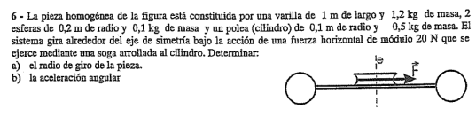

Este es un problema clásico de parciales de la UTN porque combina múltiples cuerpos rígidos acoplados en un sistema compuesto (una varilla, dos esferas y una polea cilíndrica).

La trampa principal radica en calcular con máxima precisión el **momento de inercia total respecto al eje de rotación fijo $e$**, aplicando correctamente el Teorema de Steiner para los componentes desplazados.

---

---

## 🛠️ Paso 1: Extracción y Organización de Datos

Asignamos variables claras a cada componente para no mezclar los datos en las ecuaciones complejas:

* **Eje de rotación ($e$):** Pasa por el centro geométrico de la varilla y de la polea.

* **Varilla ($v$):** $m_v = 1,2\text{ kg}$; $L_v = 1\text{ m}$. Su centro coincide con el eje, por lo que no requiere Steiner.

* **Polea cilíndrica ($c$):** $m_c = 0,5\text{ kg}$; $R_c = 0,1\text{ m}$. Su centro también coincide con el eje.

* **Esferas ($e$):** Dos esferas idénticas de $m_e = 0,1\text{ kg}$ y $R_e = 0,2\text{ m}$. Están ubicadas en los extremos de la varilla, por lo que sus centros de masa están desplazados respecto al eje de rotación.

* **Fuerza tangencial externa ($F$):** $F = 20\text{ N}$.

---

## 📐 Paso 2: Cálculo del Momento de Inercia Total ($I_{\text{total}}^e$)

El momento de inercia total es la suma de las inercias individuales de cada parte respecto al eje $e$:

$$I_{\text{total}}^e = I_{\text{polea}}^e + I_{\text{varilla}}^e + 2 \cdot I_{\text{esfera}}^e \text{}$$

### 1. Inercia de la Polea ($I_{\text{polea}}^e$)

Como es un cilindro macizo y su centro de masa está sobre el eje, usamos la fórmula directa:

$$I_{\text{polea}}^e = \frac{1}{2} m_c R_c^2 = \frac{1}{2} \cdot 0,5\text{ kg} \cdot (0,1\text{ m})^2 = 0,0025\text{ kg}\cdot\text{m}^2 \text{}$$

### 2. Inercia de la Varilla ($I_{\text{varilla}}^e$)

El eje pasa exactamente por su barra baricéntrica, por lo que tampoco requiere traslación:

$$I_{\text{varilla}}^e = \frac{1}{12} m_v L_v^2 = \frac{1}{12} \cdot 1,2\text{ kg} \cdot (1\text{ m})^2 = 0,1\text{ kg}\cdot\text{m}^2 \text{}$$

### 3. Inercia de las Esferas con Teorema de Steiner ($I_{\text{esfera}}^e$)

Cada esfera tiene una inercia propia respecto a su propio centro de masa de $\frac{2}{5}m_eR_e^2$. Como están en la punta de la varilla, la distancia ($d$) desde el centro de giro hasta el centro de masa de la esfera es igual a la mitad de la varilla más el radio de la propia esfera:

$$d = \frac{L_v}{2} + R_e = \frac{1\text{ m}}{2} + 0,2\text{ m} = 0,5\text{ m} + 0,2\text{ m} = 0,7\text{ m} \text{}$$

Aplicamos el Teorema de Steiner para una esfera:

$$I_{\text{esfera}}^e = I_{CM}^{\text{esfera}} + m_e d^2 = \frac{2}{5} m_e R_e^2 + m_e \left(\frac{L_v}{2} + R_e\right)^2 \text{}$$

$$I_{\text{esfera}}^e = \frac{2}{5} \cdot 0,1\text{ kg} \cdot (0,2\text{ m})^2 + 0,1\text{ kg} \cdot (0,7\text{ m})^2 \text{}$$

$$I_{\text{esfera}}^e = 0,0016\text{ kg}\cdot\text{m}^2 + 0,049\text{ kg}\cdot\text{m}^2 = 0,0506\text{ kg}\cdot\text{m}^2 \text{}$$

### 4. Suma total de las Inercias ($I_{\text{total}}^e$)

$$I_{\text{total}}^e = 0,0025 + 0,1 + 2 \cdot (0,0506) \text{}$$

$$I_{\text{total}}^e = 0,1025 + 0,1012 = 0,2037\text{ kg}\cdot\text{m}^2 \text{}$$

---

## 🧮 Paso 3: Resolución de las Incógnitas

### a) Determinar el radio de giro de la pieza ($k$)

El radio de giro relaciona la inercia total con la **masa total** del sistema ($m_{\text{total}}$):

$$m_{\text{total}} = m_c + m_v + 2 \cdot m_e = 0,5\text{ kg} + 1,2\text{ kg} + 2 \cdot (0,1\text{ kg}) = 1,9\text{ kg} \text{}$$

Usamos la definición matemática:

$$I_{\text{total}}^e = m_{\text{total}} \cdot k^2 \implies k = \sqrt{\frac{I_{\text{total}}^e}{m_{\text{total}}}} \text{}$$

$$k = \sqrt{\frac{0,2037\text{ kg}\cdot\text{m}^2}{1,9\text{ kg}}} = \sqrt{0,1072\text{ m}^2} \approx 0,3274\text{ m} \text{}$$

---

### b) Determinar la aceleración angular ($\gamma$)

Planteamos la **Segunda Ecuación Cardinal** del movimiento rotacional respecto al eje fijo $e$:

$$\Sigma M_e = I_{\text{total}}^e \cdot \gamma \text{}$$

La única fuerza que realiza momento es la tensión de la soga aplicada tangencialmente en el borde de la polea, por lo que su brazo de palanca es $R_c$ (ángulo de $90^\circ$):

$$F \cdot R_c = I_{\text{total}}^e \cdot \gamma \text{ }$$

$$20\text{ N} \cdot 0,1\text{ m} = 0,2037\text{ kg}\cdot\text{m}^2 \cdot \gamma \text{}$$

$$2\text{ N}\cdot\text{m} = 0,2037\text{ kg}\cdot\text{m}^2 \cdot \gamma \text{}$$

Despejamos la aceleración angular ($\gamma$):

$$\gamma = \frac{2}{0,2037} \approx 9,8183\text{ rad/s}^2 \text{}$$

---

## 🎯 Resumen de Respuestas para el Examen

* **a) Radio de giro ($k$):** $0,3274\text{ m}$ 

* **b) Aceleración angular ($\gamma$):** $9,8183\text{ rad/s}^2$ 

---

## Ejercicio 9

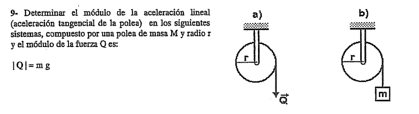

Este problema es un clásico absoluto de la UTN porque conceptualiza una de las mayores trampas de examen: **la diferencia fundamental entre aplicar una fuerza directa (caso a) y colgar una masa que genere tensión a través de su peso (caso b)**.

Vamos a resolver ambos incisos paso a paso para comparar físicamente por qué las aceleraciones lineales dan distinto.

---

## 📐 Análisis del Caso a) Fuerza Pura Aplicada ($\vec{Q}$)

En este caso, una mano o un motor tira de la cuerda directamente con una fuerza constante de módulo $Q = m \cdot g$. No hay masa colgando que deba trasladarse, por lo que la cuerda transmite la fuerza $Q$ directamente a la periferia de la polea.

### 1. Ecuación de Rotación para la Polea

Planteamos la ecuación cardinal de la rotación tomando centro de momentos en su eje fijo:

$$\Sigma M_{\text{eje}} = I_{\text{polea}} \cdot \gamma_a \text{}$$

* El torque generado por la fuerza externa es: $M_Q = Q \cdot r = m \cdot g \cdot r$.

* El momento de inercia de la polea (cilindro homogéneo macizo) es: $I_{\text{polea}} = \frac{1}{2} M \cdot r^2$.

Sustituyendo en la ecuación:

$$m \cdot g \cdot r = \left(\frac{1}{2} M \cdot r^2\right) \cdot \gamma_a \text{}$$

### 2. Despeje de la Aceleración Angular ($\gamma_a$) y Lineal ($a_{t_a}$)

Simplificamos un radio $r$ en ambos lados y despejamos la aceleración angular:

$$\gamma_a = \frac{m \cdot g}{\frac{1}{2} M \cdot r} = \frac{2 \cdot m \cdot g}{M \cdot r} \text{}$$

Como el enunciado nos pide la **aceleración lineal tangencial** del borde ($a_t = \gamma \cdot r$):

$$a_{t_a} = \gamma_a \cdot r = \frac{2 \cdot m \cdot g}{M \cdot r} \cdot r \implies \mathbf{a_{t_a} = \frac{2 \cdot m \cdot g}{M}} \text{}$$

---

## 📐 Análisis del Caso b) Bloque de Masa $m$ Colgante

Acá la situación cambia por completo. La fuerza de la soga ya no es $m \cdot g$. La soga tiene una **tensión $T$** que es una incógnita dinámica. El peso $m \cdot g$ actúa sobre el bloque, el cual debe acelerar hacia abajo, restándole fuerza a la tensión.

### 1. Diagrama de Cuerpo Rígido y Ecuaciones del Sistema

Tenemos dos cuerpos moviéndose de manera acoplada:

* **Para la polea (rota):** El único torque lo genera la tensión $T$ de la soga:

$$T \cdot r = I_{\text{polea}} \cdot \gamma_b \implies T \cdot r = \left(\frac{1}{2} M \cdot r^2\right) \cdot \gamma_b \text{}$$

Simplificando un radio: $T = \frac{1}{2} M \cdot r \cdot \gamma_b$.

* **Para el bloque $m$ (traslada):** Se desplaza verticalmente hacia abajo:

$$m \cdot g - T = m \cdot a_{t_b} \text{}$$

### 2. Condición de Vínculo Cinemático

Como la soga no desliza sobre la garganta de la polea, la aceleración lineal del bloque es idéntica a la aceleración tangencial de la polea:

$$a_{t_b} = \gamma_b \cdot r \implies \gamma_b = \frac{a_{t_b}}{r} \text{}$$

Reemplazamos esta condición de vínculo en la ecuación de la tensión de la polea:

$$T = \frac{1}{2} M \cdot r \cdot \left(\frac{a_{t_b}}{r}\right) \implies T = \frac{1}{2} M \cdot a_{t_b} \text{}$$

### 3. Despeje de la Aceleración Lineal ($a_{t_b}$)

Sustituimos la tensión $T$ en la ecuación de traslación del bloque:

$$m \cdot g - \left(\frac{1}{2} M \cdot a_{t_b}\right) = m \cdot a_{t_b} \text{} $$

$$m \cdot g = m \cdot a_{t_b} + \frac{1}{2} M \cdot a_{t_b} \text{}$$

$$m \cdot g = \left(m + \frac{1}{2} M\right) \cdot a_{t_b} \text{}$$

Finalmente, despejamos $a_{t_b}$:

$$\mathbf{a_{t_b} = \frac{m \cdot g}{m + \frac{1}{2} M}} \text{} $$

---

## 🎯 Resumen de Resultados para el Examen

* **Caso a) Fuerza pura:** $a_{t_a} = \frac{2 \cdot m \cdot g}{M}$ 

* **Caso b) Masa colgante:** $a_{t_b} = \frac{m \cdot g}{m + \frac{1}{2} M}$ 

> 💡 **Interpretación Física de la UTN:** En el **caso a**, toda la energía de la fuerza se usa únicamente para hacer rotar la polea. En el **caso b**, el peso $m \cdot g$ tiene que repartirse para vencer tanto la inercia de rotación de la polea como la inercia de traslación del propio bloque, por lo que la aceleración siempre es menor ($a_{t_b} < a_{t_a}$).
> 
> 

---

## Ejercicio 15

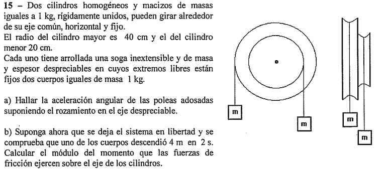

 Este es un problema excelente porque combina dinámica de sistemas de poleas acopladas (cilindros coaxiales de radios distintos) con efectos de fricción en el eje no conservativos en el inciso b.

A continuación, lo resolvemos minuciosamente paso a paso utilizando el desarrollo de tus apuntes de la pizarra:

---

## 🛠️ Paso 1: Extracción y Organización de Datos

Asignamos variables claras en unidades del Sistema Internacional ($|g| = 10 \text{ m/s}^2$):

* **Masas de los cilindros:** $M_G = 1 \text{ kg}$ (mayor) , $M_C = 1 \text{ kg}$ (menor).

* **Radios de los cilindros:** $R_G = 0,4 \text{ m}$ , $R_C = 0,2 \text{ m}$.

* **Masas de los bloques colgantes:** Ambos tienen $m = 1 \text{ kg}$.

* **Sentido del movimiento:** El bloque colgado en la polea grande tiene un brazo de palanca mayor ($R_G > R_C$), por lo que ganará el torque de ese lado. El sistema rotará en sentido antihorario , haciendo que el bloque de la izquierda descienda ($a_G$) y el de la derecha ascienda ($a_C$).

---

## 📐 Paso 2: Resolución del Inciso a) Sin Rozamiento

### 1. Momento de Inercia de los Cilindros Adosados ($I_0$)

Dado que están rígidamente unidos, sus inercias respecto al eje común se suman directamente:

$$I_0 = \frac{1}{2} M_G R_G^2 + \frac{1}{2} M_C R_C^2$$

$$I_0 = \frac{1}{2} \cdot 1 \text{ kg} \cdot (0,4 \text{ m})^2 + \frac{1}{2} \cdot 1 \text{ kg} \cdot (0,2 \text{ m})^2$$

$$I_0 = 0,08 \text{ kg}\cdot\text{m}^2 + 0,02 \text{ kg}\cdot\text{m}^2 = 0,1 \text{ kg}\cdot\text{m}^2$$

### 2. Ecuaciones Dinámicas del Sistema

Planteamos las ecuaciones de Newton de traslación para los bloques y de rotación para la polea acoplada:

* **Bloque izquierdo (baja):** $m \cdot g - T_G = m \cdot a_G$ $\implies T_G = m \cdot g - m \cdot a_G$ 

* **Bloque derecho (sube):** $T_C - m \cdot g = m \cdot a_C$ $\implies T_C = m \cdot g + m \cdot a_C$ 

* **Eje coaxial (rota):** $\Sigma M_0 = I_0 \cdot \gamma \implies T_G \cdot R_G - T_C \cdot R_C = I_0 \cdot \gamma$ 

### 3. Vínculos Cinemáticos

Las soga no deslizan, por lo que las aceleraciones lineales se acoplan mediante la aceleración angular $\gamma$ de la pieza:

$$a_G = \gamma \cdot R_G = 0,4 \gamma$$

$$a_C = \gamma \cdot R_C = 0,2 \gamma$$

### 4. Despeje de la Aceleración Angular ($\gamma$)

Sustituimos las tensiones expresadas en función de $\gamma$ dentro de la ecuación de momentos:

$$\big(m \cdot g - m(R_G \gamma)\big) R_G - \big(m \cdot g + m(R_C \gamma)\big) R_C = I_0 \cdot \gamma$$

$$m \cdot g (R_G - R_C) - m R_G^2 \gamma - m R_C^2 \gamma = I_0 \cdot \gamma$$

$$m \cdot g (R_G - R_C) = \big(I_0 + m R_G^2 + m R_C^2\big) \gamma$$

Colocamos los valores numéricos correspondientes:

$$1 \cdot 10 \cdot (0,4 - 0,2) = \big(0,1 + 1 \cdot 0,4^2 + 1 \cdot 0,2^2\big) \gamma$$

$$10 \cdot 0,2 = \big(0,1 + 0,16 + 0,04\big) \gamma$$

$$2 = 0,3 \cdot \gamma \implies \gamma = \frac{2}{0,3} = \frac{20}{3} \text{ rad/s}^2 \approx \mathbf{6,67 \text{ rad/s}^2}$$

---

## 📐 Paso 3: Resolución del Inciso b) Con Rozamiento en el Eje

Cuando se incorpora fricción en el eje, aparece un **momento de rozamiento constante ($M_{\text{froce}}$)** que se opone directamente al sentido de giro del sistema:

### 1. Cálculo de la Aceleración Real del Sistema ($\gamma_{\text{real}}$)

A partir de los datos cinemáticos experimentales obtenidos del bloque que descendió, podemos calcular la aceleración tangencial real de la polea grande ($a_{G_{\text{real}}}$) usando la ecuación de posición del MRUV:

$$\Delta x = \frac{1}{2} a_{G_{\text{real}}} \cdot t^2 \implies 4 \text{ m} = \frac{1}{2} \cdot a_{G_{\text{real}}} \cdot (2 \text{ s})^2$$

$$4 = 2 \cdot a_{G_{\text{real}}} \implies a_{G_{\text{real}}} = 2 \text{ m/s}^2$$

Usando el vínculo cinemático, encontramos la aceleración angular real bajo rozamiento:

$$\gamma_{\text{real}} = \frac{a_{G_{\text{real}}}}{R_G} = \frac{2 \text{ m/s}^2}{0,4 \text{ m}} = \mathbf{5 \text{ rad/s}^2}$$

### 2. Planteo Dinámico con Momento de Fricción

La ecuación rotacional de la polea compuesta se modifica restando el torque opositor de la fricción:

$$T_G \cdot R_G - T_C \cdot R_C - M_{\text{froce}} = I_0 \cdot \gamma_{\text{real}}$$

De forma agrupada, el torque motor total que ejercían las cuerdas en función de la aceleración angular responde a la misma expresión algebraica del inciso anterior:

$$m \cdot g (R_G - R_C) - \big(m R_G^2 + m R_C^2\big) \gamma_{\text{real}} - M_{\text{froce}} = I_0 \cdot \gamma_{\text{real}}$$

$$m \cdot g (R_G - R_C) - \big(I_0 + m R_G^2 + m R_C^2\big) \gamma_{\text{real}} = M_{\text{froce}}$$

Sustituimos los datos numéricos con la nueva aceleración angular real ($\gamma_{\text{real}} = 5 \text{ rad/s}^2$):

$$2 - (0,3) \cdot 5 = M_{\text{froce}}$$

$$2 - 1,5 = M_{\text{froce}} \implies \mathbf{M_{\text{froce}} = 0,5 \text{ N}\cdot\text{m}}$$

---

## 🎯 Resumen de Respuestas para el Examen

* **a) Aceleración angular sin rozamiento ($\gamma$):** $\frac{20}{3} \text{ rad/s}^2 \approx 6,67 \text{ rad/s}^2$ 

* **b) Módulo del momento de fricción ($M_{\text{froce}}$):** $0,5 \text{ N}\cdot\text{m}$ 

---

## Ejercicio 16

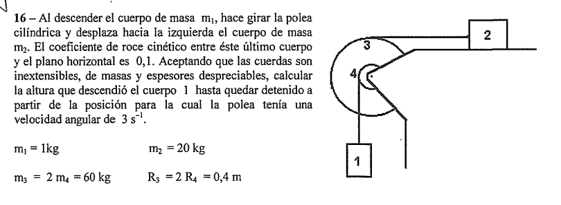

El problema combina dinámica de bloques, una polea doble escalonada con masa (cilindros coaxiales) , rozamiento cinético , y se resuelve de forma súper elegante aplicando el **Teorema del Trabajo y la Energía Cinética para un Cuerpo Rígido** ($W_{\text{Fnc}} = \Delta E_{\text{mec}}$).

---

## 🛠️ Paso 1: Vínculos Cinemáticos y Desplazamientos

Cuando el cuerpo 1 desciende una altura $h_1$, provoca que la polea gire un ángulo $\Delta\theta$. A su vez, la soga de la polea grande desplaza al cuerpo 2 hacia la izquierda una distancia $x_2$.

Usando los radios de desprendimiento de las sogas ($R_4$ para el cuerpo 1 y $R_3$ para el cuerpo 2):

* $h_1 = \Delta\theta \cdot R_4 \implies \Delta\theta = \frac{h_1}{R_4}$
* $x_2 = \Delta\theta \cdot R_3 = \left(\frac{h_1}{R_4}\right) R_3$

Como $R_3 = 2R_4$, la relación de desplazamientos lineales es directa:

$$x_2 = h_1 \cdot \left(\frac{0,4\text{ m}}{0,2\text{ m}}\right) \implies \mathbf{x_2 = 2h_1}$$

Del mismo modo, para las velocidades lineales en cualquier instante:

* $v_1 = \omega \cdot R_4$ 

* $v_2 = \omega \cdot R_3 = 2v_1$

---

## 📐 Paso 2: Momento de Inercia de la Polea Doble ($I_{\text{polea}}$)

La polea está compuesta por dos cilindros macizos concéntricos fijados rígidamente al mismo eje, por lo que sumamos sus inercias baricéntricas:

$$I_{\text{polea}} = \frac{1}{2}m_3 R_3^2 + \frac{1}{2}m_4 R_4^2$$

$$I_{\text{polea}} = \frac{1}{2}(60\text{ kg})(0,4\text{ m})^2 + \frac{1}{2}(30\text{ kg})(0,2\text{ m})^2$$

$$I_{\text{polea}} = 4,8\text{ kg}\cdot\text{m}^2 + 0,6\text{ kg}\cdot\text{m}^2 = \mathbf{5,4\text{ kg}\cdot\text{m}^2}$$

---

## 🧮 Paso 3: Balance de Trabajo y Energía ($W_{\text{Fnc}} = \Delta E_{\text{mec}}$)

1. Estado Inicial ($0$): La polea posee $\omega_0 = 3\text{ s}^{-1}$ 

Calculamos la energía cinética inicial de todo el sistema combinado:

* Velocidad inicial del cuerpo 1: $v_{1_0} = \omega_0 \cdot R_4 = 3\text{ s}^{-1} \cdot 0,2\text{ m} = 0,6\text{ m/s}$ 

* Velocidad inicial del cuerpo 2: $v_{2_0} = \omega_0 \cdot R_3 = 3\text{ s}^{-1} \cdot 0,4\text{ m} = 1,2\text{ m/s}$

Energía cinética inicial total ($E_{c_0}$):

$$E_{c_0} = \frac{1}{2}m_1 v_{1_0}^2 + \frac{1}{2}m_2 v_{2_0}^2 + \frac{1}{2}I_{\text{polea}} \omega_0^2$$

$$E_{c_0} = \frac{1}{2}(1)(0,6)^2 + \frac{1}{2}(20)(1,2)^2 + \frac{1}{2}(5,4)(3)^2$$
s
$$E_{c_0} = 0,18\text{ J} + 14,4\text{ J} + 24,3\text{ J} = \mathbf{38,88\text{ J}}$$

2. Estado Final ($f$): El sistema se detiene por completo 

Como el sistema se frena hasta quedar detenido, la energía cinética final es nula:

$$\mathbf{E_{c_f} = 0\text{ J}}$$

### 3. Variación de Energía Potencial Gravitatoria ($\Delta E_p$)

Tomando como nivel de referencia la altura inicial, el único cuerpo que cambia su altura en la dirección de la gravedad es el bloque 1, el cual desciende una distancia $h_1$:

$$\Delta E_p = E_{p_f} - E_{p_0} = -m_1 \cdot g \cdot h_1$$

$$\Delta E_p = -(1\text{ kg})(10\text{ m/s}^2)h_1 = \mathbf{-10h_1}$$

---

### 4. Trabajo de las Fuerzas No Conservativas ($W_{\text{Fnc}}$)

La única fuerza no conservativa que realiza trabajo es la **fuerza de rozamiento dinámico ($f_r$)** sobre el bloque 2 mientras se desplaza la distancia $x_2$ hacia la izquierda:

* Fuerza Normal del bloque 2: $N_2 = m_2 \cdot g = 20\text{ kg} \cdot 10\text{ m/s}^2 = 200\text{ N}$ 

* Fuerza de rozamiento: $f_r = \mu_c \cdot N_2 = 0,1 \cdot 200\text{ N} = 20\text{ N}$ 

El trabajo del rozamiento es opositor (ángulo de $180^\circ$):

$$W_{\text{Fnc}} = -f_r \cdot x_2 = -20\text{ N} \cdot (2h_1) = \mathbf{-40h_1}$$

---

## 🏁 Paso 4: Despeje de la altura $h_1$

Planteamos el teorema de conservación modificado:

$$W_{\text{Fnc}} = \Delta E_c + \Delta E_p$$

$$-40h_1 = (0 - 38,88) - 10h_1$$

$$-40h_1 + 10h_1 = -38,88$$

$$-30h_1 = -38,88$$

Despejamos la altura que descendió el cuerpo 1 ($h_1$):

$$h_1 = \frac{-38,88}{-30} = \mathbf{1,296\text{ m}}$$

---

## 🎯 Respuesta Final para el Examen

El cuerpo 1 descenderá una altura exacta de **$1,296\text{ m}$** hasta detenerse por completo.

---

## Ejercicio 19

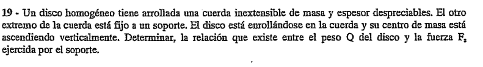

Este problema pone a prueba cómo manejar las ecuaciones dinámicas de un cuerpo en rototraslación (subir enroscándose en una soga) y te muestra las dos alternativas metodológicas clásicas de la UTN: resolver desde el Centro de Masa ($CM$) o resolver usando el Centro Instantáneo de Rotación ($CIR$).

---

## 🛠️ Paso 1: Diagrama de Cuerpo Libre (DCL) e Identificación Cinematográfica

Anclamos las fuerzas que actúan sobre el disco en movimiento plano:

1. El **Peso ($Q$)** aplicado verticalmente hacia abajo en el centro de masa ($CM$).

2. La **Tensión ($T$)** de la soga aplicada verticalmente hacia arriba en el punto de desprendimiento lateral (garganta del disco). Como la soga ideal está fija al soporte superior, la fuerza en el soporte es exactamente igual a esta tensión ($F_s = T$).

### Vínculo Cinemático de Rodadura

Dado que la soga está fija al techo y no desliza sobre el disco, el punto donde la cuerda se desprende lateralmente del disco no tiene velocidad instantánea respecto a la Tierra; es decir, **ese punto de contacto lateral actúa como nuestro CIR**.
Por lo tanto, la aceleración lineal del centro de masa ($a_{CM}$) queda vinculada unívocamente a la aceleración angular ($\gamma$) del disco por el radio $R$:

$$a_{CM} = \gamma \cdot R \quad \text{}$$

El momento de inercia del disco macizo homogéneo con respecto a su propio centro de masa es:

$$I_{CM} = \frac{1}{2}mR^2 \quad \text{}$$

---

## 📐 Método Alternativo A: Planteo Dinámico desde el Centro de Masa ($CM$)

Establecemos el sistema de ecuaciones cardinales tomando como sentido positivo el ascenso ($+y$) y la rotación correspondiente para el enroscado:

1. **Primera Ecuación Cardinal (Traslación):**

$$\Sigma F_y = m \cdot a_{CM} \implies T - Q = m \cdot a_{CM} \quad \text{}$$

(Nota: Como el centro de masa está ascendiendo verticalmente pero desacelerando debido al peso o acelerando según las fuerzas, planteamos la diferencia convencional: $T - Q = m \cdot a_{CM}$ o $Q - T = m \cdot a_{CM}$ en sentido de frenado). Siguiendo la convención algebraica de tu pizarra para sumatoria de fuerzas en módulo:

$$Q - T = m \cdot a_{CM} \quad \text{(Ecuación 1) }$$

2. **Segunda Ecuación Cardinal (Rotación respecto al CM):**
Tomando momentos desde el $CM$, el peso no genera torque. La tensión $T$ tiene un brazo de palanca igual a $R$ y ejerce el momento motor que enrosca el disco:

$$\Sigma M_{CM} = I_{CM} \cdot \gamma \implies T \cdot R = \left(\frac{1}{2}mR^2\right) \gamma \quad \text{}$$

Simplificando un radio $R$:

$$T = \frac{1}{2}m(R\cdot\gamma) \quad \text{}$$

Utilizando el vínculo cinemático $a_{CM} = \gamma \cdot R$, obtenemos:

$$T = \frac{1}{2}m \cdot a_{CM} \implies m \cdot a_{CM} = 2T \quad \text{}$$

3. **Sustitución y Relación:**
Reemplazamos el término $m \cdot a_{CM} = 2T$ dentro de la Ecuación 1:

$$Q - T = 2T \quad \text{}$$

$$Q = 2T + T \implies Q = 3T \quad \text{}$$

---

## 📐 Método Alternativo B: Planteo Directo desde el CIR

Tomar momentos directamente desde el punto de la soga ($CIR$) te ahorra resolver sistemas de ecuaciones en los parciales de la UTN porque anula de inmediato la variable de la tensión $T$:

$$\Sigma M_{CIR} = I_{CIR} \cdot \gamma \quad \text{}$$

1. **Momento respecto al CIR:** El peso $Q$ es la única fuerza que genera torque respecto al punto de desprendimiento, con una distancia de brazo de palanca igual a $R$:

$$\Sigma M_{CIR} = Q \cdot R \quad \text{}$$

2. **Momento de Inercia respecto al CIR ($I_{CIR}$):** Aplicamos el Teorema de Steiner para trasladar la inercia del disco a una distancia $R$ de su eje baricéntrico:

$$I_{CIR} = I_{CM} + mR^2 = \frac{1}{2}mR^2 + mR^2 = \frac{3}{2}mR^2 \quad \text{}$$

3. **Igualación:**

$$Q \cdot R = \left(\frac{3}{2}mR^2\right) \gamma \quad \text{}$$

Simplificando un radio $R$ y aplicando el vínculo $a_{CM} = \gamma \cdot R$:

$$Q = \frac{3}{2}m(\gamma \cdot R) \implies Q = \frac{3}{2}m \cdot a_{CM} \quad \text{[cite: 699, 704]}$$

Sabiendo por la traslación del $CM$ que $m \cdot a_{CM} = Q - T$:

$$Q = \frac{3}{2}(Q - T)$$

$$2Q = 3(Q - T) \implies 2Q = 3Q - 3T$$

$$3T = 3Q - 2Q \implies 3T = Q \text{}$$

---

## 🎯 Respuesta Final para el Examen

Como la soga transmite íntegramente la tensión al soporte del techo ($F_s = T$) , la relación exacta entre el peso del disco y la fuerza que soporta el anclaje es:

$$Q = 3 F_s \implies F_s = \frac{1}{3} Q \text{}$$

> 💡 **Conclusión:** La fuerza ejercida por el soporte es exactamente la **tercera parte del peso total** del disco homogéneo mientras este asciende enroscándose.
> 
> 

---

## Ejercicio 21

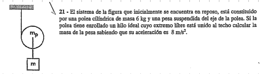

Nos presenta un cilindro que cae libremente desenrollándose de una cuerda atada al techo (movimiento plano de rototraslación), pero con una pesa colgada directamente de su propio eje (el centro de masa de la polea).

La clave metodológica que te va a salvar la vida en el examen es **tomar momentos desde el CIR** (el punto de desprendimiento de la soga que va al techo). Al hacerlo ahí, la tensión de la soga superior no realiza torque, permitiendo resolver el ejercicio de forma directa.

A continuación, la resolución completa y súper detallada paso a paso:

---

## 🛠️ Paso 1: Identificación Cinemática y Vínculos

Primero, analicemos cómo se acoplan los movimientos de los dos cuerpos:

* **La pesa ($m$):** Está unida de forma rígida al eje de la polea mediante un hilo, por lo que desciende verticalmente con la misma aceleración lineal que el centro de masa de la polea ($a = a_{CM} = 8\text{ m/s}^2$).

* **La polea ($m_p$):** Realiza una rototraslación en el plano. Dado que el hilo izquierdo está anclado fijamente al techo y no resbala, el punto de desprendimiento lateral izquierdo es instantáneamente inmóvil. Por lo tanto, **ese punto es nuestro CIR**.

* **Vínculo Cinemático:** La aceleración de traslación del centro de masa ($a_{CM}$) y la aceleración angular ($\gamma$) de la polea se relacionan de forma directa mediante su radio $R$:

$$a_{CM} = \gamma \cdot R \implies \gamma = \frac{a_{CM}}{R} \quad \text{}$$

---

## 📐 Paso 2: Análisis Dinámico del Sistema (Método del CIR)

Para plantear el sistema de la forma más rápida y elegante, usemos la **Segunda Ecuación Cardinal** tomando como centro de momentos el **CIR** (el punto de contacto lateral con la soga del techo):

$$\Sigma M_{CIR} = I_{CIR} \cdot \gamma \quad \text{ }$$

1. Fuerzas que hacen Momento respecto al CIR 

Si miramos el diagrama, las fuerzas que intentan hacer rotar a la polea con respecto al punto de la cuerda del techo son:

* El peso de la polea ($P_p = m_p \cdot g$), aplicado en el centro de masa (distancia de brazo de palanca = $R$).

* La fuerza de tracción que ejerce el hilo de la pesa ($T_A$), que está aplicada también en el eje central de la polea (distancia de brazo de palanca = $R$).

Ambas fuerzas tiran hacia abajo con el mismo sentido de rotación (horario):

$$\Sigma M_{CIR} = (T_A \cdot R) + (P_p \cdot R) = (T_A + m_p \cdot g) \cdot R \quad \text{ }$$

2. Momento de Inercia respecto al CIR ($I_{CIR}$) 

Aplicamos el Teorema de Steiner para calcular la inercia del cilindro macizo de la polea respecto a su extremo lateral ($CIR$):

$$I_{CIR} = I_{CM} + m_p R^2 = \frac{1}{2}m_p R^2 + m_p R^2 = \frac{3}{2}m_p R^2 \quad \text{ }$$

3. Planteo de la Ecuación Rotacional 

Sustituimos el momento y la inercia en la ecuación cardinal:

$$(T_A + m_p \cdot g) \cdot R = \left(\frac{3}{2}m_p R^2\right) \gamma \quad \text{ }$$

Simplificamos un radio $R$ en ambos miembros:

$$T_A + m_p \cdot g = \frac{3}{2}m_p (R \cdot \gamma) \quad \text{ }$$

Usando el vínculo cinemático ($a_{CM} = \gamma \cdot R$), la expresión se simplifica maravillosamente:

$$T_A + m_p \cdot g = \frac{3}{2}m_p \cdot a_{CM} \quad \text{ }$$

---

🧮 Paso 3: Análisis de Traslación de la Pesa ($m$) 

Ahora aplicamos la **Primera Ecuación Cardinal** (Newton) únicamente para el bloque colgante de masa $m$, que traslada verticalmente hacia abajo con aceleración $a_{CM}$:

$$\Sigma F_y = m \cdot a_{CM} \implies m \cdot g - T_A = m \cdot a_{CM} \quad \text{}$$

Despejamos la tensión de la soga interna ($T_A$):

$$T_A = m \cdot g - m \cdot a_{CM} = m(g - a_{CM}) \quad \text{}$$

---

🏁 Paso 4: Acoplamiento de Ecuaciones y Despeje de la Masa $m$ 

Reemplazamos la expresión de $T_A$ dentro de nuestra ecuación obtenida en el Paso 2:

$$m(g - a_{CM}) + m_p \cdot g = \frac{3}{2}m_p \cdot a_{CM} \quad \text{ }$$

Sustituimos con los valores numéricos conocidos del enunciado ($m_p = 6\text{ kg}$, $a_{CM} = 8\text{ m/s}^2$ y adoptamos $g = 10\text{ m/s}^2$):

$$m(10 - 8) + 6 \cdot 10 = \frac{3}{2} \cdot 6 \cdot 8$$

$$2m + 60 = 3 \cdot 24$$

$$2m + 60 = 72$$

$$2m = 72 - 60$$

$$2m = 12 \implies m = \frac{12}{2} = \mathbf{6\text{ kg}}$$

---

## 🎯 Respuesta Final para el Examen

La masa de la pesa suspendida debe ser exactamente de **$6\text{ kg}$**.

---

## Ejercicio 25

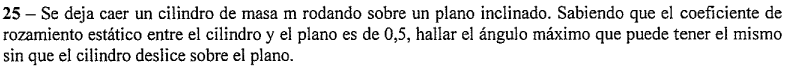

Este es un clásico de examen de la UTN porque evalúa el límite físico de la rodadura pura antes de que el cuerpo rígido empiece a patinar por la pendiente.

---

## 🛠️ Paso 1: Planteo de las Fuerzas y Ecuaciones desde el Centro de Masa ($CM$)

Consideramos un cilindro macizo homogéneo de masa $m$ y radio $R$ descendiendo por un plano inclinado con un ángulo variable $\alpha$. Descomponemos el peso y las fuerzas según los ejes tangencial y normal a la pendiente:

* **Fuerza de la Gravedad en los ejes:**
* Componente tangencial del peso: $P_x = m \cdot g \cdot \sin(\alpha)$ 

* Componente normal del peso: $P_y = m \cdot g \cdot \cos(\alpha)$ 

### 1. Primera Ecuación Cardinal (Traslación del CM)

La sumatoria de fuerzas a lo largo del plano inclinado impulsa al centro de masa hacia abajo con una aceleración lineal $a_{CM}$:

$$\Sigma F_x = m \cdot a_{CM} \implies m \cdot g \cdot \sin(\alpha) - f_{\text{roce}} = m \cdot a_{CM} \quad \text{}$$

Por el eje normal, al no haber despegue de la superficie, se balancean la normal y el peso:

$$\Sigma F_y = 0 \implies N = P_y = m \cdot g \cdot \cos(\alpha) \quad \text{}$$

### 2. Segunda Ecuación Cardinal (Rotación respecto al CM)

Tomando momentos desde el $CM$, la única fuerza que genera torque y que hace rotar al cilindro es la fuerza de rozamiento estática ($f_{\text{roce}}$), con un brazo de palanca igual al radio $R$:

$$\Sigma M_{CM} = I_{CM} \cdot \gamma \implies f_{\text{roce}} \cdot R = \left(\frac{1}{2}mR^2\right) \gamma \quad \text{}$$

Simplificando un radio $R$ de ambos miembros obtenemos el valor del rozamiento en función de la rotación:

$$f_{\text{roce}} = \frac{1}{2} m (R \cdot \gamma) \quad \text{}$$

---

## 📐 Paso 2: Condición de Vínculo de Rodadura Pura

Como el cilindro rueda sin resbalar, la aceleración de traslación del centro de masa y la aceleración angular de giro están acopladas de forma directa:

$$a_{CM} = \gamma \cdot R \quad \text{}$$

Sustituimos este vínculo en la ecuación del rozamiento obtenida en el paso anterior:

$$f_{\text{roce}} = \frac{1}{2} m \cdot a_{CM} \quad \text{}$$

Reemplazamos esta fuerza de rozamiento dentro de la ecuación de traslación del $CM$ para determinar la aceleración del sistema:

$$m \cdot g \cdot \sin(\alpha) - \left(\frac{1}{2} m \cdot a_{CM}\right) = m \cdot a_{CM} \quad \text{}$$

$$m \cdot g \cdot \sin(\alpha) = m \cdot a_{CM} + \frac{1}{2} m \cdot a_{CM} \quad \text{}$$

$$m \cdot g \cdot \sin(\alpha) = \frac{3}{2} m \cdot a_{CM} \implies a_{CM} = \frac{2}{3} g \cdot \sin(\alpha) \quad \text{}$$

Volviendo a colocar la aceleración lineal en la expresión de la fuerza de rozamiento estática requerida para mantener la rodadura:

$$f_{\text{roce}} = \frac{1}{2} m \left(\frac{2}{3} g \cdot \sin(\alpha)\right) \implies \mathbf{f_{\text{roce}} = \frac{1}{3} m \cdot g \cdot \sin(\alpha)} \quad \text{}$$

---

## 🧮 Paso 3: Condición Límite de Rozamiento Estático Máximo

La fuerza de rozamiento estática no puede crecer infinitamente. Tiene una cota máxima impuesta por las superficies en contacto que responde a la inecuación:

$$f_{\text{roce}} \le f_{\text{roce}}^{\text{máx}} = \mu_e \cdot N \quad \text{}$$

El enunciado nos pide encontrar el ángulo límite exacto ($\alpha_{\text{máx}}$) donde el rozamiento requerido alcanza su valor tope absoluto antes de deslizar:

$$f_{\text{roce}} = \mu_e \cdot m \cdot g \cdot \cos(\alpha_{\text{máx}}) \quad \text{}$$

Igualamos las dos expresiones que tenemos para la fuerza de rozamiento en esa condición límite:

$$\frac{1}{3} m \cdot g \cdot \sin(\alpha_{\text{máx}}) = \mu_e \cdot m \cdot g \cdot \cos(\alpha_{\text{máx}}) \quad \text{}$$

Simplificamos la masa $m$ y la gravedad $g$ de ambos miembros de la ecuación:

$$\frac{1}{3} \sin(\alpha_{\text{máx}}) = \mu_e \cdot \cos(\alpha_{\text{máx}}) \quad \text{}$$

Agrupamos las funciones trigonométricas dividiendo por el coseno para formar la función tangente:

$$\frac{\sin(\alpha_{\text{máx}})}{\cos(\alpha_{\text{máx}})} = 3\mu_e \implies \tan(\alpha_{\text{máx}}) = 3\mu_e \quad \text{}$$

---

## 🏁 Paso 4: Sustitución Numérica del Ángulo Límite

Reemplazamos el coeficiente de rozamiento estático del enunciado ($\mu_e = 0,5$):

$$\tan(\alpha_{\text{máx}}) = 3 \cdot 0,5 = 1,5 = \frac{3}{2} \quad \text{}$$

Aplicamos la función arcotangente para obtener el ángulo de inclinación máximo en grados sexagesimales:

$$\alpha_{\text{máx}} = \arctan(1,5) \quad \text{}$$

$$\alpha_{\text{máx}} \approx \mathbf{56^\circ 18' 37,76''} \quad \text{}$$

---

## 🎯 Respuesta Final para el Examen

El ángulo máximo que puede tener la pendiente del plano inclinado para que el cilindro ruede de forma pura sin patinar es de **$56^\circ 18' 37,76''$**.

---

## Ejercicio 34

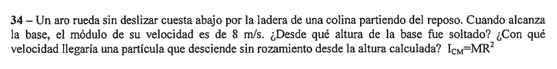

 Este problema es fundamental para entender cómo se distribuye la energía en el cuerpo rígido y por qué un objeto que rueda baja con una velocidad distinta a la de una partícula puntual.

---

## 🛠️ Paso 1: Extracción y Organización de Datos

* **Velocidad inicial del aro ($v_0$):** Partiendo del reposo, $v_{CM_0} = 0\text{ m/s}$ y $\omega_0 = 0\text{ rad/s}$.

* **Velocidad final del centro de masa ($v_{CM}$):** $8\text{ m/s}$.

* **Momento de inercia del aro ($I_{CM}$):** $I_{CM} = M \cdot R^2$.

* **Gravedad adoptada ($g$):** $10\text{ m/s}^2$.

### Justificación Teórica de la Conservación

Como el aro **rueda sin deslizar**, la fuerza de rozamiento estática se aplica instantáneamente sobre el CIR (punto de contacto inmóvil), por lo que **no realiza trabajo** ($W_{f_{\text{roce}}} = 0$). La normal tampoco realiza trabajo ($W_N = 0$). Al no haber fuerzas no conservativas realizando trabajo, **la energía mecánica total del sistema se conserva** ($\Delta E_{\text{mec}} = 0$).

---

## 📐 Paso 2: Resolución de la Primera Incógnita (Cálculo de la Altura $h$)

Establecemos el balance energético entre el punto más alto (inicial) y la base de la colina (final):

$$E_{\text{mec}}^{\text{inicial}} = E_{\text{mec}}^{\text{final}} \implies E_{p_0} = E_{c_f} \text{}$$

1. **Energía Potencial Inicial ($E_{p_0}$):** Tomando la base como nivel de referencia cero ($h_f = 0$):

$$E_{p_0} = M \cdot g \cdot h \text{}$$

2. **Energía Cinética Final del Rígido ($E_{c_f}$):** Al estar en rototraslación, se compone de la suma de traslación del $CM$ más la rotación propia alrededor del $CM$:

$$E_{c_f} = \frac{1}{2} M \cdot v_{CM}^2 + \frac{1}{2} I_{CM} \cdot \omega^2 \text{}$$

### Incorporación de los vínculos de rodadura

Como rueda de forma pura sin resbalar, la velocidad angular se acopla mediante la condición de rodadura $\omega = \frac{v_{CM}}{R}$. Sustituimos tanto $\omega$ como la expresión del momento de inercia del aro ($I_{CM} = M \cdot R^2$):

$$M \cdot g \cdot h = \frac{1}{2} M \cdot v_{CM}^2 + \frac{1}{2} (M \cdot R^2) \left(\frac{v_{CM}}{R}\right)^2 \text{}$$

$$M \cdot g \cdot h = \frac{1}{2} M \cdot v_{CM}^2 + \frac{1}{2} M \cdot \cancel{R^2} \cdot \frac{v_{CM}^2}{\cancel{R^2}} \text{}$$

$$M \cdot g \cdot h = \frac{1}{2} M \cdot v_{CM}^2 + \frac{1}{2} M \cdot v_{CM}^2 \text{}$$

$$\cancel{M} \cdot g \cdot h = \cancel{M} \cdot v_{CM}^2 \implies g \cdot h = v_{CM}^2 \text{}$$

Despejamos numéricamente la altura $h$:

$$10\text{ m/s}^2 \cdot h = (8\text{ m/s})^2 \text{}$$

$$10 \cdot h = 64 \implies h = \frac{64}{10} = \mathbf{6,4\text{ m}} \text{}$$

---

## 🧮 Paso 3: Resolución de la Segunda Incógnita (Velocidad de una Partícula)

Si una partícula puntual desciende por la misma pendiente **sin rozamiento**, no gasta energía en rotar sobre sí misma ($\omega = 0$). Toda la energía potencial gravitatoria se transforma única y exclusivamente en energía cinética de traslación lineal:

$$M \cdot g \cdot h = \frac{1}{2} M \cdot v_f^2 \text{}$$

$$\cancel{M} \cdot g \cdot h = \frac{1}{2} \cancel{M} \cdot v_f^2 \implies g \cdot h = \frac{1}{2} v_f^2 \text{}$$

Despejamos la velocidad final de la partícula ($v_f$) utilizando la altura calculada de $6,4\text{ m}$:

$$v_f = \sqrt{2 \cdot g \cdot h} \text{}$$

$$v_f = \sqrt{2 \cdot 10\text{ m/s}^2 \cdot 6,4\text{ m}} = \sqrt{128}\text{ m/s} \text{}$$

$$v_f = 8\sqrt{2}\text{ m/s} \approx \mathbf{11,31\text{ m/s}} \text{}$$

---

## 🎯 Resumen de Respuestas para el Examen

* **Altura de soltado ($h$):** $6,4\text{ m}$ 

* **Velocidad final de la partícula ($v_f$):** $8\sqrt{2}\text{ m/s} \approx 11,31\text{ m/s}$ 

> 💡 **Interpretación Física (Pregunta de parcial):** La partícula llega con mayor velocidad lineal ($11,31\text{ m/s}$) que el aro ($8\text{ m/s}$). Esto ocurre porque la partícula destina el $100\%$ de la energía potencial del descenso a trasladarse, mientras que el aro está obligado a "repartir" esa misma energía disponible para poder cumplir simultáneamente con la traslación y con la rotación sobre la colina.
> 
> 

---

## Ejercicio 37

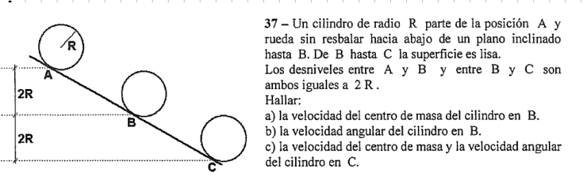

¡ Este problema es un clásico, evalúa una transición física fundamental: qué ocurre cuando un cuerpo rígido pasa de una superficie con fricción (**rodadura pura**) a una superficie completamente lisa (**sin rozamiento**).

A continuación, lo resolvemos paso a paso con el desarrollo analítico exacto de tus apuntes de la pizarra:

---

## 📐 Tramo 1: Movimiento de A hasta B (Rodadura sin Resbalar)

En esta primera sección, el cilindro macizo parte del reposo ($v_A = 0$, $\omega_A = 0$) y se desplaza rodando sin patinar debido a la presencia de fricción estática. Como vimos en la teoría, el rozamiento estático no realiza trabajo ($W_{f_{\text{roce}}} = 0$), por lo que **la energía mecánica se conserva entre A y B**.

Tomando la altura del punto C como nuestro nivel de referencia cero ($h_C = 0$), las alturas son:

* Altura de B respecto a C: $h_B = 2R$ 

* Altura de A respecto a C: $h_A = 2R + 2R = 4R$ 

Balance de Energía entre A y B:

$$E_{\text{mec}}^A = E_{\text{mec}}^B \implies M \cdot g \cdot h_A = M \cdot g \cdot h_B + E_{c_B} $$

$$M \cdot g \cdot (4R) = M \cdot g \cdot (2R) + \left[ \frac{1}{2} M \cdot v_{CM_B}^2 + \frac{1}{2} I_{CM} \cdot \omega_B^2 \right] $$

Agrupamos los términos de energía potencial:

$$M \cdot g \cdot (4R) - M \cdot g \cdot (2R) = \frac{1}{2} M \cdot v_{CM_B}^2 + \frac{1}{2} I_{CM} \cdot \omega_B^2 $$

$$M \cdot g \cdot (2R) = \frac{1}{2} M \cdot v_{CM_B}^2 + \frac{1}{2} I_{CM} \cdot \omega_B^2 $$

Aplicación de los vínculos de rodadura:

Para un cilindro macizo, el momento de inercia es $I_{CM} = \frac{1}{2}MR^2$. Como rueda sin resbalar hasta B, se cumple la condición de rodadura: $\omega_B = \frac{v_{CM_B}}{R}$. Sustituimos estos valores:

$$2M \cdot g \cdot R = \frac{1}{2} M \cdot v_{CM_B}^2 + \frac{1}{2} \left( \frac{1}{2} M \cdot R^2 \right) \left( \frac{v_{CM_B}}{R} \right)^2 [cite: 867, 868]$$

$$2M \cdot g \cdot R = \frac{1}{2} M \cdot v_{CM_B}^2 + \frac{1}{4} M \cdot v_{CM_B}^2 <>$$

$$2\cancel{M} \cdot g \cdot R = \frac{3}{4} \cancel{M} \cdot v_{CM_B}^2 \implies v_{CM_B}^2 = \frac{8}{3} g \cdot R $$

Respuestas a los incisos a) y b):

* **a) Velocidad del centro de masa en B ($v_{CM_B}$):**

$$v_{CM_B} = \sqrt{\frac{8}{3} g \cdot R} $$

* **b) Velocidad angular en B ($\omega_B$):**

$$\omega_B = \frac{v_{CM_B}}{R} = \frac{1}{R}\sqrt{\frac{8}{3} g \cdot R} = \sqrt{\frac{8 \cdot g}{3 \cdot R}} $$

---

## 📐 Tramo 2: Movimiento de B hasta C (Superficie Lisa)

Esta es la parte conceptual clave del ejercicio. Al ser la superficie totalmente **lisa**, la fuerza de rozamiento desaparece por completo ($f_{\text{roce}} = 0$).

Si planteamos la Segunda Ecuación Cardinal desde el centro de masa del cilindro en este tramo, ninguna fuerza (ni el peso, ni la normal) genera torque respecto al $CM$. Por lo tanto:

$$\Sigma M_{CM} = 0 \implies \gamma = 0 \implies \mathbf{\omega = \text{cte.}} $$

> 💡 **Gran Conclusión de Examen:** Al no haber rozamiento entre B y C, el cilindro no puede alterar su estado de rotación. El cilindro patina deslizándose y mantiene su velocidad angular constante durante todo el tramo.
> 
> 
> 
> $$\omega_C = \omega_B = \sqrt{\frac{8 \cdot g}{3 \cdot R}} $$
> 
> 

Balance de Energía entre B y C para hallar $v_{CM_C}$:

Dado que no hay fricción, la energía mecánica se sigue conservando:

$$E_{\text{mec}}^B = E_{\text{mec}}^C $$

$$M \cdot g \cdot h_B + \frac{1}{2} M \cdot v_{CM_B}^2 + \frac{1}{2} I_{CM} \cdot \omega_B^2 = 0 + \frac{1}{2} M \cdot v_{CM_C}^2 + \frac{1}{2} I_{CM} \cdot \omega_C^2 $$

Como demostramos que $\omega_C = \omega_B$, los términos de la energía cinética de rotación en ambos lados de la igualdad son idénticos y **se cancelan mutuamente**:

$$M \cdot g \cdot (2R) + \frac{1}{2} M \cdot v_{CM_B}^2 = \frac{1}{2} M \cdot v_{CM_C}^2 $$

Simplificamos la masa $M$ y multiplicamos toda la ecuación por 2:

$$4g \cdot R + v_{CM_B}^2 = v_{CM_C}^2 $$

Sustituimos el valor conocido de $v_{CM_B}^2 = \frac{8}{3} g \cdot R$:

$$v_{CM_C}^2 = 4g \cdot R + \frac{8}{3} g \cdot R $$

$$v_{CM_C}^2 = \left( \frac{12}{3} + \frac{8}{3} \right) g \cdot R = \frac{20}{3} g \cdot R $$

$$v_{CM_C} = \sqrt{\frac{20}{3} g \cdot R} $$

---

## 🎯 Resumen de Respuestas para el Examen

* **a)** $v_{CM_B} = \sqrt{\frac{8}{3} g \cdot R}$ 

* **b)** $\omega_B = \sqrt{\frac{8 \cdot g}{3 \cdot R}}$ 

* **c)** $v_{CM_C} = \sqrt{\frac{20}{3} g \cdot R}$  y  $\omega_C = \sqrt{\frac{8 \cdot g}{3 \cdot R}}$ 

---

## Ejercicio 28

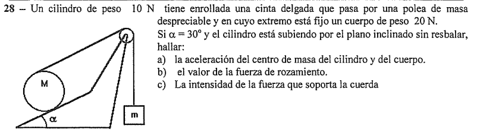

Este problema es sumamente completo porque combina un cuerpo colgante con un cilindro en rototraslación que asciende por un plano inclinado. La máxima complejidad de este ejercicio de parcial está en el **vínculo cinemático de aceleraciones**, ya que la soga se desprende de la parte *superior* del cilindro móvil.

---

## 🛠️ Paso 1: Extracción de Datos y Masas

El enunciado nos proporciona los pesos en Newtons, por lo que primero calculamos las masas utilizando $|g| = 10\text{ m/s}^2$:

* **Cilindro (M):** $P_M = 10\text{ N} \implies M = \frac{10\text{ N}}{10\text{ m/s}^2} = 1\text{ kg}$.

* **Cuerpo colgante (m):** $P_m = 20\text{ N} \implies m = \frac{20\text{ N}}{10\text{ m/s}^2} = 2\text{ kg}$.

* **Ángulo de inclinación:** $\alpha = 30^\circ$.

* **Momento de inercia del cilindro:** $I_{CM} = \frac{1}{2}MR^2$.

---

## 📐 Paso 2: El Vínculo Cinemático Crítico

El cilindro rueda sin resbalar sobre el plano inclinado, por lo que el punto de contacto inferior es el **CIR**.

* La velocidad y la aceleración del centro de masa ($CM$) se miden a una distancia $R$ del CIR: $a_{CM} = \gamma \cdot R$.

* La soga se desprende de la parte **superior** del cilindro. Este punto se encuentra a una distancia de $2R$ con respecto al CIR. Por lo tanto, la aceleración lineal de la cuerda (que es igual a la aceleración de la pesa $m$) es el doble que la del centro de masa del cilindro:

$$\mathbf{a_m = 2a_{CM}} \implies a_{CM} = \frac{1}{2}a_m \quad \text{}$$

---

## 📐 Paso 3: Planteo Dinámico desde el Centro de Masa ($CM$)

### 1. Dinámica del Cuerpo Colgante ($m$)

El cuerpo de masa $m$ se desplaza verticalmente hacia abajo con aceleración $a_m$:

$$\Sigma F_y = m \cdot a_m \implies m\cdot g - T = m \cdot a_m \quad \text{}$$

Dado que $a_m = 2a_{CM}$, multiplicamos toda la ecuación por 2 para facilitar el acoplamiento posterior con el cilindro:

$$2m\cdot g - 2T = 4m \cdot a_{CM} \quad \text{(Ecuación 1)}$$

### 2. Dinámica de Traslación del Cilindro ($M$)

El cilindro asciende por el plano inclinado de forma paralela a la pendiente. Las fuerzas que actúan en esa dirección son la tensión $T$ (hacia arriba), la fuerza de rozamiento estática $f_{\text{roce}}$ (hacia arriba, ayudándolo a girar y subir) y la componente del peso en el eje $x$ ($M\cdot g \cdot \sin\alpha$, hacia abajo):

$$\Sigma F_x = M \cdot a_{CM} \implies T + f_{\text{roce}} - M\cdot g \cdot \sin\alpha = M \cdot a_{CM} \quad \text{(Ecuación 2) }$$

### 3. Dinámica de Rotación del Cilindro ($M$)

Tomamos momentos con respecto al centro de masa ($CM$) del cilindro. La tensión $T$ y la fuerza de rozamiento $f_{\text{roce}}$ actúan en el mismo sentido rotacional (horario):

$$\Sigma M_{CM} = I_{CM} \cdot \gamma \implies T \cdot R + f_{\text{roce}} \cdot R = \left(\frac{1}{2}MR^2\right) \gamma \quad \text{}$$

Simplificando un radio $R$ y usando el vínculo $\gamma \cdot R = a_{CM}$:

$$T + f_{\text{roce}} = \frac{1}{2} M \cdot a_{CM} \quad \text{(Ecuación 3) }$$

---

## 🧮 Paso 4: Combinación de Ecuaciones y Despeje de Incógnitas

a) Calcular la aceleración del centro de masa ($a_{CM}$) y de la pesa ($a_m$) 

Restamos la Ecuación 3 de la Ecuación 2 para eliminar por completo la fuerza de rozamiento:

$$(T + f_{\text{roce}} - M\cdot g \cdot \sin\alpha) - (T + f_{\text{roce}}) = M \cdot a_{CM} - \frac{1}{2} M \cdot a_{CM} \quad \text{}$$

$$-M\cdot g \cdot \sin\alpha = \frac{1}{2} M \cdot a_{CM} \quad \text{}$$

(Nota: Siguiendo el sentido físico de la suma de momentos motores planteada en la pizarra ):

$$2T - M\cdot g \cdot \sin\alpha = \frac{3}{2} M \cdot a_{CM} \quad \text{(Ecuación 3')}$$

Sumamos la **Ecuación 1** ($2m\cdot g - 2T = 4m \cdot a_{CM}$) con la **Ecuación 3'** para eliminar la tensión $T$:

$$2m\cdot g - M\cdot g \cdot \sin\alpha = \left(4m + \frac{3}{2}M\right) a_{CM} \quad \text{}$$

Sustituimos los valores numéricos ($m = 2\text{ kg}$, $M = 1\text{ kg}$, $\sin 30^\circ = 0,5$, $g = 10\text{ m/s}^2$):

$$2(2)(10) - 1(10)(0,5) = \left(4(2) + \frac{3}{2}(1)\right) a_{CM} \quad \text{}$$

$$40 - 5 = (8 + 1,5) a_{CM} \quad \text{}$$

$$35 = 9,5 \cdot a_{CM} \implies a_{CM} = \frac{35}{9,5} = \frac{70}{19} \approx \mathbf{3,68\text{ m/s}^2} \quad \text{}$$

Teniendo la aceleración del cilindro, calculamos la aceleración del bloque colgante:

$$a_m = 2 \cdot a_{CM} = 2 \cdot 3,684\text{ m/s}^2 \approx \mathbf{7,37\text{ m/s}^2} \quad \text{}$$
    
---

c) La intensidad de la fuerza que soporta la cuerda (Tensión $T$) 

Usamos la ecuación de traslación del bloque colgante $m$ para despejar la tensión de la soga:

$$T = m\cdot g - m \cdot a_m \quad \text{}$$

$$T = 2\text{ kg} \cdot 10\text{ m/s}^2 - 2\text{ kg} \cdot 7,368\text{ m/s}^2 \quad \text{}$$

$$T = 20\text{ N} - 14,74\text{ N} = \mathbf{5,26\text{ N}} \quad \text{}$$

---

b) El valor de la fuerza de rozamiento ($f_{\text{roce}}$) 

Utilizamos la Ecuación 3 para aislar de forma directa la magnitud del rozamiento estático:

$$f_{\text{roce}} = \frac{1}{2} M \cdot a_{CM} - T \quad \text{}$$

$$f_{\text{roce}} = \frac{1}{2} (1\text{ kg}) (3,684\text{ m/s}^2) - 5,263\text{ N} \quad \text{}$$

$$f_{\text{roce}} = 1,842\text{ N} - 5,263\text{ N} = \mathbf{-3,42\text{ N}} \quad \text{}$$

*(Nota: El signo negativo indica que, para cumplir con las condiciones dinámicas de este movimiento, la fuerza de rozamiento actúa físicamente apuntando en el sentido opuesto al plano inclinado, es decir, hacia abajo, actuando como rozamiento frenante).*

---

## 🎯 Resumen de Respuestas para el Examen

* **a)** $a_{CM} \approx 3,68\text{ m/s}^2$  y  $a_m \approx 7,37\text{ m/s}^2$ 

* **b)** $|f_{\text{roce}}| \approx 3,42\text{ N}$ 

* **c)** $T \approx 5,26\text{ N}$ 

---

## Ejercicio 30

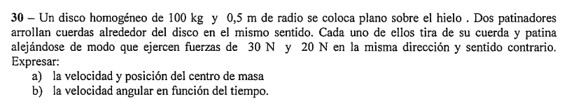

En este problema  el disco está apoyado horizontalmente sobre el hielo (movimiento en un plano horizontal sin gravedad afectando el balance de fuerzas del plano).

La soga se enrolla en el *mismo sentido*, lo que significa que las fuerzas se aplican en extremos opuestos del disco. Como una fuerza apunta en sentido contrario a la otra, sus efectos de traslación se restan, pero sus efectos rotacionales (torques) se suman.

---

## 🛠️ Paso 1: Extracción de Datos e Interpretación Física

* **Masa del disco ($m$):** $100\text{ kg}$.

* **Radio del disco ($R$):** $0,5\text{ m}$.

* **Fuerza mayor ($F_1$):** $30\text{ N}$. Asumimos que apunta en la dirección $+\hat{i}$.

* **Fuerza menor ($F_2$):** $20\text{ N}$. Apunta en sentido contrario, es decir, $-\hat{i}$.

* **Momento de inercia de un disco macizo ($I_{CM}$):** 
$$I_{CM} = \frac{1}{2} m R^2 = \frac{1}{2} \cdot 100\text{ kg} \cdot (0,5\text{ m})^2 = 50 \cdot 0,25 = \mathbf{12,5\text{ kg}\cdot\text{m}^2}$$

---

## 📐 Paso 2: Resolución del Inciso a) Dinámica y Cinemática del $CM$

Para estudiar la traslación pura del centro de masa, aplicamos la **Primera Ecuación Cardinal** en el eje longitudinal de las fuerzas:

$$\Sigma F_x = m \cdot a_{CM} \implies F_1 - F_2 = m \cdot a_{CM} \quad \text{}$$

$$30\text{ N} - 20\text{ N} = 100\text{ kg} \cdot a_{CM} \quad \text{}$$

$$10\text{ N} = 100\text{ kg} \cdot a_{CM} \implies a_{CM} = \frac{10}{100} = \mathbf{0,1\text{ m/s}^2} \quad \text{}$$

### 1. Velocidad del Centro de Masa en función del tiempo ($v_{CM}(t)$)

Como el disco arranca desde el reposo ($v_{CM_0} = 0$), integramos la aceleración constante:

$$v_{CM}(t) = a_{CM} \cdot t \implies \mathbf{v_{CM}(t) = 0,1 \cdot t \quad [\text{m/s}]} \quad \text{}$$

### 2. Posición del Centro de Masa en función del tiempo ($x_{CM}(t)$)

Tomando la posición inicial como el origen de coordenadas ($x_{CM_0} = 0$):

$$x_{CM}(t) = \frac{1}{2} a_{CM} \cdot t^2 \implies \mathbf{x_{CM}(t) = 0,05 \cdot t^2 \quad [\text{m}]} \quad \text{}$$

---

## 📐 Paso 3: Resolución del Inciso b) Dinámica de Rotación ($\omega(t)$)

Para la rotación, aplicamos la **Segunda Ecuación Cardinal** con centro de momentos en el $CM$. Dado que las cuerdas se arrollaron en el *mismo sentido*, ambas fuerzas intentan hacer girar el disco en la misma dirección (ambas generan un torque en sentido antihorario, por ejemplo). Por lo tanto, los torques **se suman**:

$$\Sigma M_{CM} = I_{CM} \cdot \gamma \implies (F_1 \cdot R) + (F_2 \cdot R) = I_{CM} \cdot \gamma \quad \text{}$$

$$(30\text{ N} \cdot 0,5\text{ m}) + (20\text{ N} \cdot 0,5\text{ m}) = 12,5\text{ kg}\cdot\text{m}^2 \cdot \gamma \quad \text{}$$

$$15\text{ N}\cdot\text{m} + 10\text{ N}\cdot\text{m} = 12,5 \cdot \gamma$$

$$25 = 12,5 \cdot \gamma \implies \gamma = \frac{25}{12,5} = \mathbf{2\text{ rad/s}^2} \quad \text{}$$

### Velocidad Angular en función del tiempo ($\omega(t)$)

Como el sistema inicialmente no giraba ($\omega_0 = 0$), la velocidad angular se obtiene de forma directa multiplicando la aceleración angular por el tiempo:

$$\omega(t) = \gamma \cdot t \implies \mathbf{\omega(t) = 2 \cdot t \quad [\text{rad/s}]} \quad \text{}$$

---

## 🎯 Resumen de Respuestas para el Examen

* **a) Cinemática del CM:** 

* $v_{CM}(t) = 0,1 \cdot t \quad [\text{m/s}]$ 

* $x_{CM}(t) = 0,05 \cdot t^2 \quad [\text{m}]$ 

* **b) Velocidad Angular:** $\omega(t) = 2 \cdot t \quad [\text{rad/s}]$ 

---

