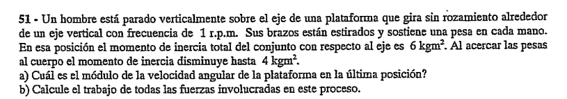
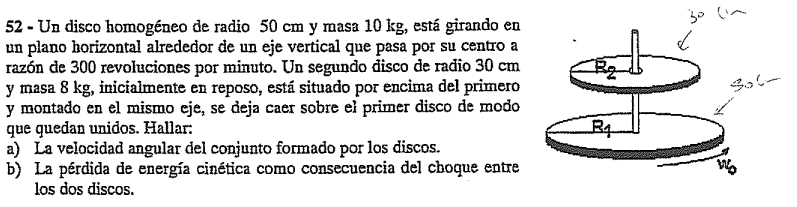

## Ejercicio 51

Este problema es espectacular porque cambia completamente de registro analítico: entramos de lleno en el principio de **Conservación del Momento Angular ($L$)** combinándolo con variaciones de energía cinética rotacional debido a fuerzas internas.

---

## 🛠️ Paso 1: Extracción de Datos y Conversión Angular

Organizamos las variables en unidades del Sistema Internacional:

* **Frecuencia inicial ($f_0$):** $1\text{ r.p.m.}$. Convertimos a radianes por segundo:

$$\omega_0 = 1\text{ r.p.m.} = \frac{1 \cdot 2\pi}{60\text{ s}} = \frac{\pi}{30}\text{ rad/s} \quad \text{}$$

* **Momento de inercia inicial ($I_0$):** $6\text{ kg}\cdot\text{m}^2$.

* **Momento de inercia final ($I_f$):** $4\text{ kg}\cdot\text{m}^2$.

---

## 📐 Paso 2: Resolución del Inciso a) Conservación del Momento Angular

Dado que la plataforma gira sobre su eje **sin rozamiento** , la sumatoria de momentos de las fuerzas externas respecto al eje vertical de rotación es estrictamente nula ($\Sigma \vec{M}_{\text{ext}} = \vec{0}$). Por lo tanto, el momento angular neto del sistema permanece constante antes y después de encoger los brazos:

$$L_{\text{inicial}} = L_{\text{final}} \implies I_0 \cdot \omega_0 = I_f \cdot \omega_f \quad \text{}$$

Sustituimos nuestros valores e incógnitas conocidos:

$$6\text{ kg}\cdot\text{m}^2 \cdot \left(\frac{\pi}{30}\text{ s}^{-1}\right) = 4\text{ kg}\cdot\text{m}^2 \cdot \omega_f \quad \text{}$$

$$\frac{6\pi}{30} = 4\omega_f \implies \frac{\pi}{5} = 4\omega_f \quad \text{}$$

Despejamos la velocidad angular final ($\omega_f$):

$$\omega_f = \frac{\pi}{20}\text{ rad/s} \approx \mathbf{0,157\text{ rad/s}} \quad \text{}$$

---

## 🧮 Paso 3: Resolución del Inciso b) Trabajo de las Fuerzas Involucradas

Para hallar el trabajo neto realizado por todas las fuerzas durante este proceso (incluyendo el trabajo muscular de los brazos del hombre al atraer las pesas), aplicamos el **Teorema del Trabajo y la Energía Cinética Rotacional**:

$$W_{\text{total}} = \Delta E_c = E_{c_f} - E_{c_0} \quad \text{}$$

### 1. Cálculo de la Energía Cinética Inicial ($E_{c_0}$)

$$E_{c_0} = \frac{1}{2} I_0 \cdot \omega_0^2 = \frac{1}{2} \cdot 6\text{ kg}\cdot\text{m}^2 \cdot \left(\frac{\pi}{30}\text{ s}^{-1}\right)^2 \quad \text{}$$

$$E_{c_0} = 3 \cdot \frac{\pi^2}{900} = \frac{\pi^2}{300}\text{ J} \approx 0,0329\text{ J} \quad \text{}$$

### 2. Cálculo de la Energía Cinética Final ($E_{c_f}$)

$$E_{c_f} = \frac{1}{2} I_f \cdot \omega_f^2 = \frac{1}{2} \cdot 4\text{ kg}\cdot\text{m}^2 \cdot \left(\frac{\pi}{20}\text{ s}^{-1}\right)^2 \quad \text{}$$

$$E_{c_f} = 2 \cdot \frac{\pi^2}{400} = \frac{\pi^2}{200}\text{ J} \approx 0,0493\text{ J} \quad \text{}$$

### 3. Variación del Trabajo Neto ($W_{\text{total}}$)

$$W_{\text{total}} = \frac{\pi^2}{200} - \frac{\pi^2}{300} = \left(\frac{3\pi^2 - 2\pi^2}{600}\right) = \frac{\pi^2}{600}\text{ J} \quad \text{}$$

$$W_{\text{total}} \approx \mathbf{0,0164\text{ J}} \quad \text{}$$

> 💡 **Interpretación Física Notar:** El trabajo dio un valor positivo ($W > 0$). Esto significa que la energía mecánica del sistema **aumentó**. Ese incremento energético proviene del trabajo químico interno realizado por los músculos del hombre al contraer sus brazos en contra de la fuerza centrífuga.
> 
> 

---

## 🎯 Resumen de Respuestas para el Examen

* **a) Velocidad angular final ($\omega_f$):** $\frac{\pi}{20}\text{ rad/s} \approx 0,157\text{ rad/s}$ 

* **b) Trabajo realizado ($W_{\text{total}}$):** $\frac{\pi^2}{600}\text{ J} \approx 0,0164\text{ J}$ 

---

## Ejercicio 52

Este ejercicio modela un **choque rotacional plástico** (acoplamiento coaxial de dos discos).

Para resolverlo, aplicaremos el principio de **Conservación del Momento Angular** para el inciso a , y realizaremos un balance de energía rotacional para cuantificar la pérdida energética por fricción interna durante el acoplamiento en el inciso b.

---

## 🛠️ Paso 1: Extracción de Datos y Conversión de Unidades

Definimos las variables correspondientes a cada disco en unidades del Sistema Internacional:

* **Disco Inferior (1 o A):**
* Masa ($m_1$): $10\text{ kg}$.

* Radio ($R_1$): $50\text{ cm} = 0,5\text{ m}$.

* Velocidad angular inicial ($\omega_0$): Gira a $300\text{ r.p.m.}$. Convertimos a radianes por segundo:

$$\omega_0 = 300\text{ r.p.m.} = \frac{300 \cdot 2\pi}{60\text{ s}} = 10\pi\text{ rad/s} \approx 31,42\text{ rad/s} \quad \text{}$$

* **Disco Superior (2 o B):**
* Masa ($m_2$): $8\text{ kg}$.

* Radio ($R_2$): $30\text{ cm} = 0,3\text{ m}$.

* Velocidad angular inicial: Como parte del reposo, $\omega_{2_0} = 0\text{ rad/s}$.

---

## 📐 Paso 2: Cálculo de los Momentos de Inercia Individuales

Como ambos discos son macizos y homogéneos, calculamos sus momentos de inercia respecto al eje baricéntrico central:

1. **Inercia del Disco 1 ($I_1$):**

$$I_1 = \frac{1}{2} m_1 R_1^2 = \frac{1}{2} \cdot 10\text{ kg} \cdot (0,5\text{ m})^2 = 5 \cdot 0,25 = \mathbf{1,25\text{ kg}\cdot\text{m}^2} \quad \text{}$$

2. **Inercia del Disco 2 ($I_2$):**

$$I_2 = \frac{1}{2} m_2 R_2^2 = \frac{1}{2} \cdot 8\text{ kg} \cdot (0,3\text{ m})^2 = 4 \cdot 0,09 = \mathbf{0,36\text{ kg}\cdot\text{m}^2} \quad \text{}$$

3. **Inercia Total del Conjunto Acoplado ($I_f$):**
Cuando el disco superior cae y se une al inferior, ambos giran solidariamente como un único rígido compuesto. Sus inercias se suman de forma directa:

$$I_f = I_1 + I_2 = 1,25\text{ kg}\cdot\text{m}^2 + 0,36\text{ kg}\cdot\text{m}^2 = \mathbf{1,61\text{ kg}\cdot\text{m}^2} \quad \text{}$$

---

## 📐 Paso 3: Resolución del Inciso a) Velocidad Angular del Conjunto ($\omega_f$)

Dado que el sistema de discos horizontales gira libremente sobre su eje central vertical sin rozamiento externo en los apoyos , la sumatoria de torques externos con respecto al eje es nula ($\Sigma \vec{M}_{\text{ext}} = \vec{0}$). Por lo tanto, **el momento angular neto del sistema se conserva de forma absoluta**:

$$L_{\text{inicial}} = L_{\text{final}} \implies I_1 \cdot \omega_0 = I_f \cdot \omega_f \quad \text{}$$

Sustituimos los valores calculados de inercia y la velocidad angular inicial:

$$1,25\text{ kg}\cdot\text{m}^2 \cdot (10\pi\text{ rad/s}) = 1,61\text{ kg}\cdot\text{m}^2 \cdot \omega_f \quad \text{}$$

$$12,5\pi = 1,61 \cdot \omega_f \quad \text{}$$

Despejamos la velocidad angular final del conjunto acoplado ($\omega_f$):

$$\omega_f = \frac{12,5\pi}{1,61} \approx \frac{39,27}{1,61} \approx \mathbf{24,39\text{ rad/s}} \quad \text{}$$

---

## 🧮 Paso 4: Resolución del Inciso b) Pérdida de Energía Cinética ($\Delta E_c$)

Durante el proceso de acoplamiento, la fuerza de rozamiento interna entre las caras de los discos actúa hasta igualar sus velocidades. Al tratarse de un choque plástico rotacional, se genera una pérdida disipativa de energía mecánica:

$$\Delta E_c = E_{c_f} - E_{c_0} \quad \text{}$$

1. **Energía Cinética Inicial ($E_{c_0}$):** Solo el disco inferior aportaba energía cinética al sistema:

$$E_{c_0} = \frac{1}{2} I_1 \cdot \omega_0^2 = \frac{1}{2} \cdot 1,25\text{ kg}\cdot\text{m}^2 \cdot (10\pi\text{ rad/s})^2 \quad \text{}$$

$$E_{c_0} = 0,625 \cdot 100\pi^2 = 62,5\pi^2\text{ J} \approx \mathbf{616,85\text{ J}} \quad \text{}$$

2. **Energía Cinética Final ($E_{c_f}$):** Calculada con la masa acoplada total girando a la velocidad común $\omega_f$:

$$E_{c_f} = \frac{1}{2} I_f \cdot \omega_f^2 = \frac{1}{2} \cdot 1,61\text{ kg}\cdot\text{m}^2 \cdot (24,39\text{ rad/s})^2 \quad \text{}$$

$$E_{c_f} = 0,805 \cdot 594,87 \approx \mathbf{478,87\text{ J}} \quad \text{}$$

3. **Cálculo de la Variación de Energía ($\Delta E_c$):**

$$\Delta E_c = 478,87\text{ J} - 616,85\text{ J} = \mathbf{-137,98\text{ J}} \quad \text{}$$

s
El signo negativo corrobora una pérdida neta de energía disipada en forma de calor por el frotamiento entre los platos.

---

## 🎯 Resumen de Respuestas para el Examen

* **a) Velocidad angular final del conjunto ($\omega_f$):** $\approx \mathbf{24,39\text{ rad/s}}$ 

* **b) Energía cinética perdida en el choque ($\Delta E_c$):** $\approx \mathbf{137,98\text{ J}}$ 

---

