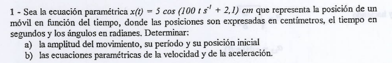
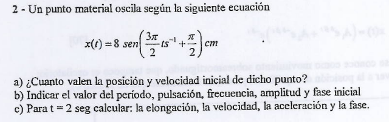
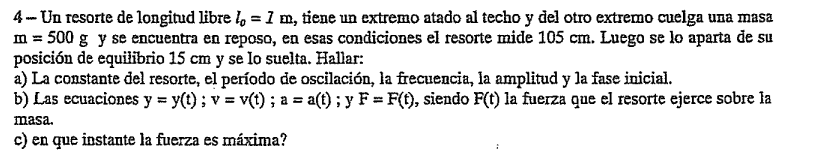
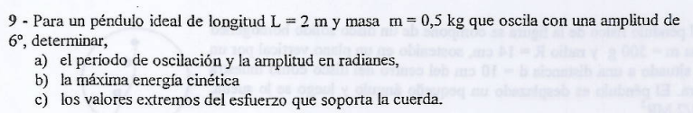
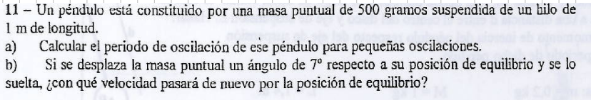

# Teoría del Movimiento Oscilatorio Armónico Simple (MOAS)

## Parte I: Dinámica y Ecuación Diferencial del MOAS

El modelo físico fundamental consiste en una masa $m$ sujeta al extremo libre de un resorte ideal de constante elástica $k$. Bajo las hipótesis simplificadoras de la cátedra, consideramos la masa del resorte, el rozamiento superficial y la resistencia del medio como totalmente despreciables.

### 1. Deducción Dinámica (Ley de Hooke)

Cuando apartamos la masa de su posición de equilibrio una distancia $x$, el resorte reacciona ejerciendo una **fuerza elástica restitutiva**. Según la Ley de Hooke, esta fuerza es proporcional al desplazamiento pero de sentido opuesto (apunta siempre hacia la posición de equilibrio):

$$\vec{f}_e = -k \cdot x \cdot \hat{i} \text{}$$

Aplicando la Segunda Ley de Newton en el eje horizontal del movimiento:

$$\Sigma F_x = m \cdot a \implies -k \cdot x = m \cdot a \text{}$$

Sabiendo que la aceleración es la derivada segunda de la posición respecto al tiempo ($a = \frac{d^2x}{dt^2}$) , reordenamos los términos y obtenemos la **ecuación diferencial característica del MOAS**:

$$m\frac{d^2x}{dt^2} + k \cdot x = 0 \text{} \implies \frac{d^2x}{dt^2} + \frac{k}{m}x = 0 \text{}$$

Esta es una ecuación diferencial ordinaria de segundo orden, lineal, homogénea y a coeficientes constantes.

---

## Parte II: Ecuaciones Horarias del Movimiento

Para resolver la ecuación diferencial de manera intuitiva, buscamos una función matemática cuya derivada segunda sea idéntica a la función original pero con signo cambiado. Las funciones armónicas (seno y coseno) cumplen estrictamente esta propiedad.

Definimos la **pulsación o frecuencia angular propia ($\omega$)** del sistema como:

$$\omega = \sqrt{\frac{k}{m}} \text{}$$

A partir de allí, la solución general (ecuación horaria de posición) adopta la forma:

$$x(t) = A \cdot \cos(\omega \cdot t + \varphi) \text{}$$

Donde los parámetros fundamentales son:

* **Amplitud ($A$):** Representa la elongación máxima que alcanza la masa respecto al centro de equilibrio. El cuerpo oscila confinadamente entre $-A$ y $A$.

* **Fase instantánea ($\omega \cdot t + \varphi$):** El argumento de la función armónica (medido en radianes).

* **Fase inicial o constante de fase ($\varphi$ o $\varphi_0$):** Determina la posición y el sentido del movimiento en el instante $t = 0$.

### 1. Campo de Velocidad y Aceleración

Derivando sucesivamente la posición respecto al tiempo, obtenemos las ecuaciones horarias de las variables cinemáticas lineales:

* **Velocidad ($v(t)$):**

$$v(t) = \frac{dx(t)}{dt} = -\omega \cdot A \cdot \sin(\omega \cdot t + \varphi) \text{}$$

El módulo de la velocidad máxima es $v_{\text{max}} = \omega \cdot A$, y ocurre justamente cuando la masa pasa por la posición de equilibrio ($x = 0$).

* **Aceleración ($a(t)$):**

$$a(t) = \frac{dv(t)}{dt} = -\omega^2 \cdot A \cdot \cos(\omega \cdot t + \varphi) \text{}$$

Notar que podemos reescribir la aceleración como $a(t) = -\omega^2 \cdot x(t)$. El módulo de la aceleración máxima es $a_{\text{max}} = \omega^2 \cdot A$, y se alcanza en los extremos de máxima elongación ($x = \pm A$).

---

## Parte III: Período ($T$) y Frecuencia ($f$)

Dado que las funciones armónicas son cíclicas y se repiten cada $2\pi$ radianes en su argumento, definimos:

* **Período ($T$):** El intervalo de tiempo regular requerido para completar una oscilación completa.

$$T = \frac{2\pi}{\omega} = 2\pi\sqrt{\frac{m}{k}} \text{}$$

*Nota crucial de parcial:* El período de un MOAS depende **única y exclusivamente de las propiedades intrínsecas del sistema (la masa y la rigidez del resorte)**, siendo completamente independiente de la amplitud de la oscilación.

* **Frecuencia ($f$):** La cantidad de oscilaciones completas ejecutadas por unidad de tiempo. Es la inversa del período:

$$f = \frac{1}{T} = \frac{\omega}{2\pi} \text{}$$

---

## Parte IV: Conservación de la Energía Mecánica

En el MOAS, la fuerza elástica es conservativa. Al no haber fuerzas disipativas involucradas, la energía mecánica total del sistema ($E_M$) se mantiene rigurosamente constante en cualquier posición y tiempo:

$$E_M = E_c(t) + E_p(t) = \text{cte.} \text{}$$

* **Energía Cinética ($E_c$):** Asociada a la velocidad de la masa.

$$E_c = \frac{1}{2}m \cdot v^2 = \frac{1}{2}m \cdot \omega^2 \cdot A^2 \cdot \sin^2(\omega \cdot t + \varphi) \text{}$$

* **Energía Potencial Elástica ($E_p$):** Asociada a la deformación del resorte.

$$E_p = \frac{1}{2}k \cdot x^2 = \frac{1}{2}k \cdot A^2 \cdot \cos^2(\omega \cdot t + \varphi) \text{}$$

Sabiendo que $k = m \cdot \omega^2$ , al sumar miembro a miembro ambas energías y aplicar la identidad trigonométrica fundamental ($\sin^2\theta + \cos^2\theta = 1$) , la energía mecánica total se reduce a la expresión constante:

$$E_M = \frac{1}{2}k \cdot A^2 = \frac{1}{2}m \cdot v_{\text{max}}^2 \text{ }$$

### El Gráfico de Energía Potencial (La Parábola de Estabilidad)

Si graficamos la energía potencial elástica en función de la elongación ($E_p = \frac{1}{2}kx^2$), obtenemos una parábola simétrica centrada en el origen.

* **Zona II (Zona Permitida):** Comprende el intervalo $-|A| < x < +|A|$. Aquí la energía potencial es menor que la energía mecánica total ($E_p < E_M$), dando lugar a valores de energía cinética positivos ($E_c > 0$) y velocidades reales.

* **Zonas I y III (Zonas Prohibidas):** Fuera de la amplitud ($x < -A$ o $x > A$). Físicamente requerirían una energía cinética negativa ($E_c < 0$) y velocidades imaginarias, lo cual es clásicamente imposible. La partícula jamás podrá encontrarse en estas regiones.

---

## Parte V: El Péndulo Simple (Aproximación de Pequeñas Oscilaciones)

Un péndulo simple ideal consiste en una masa puntual $m$ suspendida del extremo de un hilo inextensible y de masa despreciable de longitud $l$. Al separarlo de la vertical un ángulo $\varphi$, el sistema oscila describiendo un arco de circunferencia en un plano vertical.

### 1. Análisis Dinámico (Componentes de la Aceleración)

Descomponemos las fuerzas (la tensión $\vec{T}$ y el peso $\vec{P}$) en las direcciones radial y tangencial a la trayectoria:

* **Dirección Radial (Hacia el centro de giro):**

$$T - m \cdot g \cdot \cos\varphi = m \cdot \frac{v^2}{l} \implies T = m \cdot g \cdot \cos\varphi + m \cdot \frac{v^2}{l} \quad \text{}$$

> 💡 **Pregunta típica de examen:** La tensión de la cuerda es **máxima cuando pasa por la vertical ($\varphi = 0$)**, ya que en ese punto el coseno es máximo ($\cos 0^\circ = 1$) y la velocidad lineal $v$ también alcanza su valor máximo.
> 
> 

* **Dirección Tangencial (Fuerza Restitutiva):**
La componente tangencial del peso intenta restaurar el equilibrio, actuando en sentido opuesto al desplazamiento angular:

$$-m \cdot g \cdot \sin\varphi = m \cdot a_\tau \quad \text{}$$

Sabiendo que el arco recorrido es $s = l \cdot \varphi$, la aceleración tangencial se expresa como $a_\tau = l \cdot \frac{d^2\varphi}{dt^2}$. Sustituyendo y simplificando la masa $m$, obtenemos la ecuación diferencial del péndulo:

$$\frac{d^2\varphi}{dt^2} + \frac{g}{l}\sin\varphi = 0 \quad \text{}$$

### 2. Hipótesis de Pequeñas Oscilaciones

Esta ecuación no es formalmente igual a la del sistema masa-resorte debido al término $\sin\varphi$. Sin embargo, si restringimos el movimiento a **ángulos pequeños (menores a $10^\circ$ o en radianes)**, podemos aplicar el desarrollo de Taylor de primer orden: $\sin\varphi \approx \varphi$. La ecuación se linealiza:

$$\frac{d^2\varphi}{dt^2} + \frac{g}{l}\varphi = 0 \quad \text{}$$

Por analogía directa con el resorte, definimos su pulsación propia ($\omega$) y su período ($T$) de oscilación:

$$\omega = \sqrt{\frac{g}{l}} \quad \text{} \qquad \text{y} \qquad T = \frac{2\pi}{\omega} = 2\pi\sqrt{\frac{l}{g}} \quad \text{}$$

---

## Parte VI: El Péndulo Físico o Compuesto

Un **Péndulo Físico** es cualquier cuerpo extenso de masa $m$ y forma arbitraria que está acoplado a un eje de suspensión horizontal fijo $E$ que **no pasa por su centro de masa ($CM$)**, permitiéndole oscilar en un plano vertical bajo la acción de su propio peso.

### 1. Planteo Dinámico Rotacional

Como el cuerpo realiza una rotación pura alrededor del eje rígido $E$, aplicamos la **Segunda Ecuación Cardinal de la Dinámica** tomando como centro de momentos el propio eje $E$ :

$$\Sigma M_E = I_E \cdot \gamma \implies -m \cdot g \cdot d \cdot \sin\varphi = I_E \cdot \frac{d^2\varphi}{dt^2} \quad \text{}$$

Donde:

* $I_E$: Es el momento de inercia del cuerpo compuesto respecto al eje de suspensión $E$ (calculado casi siempre usando el **Teorema de Steiner**: $I_E = I_{CM} + m \cdot d^2$) .
* $d$: Es la distancia lineal en línea recta que separa al eje de suspensión $E$ del centro de masa ($CM$) del cuerpo .

### 2. Ecuación de Movimiento para Pequeñas Oscilaciones

Si asumimos nuevamente amplitudes angulares pequeñas ($\sin\varphi \approx \varphi$) , la ecuación diferencial se reduce a la forma armónica estándar:

$$\frac{d^2\varphi}{dt^2} + \left(\frac{m \cdot g \cdot d}{I_E}\right)\varphi = 0 \quad \text{}$$

Deduciendo por analogía formal, la pulsación angular ($\omega$) y el período ($T$) de un péndulo físico responden a :

$$\omega = \sqrt{\frac{m \cdot g \cdot d}{I_E}} \quad \text{y} \quad T = 2\pi\sqrt{\frac{I_{E}}{m \cdot g \cdot d}} \quad \text{}$$

---

## 7. Movimiento Oscilatorio Amortiguado (Breve Resumen Conceptual)

En el mundo real, los sistemas experimentan fuerzas viscosas disipativas del medio (generalmente proporcionales a la velocidad, $\vec{f}_v = -k_v \cdot \vec{v}$) . La ecuación diferencial toma la forma completa:

$$\frac{d^2x}{dt^2} + 2\delta\frac{dx}{dt} + \omega^2x = 0 \quad \text{}$$

Donde $\delta = \frac{k_v}{2m}$ es el factor de amortiguamiento . Dependiendo de la relación matemática entre $\delta$ y $\omega$, la física clasifica tres comportamientos dinámicos :

1. **Subamortiguado ($\delta < \omega$):** El cuerpo continúa oscilando, pero su **amplitud decae exponencialmente** con el tiempo ($A(t) = A_0 e^{-\delta t}$) . No tiene un período estricto, sino un **pseudoperíodo** ($T' = \frac{2\pi}{\omega'}$) con una pulsación menor $\omega' = \sqrt{\omega^2 - \delta^2}$ .
2. **Amortiguado Crítico ($\delta = \omega$):** El sistema no llega a oscilar . Al soltarlo, regresa a la posición de equilibrio lo más rápido posible sin cruzar al otro lado . Es el principio de los amortiguadores de los autos.
3. **Sobreamortiguado ($\delta > \omega$):** El medio es sumamente viscoso (ej: un resorte sumergido en dulce de leche). El sistema vuelve a la posición de equilibrio de forma exponencial pero de manera sumamente lenta, sin llegar a oscilar .

---

# Ejercicios 

## Ejercicio 1

---

## 📐 Paso 1: Resolución del Inciso a) Parámetros Fundamentales

Para extraer los datos, comparamos la ecuación dada por el enunciado con la ecuación teórica estándar del movimiento armónico simple:

$$x(t) = A \cdot \cos(\omega \cdot t + \varphi) \text{}$$

$$x(t) = 5 \cdot \cos(100 \cdot t + 2,1) \text{}$$

Por simple analogía e inspección directa de los términos, identificamos de forma inmediata:

1. **Amplitud ($A$):** Es el factor que multiplica a la función coseno exterior.

$$A = 5\text{ cm} = 0,05\text{ m} \quad \text{[cite: 2178]}$$

2. **Pulsación o frecuencia angular ($\omega$):** Es el coeficiente que acompaña a la variable tiempo $t$ dentro del argumento.

$$\omega = 100\text{ rad/s} \quad \text{}$$

3. **Fase inicial ($\varphi$):** Es la constante angular sin variable temporal dentro del argumento.

$$\varphi = 2,1\text{ radianes} \quad \text{}$$

### Cálculo del Período ($T$)

Utilizamos la relación matemática fundamental entre el período y la pulsación propia del sistema:

$$T = \frac{2\pi}{\omega} = \frac{2\pi}{100\text{ rad/s}} = \frac{\pi}{50}\text{ s} \approx \mathbf{0,0628\text{ s}} \quad \text{}$$

### Cálculo de la Posición Inicial ($x_0$)

Para hallar la ubicación exacta de la partícula en el origen de coordenadas temporales, evaluamos la función horaria de posición para el instante $t = 0$:

$$x_0 = x(t=0) = 5 \cdot \cos\big(100 \cdot (0) + 2,1\big)\text{ cm} \text{}$$

$$x_0 = 5 \cdot \cos(2,1)\text{ cm} \text{}$$

> ⚠️ **Detalle crítico de calculadora:** Asegurate de tener la calculadora configurada en modo **Radianes (RAD)**, nunca en grados (DEG), para evaluar el coseno de $2,1$.

$$\cos(2,1) \approx -0,50484 \text{}$$

$$x_0 = 5 \cdot (-0,50484)\text{ cm} \approx \mathbf{-2,52\text{ cm}} \quad \text{}$$

---

## 🧮 Paso 2: Resolución del Inciso b) Ecuaciones de Velocidad y Aceleración

Para deducir las ecuaciones horarias paramétricas de las variables cinemáticas lineales restantes, aplicamos derivadas sucesivas respecto al tiempo aplicando la regla de la cadena:

### 1. Ecuación Horaria de la Velocidad ($v(t)$)

Derivamos la posición respecto al tiempo:

$$v(t) = \frac{dx(t)}{dt} = -A \cdot \omega \cdot \sin(\omega \cdot t + \varphi) \quad \text{}$$

Multiplicamos la amplitud por la pulsación angular para obtener la velocidad máxima ($v_{\text{max}} = A \cdot \omega$):

$$v_{\text{max}} = 5\text{ cm} \cdot 100\text{ s}^{-1} = 500\text{ cm/s} = 5\text{ m/s} \quad \text{}$$

Sustituimos para dar la expresión en metros por segundo como figura en tus respuestas:

$$\mathbf{v(t) = -5\text{ m/s} \cdot \sin(100 \cdot t + 2,1)} \quad \text{}$$

### 2. Ecuación Horaria de la Aceleración ($a(t)$)

Derivamos la velocidad respecto al tiempo:

$$a(t) = \frac{dv(t)}{dt} = -A \cdot \omega^2 \cdot \cos(\omega \cdot t + \varphi) \quad \text{}$$

El módulo de la aceleración máxima responde a $a_{\text{max}} = A \cdot \omega^2$:

$$a_{\text{max}} = 0,05\text{ m} \cdot (100\text{ s}^{-1})^2 = 0,05 \cdot 10000 = 500\text{ m/s}^2 = 5 \cdot 10^2\text{ m/s}^2 \quad \text{}$$

Sustituimos para dar la expresión paramétrica final:

$$\mathbf{a(t) = -5 \cdot 10^2\text{ m/s}^2 \cdot \cos(100 \cdot t + 2,1)} \quad \text{}$$

---

## 🎯 Resumen de Respuestas para el Examen

* **a)** $A = 5\text{ cm}$ , $T \approx 0,0628\text{ s}$ , $x_0 \approx -2,52\text{ cm}$ 

* **b)** * $v(t) = -5 \cdot \sin(100t + 2,1)\text{ m/s}$ 

* $a(t) = -5 \cdot 10^2 \cdot \cos(100t + 2,1)\text{ m/s}^2$ 

---

## Ejercicio 2

Este problema es clave porque la ecuación horaria viene dada con la función **seno** . Como vimos en la nota teórica, es perfectamente válido y solo altera la forma de las derivadas y las constantes iniciales respecto al modelo con coseno .

---

## 📐 Paso 1: Resolución del Inciso b) Identificación de Parámetros Notables

Por inspección directa de la ecuación dada, comparándola con el modelo general basado en el seno $x(t) = A \cdot \sin(\omega t + \varphi)$:

* **Amplitud ($A$):** Es el coeficiente que multiplica a la función armónica .

$$A = 8\text{ cm} = 0,08\text{ m}$$

* **Pulsación o frecuencia angular ($\omega$):** Es el coeficiente que multiplica al tiempo $t$ :

$$\omega = 2\pi \cdot f_0 = 2\text{ s}^{-1} \implies \omega = 2\text{ rad/s} \text{ (notar el cálculo de la pizarra: } \omega = \frac{2\pi f}{60} \text{ para r.p.m., acá es directo como } 2\text{ s}^{-1}\text{)}$$

*(Nota técnica: En la transcripción de la pizarra se lee una simplificación para la pulsación de este ejercicio como $\omega = 2\text{ s}^{-1}$).*
* **Fase inicial ($\varphi$):** El desfase angular para $t = 0$:

$$\varphi = -\frac{\pi}{4}\text{ rad (o } -45^\circ\text{)}$$

* **Período ($T$):** El tiempo que tarda en completar un ciclo completo :

$$T = \frac{2\pi}{\omega} = \frac{2\pi}{2\text{ s}^{-1}} = \pi\text{ s} \approx \mathbf{3,14\text{ s}}$$

* **Frecuencia ($f$):** Cantidad de ciclos por segundo :

$$f = \frac{1}{T} = \frac{1}{\pi}\text{ Hz} \approx \mathbf{0,318\text{ Hz}}$$

---

## 🛠️ Paso 2: Resolución del Inciso a) Condiciones Iniciales ($t = 0$)

### 1. Posición Inicial ($x_0$)

Evaluamos la ecuación de posición para $t = 0$ :

$$x_0 = 8 \cdot \sin\left(2 \cdot (0) - \frac{\pi}{4}\right) = 8 \cdot \sin\left(-\frac{\pi}{4}\right)\text{ cm}$$

$$x_0 = 8 \cdot \left(-\frac{\sqrt{2}}{2}\right) = -4\sqrt{2}\text{ cm} \approx \mathbf{-5,66\text{ cm}}$$

### 2. Velocidad Inicial ($v_0$)

Para obtener la velocidad, derivamos la posición respecto al tiempo aplicando la regla de la cadena :

$$v(t) = \frac{dx(t)}{dt} = A \cdot \omega \cdot \cos(\omega t + \varphi) \text{}$$

$$v(t) = 8\text{ cm} \cdot 2\text{ s}^{-1} \cdot \cos\left(2t - \frac{\pi}{4}\right) = 16 \cdot \cos\left(2t - \frac{\pi}{4}\right)\text{ cm/s}$$

Evaluamos para el instante inicial $t = 0$ :

$$v_0 = 16 \cdot \cos\left(-\frac{\pi}{4}\right) = 16 \cdot \left(\frac{\sqrt{2}}{2}\right) = 8\sqrt{2}\text{ cm/s} \approx \mathbf{11,31\text{ cm/s}}$$

---

## 🧮 Paso 3: Resolución del Inciso c) Estado para $t = 2\text{ s}$

Sustituimos el valor del tiempo $t = 2\text{ s}$ en cada una de las funciones paramétricas:

### 1. Fase Instantánea ($\phi$)

Es el argumento completo de la función trigonométrica evaluado en ese instante :

$$\phi(t=2) = \omega \cdot t + \varphi = 2\text{ s}^{-1} \cdot (2\text{ s}) - \frac{\pi}{4} = \left(4 - \frac{\pi}{4}\right)\text{ rad}$$

$$\phi(t=2) \approx 4 - 0,7854 = \mathbf{3,2146\text{ radianes}}$$

### 2. Elongación o Posición ($x$)

$$x(t=2) = 8 \cdot \sin(3,2146\text{ rad})\text{ cm}$$

> ⚠️ **Calculadora en RAD:** $\sin(3,2146) \approx -0,0728$.

$$x(t=2) = 8 \cdot (-0,0728) \approx \mathbf{-0,58\text{ cm}}$$

### 3. Velocidad ($v$)

$$v(t=2) = 16 \cdot \cos(3,2146\text{ rad})\text{ cm/s}$$

$$\cos(3,2146) \approx -0,9973 \text{}$$

$$v(t=2) = 16 \cdot (-0,9973) \approx \mathbf{-15,96\text{ cm/s}}$$

### 4. Aceleración ($a$)

Derivamos la velocidad para obtener la aceleración armónica :

$$a(t) = \frac{dv(t)}{dt} = -A \cdot \omega^2 \cdot \sin(\omega t + \varphi) = -\omega^2 \cdot x(t) \text{}$$

$$a(t=2) = -(2\text{ s}^{-1})^2 \cdot (-0,582\text{ cm}) \text{}$$

$$a(t=2) = -4 \cdot (-0,582\text{ cm}) \approx \mathbf{2,33\text{ cm/s}^2}$$

---

## 🎯 Resumen de Respuestas para el Examen

* **a)** $x_0 \approx -5,66\text{ cm}$ \quad y \quad $v_0 \approx 11,31\text{ cm/s}$
* **b)** $A = 8\text{ cm}$, $\omega = 2\text{ rad/s}$, $T \approx 3,14\text{ s}$, $f \approx 0,318\text{ Hz}$, $\varphi = -\frac{\pi}{4}\text{ rad}$
* **c)** Para $t = 2\text{ s}$: $x \approx -0,58\text{ cm}$, $v \approx -15,96\text{ cm/s}$, $a \approx 2,33\text{ cm/s}^2$, $\phi \approx 3,21\text{ rad}$

---

## Ejercicio 4

Este es el típico problema  que cambia el plano horizontal por un **resorte vertical**.

La clave teórica absoluta que tenés que recordar acá es que la gravedad solo desplaza la posición de equilibrio del sistema. Alrededor de esa nueva posición estática, la masa realiza un movimiento armónico exactamente igual al horizontal.

---

## 🛠️ Paso 1: Condición de Equilibrio Estático y Obtención de $k$

Cuando la masa de $500\text{ g}$ ($0,5\text{ kg}$) cuelga en reposo, el peso de la partícula estira el resorte una longitud inicial $\Delta l_0$.

* Longitud libre ($l_0$): $1\text{ m}$.

* Longitud estática ($l_{\text{eq}}$): $105\text{ cm} = 1,05\text{ m}$.

* Deformación estática ($\Delta l_0$): $1,05\text{ m} - 1\text{ m} = 0,05\text{ m}$.

Planteamos el equilibrio de fuerzas en el eje vertical (adoptando $|g| = 10\text{ m/s}^2$ como indica el documento):

$$\Sigma F_y = 0 \implies F_e = P \implies k \cdot \Delta l_0 = m \cdot g \quad $$

$$k \cdot (0,05\text{ m}) = 0,5\text{ kg} \cdot 10\text{ m/s}^2 \quad $$

$$k \cdot (0,05) = 5\text{ N} \implies k = \frac{5}{0,05} = \mathbf{100\text{ N/m}} \quad $$

---

## 📐 Paso 2: Resolución del Inciso a) Parámetros Oscilatorios

1. **Amplitud ($A$):** El enunciado dice que se lo aparta de su posición de equilibrio $15\text{ cm}$ y **se lo suelta**. Al soltarlo desde el reposo absoluto ($v_0 = 0$), esa distancia máxima se transforma instantáneamente en la amplitud de oscilación:

$$A = 15\text{ cm} = 0,15\text{ m} \quad $$

2. **Pulsación o frecuencia angular ($\omega$):** 
$$\omega = \sqrt{\frac{k}{m}} = \sqrt{\frac{100\text{ N/m}}{0,5\text{ kg}}} = \sqrt{200} = \mathbf{10\sqrt{2}\text{ rad/s}} \quad $$

3. **Período ($T$):** El tiempo por ciclo completo:

$$T = \frac{2\pi}{\omega} = \frac{2\pi}{10\sqrt{2}} = \frac{\pi}{5\sqrt{2}} = \mathbf{0,1\sqrt{2}\pi\text{ s}} \approx 0,444\text{ s} \quad $$

4. **Frecuencia ($f$):** Cantidad de oscilaciones por segundo:

$$f = \frac{1}{T} = \mathbf{\frac{5\sqrt{2}}{\pi}\text{ Hz}} \quad $$

5. **Fase Inicial ($\varphi$):** Si elegimos trabajar con el modelo de la función coseno, establecemos el eje coordenado con el origen ($y = 0$) en la posición de equilibrio estático, tomando el sentido positivo hacia abajo. Evaluamos para $t = 0$:

$$y(0) = A \cdot \cos(\varphi) \implies 0,15\text{ m} = 0,15\text{ m} \cdot \cos(\varphi) \quad $$

$$\cos(\varphi) = 1 \implies \mathbf{\varphi = 0\text{ rad}} \quad $$

---

## 🧮 Paso 3: Resolución del Inciso b) Ecuaciones Horarias del Movimiento

Sustituimos nuestros parámetros calculados dentro de las funciones paramétricas de posición, velocidad y aceleración (usando centímetros para coincidir con la nomenclatura del CEIT):

1. **Posición ($y(t)$):**

$$\mathbf{y(t) = 15 \cdot \cos(10\sqrt{2}\cdot t)\text{ cm}} \quad $$

2. **Velocidad ($v(t)$):** Derivando la posición respecto al tiempo:

$$v(t) = -A \cdot \omega \cdot \sin(\omega t) = -15 \cdot 10\sqrt{2} \cdot \sin(10\sqrt{2}\cdot t) \quad $$

$$\mathbf{v(t) = -150\sqrt{2} \cdot \sin(10\sqrt{2}\cdot t)\text{ cm/s}} \quad $$

3. **Aceleración ($a(t)$):** Derivando la velocidad respecto al tiempo:

$$a(t) = -A \cdot \omega^2 \cdot \cos(\omega t) = -15 \cdot (10\sqrt{2})^2 \cdot \cos(10\sqrt{2}\cdot t) \quad $$

$$\mathbf{a(t) = -3000 \cdot \cos(10\sqrt{2}\cdot t)\text{ cm/s}^2} \quad $$

4. **Fuerza que el resorte ejerce sobre la masa ($F(t)$):**
La fuerza total elástica instantánea responde a la Ley de Hooke considerando la deformación total (estática + dinámica):

$$F_{\text{elástica}}(t) = k \cdot (\Delta l_0 + y(t)) = \underbrace{k \cdot \Delta l_0}_{= P} + k \cdot y(t) \quad $$

Para estudiar la componente de la fuerza oscilatoria neta del resorte asociada al movimiento dinámico armónico:

$$F(t) = k \cdot y(t) = 100\text{ N/m} \cdot \big(0,15\text{ m} \cdot \cos(10\sqrt{2}\cdot t)\big) \quad $$

$$\mathbf{F(t) = 15 \cdot \cos(10\sqrt{2}\cdot t)\text{ N}} \quad $$

---

## 🏁 Paso 4: Resolución del Inciso c) Instante de Fuerza Máxima

La fuerza dinámica elástica es máxima cuando la función coseno alcanza sus valores extremos máximos ($\cos(10\sqrt{2}\cdot t) = \pm 1$):

$$10\sqrt{2}\cdot t = n\cdot\pi \implies t = \frac{n\cdot\pi}{10\sqrt{2}} = n \cdot \left(\frac{0,1\sqrt{2}\pi}{2}\right) \quad $$

$$t = n \cdot \frac{T}{2} \quad $$

Por lo tanto, la fuerza alcanza sus módulos máximos en los extremos de la oscilación, lo que ocurre cíclicamente cada medio período:

$$\mathbf{t = n \cdot T \text{ o } n \cdot \frac{T}{2}\text{ segundos}} \quad (\text{con } n = 0, 1, 2 \dots) \quad $$

---

## 🎯 Resumen de Respuestas para el Examen

* **a)** $k = 100\text{ N/m}$, $T = 0,1\sqrt{2}\pi\text{ s}$, $f = \frac{5\sqrt{2}}{\pi}\text{ Hz}$, $A = 15\text{ cm}$, $\varphi = 0$ 

* **b)** Las ecuaciones horarias paramétricas calculadas en el Paso 3.

* **c)** $t = n \cdot \frac{T}{2}\text{ segundos}$ (con $n$ entero).

---

## Ejercicio 9

Este problema es brillante porque nos mete de lleno en el análisis del **Péndulo Simple**. En él tendremos que aplicar la conversión angular a radianes, la aproximación para pequeñas oscilaciones, conservación de la energía y el balance dinámico de fuerzas para hallar las tensiones máxima y mínima.

A continuación, lo resolvemos minuciosamente paso a paso:

## 🛠️ Paso 1: Resolución del Inciso a) Parámetros de Oscilación

### 1. Amplitud angular en Radianes ($\alpha$)

Para poder operar en las ecuaciones fundamentales de oscilaciones, es requisito obligatorio transformar la amplitud dada en grados sexagesimales a radianes:

$$\alpha = 6^\circ \cdot \left(\frac{\pi\text{ rad}}{180^\circ}\right) = \frac{\pi}{30}\text{ rad} \approx \mathbf{0,1047\text{ rad}} \quad \text{}$$

### 2. Período de Oscilación ($T$)

Como la amplitud angular es pequeña ($\alpha = 6^\circ < 10^\circ$), es perfectamente válida la aproximación lineal de pequeñas oscilaciones ($\sin\alpha \approx \alpha$). Usamos la fórmula del período deducida para el péndulo ideal (adoptando $|g| = 10\text{ m/s}^2$ por consigna de la cátedra):

$$T = 2\pi\sqrt{\frac{L}{g}} = 2\pi\sqrt{\frac{2\text{ m}}{10\text{ m/s}^2}} = 2\pi\sqrt{0,2} \approx \mathbf{2,81\text{ s}} \quad \text{}$$

---

## 📐 Paso 2: Resolución del Inciso b) Máxima Energía Cinética ($E_{c_{\text{máx}}}$)

Por el principio de conservación de la energía mecánica, la energía cinética es máxima en el punto más bajo de la trayectoria (la posición de equilibrio vertical, donde la altura es mínima), y equivale exactamente a la energía potencial gravitatoria en el extremo de máxima amplitud angular:

$$E_{c_{\text{máx}}} = E_{p_{\text{máx}}} = m \cdot g \cdot h \quad \text{}$$

Calculamos la altura geométrica de elevación ($h$) del péndulo cuando se desplaza un ángulo $\alpha$ respecto a la vertical:

$$h = L - L \cdot \cos\alpha = L \cdot (1 - \cos\alpha) \quad \text{}$$

Sustituimos los valores numéricos correspondientes (con la calculadora en modo RAD o evaluando directamente $\cos(6^\circ)$):

$$h = 2\text{ m} \cdot (1 - \cos(6^\circ)) \approx 2\text{ m} \cdot (1 - 0,99452) = 2 \cdot (0,00548) \approx 0,01096\text{ m} \quad$$

Calculamos la energía potencial máxima:

$$E_{c_{\text{máx}}} = 0,5\text{ kg} \cdot 10\text{ m/s}^2 \cdot 0,01096\text{ m} = \mathbf{0,0548\text{ J}} \quad \text{}$$

---

## 🧮 Paso 3: Resolución del Inciso c) Valores Extremos del Esfuerzo (Tensiones)

La tensión $\vec{T}$ que soporta la cuerda del péndulo se deduce de la ecuación en dirección radial:

$$T = m \cdot g \cdot \cos\varphi + m \cdot \frac{v^2}{L} \quad \text{}$$

### 1. Tensión Mínima ($T_{\text{mín}}$)

Ocurre en los extremos del movimiento ($\varphi = \pm 6^\circ$), donde el péndulo se detiene instantáneamente para cambiar el sentido de su marcha, por lo que la velocidad lineal es nula ($v = 0$):

$$T_{\text{mín}} = m \cdot g \cdot \cos(6^\circ) + 0 \quad$$

$$T_{\text{mín}} = 0,5\text{ kg} \cdot 10\text{ m/s}^2 \cdot 0,99452 \approx \mathbf{4,97\text{ N}} \quad \text{}$$

### 2. Tensión Máxima ($T_{\text{máx}}$)

Ocurre cuando el péndulo cruza en forma vertical por la posición de equilibrio ($\varphi = 0^\circ$), donde el coseno se hace máximo ($\cos 0^\circ = 1$) y la velocidad lineal alcanza su valor máximo ($v_{\text{máx}}$).
De la ecuación de energía cinética máxima calculada en el Paso 2:

$$E_{c_{\text{máx}}} = \frac{1}{2}m \cdot v_{\text{máx}}^2 \implies m \cdot v_{\text{máx}}^2 = 2 \cdot E_{c_{\text{máx}}} \quad \text{}$$

Reemplazamos este término directamente en la componente de la fuerza centrípeta:

$$T_{\text{máx}} = m \cdot g \cdot \cos(0^\circ) + \frac{m \cdot v_{\text{máx}}^2}{L} = m \cdot g + \frac{2 \cdot E_{c_{\text{máx}}}}{L} \quad$$

$$T_{\text{máx}} = (0,5 \cdot 10) + \frac{2 \cdot 0,0548\text{ J}}{2\text{ m}} \quad$$

$$T_{\text{máx}} = 5\text{ N} + 0,0548\text{ N} = \mathbf{5,055\text{ N}} \quad \text{}$$

---

## 🎯 Resumen de Respuestas para el Examen

* **a)** $T \approx 2,81\text{ s}$  y  $\alpha \approx 0,1047\text{ rad}$ 

* **b)** $E_{c_{\text{máx}}} \approx 0,0548\text{ J}$ 

* **c)** $T_{\text{mín}} \approx 4,97\text{ N}$ \quad y \quad $T_{\text{máx}} = 5,055\text{ N}$ 

---

## Ejercicio 11

Con este completamos la tanda de péndulos simples utilizando el balance energético directo.

---

## 🛠️ Paso 1: Extracción de Datos

Llevamos todas las magnitudes físicas al Sistema Internacional de Unidades (SI):

* **Masa puntual ($m$):** $500\text{ g} = 0,5\text{ kg}$.

* **Longitud del hilo ($l$):** $1\text{ m}$.

* **Ángulo de apartamiento ($\alpha$):** $7^\circ$.

* **Gravedad adoptada ($g$):** Como se observa en tus anotaciones manuscritas, la cátedra utiliza para este tema el valor preciso de la guía: $g = 10\text{ m/s}^2$.

---

## 📐 Paso 2: Resolución del Inciso a) Período para Pequeñas Oscilaciones

Dado que el ángulo de apartamiento es muy pequeño ($\alpha = 7^\circ < 10^\circ$), aplicamos de forma directa la ecuación del período deducida en la teoría de la UTN para oscilaciones lineales aproximadas:

$$T = 2\pi\sqrt{\frac{l}{g}} \quad \text{}$$

Sustituimos con los datos del problema:

$$T = 2\pi\sqrt{\frac{1\text{ m}}{10\text{ m/s}^2}} = \frac{2\pi}{\sqrt{10}}\text{ s} \quad \text{}$$

Haciendo el cálculo numérico aproximado:

$$T \approx \frac{6,28318}{3,16227} \approx \mathbf{1,99\text{ segundos}} \quad \text{}$$

---

## 🧮 Paso 3: Resolución del Inciso b) Velocidad en la Posición de Equilibrio

Al soltar el péndulo desde el reposo en el punto más alto ($B$), toda su energía potencial gravitatoria respecto al centro se transforma íntegramente en energía cinética al cruzar por el punto más bajo de la trayectoria ($A$, la vertical de equilibrio).

### 1. Cálculo de la Altura Geométrica de Descenso ($h$)

Determinamos la diferencia de nivel vertical entre la posición inclinada y el punto de equilibrio utilizando la longitud del hilo:

$$h = l - l \cdot \cos\alpha = l \cdot (1 - \cos\alpha) \quad \text{}$$

Sustituimos el ángulo $\alpha = 7^\circ$ (asegurando tener la calculadora configurada en modo **grados / DEG** para este paso):

$$\cos(7^\circ) \approx 0,992546 \quad$$

$$h = 1\text{ m} \cdot (1 - 0,992546) = 0,007454\text{ m} \approx \mathbf{0,007\text{ m}} \quad \text{}$$

### 2. Aplicación del Balance Energético

Planteamos la igualdad de energías mecánicas entre el punto de partida y la base vertical:

$$E_{p_B} = E_{c_A} \implies \cancel{m} \cdot g \cdot h = \frac{1}{2}\cancel{m} \cdot v_A^2 \quad \text{}$$

Despejamos la velocidad lineal en el punto más bajo ($v_A$, que coincide con la velocidad máxima del movimiento):

$$v_A = \sqrt{2 \cdot g \cdot h} \quad \text{}$$

$$v_A = \sqrt{2 \cdot 10\text{ m/s}^2 \cdot 0,007454\text{ m}} = \sqrt{0,14908}\text{ m/s} \quad \text{}$$

$$v_A \approx \mathbf{0,386\text{ m/s}} \quad \text{}$$

---

## 🎯 Resumen de Respuestas para el Examen

* **a) Período de oscilación ($T$):** $1,99\text{ segundos}$ 

* **b) Velocidad al pasar por el equilibrio ($v_A$):** $\approx 0,386\text{ m/s}$ 

---

