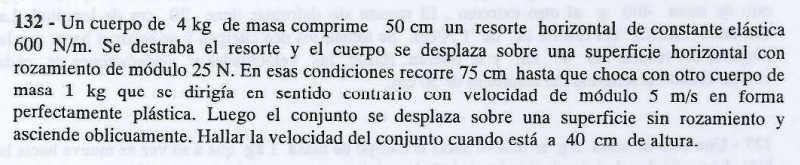
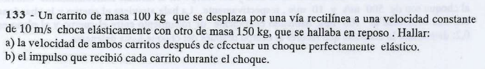
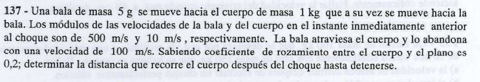

# Sistemas de Partículas Materiales (SPM)

## Parte I: Cinemática y Dinámica del Centro de Masa ($CM$)

Un sistema de partículas es un conjunto de $n$ masas puntuales ($m_1, m_2, \dots, m_n$) que interactúan entre sí y con el medio exterior.

### 1. Vector Posición del Centro de Masa ($\vec{r}_{CM}$)

El Centro de Masa es un punto geométrico que representa la posición promedio de toda la masa del sistema. Sus coordenadas cartesianas se calculan mediante el promedio ponderado de las masas individuales:

$$X_{CM} = \frac{\sum m_i \cdot x_i}{M_T} = \frac{m_1x_1 + m_2x_2 + \dots + m_nx_n}{m_1 + m_2 + \dots + m_n} \quad \text{}$$

$$Y_{CM} = \frac{\sum m_i \cdot y_i}{M_T} = \frac{m_1y_1 + m_2y_2 + \dots + m_ny_n}{m_1 + m_2 + \dots + m_n} \quad \text{}$$

Donde $M_T = \sum m_i$ es la masa total del sistema completo.

### 2. Velocidad ($\vec{v}_{CM}$) y Aceleración ($\vec{a}_{CM}$) del Centro de Masa

Derivando sucesivamente respecto al tiempo, se obtienen las expresiones vectoriales de movimiento del $CM$:

$$\vec{v}_{CM} = \frac{m_1\vec{v}_1 + m_2\vec{v}_2 + \dots + m_n\vec{v}_n}{M_T} \quad \text{}$$

$$\vec{a}_{CM} = \frac{m_1\vec{a}_1 + m_2\vec{a}_2 + \dots + m_n\vec{a}_n}{M_T} \quad \text{}$$

### 3. Ecuación de Movimiento del $CM$ (Teorema Fundamental)

Si sumamos las fuerzas netas sobre cada partícula, las **fuerzas internas** (las interacciones mutuas entre los componentes del sistema) forman pares de acción y reacción según la Tercera Ley de Newton, por lo que su suma vectorial da rigurosamente **cero** ($\Sigma \vec{F}_{\text{int}} = \vec{0}$).

Por lo tanto, la dinámica del sistema queda regida única y exclusivamente por las **fuerzas externas**:

$$\Sigma \vec{F}_{\text{ext}} = M_T \cdot \vec{a}_{CM} \quad \text{}$$

> 💡 **Gran Conclusión de Examen:** Si la resultante de las fuerzas externas que actúan sobre un sistema de partículas es nula ($\Sigma \vec{F}_{\text{ext}} = \vec{0}$), entonces la aceleración del centro de masa es cero ($\vec{a}_{CM} = \vec{0}$), lo que significa que **la velocidad del centro de masa permanece estrictamente constante durante todo el proceso** ($\vec{v}_{CM} = \text{cte.}$).
> 
> 

---

## Parte II: Teoremas de Conservación y Cantidad de Movimiento

### 1. Cantidad de Movimiento Lineal del Sistema ($\vec{P}_{\text{sist}}$)

Representa el momentum total del conjunto y equivale al momento que tendría una única partícula ficticia de masa $M_T$ moviéndose a la velocidad del centro de masa:

$$\vec{P}_{\text{sist}} = \sum m_i \cdot \vec{v}_i = M_T \cdot \vec{v}_{CM} \quad \text{}$$

A partir de la relación dinámica fundamental, la variación temporal de la cantidad de movimiento responde a las acciones exteriores:

$$\Sigma \vec{F}_{\text{ext}} = \frac{d\vec{P}_{\text{sist}}}{dt} \quad \text{}$$

* 
**Principio de Conservación del Momentum Linear:** Si $\Sigma \vec{F}_{\text{ext}} = \vec{0}$ (sistema aislado), entonces la cantidad de movimiento total del sistema **se conserva constante** antes, durante y después de cualquier interacción interna, como una explosión o un choque:

$$\vec{P}_{\text{antes}} = \vec{P}_{\text{después}} \quad \text{}$$

### 2. Impulso Lineal ($\vec{J}$ o $\vec{I}$)

El impulso es la magnitud física vectorial que cuantifica la transferencia de movimiento realizada por una fuerza neta durante un intervalo de tiempo corto $\Delta t$:

$$\vec{J} = \int \vec{F} \, dt = \vec{F}_{\text{media}} \cdot \Delta t \quad \text{}$$

Según el **Teorema del Impulso y la Cantidad de Movimiento**, el impulso aplicado a un cuerpo rígido o partícula es igual a la variación neta de su momentum lineal individual:

$$\vec{J} = \Delta \vec{P} = m \cdot \vec{v}_f - m \cdot \vec{v}_i \quad \text{}$$

---

## Parte III: Clasificación Física de los Choques (Colisiones)

Un choque es una interacción altamente intensa y de muy corta duración que ocurre entre dos o más cuerpos rígidos. En **todo choque**, al ser las fuerzas de impacto internas del sistema, la cantidad de movimiento lineal total **siempre se conserva** ($\vec{P}_{\text{antes}} = \vec{P}_{\text{después}}$). Sin embargo, la energía cinética del sistema se comporta diferente según el tipo de choque:

### 1. Choque Perfectamente Elástico

* **Características:** Los cuerpos colisionan y rebotan de manera limpia, separándose sin sufrir deformaciones plásticas permanentes ni generación de calor.

* **Conservación Energética:** La energía cinética total del sistema **se conserva rigurosamente** antes y después del impacto ($\Delta E_c = 0$).

* **Planteo analítico:** Se debe resolver el sistema de dos ecuaciones simultáneas:

1. $m_1v_{1_0} + m_2v_{2_0} = m_1v_{1_f} + m_2v_{2_f}$ (Conservación de $\vec{P}$) 

2. $\frac{1}{2}m_1v_{1_0}^2 + \frac{1}{2}m_2v_{2_0}^2 = \frac{1}{2}m_1v_{1_f}^2 + \frac{1}{2}m_2v_{2_f}^2$ (Conservación de $E_c$) 

### 2. Choque Inelástico y Caso Especial: Choque Plástico

* **Características:** Los cuerpos sufren deformaciones y disipan energía en forma de calor. En el caso del **choque perfectamente plástico**, los cuerpos colisionan y **quedan acoplados íntimamente, moviéndose con una única velocidad común final** ($v_f = v_{1_f} = v_{2_f}$).

* **Balance Energético:** Existe la **máxima pérdida posible de energía cinética** transformándose en calor o trabajo de deformación ($\Delta E_c < 0$).

* **Planteo analítico:** Al tener una única velocidad final, se resuelve directo con una sola ecuación:

$$m_1\vec{v}_{1_0} + m_2\vec{v}_{2_0} = (m_1 + m_2)\vec{v}_f \quad \text{}$$

### 3. Choque Explosivo o Explosión Interna

* **Características:** Un único cuerpo inicial en reposo o movimiento se fragmenta repentinamente en múltiples trozos debido a la liberación brusca de una fuerza química o mecánica interna.

* **Balance Energético:** El sistema **gana energía cinética de traslación** debido a la conversión del potencial químico acumulado en las masas puntuales ($\Delta E_c > 0$).

$$\Sigma \vec{P}_{\text{inicial}} = \sum m_i \cdot \vec{v}_{i_f} \quad \text{}$$

---

## Ejercicio 132

Este ejercicio es completísimo porque divide el problema en tres tramos físicos totalmente diferentes : **Trabajo y Energía con fricción** (tramo AB) , **Choque Plástico con conservación del momentum** (tramo BC) , y **Conservación de la Energía Mecánica pura en ascenso** (tramo CD).

---

## 📐 Tramo 1 ($A \to B$): Desprendimiento del Resorte y Desplazamiento con Roce

El cuerpo 1 ($m_1 = 4 \text{ kg}$) parte del reposo impulsado por el resorte comprimido y viaja perdiendo energía por la fricción hasta el instante inmediatamente anterior al choque.

* **Datos iniciales:** $v_A = 0 \text{ m/s}$, $k = 600 \text{ N/m}$, $\Delta x = 50 \text{ cm} = 0,5 \text{ m}$, $f_r = 25 \text{ N}$, $d_{AB} = 75 \text{ cm} = 0,75 \text{ m}$.

Planteamos el teorema fundamental del **Trabajo de las fuerzas No Conservativas**:

$$\Sigma W_{\text{Fnc}_{A \to B}} = \Delta E_{\text{mec}} = E_{\text{mec}_B} - E_{\text{mec}_A} \text{}$$

La única fuerza no conservativa que realiza trabajo es la fuerza de rozamiento del plano horizontal, la cual se opone al movimiento:

$$-f_r \cdot d_{AB} = E_{c_B} - E_{p_{\text{elástica}_A}} \text{}$$

$$-25 \text{ N} \cdot 0,75 \text{ m} = \frac{1}{2} m_1 \cdot v_{1B}^2 - \frac{1}{2} k \cdot (\Delta x)^2 \text{}$$

$$-18,75 \text{ J} = \frac{1}{2} (4 \text{ kg}) \cdot v_{1B}^2 - \frac{1}{2} (600 \text{ N/m}) \cdot (0,5 \text{ m})^2 \text{} $$

$$-18,75 \text{ J} = 2 \text{ kg} \cdot v_{1B}^2 - 75 \text{ J} \text{}$$

Despejamos el módulo de la velocidad del cuerpo 1 justo antes de chocar ($v_{1B}$):

$$2 \cdot v_{1B}^2 = 75 - 18,75 = 56,25 \text{ J} \text{}$$

$$v_{1B}^2 = \frac{56,25}{2} = 28,125 \text{ m}^2/\text{s}^2 \implies v_{1B} = \sqrt{28,125} \approx \mathbf{5,303 \text{ m/s}} \text{} $$

---

## 🤝 Tramo 2 ($B \to C$): Choque Perfectamente Plástico

Durante el impacto, al ser las fuerzas de colisión de carácter interno, la sumatoria de fuerzas externas en el eje horizontal es nula ($\Sigma F_{\text{ext}_x} = 0$), lo que significa que **la cantidad de movimiento total del sistema se conserva**.

* **Datos de los móviles:** * Cuerpo 1 ($m_1 = 4 \text{ kg}$): se mueve hacia la derecha con $\vec{v}_{1B} = +5,303 \text{ m/s} \cdot \hat{i}$.

* Cuerpo 2 ($m_2 = 1 \text{ kg}$): se dirige en sentido contrario, hacia la izquierda con $\vec{v}_{2B} = -5 \text{ m/s} \cdot \hat{i}$.

* Como el choque es **perfectamente plástico**, las masas quedan unidas tras el impacto, viajando a una velocidad común $\vec{v}_C$.

$$\vec{P}_{\text{antes}} = \vec{P}_{\text{después}} \text{}$$

$$m_1 \cdot \vec{v}_{1B} + m_2 \cdot \vec{v}_{2B} = (m_1 + m_2) \cdot \vec{v}_C \text{}$$

$$4 \text{ kg} \cdot (5,303 \text{ m/s}) + 1 \text{ kg} \cdot (-5 \text{ m/s}) = (4 \text{ kg} + 1 \text{ kg}) \cdot v_C \text{} $$

$$21,212 \text{ kg}\cdot\text{m/s} - 5 \text{ kg}\cdot\text{m/s} = 5 \text{ kg} \cdot v_C \text{}$$

$$16,212 \text{ kg}\cdot\text{m/s} = 5 \text{ kg} \cdot v_C \text{}$$

Despejamos la velocidad del conjunto inmediatamente después del choque ($v_C$):

$$v_C = \frac{16,212}{5} \approx \mathbf{3,242 \text{ m/s}} \text{}$$

---

## ⛰️ Tramo 3 ($C \to D$): Ascenso por la Rampa sin Rozamiento

Una vez acoplado, el bloque compuesto ($M_T = m_1 + m_2 = 5 \text{ kg}$) sube por una pendiente lisa. Como no hay fricción ($\Sigma W_{\text{Fnc}} = 0$), **la energía mecánica total se conserva de forma estricta** entre la base y la altura solicitada.

* **Datos del tramo:** $v_C = 3,242 \text{ m/s}$, $h_C = 0 \text{ m}$, $h_D = 40 \text{ cm} = 0,4 \text{ m}$, y adoptamos $g = 10 \text{ m/s}^2$.

$$E_{\text{mec}_C} = E_{\text{mec}_D} \text{}$$

$$E_{c_C} = E_{p_{\text{gravitatoria}_D}} + E_{c_D} \text{} $$

$$\frac{1}{2} M_T \cdot v_C^2 = M_T \cdot g \cdot h_D + \frac{1}{2} M_T \cdot v_D^2 \text{}$$

Simplificamos la masa total $M_T$ de todos los términos de la igualdad:

$$\frac{1}{2} v_C^2 = g \cdot h_D + \frac{1}{2} v_D^2 \text{}$$

Multiplicamos toda la expresión por 2 para mayor comodidad de despeje:

$$v_C^2 = 2 \cdot g \cdot h_D + v_D^2 \text{}$$

$$(3,242 \text{ m/s})^2 = 2 \cdot (10 \text{ m/s}^2) \cdot 0,4 \text{ m} + v_D^2 \text{}$$

$$10,513 \text{ m}^2/\text{s}^2 = 8 \text{ m}^2/\text{s}^2 + v_D^2 \text{} $$

$$v_D^2 = 10,513 - 8 = 2,513 \text{ m}^2/\text{s}^2 \text{}$$

Finalmente, calculamos la raíz cuadrada de la velocidad final en el punto $D$:

$$v_D = \sqrt{2,513} \approx \mathbf{1,5852 \text{ m/s}} \text{}$$

---

## 🎯 Respuesta Final para el Examen

La velocidad del conjunto acoplado al alcanzar los $40 \text{ cm}$ de altura por la rampa oblicua es de aproximadamente **$1,585 \text{ m/s}$**.

---

## Ejercicio 133

Este caso es un modelo de **choque perfectamente elástico**, lo que significa que hay que plantear un sistema donde se conserva tanto la cantidad de movimiento total como la energía cinética total del sistema.

---

## 🛠️ Paso 1: Extracción y Organización de Datos

Para no marearnos con los signos algebraicos en el examen, definimos un eje horizontal coordenado de referencia positivo hacia la derecha ($+\hat{i}$):

* **Carrito 1:** $m_1 = 100\text{ kg}$; $\vec{v}_{1_0} = +10\text{ m/s} \cdot \hat{i}$.

* **Carrito 2:** $m_2 = 150\text{ kg}$; $\vec{v}_{2_0} = 0\text{ m/s}$ (en reposo).

---

## 📐 Paso 2: Resolución del Inciso a) Velocidades Finales ($v_{1_f}$ y $v_{2_f}$)

Al tratarse de un choque perfectamente elástico, planteamos las dos ecuaciones de conservación fundamentales:

### 1. Conservación de la Cantidad de Movimiento Lineal ($\vec{P}_{\text{antes}} = \vec{P}_{\text{después}}$)

Las fuerzas de impacto son internas, por lo que el momentum total del sistema se mantiene constante:

$$m_1 \cdot v_{1_0} + m_2 \cdot v_{2_0} = m_1 \cdot v_{1_f} + m_2 \cdot v_{2_f}$$

$$100\text{ kg} \cdot (10\text{ m/s}) + 150\text{ kg} \cdot 0 = 100\text{ kg} \cdot v_{1_f} + 150\text{ kg} \cdot v_{2_f} $$

$$1000 = 100 \cdot v_{1_f} + 150 \cdot v_{2_f}$$

Dividimos toda la ecuación por $100$ para simplificar la expresión matemática como en tu hoja de apuntes:

$$10 = v_{1_f} + 1,5 \cdot v_{2_f} \implies v_{1_f} = 10 - 1,5 \cdot v_{2_f} \quad \text{(Ecuación 1)} $$

### 2. Conservación de la Energía Cinética ($\Delta E_{\text{cin}} = 0$)

Por ser elástico puro, la energía cinética no se disipa en forma de calor ni deformaciones:

$$\frac{1}{2}m_1 \cdot v_{1_0}^2 + \frac{1}{2}m_2 \cdot v_{2_0}^2 = \frac{1}{2}m_1 \cdot v_{1_f}^2 + \frac{1}{2}m_2 \cdot v_{2_f}^2 $$

Simplificamos el factor común $\frac{1}{2}$ y sustituimos con los valores numéricos iniciales:

$$100 \cdot (10)^2 + 150 \cdot (0)^2 = 100 \cdot v_{1_f}^2 + 150 \cdot v_{2_f}^2 $$

$$10000 = 100 \cdot v_{1_f}^2 + 150 \cdot v_{2_f}^2$$

Dividimos toda la ecuación por $100$ para alivianar los términos algebraicos:

$$100 = v_{1_f}^2 + 1,5 \cdot v_{2_f}^2 \quad \text{(Ecuación 2)} $$

### 3. Acoplamiento de Ecuaciones por Sustitución

Sustituimos el término de la velocidad $v_{1_f}$ despejado en la Ecuación 1 dentro de la Ecuación 2:

$$100 = (10 - 1,5 \cdot v_{2_f})^2 + 1,5 \cdot v_{2_f}^2$$

Desarrollamos el binomio al cuadrado con máxima precaución:

$$100 = 100 - 2 \cdot 10 \cdot (1,5 \cdot v_{2_f}) + (1,5 \cdot v_{2_f})^2 + 1,5 \cdot v_{2_f}^2 $$

$$100 = 100 - 30 \cdot v_{2_f} + 2,25 \cdot v_{2_f}^2 + 1,5 \cdot v_{2_f}^2 $$

Restamos $100$ de ambos lados de la igualdad y agrupamos los términos cuadráticos de $v_{2_f}$:

$$0 = -30 \cdot v_{2_f} + 3,75 \cdot v_{2_f}^2$$

$$30 \cdot v_{2_f} = 3,75 \cdot v_{2_f}^2$$

Simplificamos una variable de velocidad $v_{2_f}$ en ambos lados (descartando la solución trivial $v_{2_f} = 0$, que correspondería a que no haya choque):

$$v_{2_f} = \frac{30}{3,75} = \mathbf{8\text{ m/s}}$$

Volvemos a la Ecuación 1 para hallar el valor exacto de la velocidad del carrito 1 tras rebotar:

$$v_{1_f} = 10 - 1,5 \cdot (8) = 10 - 12 = \mathbf{-2\text{ m/s}}$$

---

## 🧮 Paso 3: Resolución del Inciso b) Impulso Recibido por cada Carrito ($\vec{J}$)

Para calcular el impulso neto que la fuerza interna de contacto le imprime a cada móvil, aplicamos el **Teorema del Impulso y la Cantidad de Movimiento** ($\vec{J} = \Delta \vec{P}$):

### 1. Impulso sobre el Carrito 1 ($\vec{J}_1$)

$$J_1 = m_1 \cdot v_{1_f} - m_1 \cdot v_{1_0} = m_1 \cdot (v_{1_f} - v_{1_0})$$

$$J_1 = 100\text{ kg} \cdot (-2\text{ m/s} - 10\text{ m/s}) = 100\text{ kg} \cdot (-12\text{ m/s}) = \mathbf{-1200\text{ N}\cdot\text{s}}$$

Vectorialmente, apunta hacia la izquierda: $\vec{J}_1 = -1200\text{ N}\cdot\text{s} \cdot \hat{i}$.

### 2. Impulso sobre el Carrito 2 ($\vec{J}_2$)

$$J_2 = m_2 \cdot v_{2_f} - m_2 \cdot v_{2_0} = m_2 \cdot (v_{2_f} - v_{2_0}$$

$$J_2 = 150\text{ kg} \cdot (8\text{ m/s} - 0) = 150\text{ kg} \cdot 8\text{ m/s} = \mathbf{1200\text{ N}\cdot\text{s}}$$

Vectorialmente, apunta hacia la derecha: $\vec{J}_2 = +1200\text{ N}\cdot\text{s} \cdot \hat{i}$.

> 💡 **Validación Teórica Examen:** Se corrobora perfectamente la Tercera Ley de Newton en términos impulsivos ($\vec{J}_1 = -\vec{J}_2$). El impulso recibido por un cuerpo es idéntico en módulo y dirección pero de sentido opuesto al recibido por el otro móvil.

---

## 🎯 Resumen de Respuestas para el Examen

* **a)** $v_{1_f} = -2\text{ m/s}$ (rebota y se mueve hacia la izquierda) y $v_{2_f} = 8\text{ m/s}$ (avanza hacia la derecha).

* **b)** $\vec{J}_1 = -1200\text{ N}\cdot\text{s} \cdot \hat{i}$ y $\vec{J}_2 = +1200\text{ N}\cdot\text{s} \cdot \hat{i}$.

---

## EJercicio 137

Este problema   plantea un impacto donde un cuerpo atraviesa a otro (no quedan pegados ni rebotan elásticamente).

Lo dividiremos en dos etapas físicas: primero la **conservación de la cantidad de movimiento durante el choque** para hallar la velocidad de salida del bloque, y segundo un **balance de trabajo y energía no conservativa** para calcular la distancia de frenado por fricción.

---

## 🛠️ Paso 1: Extracción de Datos y Conversión de Unidades

Definimos un eje de coordenadas horizontal positivo hacia la derecha ($+\hat{i}$):

* **Bala ($B$):** Masa $m_B = 5\text{ g} = 0,005\text{ kg}$. Velocidad inicial: $\vec{v}_{B_0} = +500\text{ m/s} \cdot \hat{i}$ (se mueve hacia la derecha). Velocidad final al abandonar el bloque: $\vec{v}_{B_f} = +100\text{ m/s} \cdot \hat{i}$ (mantiene su dirección original).

* **Cuerpo/Bloque ($C$):** Masa $m_C = 1\text{ kg}$. Velocidad inicial: $\vec{v}_{C_0} = -10\text{ m/s} \cdot \hat{i}$ (se dirigía hacia la bala, es decir, a la izquierda).

* **Plano horizontal:** Coeficiente de rozamiento dinámico $\mu_c = 0,2$. Adoptamos $|g| = 10\text{ m/s}^2$.

---

## 📐 Paso 2: Análisis del Choque (Conservación de $\vec{P}_{\text{sist}}$)

Durante la colisión, la sumatoria de fuerzas externas en el eje horizontal es nula ($\Sigma F_{\text{ext}_x} = 0$), por lo que **la cantidad de movimiento total del sistema se conserva** de forma estricta entre el instante previo y el posterior al impacto:

$$\vec{P}_{\text{antes}} = \vec{P}_{\text{después}} $$

$$m_B \cdot \vec{v}_{B_0} + m_C \cdot \vec{v}_{C_0} = m_B \cdot \vec{v}_{B_f} + m_C \cdot \vec{v}_{C_f} $$

Sustituimos con los valores numéricos correspondientes respetando los signos vectoriales del eje elegido:

$$0,005\text{ kg} \cdot (500\text{ m/s}) + 1\text{ kg} \cdot (-10\text{ m/s}) = 0,005\text{ kg} \cdot (100\text{ m/s}) + 1\text{ kg} \cdot v_{C_f} $$

$$2,5\text{ kg}\cdot\text{m/s} - 10\text{ kg}\cdot\text{m/s} = 0,5\text{ kg}\cdot\text{m/s} + 1\text{ kg} \cdot v_{C_f} $$

$$-7,5\text{ kg}\cdot\text{m/s} = 0,5\text{ kg}\cdot\text{m/s} + 1\text{ kg} \cdot v_{C_f} $$

$$1\text{ kg} \cdot v_{C_f} = -7,5 - 0,5 = -8\text{ kg}\cdot\text{m/s}$$

$$v_{C_f} = -8\text{ m/s} $$

> 💡 **Interpretación Física:** La velocidad final del bloque es $\vec{v}_{C_f} = -8\text{ m/s} \cdot \hat{i}$. El signo negativo indica que el cuerpo continúa moviéndose hacia la **izquierda** inmediatamente después de que la bala lo atraviesa.
> 
> 

---

## 🧮 Paso 3: Tramo Post-Choque (Balance de Trabajo y Energía)

Una vez que la bala abandonó el bloque, este desliza por el plano rugoso con una velocidad inicial $v_0 = 8\text{ m/s}$ hasta detenerse por completo ($v_{\text{final}} = 0$).

Planteamos el **Teorema del Trabajo de las Fuerzas No Conservativas**:

$$W_{\text{Fnc}} = \Delta E_{\text{mec}} = E_{c_{\text{final}}} - E_{c_{\text{inicial}}} $$

La única fuerza no conservativa que realiza trabajo sobre el eje horizontal es la fuerza de rozamiento dinámico ($f_r = \mu_c \cdot N$), la cual se opone al desplazamiento $\Delta x$:

$$-f_r \cdot \Delta x = 0 - \frac{1}{2} m_C \cdot v_0^2 $$

Dado que en un plano horizontal sin inclinación la Normal es igual al peso ($N = m_C \cdot g$):

$$-\mu_c \cdot (m_C \cdot g) \cdot \Delta x = -\frac{1}{2} m_C \cdot v_0^2 $$

Simplificamos el término de la masa $m_C$ en ambos lados y cancelamos los signos negativos:

$$\mu_c \cdot g \cdot \Delta x = \frac{1}{2} v_0^2 $$

Sustituimos los valores numéricos correspondientes para despejar la distancia de frenado ($\Delta x$):

$$0,2 \cdot 10\text{ m/s}^2 \cdot \Delta x = \frac{1}{2} \cdot (-8\text{ m/s})^2 $$

$$2 \cdot \Delta x = \frac{1}{2} \cdot 64 $$

$$2 \cdot \Delta x = 32 \implies \Delta x = \frac{32}{2} = \mathbf{16\text{ m}}$$

---

## 🎯 Respuesta Final para el Examen

El cuerpo recorrerá una distancia exacta de **$16\text{ m}$** desde el momento del impacto hasta detenerse por completo sobre el plano.

---
